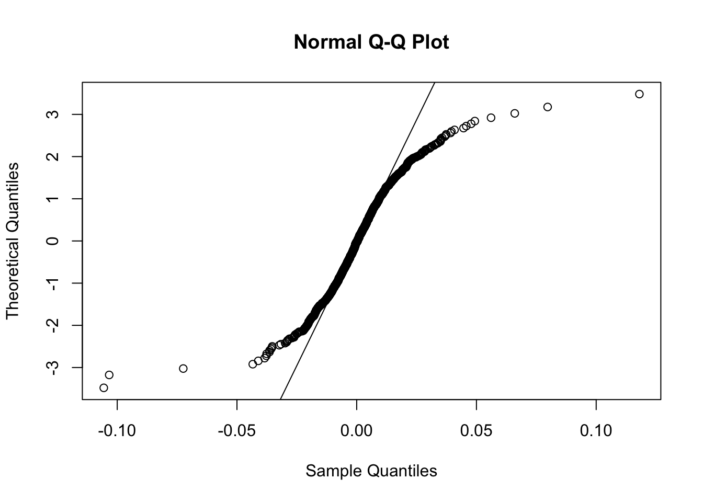
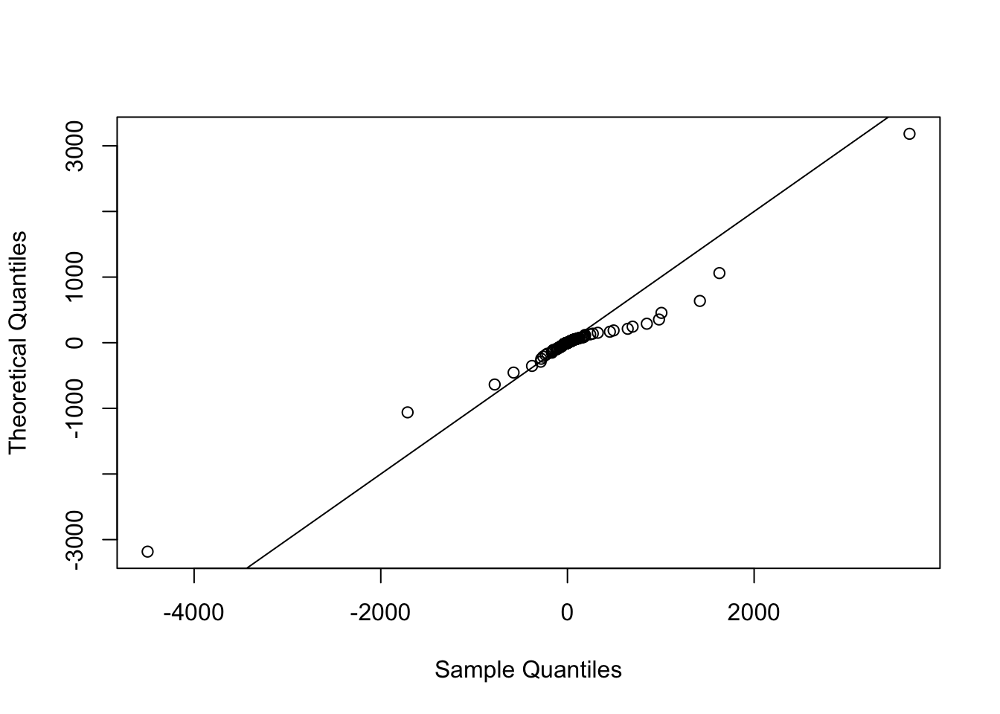

--- 
title: "STAD70 Course Work"
author: "Richard Ye"
# date: "2023-02-13"
site: bookdown::bookdown_site
documentclass: book
bibliography: [book.bib, packages.bib]
# url: your book url like https://bookdown.org/yihui/bookdown
# cover-image: path to the social sharing image like images/cover.jpg
description: |
  A collection of homework and assignments from the STAD70 course at UTSC
link-citations: yes
github-repo: rstudio/bookdown-demo
always_allow_html: true
---

# Introduction

Work from the STAD70 course taken Winter 2023.


<!--chapter:end:index.Rmd-->

# Financial Data and Returns
- Prices of financial instruments (stocks, bonds, futures, options, etc)
- LIBOR: London Inter-Bank Offered Rate
	- Avg interest rate that major London Banks would charge when borrowing from each other
- FX Rates: Decentralized market that sets currency prices

There are two types of *raw (tick)* data:

- **Quote data**
	- Record of bid/ask prices from the order book, usually just the top $N$ lines of the order book on the bid and ask sides
- **Trade data**
	- Trade records (filled orders)

Data that is identified using time:

- **Intraday Data**
	- Data of the most current bids/asks, last price, volume etc
	- Describes the data of a stock within a given day
- **Daily data**
	- For longer term analysis

## Trading
There are two types:
- **OTC (Over the counter)**
	- Negotiated and traded directly between parties, not for the public to bid on
- **Through an Exchange**
	- The TSX, NYSE, LSE (London)
	- Uses an **auction** system where there are many potential buyers and sellers
	- Uses a **continuous double auction (CDA)**, where the bids and asks are matched in real-time to determine which trades to execute.
		- A matching order (bid $\geq$ ask) is executed right away
		- Outstanding orders are maintained in an **order book**

## Order Types 
- Limit order: buy/sell are no more/les than a specified price
	- It is maintained in the order book if not filled immediately
- Market order: buy/sell at the current market price immediately
	- No control over the price at which the order will execute
- Iceberg order: Only a portion of the total (giant) order is displayed in the order book, and when it is filled, a new portion is shown 
	- Used to maintain anonymity

## Returns
- The ratio of money gained/lost on an investment relative to the invested amount
- It is defined relative tot he holding period (daily, monthly, annual)

### Net Returns
$$
R_{t} = \frac{P_{t}-P_{t-1}}{P_{t-1}} = \frac{P_{t}}{P_{t-1}} - 1
$$
Where $P_{t}$ is the price at time $T$.

Gross return is just $\frac{P_{t}}{P_{t-1}} = 1 + R_{t}$

### Log Returns
$$
\begin{aligned}
r_{t} &= \log(1+R_{t})\\
&= \log\left( \frac{P_{t}}{P_{t-1}} \right)\\
&= \log(P_{t}) - \log(P_{t-1})
\end{aligned}
$$

You can obtain the log return from the net return (for small returns, $<1\%$) using the Taylor Approximation:
$$
\begin{aligned}
f(x) &\approx f(x_{0}) + f'(x_{0})(x-x_{0}) + \frac{1}{2}f''(x_{0})(x-x_{0})^{2}+\dots\\
\\
r_{t} &= \log(1+R_{t})\\
&\approx \log(x_{0})+\log'(x)|_{x=x_{0}}\cdot (\underbrace{ 1+R_{t} }_{ x }-x_{0})+\dots\\
& \text{Expand around } x_{0} = 1\\
\\
&= 0 + \frac{1}{1}\cdot R_{t}\\
&\approx R_{t}
\end{aligned}
$$

We like to work with log returns because they are also easy to aggregate!
$$
\begin{aligned}
R_{1-22} &= (1+R_{1})\cdot(1+R_{2})\cdot \dots \cdot (1+R_{22}) - 1\\
r_{1-22} &= r_{1} + r_{2} + \dots + r_{22}\\
&= \log\left( \frac{P_{1}}{P_{0}}\cdot \frac{P_{2}}{P_{1}} \cdot \dots \cdot \frac{P_{22}}{P_{21}} \right)\\
&= \log\left( \frac{P_{22}}{P_{0}} \right)\\
\end{aligned}
$$

### Returns accounting for dividends
If a dividend was paid just before time $t$, and after $t-1$, then we would have:
$$
\begin{aligned}
R_{t} &= \frac{P_{t}-D_{t}}{P_{t-1}} - 1 \\
\\
r_{t} &= \log(P_{t}+D_{t}) - \log(P_{t-1})
\end{aligned}
$$

### Returns accounting for splits
$$
\begin{aligned}
R_{t} &= \frac{P_{t}}{P_{t-1}/s}-1\\
r_{t} &= \log(P_{t}) - \log(P_{t-1}/s)\\
\text{Where } s &= \text{number of shares recieved per 1 share owned}
\end{aligned}
$$

### Adjusted returns
These returns have already accounted for dividends and splits, so returns should always be calculated on **adjusted returns.** 
**They should not be used as prices (ie the adjusted close)!**

### Random Walk Model
We say the additive log returns 
$$
\log\left( \frac{P_{t}}{P_{0}} \right) = r_{1} + r_{2} + \dots + r_{t}
$$
Follow a random walk model if:
$$
\begin{aligned}
r_{t} &\sim (\mu, \sigma^{2})\\
\\
\text{Where } \quad  \mathbb{E}[r_{i}] &= \mu \text{ is drift}\\
 \sqrt{ Var[r_{i}] } &= \sigma \text{ is volatility}
\end{aligned}
$$
However they follow a Normal random walk if:
$$
r_{t} \sim N(\mu, \sigma^{2})
$$
Which implies that log-returns are Normally distributed.

The random walk from $1-n$ has:
$$
\begin{aligned}
r_{1-n} &= r_1 + r_{2} + \dots +r_{n}\\
\\
\text{Mean: }& \mathbb{E}(r_{1-n}) = n\mu\\
\text{Variance: }& \sqrt{ Var[r_{1-n}] } = \sqrt{ n }\sigma
\end{aligned}
$$
Which can be converted to the asset price simply using 
$$
P_{t} = P_{0}\cdot e^{r_{1} + r_{2}+\dots +r_{t}}
$$

Which is referred to as the Exponential/Geometric Random walk

Random walks are not a good description of reality, but they are useful for modelling.

<!--chapter:end:Notes/1-Financial-Data-and-Returns.md-->

# Return Distributions

## Skewness
Skewness measures symmetry. 
- Positive skew $\to$ right skewed
- Negative skew $\to$ left skewed
$$
Sk = \mathbb{E}\left[ \left( \frac{X-\mu}{\sigma} \right)^{3} \right]
$$


## Kurtosis 
Kurtosis measures how concentrated the data is around the mean, or how heavy the tails are. You can only measure kurtosis (meaningfully) if the distribution has 0 skew.

Kurtosis of a distribution is measured against the kurtosis of the Normal distribution, which is $3$.

$$
Kur = \mathbb{E}\left[ \left( \frac{X-\mu}{\sigma} \right)^{3} \right] - 3
$$


## QQ Plot


- Top left: The sample quantiles spread further on the right than the theoretical quantiles, which implies a **right/pos skewness**
- Top right: The sample quantiles for the tails are very concentrated compared to the theoretical quantiles, which implies the data has short/finite tails implying  it is **platykurtic/neg kurtosis**
- Bottom left: The sample quantiles  spread further on the left than the theoretical quantiles, which implies a **left/neg skewness**
- Bottom right: The sample quantiles for the tails are very spread compared to the theoretical quantiles, which implies the data has long/heavy tails implying  it is **leptokurtic/pos kurtosis**

## Heavy Tail Distributions 

A distribution $f(x)$ is said to have:

- Exponential tails (short/finite tails) if
$$f(x) \propto e^{-x/\lambda}$$
- Polynomial tails (long/heavy tails) if 
$$
\begin{aligned}
f(x) &\propto x^{-(1+\alpha)}\\
\\
\text{Where } &\alpha \text{ is the tail index}
\end{aligned}
$$

>**The smaller the tail index, the heavier the tail**

Heavy tailed distributions can also have infinite moments (including the mean!)

$$
\mathbb{E}(X^{k}) = \infty \text{ for } k \geq \alpha
$$
*So if the tail index is high, the tail is lighter, and the first $\alpha$ moments exist.*

The tail index can be estimated using:
- MLE approximation, which takes the derivative log of the product of n the distributions when it equals 0, and solving for $\alpha$
	- $\hat{\alpha} = \frac{n}{\sum^n_{i=1}\ln\left( r_{i}/r_{min} \right)}$

$$
\begin{aligned}
L(\alpha) &= \prod^{n}_{i=1}[f(x)]\\
\log(L(\alpha)) = l(\alpha) &= \sum^{n}_{i=1} f(x)\\
l'(\alpha) &= \sum^{n}_{i=1} f'(x) = 0
\end{aligned}
$$
- Pareto Q-Q plot of the empirical CDF and the returns in log x log scale
	- $\alpha$ is the estimated slope of the line of best fit


### Common Heavy Tail Distributions

#### Pareto 
$$
\begin{aligned}
f(x) &= \frac{c\ x^{-(1+\alpha)}}{l^{\alpha}}, \ x \geq l\\
\end{aligned}
$$

Can be used to model **absolute** returns above a cutoff $r_{min}$
$$
\bar{F}(r) = \left( \frac{r}{r_{min}} \right)^{\alpha} \quad \forall\ r > r_{min}
$$

#### Cauchy 
$$
\begin{aligned}
f(x) &= \frac{1}{\pi(1+x^{2})}\\
&= \frac{1+x^{-(\alpha+1)}}{\pi}  \implies \alpha = 1
\end{aligned}
$$
Which is the t-distribution when df = 1.
$$
f(x) \sim t(df=1)
$$

#### Students t
$$
\begin{aligned}
f(x) &= \frac{\Gamma\left( \frac{v+1}{2} \right)}{\sqrt{ v\pi }\Gamma(v/2)}\left( 1+\frac{x^{2}}{v} \right)^{-\frac{v+1}{2}}\\
\\
\text{Where } &\alpha = v = \text{degrees of freedom}
\end{aligned}
$$
The Students t distributions offers a tractable heavy-tail model of the entire return distribution (not just the tail). It is typically adjusted for the location and scale:

$$
Y = \mu + \sigma X \quad \text{where } X \sim t(df=v)
$$

### Stable Distributions

If we let log returns $r_{i} \sim$ heavy tail distribution with $0<\alpha<2$ (the first and second moment - mean/variance exist)

The aggregate return $r_{1\to n} = r_{1} = r_{2} + \dots r_{n} \sim$  Stable Distribution

#### Generalized Central Limit Theorem
Stable distributions have no closed form expression, although the share heavy tails and the same tail index $\alpha$ as it's individual distributions. 

As you sum independent, **STABLE** random variables, the sum will follow a Stable Distribution.

#### Measuring tail behaviour
We use the complementary CDF 
$$
\bar{F}(x) = 1 - F(x) = P(X > x) \sim x^{-\alpha}
$$

## Mixture Distributions

We can generate a random variable using one of out a selection of a family of distributions, choosing the distribution using another distribution. 

They are easy to generate, but harder to work with analytically.

We can select from a discrete and finite set of distributions, or of a continuous family of distributions (possibly countable) known as compound distributions.

Example:
$$
\begin{aligned}
\text{Generate RV from: } \begin{cases}
N(0,1) & p=60\%\\
N(5,3) & p=40\%
\end{cases}
\end{aligned}
$$


#### Normal scale mixture
$Y = \mu+\sqrt{ V } \cdot Z$
Where $V$ is a RV with non-negative mixing distribution and represents a random sd of $Y$.

Example (probably don't need to memorize...) which is used when simulating returns, as seem in PS2 Q4c part ii and iii.

$$
\begin{aligned}
\text{t-dist } t &= Z\sqrt{ v/W } \quad \text{ where } W \sim \chi^{2}(df=v)\\
\text{GARCH model } r_{t} &= \mu + \sigma_{t}Z_{t} \quad \text{ where } \sigma^{2}_{t} = \omega + \sum^{p}_{i=1}a_{i}r^{2}_{t-i}+\sum^{q}_{j=1}\beta_{j}\sigma^{2}_{t-j}\\
\end{aligned}
$$

<!--chapter:end:Notes/2-Return-Distributions.md-->

# Modelling Extreme Events
## Stylized Facts
Characteristics of typical empirical asset returns:

1. Absence of simple autocorrelations
	- Returns are not correlated with past time-steps of itself
2. Volatility clustering
	- Large amounts of volatility often occur in clusters through time
3. Heavy tails
	- Returns often have very abnormal (large) values suggesting heavy tail distributions
4. Intermittency
5. Aggregation changes distribution
6. Gain/loss asymmetry
	- The market tends to go up over time

## Extreme Value Theory 
This theory helps with modelling extreme events that have small probabilities of occurring.

### Two main results 
- Maxima of i.i.d. sequences
- Values exceeding threshold

### 1st Theorem: Fisher-Tippet-Gnedenko
*Theres no need to prove any results*

If $X_{1}, X_{2}, \dots$ are i.i.d. RVs, we can create a RV that simply takes the maximum of $n$ RVs called $M_{n} = max(X_{1}, X_{2}, \dots X_{n})$.

**In certain cases**, we can find normalizing constants $a_{n}>0, b_{n}$ such that they can be transformed into one of the three distributions (identified by $H(x)$) which can be much easier to work with.

$$
\begin{aligned}
P\left( \frac{M_{n}-b_{n}}{a_{n}} \leq x\right) &= [F(a_{n}x+b_{n})]^{n} \to H(x)\\
F(a_{n}x+b_{n}) &= \text{Single RV}
\end{aligned}
$$
This is just saying that the normalized max RV is less than some value $x$ is just the probability of each individual RV being less than the transformed value of $x$.

$$
\begin{aligned}
H(x) &= \begin{cases}
Gumbel & \exp\{-e^{-x}\} \quad\quad x \in \mathbb{R}\\
Frechet & \begin{cases}
0 & x < 0 \\
\exp\{-x^{-\alpha}\}  & x >0
\end{cases}\\
Weibull  & \begin{cases}
\exp\{-|x|^{\alpha}\}  & x<0 \\
1 & x > 0
\end{cases}
\end{cases}
\end{aligned}
$$
Where $\alpha > 0$ for the Frechet and Weibull distributions.


### Generalized Extreme Value (GEV) Distribution
The three types of distributions can be represented using:
$$
\begin{aligned}
H(x) &= \exp\left\{ -\left( 1+\xi\frac{x-\mu}{\sigma} \right)^{-1/\xi}_{+} \right\}\\
\text{Where } \mu &= \text{location}\\
\sigma &= \text{scale}\\
\xi &= \text{shape parameters} \begin{cases}
\xi>0 & \text{heavy tails (Frechet)} \\
\xi=0 & \text{exponential tails (Gumbel)} \\
\xi < 0  & \text{short/light tails (Weibull)}
\end{cases}
\end{aligned}
$$
Where the $\xi$ value describes the tail behaviour

The log-transformation of the Frechet($\alpha=1$) is the Gumbel distribution!
$$
\begin{aligned}
\ln(H_{F}(x)) &= \ln\left[ \exp\{-x^{-1}\}\right]\\
&= -\left( 1+\frac{x-\mu}{\sigma} \right)^{-1}\\
\\
&= H_{G} = \exp \left\{ -\left( 1+0\cdot \frac{x-\mu}{\sigma} \right)^{-1/0} \right\}
\end{aligned}
$$

As an example, we'll show that the normalized maximum of i.i.d. Uniform(0,1) aka $F_{n}(x) = x$ with $a_{n}=1/n, b_{n}=1$ converges to the Weibull distribution.
$$
\begin{aligned}
P\left( \frac{M_{n}-b_{n}}{a_{n}} \leq x\right) &= P\left( \frac{M_{n}-1}{1/n} \leq x\right)\\
& b_{n}\text{ shifts the Uniform from (0,1) to (-1,0)}\\
&= P\left( M_{n} \leq \frac{x}{n}+1 \right)\\
&= P\left( \max(U_{1}, U_{2}, \dots U_{n}) \leq 1+\frac{x}{n} \right)\\
&= \prod^{n}_{i=1} \underbrace{ P\left( U_{i}\leq 1+\frac{x}{n} \right) }_{ \left( 1+\frac{x}{n} \right) }\\
&= \left( 1+\frac{x}{n} \right)^{n}\\
& \text{because } x<0, \quad 1+ (-.4) = 1-|-.4|\\
&=\left( 1-\frac{|x|}{n} \right)^{n}\\
\\
\lim_{ n \to \infty } \left( 1-\frac{|x|}{n} \right)^{n} &\to \exp\{((-1)|x|)^{-1/-1}\}\\
&= \exp\{-|x|^{1}\} \implies Weibull(\alpha=1)\\
\end{aligned}
$$

### 2nd Theorem: Pickands-Balkema-De Haan
For any RV $X$ with CDF $F(\cdot)$, it's conditional distribution when exceeding a certain threshold $u$ is:
$$
\begin{aligned}
F_{u}(y) &= \frac{F(u+y)-F(u)}{1-F(u)}, \quad 0\leq y\leq x_{F}-u\\
\text{Where } x_{F} &= sup\{x \in \mathbb{R}:F(x) < 1\} \text{ is the right endpoint of } F
\end{aligned}
$$

$x_{F}$ could be finite, or $\infty$. As $u\to x_{F}$, the conditional distribution converges to something belonging to the **Generalized Pareto Distribution (GPD).**
$$
F_{u}(y) \to G_{\xi, \sigma}(y)
$$
The **Generalized Pareto Distribution (GPD)** is given by:
$$
\begin{aligned}
G_{\xi,\sigma}(y) &= 1 - \left( 1+\xi \frac{y}{\sigma} \right)^{-1/\xi}_{+} = \begin{cases}
G_{\xi, \sigma}(y) = 1-\left( 1+\xi  \frac{y}{\sigma} \right)^{-1/\xi}  & \xi \ne 0\\
G_{\xi, \sigma}(y) = 1-\exp\left\{ -\frac{y}{\sigma} \right\}  & \xi = 0
\end{cases}\\
\text{Where } & \sigma > 0, y\geq 0, \quad y\leq-\frac{\sigma}{\xi} \text{ when } \xi < 0
\end{aligned}
$$

$f(x) = \lambda e^{-\lambda x}, \lambda>0$
```desmos-graph
bottom=-1; left=-0.5; right=1.5;
---
y=2 \exp(-2x)
x=.9|dashed
```


The exponential distribution is used to model waiting times, no matter how much time has passed. The conditional distribution 

<!--chapter:end:Notes/3-Modelling-Extreme-Events.md-->

# Multivariate Return Modelling
When modelling returns of multiple assets, it's common to assume the correlation between them is constant.

Many investment strategies combine multiple assets together, but how those assets are related is an important piece of information to understand. It's also difficult to model. Say we start with a simple multivariate Normal, where dependence $\leftrightarrow$ covariance, so we can model their relations with the covariance matrix.

## Covariance & Correlation Matrix

For a linear combination of assets, we can attempt to use the following covariance matrix to describe their linear dependence:
$$
\begin{aligned}
Cov[A^{T}R] = A^{T}Cov[R]A, \quad \text{where }\begin{cases}
A = \text{Constant matrix} \\
R = \text{random vector}
\end{cases}
\end{aligned}
$$
Unfortunately, sample covariance estimation is very sensitive to extreme values, which happen frequently with return (See heavy tails)

Returns are often treated as independent samples, but that is not realistic.

## Multivariate Student's t Distribution

We should **never remove outliers** in finance. We must model the heavy tails (extreme returns) somehow, and Student's t distribution is one way to do that.

A multivariate Normal scale mixture model can be used to describe a multivariate Student's t distribution:
$$
\begin{aligned}
\mathbf{R} &= \boldsymbol{\mu} + \mathbf{Z} \sqrt{ v/W } \sim t_{v}(\boldsymbol{\mu}, \boldsymbol{\Lambda})\\
\\
\text{Where } & W \sim \chi^{2}(df=v)\\
& \mathbf{Z} \sim N(\mathbf{0}, \boldsymbol{\Lambda}) \quad \text{where } \boldsymbol{\Lambda} = Indentity \ Mat
\end{aligned}
$$

It's mean and variance are:

$$
\begin{aligned}
\mathbb{E}(\mathbf{R}) &= \mathbb{E}\left( \boldsymbol{\mu}+\mathbf{Z}\sqrt{ \frac{v}{W} }\right)\\ 
&= \boldsymbol{\mu} + \underbrace{ \mathbb{E}(\mathbf{Z}) }_{ =0 }\cdot \mathbb{E}\left( \sqrt{ \frac{v}{W} } \right)\\
&=\boldsymbol{\mu}\\
\\
Cov(\mathbf{R}) &= Cov\left( \boldsymbol{\mu} + \mathbf{Z} \sqrt{ \frac{v}{W} } \right)\\
&= Cov(\mathbf{Z}) \cdot Cov\left( \sqrt{ \frac{v}{W} } \right)\\
&= \boldsymbol{\Lambda}\cdot \frac{v}{v-2} \quad \text{where } v > 2
\end{aligned}
$$


From these plots, we see that with the Multivariate t distribution, the extreme values between the two RVs are more evenly spread (the round shape of the points) and imply extreme values for both assets happen together. This is because they both share the same $\Lambda$.

This shows that the multivariate t distribution is more practical and realistic than using the Normal to model multiple assets. We can linearly combine multivariate t-distributions with the same degrees of freedom:

$$
\begin{aligned}
\mathbf{Y} &\sim t_{v}(\boldsymbol{\mu}, \boldsymbol{\Lambda}) \implies \mathbf{w}^{T}\mathbf{Y} \sim t_{v}(\mathbf{w}^{T}\boldsymbol{\mu}, \mathbf{w}^{T}\boldsymbol{\Lambda}\mathbf{w})\\
\\
\mathbb{E}[\mathbf{w}^{T}\mathbf{Y}] &= \mathbf{w}^{T}\mathbb{E}(\mathbf{Y})\\
Var[\mathbf{w}^{T}\mathbf{Y}] &= \mathbf{w}^{T}Var\left( \boldsymbol{\mu}+\mathbf{Z}\sqrt{ \frac{v}{W} } \right)\mathbf{w}\\
&= \mathbf{w}^{T}Var(\mathbf{Z})Var\left( \sqrt{ \frac{v}{W} } \right)\mathbf{w}\\
&= \frac{v}{v-2}(\mathbf{w}^{T}\boldsymbol{\Lambda}\mathbf{w})
\end{aligned}
$$

However, as seen above, the multivariate t distribution is **restrictive** because all the marginal distributions share the same degrees of freedom, as they all depend on the variance of $W \sim\chi^{2}$.

# Copulas
A more flexible way of modelling dependencies of RVs is using copulas.

>Definition: A copula (C) is a multivariate CDF with Uniform(0,1) marginals

$$
\begin{aligned}
C(u_{1}, u_{2}, \dots u_{d}) &=P(u_{1}, u_{2}, \dots u_{d}) \in [0,1], \quad \forall \ u_{1},\dots u_{d} \in [0,1]\\ 
\\
&\text{Where }\begin{cases}
C(0,0, \ldots, 0)=0 \\
C(1,1, \ldots, 1)=1 \\
C\left(\ldots, u_{i-1}, 0, u_{i+1}, \ldots\right)=0 \\
C\left(1, \ldots, 1, u_i, 1, \ldots, 1\right)=u_i
\end{cases}
\end{aligned}
$$
Third case: The cumulative probability of one RV being less than or equal to 0 regardless of what the other RVs are in a copula is 0.
Fourth case: The cumulative probability that the other RVs have values less than 1 is 1 but the $i^{th}$ RV is $u_{i}$ is simply $u_{i}$

## The independence copula

>**Definition:** $C_{indep} (u_{1}, \dots u_{d}) = u_{1} \times \dots \times u_{d}$

By the **Frechet-Hoeffding** theorem, any/every copula is bounded by 

$$
\begin{aligned}
& \underline{C}\left(u_1, \ldots, u_d\right) \leq C\left(u_1, \ldots, u_d\right) \leq \bar{C}\left(u_1, \ldots, u_d\right) \\
& \text { where }
\begin{cases}
\underline{C}\left(u_1, \ldots, u_d\right)=\max \left\{1-d+\sum_{i=1}^d u_i, 0\right\} = \max\left\{ 1 - \left(\sum^d_{i=1} 1 - u_{i}\right),0 \right\} \\
\bar{C}\left(u_1, \ldots, u_d\right)=\min \left\{u_1, \ldots, u_d\right\}
\end{cases}
\end{aligned}
$$
$\max \left\{1-d+\sum_{i=1}^d u_i, 0\right\}$ is 1 minus number of uniforms plus the values of the uniforms 

- (if $\mathbf{d=5}, u_{1}=.5,u_{2}=.4,u_{3}=.7,u_{4}=.2,u_{5}=.6$ 
	- then $\max(1-5+2.4 = \mathbf{-1.6},0)$ )
- This implies the maximum of the Copula is bounded by 0, or higher if the average value of the uniforms are $\geq\frac{d-1}{d}$. 

$\min \left\{u_1, \ldots, u_d\right\}$ implies the max of the Copula is bounded by the smallest marginal probability, which makes sense as that is the only one limiting the **cumulative probability**.


## Sklar's Theorem
Any continuous multivariate CDF $F(x_{1}, \dots x_{d})$ with marginal (1D) CDF's $F_{i}(x_{i}) \ \forall \ i=1,\dots,d$ can be expressed in terms of a copula $C$, as 
$$
F(x_{1},\dots x_{d}) = C(F_{1}(x_{1}), \dots, F_{d}(x_{d}))
$$

Inverse is also true, where any copula combined with marginal CDF's can give a multivariate CDF.

- Copula's model dependence separately from the marginal distributions of the RVs

If $X \sim F \implies F(x) \sim Unif(0,1) \implies F^{-1}(Unif) \sim F$
*If an RV follows some CDF $F$, then ...*

>If you take a copula of a bunch of marginal CDF's, you can obtain the multivariate CDF of all the marginals. The inverse is true, where you can take a multivariate CDF and come up with a copula to represent the dependency between the marginal distributions, and the marginal distributions themselves. (I think is what this is saying.)

### Example
For a continuous CDF $F(x_{1},\dots,x_{d})$ with marginals $F_{i}(x_{i})$, the copula is given by:
$$
\begin{aligned}
C(F_{1}(x_{1}),\dots,F_{d}(F_{d})) &= F(x_{1},\dots,x_{d}) \ \text{by Sklar's Thm}\\
\\
\text{Let } u_{i}= F_{i}(x_{i}) &\implies x_{i} = F_{i}^{-1}(u_{i})\\
\end{aligned}
$$
$$
\therefore \mathbf{C(u_{1},\dots,u_{d}) = F(F_{1}^{-1}(u_{1}),\dots,F_{d}^{-1}(u_{d}))}\\
$$

- [ ] Ask Sotirios what if $F_{i}(x_{i})$ is not uniform?

## Gaussian Copula
We can also construct copula's of non uniform distributions, such as this multivariate Normal CDF:

$$
\text{Let } \mathbf{X}\sim N_{d}(\boldsymbol{\mu}, \boldsymbol{\Sigma}) \quad \text{with Correlation Mat} \ \boldsymbol{\rho}\\
$$
We can find the copula $C_{p}$ of $\mathbf{X}$ using:
$$
C_{p}(u_{1},\dots u_{d}) = \Phi_{\boldsymbol{\mu},\boldsymbol{\Sigma}}(\Phi_{\mu_{1},\sigma_{1}^{2}}^{-1}(u_{1}), \dots, \Phi_{u_{d},\sigma_{d}^{2}}^{-1}(u_{d}))
$$
For multivariate distributions that have a Gaussian Copula are called **meta-Gaussian** distributions. These distributions themselves do not need to be Gaussian.


The second plot would be flat/uniform if the two independent distributions were not correlated ($\rho=0$). This plot shows that the probability of both being $1$ or $0$ is very high, but the probability that one is $1$ and the other is $0$ is virtually 0. This supports our goal of modelling distributions where extreme values occur together.

## Creating Copula's from Multivariate Distributions

We can create Copula's from known multivariate Distributions such as the Normal or t distributions.

*We copy the dependence structure of known distributions (allowing us to use different marginals for modelling)*

**Copula from multivariate Normal CDF with correlation matrix $\boldsymbol{\rho}$**
$$
\begin{aligned}
C_{\rho}(u_{1},\dots ,u_{d}) &= \Phi_{\boldsymbol{\rho}}(\Phi ^{-1}(u_{1}), \dots, \Phi ^{-1}(u_{d}))\\
\end{aligned}
$$
$$
\begin{aligned}
\text{Where } & \begin{cases}
\Phi_{\rho} \text{ is multivariate Normal CDF with correlation } \boldsymbol{\rho} \\ \\
\Phi \text{ is Standard univariate Normal CDF}
\end{cases}
\end{aligned}
$$
## Simulating from a Copula
Simulating from a distribution with a copula (dependence between marginals) and marginals themselves can be done with the following steps:

1. Generate (dependent) uniforms from the copula:
	- $$
(U_{1},\dots U_{d}) \sim C
$$
	- This is done by generating from a multivariate normal with correlation $\boldsymbol{\rho}$
$$
\mathbf{Z} = \left[ \begin{array}{l}
Z_{1} \\
\vdots \\
Z_{d}
\end{array} \right] \sim N_{d}(0,\boldsymbol{\rho})
$$
	- Calculate uniforms as their marginal CDF's (value of uniform var is a probability $P(Z \leq Z_{i})$)
	- $$
U_{i}=\Phi(Z_{i}), \ i=1,\dots,d
$$
	- Then we can use the uniforms with any other marginal
	- This is a very involved process, that we don't need to go into
2. Generate target variates from marginals, using the inverse CDF method
	- $$
X_{i} = F_{i}^{-1}(U_{i}) \ \forall \ i
$$

It's difficult for simulating uniforms from multivariate copula.

Simulating from just the 2D Multivariate normal with a correlation of 75% compared to simulating from the Gaussian Copula with the same correlation between variables.

### Copula example plots


We can use two different marginals ($\chi^{2}$ in this case), which are meta-Gaussian as they have a gaussian copula. 


>Here we see the simulated copula values for different correlation values.


>We can also see the differences between a Copula created using Normal and t distributions


>The Normal copula shows $u_{1},u_{2}$ are independent with 0 correlation as there is equal probability any value is sampled from $u_{1}$ and any value of $u_{2}$. 
>
>On the right, the t copula shows that values on the borders ($u_{1}=0 \mid\mid u_{2} =0$) drop to probability 0, and at the extreme values, jump very high. 
>
>Peaks at extreme combinations $\to$ manifestation of tail dependence.


## Elliptical Copulas
The Normal and t distributions have a specific type of dependence: **elliptical dependence**.

The ellipses describe the contours of the multivariate Normal and t distributions:


The ellipses are determined by the covariance matrix of the distributions. This implies a symmetry in the dependency structure, where **the strength** is the same for positively and negatively correlated variables.

## Archimedean Copulas
A Family of copula's whose form is given by 
$$
C(u_{1},\dots,u_{d}) = \phi ^{-1}[\phi(u_{1})+\dots+\phi(u_{d})]
$$
Where $\phi$:

- is a **continuous convex** generator function
- maps from $[0,1] \to [0,\infty]$ 
- $\phi(0)=\infty, \phi(1)=0$ 

>This is just an example of a possible $\phi$

There are infinitely many $\phi$ but some popular choices for $\phi$ are:
| Name    | Generator $\phi(t)$                               | Generator Inverse $\phi ^{-1}(t)$               | Parameter      |
| ------- | ------------------------------------------------- | ----------------------------------------------- | -------------- |
| Clayton | $t^{-\theta}-1$                                   | $(1+s)^{-1/\theta}$                             | $\theta\geq 0$ |
| Frank   | $-\ln \frac{e^{-\theta t}-1}{\theta^{-\theta}-1}$ | $-\frac{1}{\alpha}\ln(1+e^{-s}(e^{-\theta}-1))$ | $\theta\geq 0$ |
| Gumbel  | $(-\ln t)^{\theta}$                               | $\exp\{-s ^{-1/\theta}\}$                       | $\theta\geq 1$ |
>$\theta$ seems to represent how extreme the function varies between its domain, with larger $\theta$'s implying larger values throughout the domain.

For example, the Clayton generator with $\theta=0.25$ in blue, and $\theta=3$ in red.
```desmos-graph
bottom=-0.2;top=4;
right=1.2;left=-0.2;
---
y=1/x^{0.25}-1|0<=x<=1|blue
y=1/x^{3}-1|0<=x<=1|red
```


Samples from the Archimedean copula's:


The dependency contours of each type of archimedean copula's base distribution covariance

This plot shows that we can use Archimedean copula's to model **asymmetric dependencies**, but suffer limitation in $\geq$ 3 dimensions. 

The Archimedean Copula's value is constant for any permutation of coordinates $u_{1}, \dots, u_{d}$
$$
\begin{aligned}
C(u_{1}, u_{2}, \dots, u_{d}) &= \phi ^{-1}(\phi(u_{1})+\phi(u_{\mathbf{2}})+\dots+\phi(u_{\mathbf{d}}))\\
&= \phi ^{-1}(\phi(u_{1})+\phi(u_{\mathbf{d}})+\dots+\phi(u_{\mathbf{2}}))\\
\end{aligned}
$$

All pairs of coordinates(variables) have the same dependence, **which is not the case for elliptical copulas**. 

>There exist copulas that can both model asymmetric dependencies, **and** differences in pairwise dependence called **vine copula's**.

## Fitting Copula's
Given a copula and marginal distributions, the MLE method can be applied to fit multivariate distribution parameters to sample data. This could however lead to a very high number of parameters.

Instead, *pseudo-MLE* could be used to break down the problem into the marginals and copula.
$$
\begin{aligned}
U_{i}^{(j)} = \hat{F}_{j}(X_{i}^{(j)}) \quad \forall \ i, \dots,n \ j = 1, \dots, d
\end{aligned}
$$
>Each $n$ uniforms in $d$ dimensions of the copula can be created from the actual multivariate distribution. Alternatively, the empirical CDF could be used to obtain the uniforms.

We can then estimate the copula using MLE on the uniforms.


>Guess: The uniforms are created by plugging in each asset return into their own marginal CDF.


>The *pseudo-MLE* can give the uniform marginals used to construct/fit a t-copula.

<!--chapter:end:Notes/4-Multivariate-Return-Modelling.md-->

# Factor Models
## CAPM

The CAPM theory suggests that all investors hold some form of the tangency/market portfolio.

The slope of the tangency portfolio is also known as the Sharpe Ratio, or Market Price of Risk.

### Security Market Line
For each individual asset, CAPM implies the following risk/reward relationship (Security Market Line)
$$
\begin{aligned}
\mu_{i} &= \mu_{f} + \beta_{i}(\mu_{M}-\mu_{f})
\quad \text{Where } \begin{cases}
\beta_{i} = \frac{\sigma_{iM}}{\sigma^{2}_{M}} \\
\sigma_{iM} = Cov(R_{i, R_{M}})
\end{cases}\\
&= \mu_{f} + \left( \frac{\mu_{M}-\mu_{f}}{\sigma_{M}} \right) \cdot \sigma_{p}
\end{aligned}
$$

- $\beta_{i}$ is different for each asset, it captures how related the return on the given asset is with the Market return.
- $\sigma_{M}$ is the market risk AKA undiversifiable risk

### Security Characteristic Line
The $\beta_{i}$'s are found empirically, by regressing ($R_{i}-R_{f}$) on ($R_{M}-R_{f}$)
- Where $R_{M}$ is the market return (Proxy by large market index, ex S&P500)
- $R_{f}$ is the risk free rate (proxy by T-bill)

$$
(R_{i,t} - R_{f,t}) = \beta_{i}(R_{M,t}-R_{f,t})+\epsilon_{t}, \quad \text{ where } \epsilon_{t} \sim N(0,\sigma^{2}_{\epsilon,i})
$$

By fitting this, we can then extract the $\beta_{i}$'s!


However the mean expected return is much different than the actual return. Therefore the CAPM model doesn't work very well, or hold. 


An iteration of this model includes an intercept, $\alpha$
$$
(R_{i,t} - R_{f,t}) = \alpha_{i} + \beta_{i}(R_{M,t}-R_{f,t})+\epsilon_{t}
$$
Finding the mean and variance:
$$
\begin{aligned}
\mu_{i} = \mathbb{E}[R_{i}] &= \mathbb{E}[R_{f,t}+\alpha_{i}+\beta_{i}(R_{M,t}-R_{f,t})+\epsilon_{t}]\\
&= \underbrace{ \mathbb{E}[R_{f}] }_{ R_{f} } + \alpha_{i} + \beta_{i}\underbrace{ \mathbb{E}[R_{m}-R_{f}] }_{ \mu_{m - R_{f}} } + \underbrace{ \mathbb{E}[\epsilon_{t}] }_{ =0 }\\
&= R_{f} + \alpha_{i} + \beta_{i}(\mu_{m}-R_{f})\\
\\
\sigma^{2}_{i} = \mathbb{V}[R_{i}] &= \mathbb{V}[\underbrace{ R_{f}+\alpha_{i} }_{ Var = 0 }+\beta_{i}(R_{m}-R_{f})+\epsilon_{i})]\\
&= \mathbb{V}[\beta_{i}(R_{m}-\underbrace{ R_{f} }_{ Var = 0 }] + \mathbb{V}[\epsilon_{i}]\\
&= \beta_{i}^{2} \cdot \mathbb{V}[R_{M}] + \sigma^{2}_{\epsilon, i}\\
&= \beta^{2}_{i}\cdot \sigma^{2}_{m}+\sigma^{2}_{\epsilon,i}
\end{aligned}
$$

Time doesn't matter for the risk free or market returns

#### Alpha & Beta
An asset's beta $\beta_{i}$ can be seen as a measure of both risk & reward
$$
CAPM \to \mu_{f}  = \mu_{f} + \beta_{i}(\mu_{M}-\mu_{f}) \implies \mu_{i} = \mu_{f} + \beta_{i}\underbrace{ \left(\frac{\mu_{M}-\mu_{f}}{\sigma_{M}}  \right)}_{ \text{Sharpe Ratio} }\sigma_{M}
$$

$\beta_{i}$ measures extent of the return of a given asset is related to the market

>*If you believe in CAPM, then the bigger beta is, the more risk you will have but also the more reward you will have.*

$\alpha_{i}$ measure how much the asset outperforms the market consistently, the amount returned on top of the $\beta_{i}$

### Legacy of CAPM
CAPM is wrong, but had immense practical impact on investing, specifically in terms of 
- Diversification: concept of decreasing risk by spreading portfolio over different assets
- Index investing: justification for common investing strategy of tracking some broad index with mutual funds or ETF’s
- Benchmarking: Measuring performance of investment relative to market / index

### Performance Evaluation
CAPM says the best portfolio you can create is the tangency/market portfolio. This implies the best you can do is get the broadest index and combine it with a T-bill.

>Aside: In the past, you needed to use a mutual fund because exchange traded funds didn't exist. Thats how most people invested, even though they cost high fees as there was a lot of human involvement. 

There are several ways to measure an asset's performance, based on CAPM

Sharpe ratio: (excess return per unit risk)
$$
S_i=\frac{\mu_i-\mu_f}{\sigma_i}
$$

- If you combine different assets, you can reduce the $\sigma_{i}$ of the portfolio, so it's not objective because two assets may be really risky, but negatively correlated reducing $\sigma_{i}$.
- It doesn't however measure how correlated a portfolio is to the market.

Treynor index: (excess return per unit non-diversifiable risk)
$$
\quad T_i=\frac{\mu_i-\mu_f}{\beta_i}
$$

- You would look at this to find the best return

Jensen's alpha: (excess return on top of the return explained by the market)
$$
\quad \alpha_i=\hat{\alpha}_i
$$

- Usually the most important measure a portfolio manager tries to use to convince people to invest in them.

## Three Factor models
The CAPM model assumes the market is a single factor that drives asset returns.
- In practice, CAPM does not adequately describe real-world returns

We can improve this model by including more factors in the regression.

There are three types of factor models we will look at:

- Macroeconomic: Factors are *observable* economic and financial time series data (eg return of the S&P 500)
- Fundamental: Created explicitly or implicitly from observable asset characteristics
- Statistical (Latent variable model): Factors are unobservable and extracted from asset returns

All three types follow some form of
$$
\begin{aligned}
R_{i}(t) = \beta_{i,0} + \beta_{i,1}F_{1}(t)+\dots+\beta_{i,p}F_{p}(t)+\epsilon_{i}(t), \quad \forall \begin{cases}
i=1,\dots, N \\
t \in \mathbb{R}
\end{cases}
\end{aligned}
$$
where:
- $R_{i}(t)$ is return on the $i^{th}$ asset at time t
- $F_{j}(t)$ is the $j^{th}$ common factor at time t
- $\beta_{i,j}$  is the factor loading/beta of $i^{th}$ asset on the $j^{th}$ factor
- $\epsilon_{i}(t)$ is the idiosyncratic/unique return of asset $i^{th}$

We want the errors to be independent from the factors, 
$$
Cov[\epsilon(t), F(t)] = 0
$$


In matrix form,

$$
\begin{aligned}
& \Leftrightarrow \\
& {\left[\begin{array}{c}
R_1(t) \\
\vdots \\
R_N(t)
\end{array}\right] }=\left[\begin{array}{c}
\beta_{1,0} \\
\vdots \\
\beta_{N, 0}
\end{array}\right]+\left[\begin{array}{ccc}
\beta_{1,1} & \cdots & \beta_{1, p} \\
\vdots & \ddots & \vdots \\
\beta_{N, 1} & \cdots & \beta_{N, p}
\end{array}\right]\left[\begin{array}{c}
F_1(t) \\
\vdots \\
F_p(t)
\end{array}\right]+\left[\begin{array}{c}
\varepsilon_1(t) \\
\vdots \\
\varepsilon_p(t)
\end{array}\right] \\
& \Leftrightarrow \\
& \mathbf{R}(t)=\boldsymbol{\beta}_0+\boldsymbol{\beta}^{\top} \mathbf{F}(t)+\boldsymbol{\varepsilon}(t)
\end{aligned}
$$

The factors $F_{j}(t)$ are stationary with moments:
$$
\begin{aligned}
R(t) &= \beta_{0} + \beta^{T}F(t) + \epsilon(t)\\
\\
\mu_{r} &= \mathbb{E}(R(t)) = \mathbb{E}[\beta_{0} + \beta^{T}F(t) + \epsilon(t)]\\
&= \beta_{0}+\beta^{T}\underbrace{ \mathbb{E}[F(t)] }_{ \mu_{F} } + \underbrace{ \mathbb{E}[\epsilon(t)] }_{ 0 }\\
&= \beta_{0} + \beta^{T}\mu_{F}\\
\\
\Sigma_{R} &= \mathbb{V}[\beta_{0}+\beta^{T}F(t) +\epsilon(t)]\\
&\underbrace{= \mathbb{V}[\beta^{T}F(t)] + \mathbb{V}[\epsilon(t)]}_{ \text{As } F(t)\text{ indep of } \epsilon_(t)}\\
&= \beta^{T}\underbrace{ \mathbb{V}[F(t)] }_{ \Sigma_{F} }\beta+\Sigma_{\epsilon}\\
&= \beta^{T}\Sigma_{F}\beta+\underbrace{ \Sigma_{\epsilon} }_{ \text{Diagonal} }
\end{aligned}
$$

We can also find the moments of the portfolio with weights $w = [w_{1}, \dots w_{N}]^{T}$
$$
\begin{aligned}
R_{port} = w^{T}R \implies \begin{cases}
\mu_{port} = \mathbb{E}[R_{port}] = w^{T}\mathbb{E}[R] = w^{T}(\beta_{0}+\beta_{\mu_{F}}) \\
\sigma^{2}_{port} = \mathbb{V}[R_{port} = \mathbb{V}[w^{T}R] = w^{T}\mathbb{V}[R]w = w^{T}(\beta^{T}\Sigma_{F}\beta+\Sigma_{\epsilon})w
\end{cases}
\end{aligned}
$$

### Time Series Regression Models
Consider model for which factor values are known (e.g. macro/fundamental model)

Estimate betas & risks (variances) one asset at a time, using time series regression
- For each fixed $i=1,\dots N$, fir regression model:
$$
R_{i}(t) = = \beta_{i,0} + \beta_{i,1}F_{1}(t)+ \dots + \beta_{i,p}F_{p}(t) + \epsilon_{i}(t)
$$

Most models will always include some proxy for the overall economy (eg the market)

Instead of Fama-French, there is BARRA which uses the cross section of returns? Still regression tho

#### Fama-French 3 Factor Model
Additionally to the market, they looked at two other factors that are consistent over many datasets and time periods. 


**Small Minus Big: (SMB)**
One factor tries to capture the size(market cap) of the company/stock, which empirically showed that size played a role in its return
- Regressed returns on how companies of a certain size/group did
	- They took the smallest and biggest companies, and looked at their avg return over some period, creating a difference to use to separate the groups of companies

**High Minus Low (HML):**
The second factor looks at whether a company is a **value** one or not. Measured using book-to-market ratio.

>These two factors were found to have statistically significant coefficients in multiple regression.

People frequently use the factor model to estimate the return covariance matrix.
They can use the sample covariance matrix of the factors and apply the beta vector in order to obtain the return covariance matrix

$$
\operatorname{Var}(\mathbf{R})=\hat{\boldsymbol{\Sigma}}_R=\hat{\boldsymbol{\beta}}^{\top} \hat{\boldsymbol{\Sigma}}_F \hat{\boldsymbol{\beta}}+\hat{\boldsymbol{\Sigma}}_{\varepsilon}
$$
where:
$$
\begin{aligned}
& \hat{\boldsymbol{\beta}}=\text { beta coefficient matrix (from regressions) } \\
& \hat{\boldsymbol{\Sigma}}_F=\text { factor sample covariance matrix } \\
& \hat{\boldsymbol{\Sigma}}_{\varepsilon}=\text { diagonal error variance matrix (from residuals) }
\end{aligned}
$$
This gives more stable estimates than sample covariance.

### Statistical Factor Models

In this model, the factors are **unknown (latent) and unobserved**. THis implies that we need to estimate both $\beta$ and $F$.

Unusual constraint: Because the factors are uncorrelated (not necessarily i.i.d.)
$$
\Sigma_{F} = Cov(F)= I \sigma_F \quad \& \quad \mu_{F}=\mathbb{E}(F) = 0
$$

This gives us the resulting moments of the returns:
$$
\begin{aligned}
\mu_{R} &= \mathbb{E}[R] = \mathbb{E}[\beta_{0}+\beta^TF + \epsilon] = \beta_{0}+\beta^{T}\underbrace{ \mathbb{E}[F] }_{ 0 }+\underbrace{ \mathbb{E}[\epsilon] }_{ 0 } = \beta e_{0}\\
\\
\Sigma_{R} &= \mathbb{V}[R] = \mathbb{V}[\boldsymbol{\beta}_{0}+\boldsymbol{\beta}^{T}F+\boldsymbol{\epsilon}] = \boldsymbol{\beta}^{T}\mathbb{V}[F]\boldsymbol{\beta}+\boldsymbol{\Sigma_{\epsilon} = \beta^{T}(I\cdot \sigma_{F})\beta+\Sigma_{\epsilon}}
\end{aligned}
$$

## Principle Component Analysis (PCA)

This technique helps reduce the dimensionality of a problem. Consider a factor model without errors:
$$
\mathbf{R}(t) = \boldsymbol{\beta}_{0}+\boldsymbol{\beta}^{T}\mathbf{F}(t) \implies \boldsymbol{\Sigma_{R}=\beta^{T}\Sigma_{F}\beta}
$$

Given a set of N assets, we can construct a set of variables (components) capturing most of the variability.

- PCA is a linear transformation
- The goal is to capture as much variation as possible.

When we apply PCA to the statistical model, we find $n$ factors set as the PCA components. These components are **uncorrelated**, and have **maximum variance.**

$$
F_{1},\dots,F_{n} \text{ are factors which are the Principle Components}
$$
$$
\begin{aligned}
F_{1} &= \gamma_{1}^{T}\mathbf{R} = \gamma_{11}R_{1}+\dots+\gamma_{1n}R_{n}\\
\vdots\\
F_{n} &= \gamma_{n}^{T}\mathbf{R} = \gamma_{n1}R_{1}+\dots+\gamma_{nn}R_{n}\\
\end{aligned}
$$

Where each factor:

$$
\begin{aligned}
F_{i} &= \gamma_{i}^{T}\mathbf{X} \quad \text{Maximizes } \ Var(F_{i})=\boldsymbol{\gamma_{i}^{T}\Sigma_{R}\gamma_{i}} \quad s.t. \boldsymbol{\gamma_{i}^{T}\gamma_{i}}=1\\
\end{aligned}
$$

$$
\begin{aligned}
Cov(F_{i},F_{j}) &= \boldsymbol{\gamma_{j}^{T}\Sigma_{R}\gamma_{i}} = 0\\
\\
\text{Where }& i,j\in 1,\dots,n, \quad i > j
\end{aligned}
$$
 
Supposedly does not imply that $\gamma_{j}^{T}\gamma_{i} = 0$ which may mean they are not orthogonal? But PCA components should be orthogonal?


We can find the $Cov(F)$ and beta (loading factor) of $R_i$ on $F_j$:
$$
\begin{aligned}
\mathbb{V}(\mathbf{F})&= \mathbb{V}(\mathbf{P}^{T}\mathbf{R})\\
&= \mathbf{P}^{T}\mathbb{V}(\mathbf{R})\mathbf{P}\\
&= \mathbf{P}^{T}\boldsymbol{\Sigma}_{R}\mathbf{P}\\
&\text{By Eigen-decomposition}\\
&= \mathbf{P^{T}(P\Lambda P^{T})P}\\
&\text{Where } \mathbf{P^{T}P} = 1\\
&= \boldsymbol{\Lambda}
\end{aligned} 
$$

It's kind of circular logic. Also, $\Lambda$ is sorted with the eigenvalue associated with the eigenvector that captures the most variance is first.

>Fact: Total variance of all PC's is equal to original variable variance.

$$
\begin{aligned}
\text{ PC Total Variance = Population Total Variance } &\iff\\
tr(\Lambda) = tr(\Sigma) &\iff\\
\lambda_{1}+\dots+\lambda_{P} = \sigma_{1}^{2}+\dots+\sigma^{2}_{N}
\end{aligned}
$$

The proportion of total variance that is explained by each PC is:
$$
Var(PC_{j}) =\frac{\lambda_{j}}{\lambda_{1}+\lambda_{2}+\dots+\lambda_{N}} \quad \text{Where } j=1,\dots,N
$$

### Selecting Components
The important part of PCA is how many components to select to capture a suitable amount of variability. 

*You don't need many components if the data is very correlated, and a few components may represent most of the variance in the data.*

We can also use a scree plot and pick the number of components before some "elbow" point.


PCA run on the correlation matrix (which is the standardized covariance matrix, which is preferred when there is very large range of variances between variables)


<!--chapter:end:Notes/6-Factor-Models.md-->

# Problem Set 1


## Q1

### Data Prep

Loading libraries required:


```r
library(tidyverse)
library(ggplot2)
library(plotly)
library(lubridate)
```

Settings column names for our data (as per the [demo file](https://lobsterdata.com/info/help_codeHelp.php))


```r
msg_columns <- c( "Time" , "Type" , "OrderID" ,
                  "Size" , "Price" , "TradeDirection" )
ordr_columns <- c("ASKp1" , "ASKs1" , "BIDp1",  "BIDs1")

# Levels
nlevels = 10;
# naming the columns of data frame                                          
if (nlevels > 1)
{
	for ( i in 2:nlevels )
	{ 
  		ordr_columns <- c (ordr_columns,paste("ASKp",i,sep=""),
  		                   paste("ASKs",i,sep=""),
  		                   paste("BIDp",i,sep=""),
  		                   paste("BIDs",i,sep="")) 
	}
}
```

Reading in the data

```r
message = read_csv(paste0(path,"/AMZN_2012-06-21_34200000_57600000_message_10.csv"),
                   col_names=msg_columns)

order_book = read_csv(paste0(path,"/AMZN_2012-06-21_34200000_57600000_orderbook_10.csv"),
                      col_names=ordr_columns)
```


```r
head(message)
```

```
## # A tibble: 6 × 6
##     Time  Type  OrderID  Size   Price TradeDirection
##    <dbl> <dbl>    <dbl> <dbl>   <dbl>          <dbl>
## 1 34200.     5        0     1 2238200             -1
## 2 34200.     1 11885113    21 2238100              1
## 3 34200.     1  3911376    20 2239600             -1
## 4 34200.     1 11534792   100 2237500              1
## 5 34200.     1  1365373    13 2240000             -1
## 6 34200.     1 11474176     2 2236500              1
```

```r
head(order_book)
```

```
## # A tibble: 6 × 40
##     ASKp1 ASKs1  BIDp1 BIDs1  ASKp2 ASKs2  BIDp2 BIDs2  ASKp3 ASKs3  BIDp3 BIDs3
##     <dbl> <dbl>  <dbl> <dbl>  <dbl> <dbl>  <dbl> <dbl>  <dbl> <dbl>  <dbl> <dbl>
## 1 2239500   100 2.23e6   100 2.24e6   100 2.23e6   200 2.24e6   220 2.23e6   100
## 2 2239500   100 2.24e6    21 2.24e6   100 2.23e6   100 2.24e6   220 2.23e6   200
## 3 2239500   100 2.24e6    21 2.24e6    20 2.23e6   100 2.24e6   100 2.23e6   200
## 4 2239500   100 2.24e6    21 2.24e6    20 2.24e6   100 2.24e6   100 2.23e6   100
## 5 2239500   100 2.24e6    21 2.24e6    20 2.24e6   100 2.24e6   100 2.23e6   100
## 6 2239500   100 2.24e6    21 2.24e6    20 2.24e6   100 2.24e6   100 2.24e6     2
## # … with 28 more variables: ASKp4 <dbl>, ASKs4 <dbl>, BIDp4 <dbl>, BIDs4 <dbl>,
## #   ASKp5 <dbl>, ASKs5 <dbl>, BIDp5 <dbl>, BIDs5 <dbl>, ASKp6 <dbl>,
## #   ASKs6 <dbl>, BIDp6 <dbl>, BIDs6 <dbl>, ASKp7 <dbl>, ASKs7 <dbl>,
## #   BIDp7 <dbl>, BIDs7 <dbl>, ASKp8 <dbl>, ASKs8 <dbl>, BIDp8 <dbl>,
## #   BIDs8 <dbl>, ASKp9 <dbl>, ASKs9 <dbl>, BIDp9 <dbl>, BIDs9 <dbl>,
## #   ASKp10 <dbl>, ASKs10 <dbl>, BIDp10 <dbl>, BIDs10 <dbl>
```

Setting up the X-axis (time of day) and Y-axis (price) variables


```r
# Trading hours (start & end)
startTrad = 9.5*60*60       # 9:30:00.000 in ms after midnight
endTrad = 16*60*60        # 16:00:00.000 in ms after midnight

# Define interval length
freq = 5*60;   # Interval length in ms 5 minutes

# Number of intervals from 9:30 to 4:00
no_int= (endTrad-startTrad)/freq
```


```r
# Convert prices into dollars
#    Note: LOBSTER stores prices in dollar price times 10000

# Sample rows closest to 5 minute increments
message_data = message %>%
  mutate(Price = Price / 10000,
         idx = row_number(),
         five_min_grp = ((Time - startTrad) %/% freq) * freq + startTrad) %>% 
  group_by(five_min_grp) %>% 
  filter(row_number() == 1) %>% 
  ungroup() %>% 
  arrange(idx) %>%
  # Format the Time column to be understandable, 
  # needed to add 4 hours to be in right time zone
  mutate(X_Time = (Time + 4*60*60) %>%
           as.POSIXct.numeric(origin = '2012-06-21') %>% 
           lubridate::round_date(unit='minute'))

order_data = order_book %>% mutate(idx = row_number())
price = order_data %>%
  dplyr::select(contains("p"),idx) %>% 
  pivot_longer(!idx,
               # First column is Order Type, takes first capture group, second
               # capture group is excluded, third capture group of levels 
               # becomes col names, indicated by .value
               names_to = c("Order Type", ".value"),
               names_pattern = "(...)(?:p)(\\d{1,2})") %>% 
              # need to pivot longer again, but excluding Order Type and row idx
              # this pivots the levels into its own column
  pivot_longer(!c(`Order Type`,idx),
               names_to = c("Level"),
               values_to= "Price") 

quantity = order_data %>%
  dplyr::select(!contains("p"), idx) %>% 
  pivot_longer(!idx,
               names_to = c("Order Type", ".value"),
               names_pattern = "(...)(?:s)(\\d{1,2})") %>% 
  pivot_longer(!c(`Order Type`,idx),
               names_to = c("Level"),
               values_to= "Quantity") %>% 
  dplyr::select(Quantity)

order_longer = price %>% bind_cols(quantity) %>% 
  mutate(Limit_Price = Price / 10000) %>% filter(idx %in% message_data$idx) %>% 
  dplyr::select(-Price)

plt_data =  order_longer %>%
  left_join(message_data %>% dplyr::select(Time, Price, idx, X_Time), by="idx") 
```

### Plot

```r
(plt_data %>%
  ggplot(aes(x=X_Time)) +
  geom_point(aes(y=Limit_Price, size=Quantity, color=`Order Type`)) +
  geom_line(aes(y=Price)) +
  scale_color_manual(values=c("red2", "green3")) +
  scale_x_datetime(breaks = seq(min(plt_data$X_Time), max(plt_data$X_Time),
                                by = 30 * 60), date_labels="%H:%M") +
  scale_y_continuous(labels = scales::dollar_format(prefix="$")) +
  labs(title = "Evolution of AMZN Limit Order Book at 5-minute intervals",
       y="Price($)",
       x="Time of Day")) %>% 
  ggplotly()
```

```{=html}
<div class="plotly html-widget html-fill-item-overflow-hidden html-fill-item" id="htmlwidget-49d24aef9ee77a5ca808" style="width:672px;height:480px;"></div>
<script type="application/json" data-for="htmlwidget-49d24aef9ee77a5ca808">{"x":{"data":[{"x":[1340285400,1340285400,1340285400,1340285400,1340285400,1340285400,1340285400,1340285400,1340285400,1340285400,1340285700,1340285700,1340285700,1340285700,1340285700,1340285700,1340285700,1340285700,1340285700,1340285700,1340286000,1340286000,1340286000,1340286000,1340286000,1340286000,1340286000,1340286000,1340286000,1340286000,1340286300,1340286300,1340286300,1340286300,1340286300,1340286300,1340286300,1340286300,1340286300,1340286300,1340286600,1340286600,1340286600,1340286600,1340286600,1340286600,1340286600,1340286600,1340286600,1340286600,1340286900,1340286900,1340286900,1340286900,1340286900,1340286900,1340286900,1340286900,1340286900,1340286900,1340287200,1340287200,1340287200,1340287200,1340287200,1340287200,1340287200,1340287200,1340287200,1340287200,1340287500,1340287500,1340287500,1340287500,1340287500,1340287500,1340287500,1340287500,1340287500,1340287500,1340287800,1340287800,1340287800,1340287800,1340287800,1340287800,1340287800,1340287800,1340287800,1340287800,1340288100,1340288100,1340288100,1340288100,1340288100,1340288100,1340288100,1340288100,1340288100,1340288100,1340288400,1340288400,1340288400,1340288400,1340288400,1340288400,1340288400,1340288400,1340288400,1340288400,1340288700,1340288700,1340288700,1340288700,1340288700,1340288700,1340288700,1340288700,1340288700,1340288700,1340289000,1340289000,1340289000,1340289000,1340289000,1340289000,1340289000,1340289000,1340289000,1340289000,1340289300,1340289300,1340289300,1340289300,1340289300,1340289300,1340289300,1340289300,1340289300,1340289300,1340289600,1340289600,1340289600,1340289600,1340289600,1340289600,1340289600,1340289600,1340289600,1340289600,1340289900,1340289900,1340289900,1340289900,1340289900,1340289900,1340289900,1340289900,1340289900,1340289900,1340290200,1340290200,1340290200,1340290200,1340290200,1340290200,1340290200,1340290200,1340290200,1340290200,1340290500,1340290500,1340290500,1340290500,1340290500,1340290500,1340290500,1340290500,1340290500,1340290500,1340290800,1340290800,1340290800,1340290800,1340290800,1340290800,1340290800,1340290800,1340290800,1340290800,1340291100,1340291100,1340291100,1340291100,1340291100,1340291100,1340291100,1340291100,1340291100,1340291100,1340291400,1340291400,1340291400,1340291400,1340291400,1340291400,1340291400,1340291400,1340291400,1340291400,1340291700,1340291700,1340291700,1340291700,1340291700,1340291700,1340291700,1340291700,1340291700,1340291700,1340292000,1340292000,1340292000,1340292000,1340292000,1340292000,1340292000,1340292000,1340292000,1340292000,1340292300,1340292300,1340292300,1340292300,1340292300,1340292300,1340292300,1340292300,1340292300,1340292300,1340292600,1340292600,1340292600,1340292600,1340292600,1340292600,1340292600,1340292600,1340292600,1340292600,1340292900,1340292900,1340292900,1340292900,1340292900,1340292900,1340292900,1340292900,1340292900,1340292900,1340293200,1340293200,1340293200,1340293200,1340293200,1340293200,1340293200,1340293200,1340293200,1340293200,1340293500,1340293500,1340293500,1340293500,1340293500,1340293500,1340293500,1340293500,1340293500,1340293500,1340293800,1340293800,1340293800,1340293800,1340293800,1340293800,1340293800,1340293800,1340293800,1340293800,1340294100,1340294100,1340294100,1340294100,1340294100,1340294100,1340294100,1340294100,1340294100,1340294100,1340294400,1340294400,1340294400,1340294400,1340294400,1340294400,1340294400,1340294400,1340294400,1340294400,1340294700,1340294700,1340294700,1340294700,1340294700,1340294700,1340294700,1340294700,1340294700,1340294700,1340295000,1340295000,1340295000,1340295000,1340295000,1340295000,1340295000,1340295000,1340295000,1340295000,1340295300,1340295300,1340295300,1340295300,1340295300,1340295300,1340295300,1340295300,1340295300,1340295300,1340295600,1340295600,1340295600,1340295600,1340295600,1340295600,1340295600,1340295600,1340295600,1340295600,1340295900,1340295900,1340295900,1340295900,1340295900,1340295900,1340295900,1340295900,1340295900,1340295900,1340296200,1340296200,1340296200,1340296200,1340296200,1340296200,1340296200,1340296200,1340296200,1340296200,1340296500,1340296500,1340296500,1340296500,1340296500,1340296500,1340296500,1340296500,1340296500,1340296500,1340296800,1340296800,1340296800,1340296800,1340296800,1340296800,1340296800,1340296800,1340296800,1340296800,1340297100,1340297100,1340297100,1340297100,1340297100,1340297100,1340297100,1340297100,1340297100,1340297100,1340297400,1340297400,1340297400,1340297400,1340297400,1340297400,1340297400,1340297400,1340297400,1340297400,1340297700,1340297700,1340297700,1340297700,1340297700,1340297700,1340297700,1340297700,1340297700,1340297700,1340298000,1340298000,1340298000,1340298000,1340298000,1340298000,1340298000,1340298000,1340298000,1340298000,1340298300,1340298300,1340298300,1340298300,1340298300,1340298300,1340298300,1340298300,1340298300,1340298300,1340298600,1340298600,1340298600,1340298600,1340298600,1340298600,1340298600,1340298600,1340298600,1340298600,1340298900,1340298900,1340298900,1340298900,1340298900,1340298900,1340298900,1340298900,1340298900,1340298900,1340299200,1340299200,1340299200,1340299200,1340299200,1340299200,1340299200,1340299200,1340299200,1340299200,1340299500,1340299500,1340299500,1340299500,1340299500,1340299500,1340299500,1340299500,1340299500,1340299500,1340299800,1340299800,1340299800,1340299800,1340299800,1340299800,1340299800,1340299800,1340299800,1340299800,1340300100,1340300100,1340300100,1340300100,1340300100,1340300100,1340300100,1340300100,1340300100,1340300100,1340300400,1340300400,1340300400,1340300400,1340300400,1340300400,1340300400,1340300400,1340300400,1340300400,1340300700,1340300700,1340300700,1340300700,1340300700,1340300700,1340300700,1340300700,1340300700,1340300700,1340301000,1340301000,1340301000,1340301000,1340301000,1340301000,1340301000,1340301000,1340301000,1340301000,1340301300,1340301300,1340301300,1340301300,1340301300,1340301300,1340301300,1340301300,1340301300,1340301300,1340301600,1340301600,1340301600,1340301600,1340301600,1340301600,1340301600,1340301600,1340301600,1340301600,1340301900,1340301900,1340301900,1340301900,1340301900,1340301900,1340301900,1340301900,1340301900,1340301900,1340302200,1340302200,1340302200,1340302200,1340302200,1340302200,1340302200,1340302200,1340302200,1340302200,1340302500,1340302500,1340302500,1340302500,1340302500,1340302500,1340302500,1340302500,1340302500,1340302500,1340302800,1340302800,1340302800,1340302800,1340302800,1340302800,1340302800,1340302800,1340302800,1340302800,1340303100,1340303100,1340303100,1340303100,1340303100,1340303100,1340303100,1340303100,1340303100,1340303100,1340303400,1340303400,1340303400,1340303400,1340303400,1340303400,1340303400,1340303400,1340303400,1340303400,1340303700,1340303700,1340303700,1340303700,1340303700,1340303700,1340303700,1340303700,1340303700,1340303700,1340304000,1340304000,1340304000,1340304000,1340304000,1340304000,1340304000,1340304000,1340304000,1340304000,1340304300,1340304300,1340304300,1340304300,1340304300,1340304300,1340304300,1340304300,1340304300,1340304300,1340304600,1340304600,1340304600,1340304600,1340304600,1340304600,1340304600,1340304600,1340304600,1340304600,1340304900,1340304900,1340304900,1340304900,1340304900,1340304900,1340304900,1340304900,1340304900,1340304900,1340305200,1340305200,1340305200,1340305200,1340305200,1340305200,1340305200,1340305200,1340305200,1340305200,1340305500,1340305500,1340305500,1340305500,1340305500,1340305500,1340305500,1340305500,1340305500,1340305500,1340305800,1340305800,1340305800,1340305800,1340305800,1340305800,1340305800,1340305800,1340305800,1340305800,1340306100,1340306100,1340306100,1340306100,1340306100,1340306100,1340306100,1340306100,1340306100,1340306100,1340306400,1340306400,1340306400,1340306400,1340306400,1340306400,1340306400,1340306400,1340306400,1340306400,1340306700,1340306700,1340306700,1340306700,1340306700,1340306700,1340306700,1340306700,1340306700,1340306700,1340307000,1340307000,1340307000,1340307000,1340307000,1340307000,1340307000,1340307000,1340307000,1340307000,1340307300,1340307300,1340307300,1340307300,1340307300,1340307300,1340307300,1340307300,1340307300,1340307300,1340307600,1340307600,1340307600,1340307600,1340307600,1340307600,1340307600,1340307600,1340307600,1340307600,1340307900,1340307900,1340307900,1340307900,1340307900,1340307900,1340307900,1340307900,1340307900,1340307900,1340308200,1340308200,1340308200,1340308200,1340308200,1340308200,1340308200,1340308200,1340308200,1340308200,1340308500,1340308500,1340308500,1340308500,1340308500,1340308500,1340308500,1340308500,1340308500,1340308500],"y":[223.95,223.99,224,224.25,224.4,224.54,224.89,226.77,229.43,229.8,224.32,224.33,224.35,224.39,224.66,224.73,224.79,224.8,224.81,224.88,224.17,224.27,224.28,224.29,224.3,224.33,224.35,224.39,224.41,224.44,223.91,223.92,223.94,223.96,224.06,224.09,224.12,224.15,224.17,224.18,224.02,224.05,224.1,224.12,224.13,224.14,224.16,224.17,224.18,224.2,224.31,224.32,224.35,224.37,224.38,224.41,224.42,224.44,224.49,224.51,224.35,224.37,224.41,224.44,224.45,224.48,224.5,224.52,224.57,224.6,223.5,223.6,223.62,223.64,223.67,223.73,223.74,223.75,223.76,223.81,223.32,223.35,223.36,223.39,223.4,223.42,223.43,223.46,223.47,223.49,223.7,223.71,223.75,223.76,223.77,223.79,223.8,223.83,223.85,223.88,223.81,223.9,223.91,223.92,223.93,223.95,223.96,223.98,224,224.04,223.98,223.99,224,224.04,224.06,224.1,224.12,224.13,224.17,224.18,223.98,223.99,224,224.03,224.04,224.05,224.06,224.07,224.09,224.1,224.31,224.34,224.36,224.37,224.38,224.4,224.46,224.47,224.48,224.49,224.17,224.18,224.19,224.2,224.25,224.34,224.35,224.36,224.38,224.39,224.35,224.36,224.39,224.4,224.41,224.43,224.44,224.45,224.48,224.5,224.3,224.31,224.32,224.34,224.37,224.38,224.4,224.43,224.48,224.5,225.79,225.81,225.82,225.83,225.87,225.88,225.9,225.91,225.93,225.96,225.2,225.25,225.26,225.28,225.29,225.3,225.32,225.33,225.35,225.36,224.45,224.47,224.48,224.49,224.54,224.57,224.58,224.61,224.64,224.67,224.64,224.69,224.7,224.73,224.75,224.76,224.77,224.78,224.8,224.81,224.36,224.37,224.38,224.39,224.42,224.43,224.5,224.51,224.52,224.54,224.65,224.68,224.69,224.72,224.73,224.74,224.75,224.76,224.79,224.84,224.57,224.58,224.59,224.61,224.63,224.64,224.66,224.67,224.69,224.7,223.96,223.97,223.99,224,224.01,224.02,224.03,224.04,224.06,224.07,223.96,223.97,223.99,224,224.01,224.04,224.05,224.07,224.08,224.09,223.67,223.68,223.69,223.7,223.71,223.72,223.74,223.76,223.78,223.79,223.58,223.59,223.61,223.64,223.67,223.69,223.71,223.72,223.74,223.75,223.59,223.6,223.61,223.62,223.63,223.64,223.65,223.67,223.68,223.69,223.95,223.98,224,224.02,224.04,224.07,224.08,224.09,224.11,224.13,223.86,223.92,223.97,224.01,224.05,224.06,224.07,224.08,224.09,224.1,223.72,223.73,223.74,223.75,223.76,223.77,223.79,223.81,223.83,223.86,223.73,223.74,223.75,223.77,223.78,223.82,223.84,223.85,223.87,223.88,223.7,223.71,223.72,223.74,223.75,223.77,223.78,223.79,223.8,223.81,223.73,223.75,223.77,223.81,223.82,223.85,223.86,223.89,223.91,223.92,222.84,222.85,222.88,222.9,222.91,222.93,222.94,222.96,222.97,223,222.08,222.09,222.11,222.14,222.16,222.19,222.21,222.23,222.24,222.28,222.64,222.67,222.68,222.69,222.7,222.71,222.72,222.73,222.75,222.76,222.54,222.55,222.56,222.6,222.63,222.65,222.67,222.69,222.7,222.71,222.38,222.41,222.44,222.45,222.46,222.47,222.48,222.49,222.51,222.52,222.38,222.43,222.46,222.48,222.49,222.51,222.54,222.57,222.59,222.6,222.66,222.67,222.69,222.71,222.72,222.73,222.74,222.75,222.77,222.78,222.71,222.72,222.75,222.76,222.77,222.79,222.8,222.82,222.83,222.85,222.76,222.77,222.78,222.79,222.8,222.81,222.84,222.85,222.87,222.88,222.84,222.85,222.86,222.88,222.89,222.91,222.92,222.93,222.94,222.95,222.64,222.65,222.66,222.68,222.69,222.7,222.71,222.72,222.73,222.74,222.67,222.68,222.69,222.7,222.71,222.72,222.74,222.75,222.76,222.77,222.72,222.73,222.74,222.75,222.76,222.77,222.78,222.79,222.8,222.81,222.59,222.6,222.61,222.62,222.63,222.64,222.65,222.66,222.68,222.7,222.6,222.61,222.62,222.65,222.67,222.68,222.69,222.7,222.73,222.74,222.2,222.21,222.22,222.24,222.25,222.26,222.28,222.29,222.31,222.33,221.96,221.99,222,222.01,222.02,222.03,222.05,222.06,222.08,222.09,221.78,221.8,221.81,221.83,221.84,221.85,221.86,221.88,221.89,221.91,222.05,222.07,222.08,222.09,222.1,222.12,222.13,222.14,222.15,222.17,221.91,221.92,221.94,221.95,221.96,221.97,221.98,222,222.01,222.02,221.6,221.61,221.62,221.68,221.69,221.7,221.71,221.72,221.74,221.75,221.35,221.36,221.37,221.39,221.41,221.42,221.43,221.44,221.45,221.46,221.03,221.04,221.05,221.06,221.08,221.11,221.12,221.14,221.15,221.16,221.17,221.18,221.19,221.2,221.22,221.24,221.25,221.27,221.28,221.29,221.18,221.19,221.2,221.23,221.24,221.25,221.26,221.29,221.3,221.31,221.43,221.44,221.45,221.46,221.47,221.48,221.49,221.5,221.51,221.52,221.46,221.47,221.48,221.5,221.52,221.53,221.55,221.56,221.57,221.58,221.7,221.75,221.76,221.77,221.78,221.79,221.8,221.81,221.82,221.83,221.89,221.9,221.91,221.92,221.93,221.96,221.97,221.98,221.99,222,221.9,221.91,221.92,221.93,221.94,221.95,221.97,222,222.01,222.02,221.63,221.64,221.65,221.66,221.68,221.69,221.7,221.73,221.74,221.75,221.52,221.53,221.54,221.55,221.56,221.58,221.59,221.6,221.61,221.63,221.16,221.18,221.19,221.2,221.21,221.22,221.25,221.26,221.27,221.28,221.27,221.28,221.29,221.3,221.31,221.32,221.33,221.34,221.36,221.37,221.36,221.37,221.38,221.39,221.4,221.41,221.42,221.43,221.48,221.49,220.82,220.83,220.85,220.86,220.87,220.88,220.89,220.9,220.92,220.93,221.11,221.14,221.17,221.19,221.2,221.21,221.23,221.24,221.27,221.29,221.21,221.22,221.23,221.26,221.27,221.29,221.3,221.31,221.32,221.33,220.73,220.74,220.75,220.76,220.77,220.78,220.79,220.8,220.81,220.84,221.04,221.05,221.06,221.07,221.08,221.09,221.11,221.13,221.16,221.19,221.3,221.31,221.32,221.35,221.37,221.38,221.41,221.43,221.44,221.45,220.99,221.01,221.02,221.04,221.07,221.08,221.09,221.1,221.11,221.12,220.84,220.85,220.86,220.88,220.89,220.9,220.91,220.92,220.94,220.95],"text":["X_Time: 2012-06-21 09:30:00<br />Limit_Price: 223.95<br />Quantity:  100<br />Order Type: ASK","X_Time: 2012-06-21 09:30:00<br />Limit_Price: 223.99<br />Quantity:  100<br />Order Type: ASK","X_Time: 2012-06-21 09:30:00<br />Limit_Price: 224.00<br />Quantity:  220<br />Order Type: ASK","X_Time: 2012-06-21 09:30:00<br />Limit_Price: 224.25<br />Quantity:  100<br />Order Type: ASK","X_Time: 2012-06-21 09:30:00<br />Limit_Price: 224.40<br />Quantity:  547<br />Order Type: ASK","X_Time: 2012-06-21 09:30:00<br />Limit_Price: 224.54<br />Quantity:  100<br />Order Type: ASK","X_Time: 2012-06-21 09:30:00<br />Limit_Price: 224.89<br />Quantity:  100<br />Order Type: ASK","X_Time: 2012-06-21 09:30:00<br />Limit_Price: 226.77<br />Quantity:  100<br />Order Type: ASK","X_Time: 2012-06-21 09:30:00<br />Limit_Price: 229.43<br />Quantity:  100<br />Order Type: ASK","X_Time: 2012-06-21 09:30:00<br />Limit_Price: 229.80<br />Quantity:  100<br />Order Type: ASK","X_Time: 2012-06-21 09:35:00<br />Limit_Price: 224.32<br />Quantity:   78<br />Order Type: ASK","X_Time: 2012-06-21 09:35:00<br />Limit_Price: 224.33<br />Quantity:    1<br />Order Type: ASK","X_Time: 2012-06-21 09:35:00<br />Limit_Price: 224.35<br />Quantity:  300<br />Order Type: ASK","X_Time: 2012-06-21 09:35:00<br />Limit_Price: 224.39<br />Quantity:  100<br />Order Type: ASK","X_Time: 2012-06-21 09:35:00<br />Limit_Price: 224.66<br />Quantity:    4<br />Order Type: ASK","X_Time: 2012-06-21 09:35:00<br />Limit_Price: 224.73<br />Quantity:  100<br />Order Type: ASK","X_Time: 2012-06-21 09:35:00<br />Limit_Price: 224.79<br />Quantity:  100<br />Order Type: ASK","X_Time: 2012-06-21 09:35:00<br />Limit_Price: 224.80<br />Quantity:  350<br />Order Type: ASK","X_Time: 2012-06-21 09:35:00<br />Limit_Price: 224.81<br />Quantity:  700<br />Order Type: ASK","X_Time: 2012-06-21 09:35:00<br />Limit_Price: 224.88<br />Quantity:  100<br />Order Type: ASK","X_Time: 2012-06-21 09:40:00<br />Limit_Price: 224.17<br />Quantity:  100<br />Order Type: ASK","X_Time: 2012-06-21 09:40:00<br />Limit_Price: 224.27<br />Quantity:  100<br />Order Type: ASK","X_Time: 2012-06-21 09:40:00<br />Limit_Price: 224.28<br />Quantity:  100<br />Order Type: ASK","X_Time: 2012-06-21 09:40:00<br />Limit_Price: 224.29<br />Quantity:  100<br />Order Type: ASK","X_Time: 2012-06-21 09:40:00<br />Limit_Price: 224.30<br />Quantity:  100<br />Order Type: ASK","X_Time: 2012-06-21 09:40:00<br />Limit_Price: 224.33<br />Quantity:  100<br />Order Type: ASK","X_Time: 2012-06-21 09:40:00<br />Limit_Price: 224.35<br />Quantity:  100<br />Order Type: ASK","X_Time: 2012-06-21 09:40:00<br />Limit_Price: 224.39<br />Quantity:  100<br />Order Type: ASK","X_Time: 2012-06-21 09:40:00<br />Limit_Price: 224.41<br />Quantity:  200<br />Order Type: ASK","X_Time: 2012-06-21 09:40:00<br />Limit_Price: 224.44<br />Quantity:  100<br />Order Type: ASK","X_Time: 2012-06-21 09:45:00<br />Limit_Price: 223.91<br />Quantity:  100<br />Order Type: ASK","X_Time: 2012-06-21 09:45:00<br />Limit_Price: 223.92<br />Quantity:  100<br />Order Type: ASK","X_Time: 2012-06-21 09:45:00<br />Limit_Price: 223.94<br />Quantity:    9<br />Order Type: ASK","X_Time: 2012-06-21 09:45:00<br />Limit_Price: 223.96<br />Quantity:  200<br />Order Type: ASK","X_Time: 2012-06-21 09:45:00<br />Limit_Price: 224.06<br />Quantity:  100<br />Order Type: ASK","X_Time: 2012-06-21 09:45:00<br />Limit_Price: 224.09<br />Quantity:  100<br />Order Type: ASK","X_Time: 2012-06-21 09:45:00<br />Limit_Price: 224.12<br />Quantity:  100<br />Order Type: ASK","X_Time: 2012-06-21 09:45:00<br />Limit_Price: 224.15<br />Quantity:  100<br />Order Type: ASK","X_Time: 2012-06-21 09:45:00<br />Limit_Price: 224.17<br />Quantity:  100<br />Order Type: ASK","X_Time: 2012-06-21 09:45:00<br />Limit_Price: 224.18<br />Quantity:  100<br />Order Type: ASK","X_Time: 2012-06-21 09:50:00<br />Limit_Price: 224.02<br />Quantity:  108<br />Order Type: ASK","X_Time: 2012-06-21 09:50:00<br />Limit_Price: 224.05<br />Quantity:  100<br />Order Type: ASK","X_Time: 2012-06-21 09:50:00<br />Limit_Price: 224.10<br />Quantity: 1000<br />Order Type: ASK","X_Time: 2012-06-21 09:50:00<br />Limit_Price: 224.12<br />Quantity:  100<br />Order Type: ASK","X_Time: 2012-06-21 09:50:00<br />Limit_Price: 224.13<br />Quantity: 1300<br />Order Type: ASK","X_Time: 2012-06-21 09:50:00<br />Limit_Price: 224.14<br />Quantity:    2<br />Order Type: ASK","X_Time: 2012-06-21 09:50:00<br />Limit_Price: 224.16<br />Quantity:  100<br />Order Type: ASK","X_Time: 2012-06-21 09:50:00<br />Limit_Price: 224.17<br />Quantity:  300<br />Order Type: ASK","X_Time: 2012-06-21 09:50:00<br />Limit_Price: 224.18<br />Quantity:  100<br />Order Type: ASK","X_Time: 2012-06-21 09:50:00<br />Limit_Price: 224.20<br />Quantity:  100<br />Order Type: ASK","X_Time: 2012-06-21 09:55:00<br />Limit_Price: 224.31<br />Quantity:    2<br />Order Type: ASK","X_Time: 2012-06-21 09:55:00<br />Limit_Price: 224.32<br />Quantity:    3<br />Order Type: ASK","X_Time: 2012-06-21 09:55:00<br />Limit_Price: 224.35<br />Quantity:   19<br />Order Type: ASK","X_Time: 2012-06-21 09:55:00<br />Limit_Price: 224.37<br />Quantity:   19<br />Order Type: ASK","X_Time: 2012-06-21 09:55:00<br />Limit_Price: 224.38<br />Quantity:  416<br />Order Type: ASK","X_Time: 2012-06-21 09:55:00<br />Limit_Price: 224.41<br />Quantity:  100<br />Order Type: ASK","X_Time: 2012-06-21 09:55:00<br />Limit_Price: 224.42<br />Quantity:   16<br />Order Type: ASK","X_Time: 2012-06-21 09:55:00<br />Limit_Price: 224.44<br />Quantity:  250<br />Order Type: ASK","X_Time: 2012-06-21 09:55:00<br />Limit_Price: 224.49<br />Quantity:  100<br />Order Type: ASK","X_Time: 2012-06-21 09:55:00<br />Limit_Price: 224.51<br />Quantity:  100<br />Order Type: ASK","X_Time: 2012-06-21 10:00:00<br />Limit_Price: 224.35<br />Quantity:  100<br />Order Type: ASK","X_Time: 2012-06-21 10:00:00<br />Limit_Price: 224.37<br />Quantity:   16<br />Order Type: ASK","X_Time: 2012-06-21 10:00:00<br />Limit_Price: 224.41<br />Quantity:   19<br />Order Type: ASK","X_Time: 2012-06-21 10:00:00<br />Limit_Price: 224.44<br />Quantity:  216<br />Order Type: ASK","X_Time: 2012-06-21 10:00:00<br />Limit_Price: 224.45<br />Quantity:  100<br />Order Type: ASK","X_Time: 2012-06-21 10:00:00<br />Limit_Price: 224.48<br />Quantity:   20<br />Order Type: ASK","X_Time: 2012-06-21 10:00:00<br />Limit_Price: 224.50<br />Quantity:  120<br />Order Type: ASK","X_Time: 2012-06-21 10:00:00<br />Limit_Price: 224.52<br />Quantity:  100<br />Order Type: ASK","X_Time: 2012-06-21 10:00:00<br />Limit_Price: 224.57<br />Quantity:  200<br />Order Type: ASK","X_Time: 2012-06-21 10:00:00<br />Limit_Price: 224.60<br />Quantity:  100<br />Order Type: ASK","X_Time: 2012-06-21 10:05:00<br />Limit_Price: 223.50<br />Quantity:  164<br />Order Type: ASK","X_Time: 2012-06-21 10:05:00<br />Limit_Price: 223.60<br />Quantity:  120<br />Order Type: ASK","X_Time: 2012-06-21 10:05:00<br />Limit_Price: 223.62<br />Quantity:   18<br />Order Type: ASK","X_Time: 2012-06-21 10:05:00<br />Limit_Price: 223.64<br />Quantity:  100<br />Order Type: ASK","X_Time: 2012-06-21 10:05:00<br />Limit_Price: 223.67<br />Quantity:  200<br />Order Type: ASK","X_Time: 2012-06-21 10:05:00<br />Limit_Price: 223.73<br />Quantity:  200<br />Order Type: ASK","X_Time: 2012-06-21 10:05:00<br />Limit_Price: 223.74<br />Quantity:  100<br />Order Type: ASK","X_Time: 2012-06-21 10:05:00<br />Limit_Price: 223.75<br />Quantity:  100<br />Order Type: ASK","X_Time: 2012-06-21 10:05:00<br />Limit_Price: 223.76<br />Quantity:  100<br />Order Type: ASK","X_Time: 2012-06-21 10:05:00<br />Limit_Price: 223.81<br />Quantity:  200<br />Order Type: ASK","X_Time: 2012-06-21 10:10:00<br />Limit_Price: 223.32<br />Quantity:  326<br />Order Type: ASK","X_Time: 2012-06-21 10:10:00<br />Limit_Price: 223.35<br />Quantity:   28<br />Order Type: ASK","X_Time: 2012-06-21 10:10:00<br />Limit_Price: 223.36<br />Quantity:  100<br />Order Type: ASK","X_Time: 2012-06-21 10:10:00<br />Limit_Price: 223.39<br />Quantity:  100<br />Order Type: ASK","X_Time: 2012-06-21 10:10:00<br />Limit_Price: 223.40<br />Quantity:  300<br />Order Type: ASK","X_Time: 2012-06-21 10:10:00<br />Limit_Price: 223.42<br />Quantity:  100<br />Order Type: ASK","X_Time: 2012-06-21 10:10:00<br />Limit_Price: 223.43<br />Quantity:  200<br />Order Type: ASK","X_Time: 2012-06-21 10:10:00<br />Limit_Price: 223.46<br />Quantity:  200<br />Order Type: ASK","X_Time: 2012-06-21 10:10:00<br />Limit_Price: 223.47<br />Quantity:  200<br />Order Type: ASK","X_Time: 2012-06-21 10:10:00<br />Limit_Price: 223.49<br />Quantity:    3<br />Order Type: ASK","X_Time: 2012-06-21 10:15:00<br />Limit_Price: 223.70<br />Quantity:    2<br />Order Type: ASK","X_Time: 2012-06-21 10:15:00<br />Limit_Price: 223.71<br />Quantity:  200<br />Order Type: ASK","X_Time: 2012-06-21 10:15:00<br />Limit_Price: 223.75<br />Quantity:  100<br />Order Type: ASK","X_Time: 2012-06-21 10:15:00<br />Limit_Price: 223.76<br />Quantity:  200<br />Order Type: ASK","X_Time: 2012-06-21 10:15:00<br />Limit_Price: 223.77<br />Quantity:  216<br />Order Type: ASK","X_Time: 2012-06-21 10:15:00<br />Limit_Price: 223.79<br />Quantity:  100<br />Order Type: ASK","X_Time: 2012-06-21 10:15:00<br />Limit_Price: 223.80<br />Quantity:   19<br />Order Type: ASK","X_Time: 2012-06-21 10:15:00<br />Limit_Price: 223.83<br />Quantity:  200<br />Order Type: ASK","X_Time: 2012-06-21 10:15:00<br />Limit_Price: 223.85<br />Quantity:  200<br />Order Type: ASK","X_Time: 2012-06-21 10:15:00<br />Limit_Price: 223.88<br />Quantity:  200<br />Order Type: ASK","X_Time: 2012-06-21 10:20:00<br />Limit_Price: 223.81<br />Quantity:  100<br />Order Type: ASK","X_Time: 2012-06-21 10:20:00<br />Limit_Price: 223.90<br />Quantity:   15<br />Order Type: ASK","X_Time: 2012-06-21 10:20:00<br />Limit_Price: 223.91<br />Quantity:  118<br />Order Type: ASK","X_Time: 2012-06-21 10:20:00<br />Limit_Price: 223.92<br />Quantity:  300<br />Order Type: ASK","X_Time: 2012-06-21 10:20:00<br />Limit_Price: 223.93<br />Quantity:   15<br />Order Type: ASK","X_Time: 2012-06-21 10:20:00<br />Limit_Price: 223.95<br />Quantity:  100<br />Order Type: ASK","X_Time: 2012-06-21 10:20:00<br />Limit_Price: 223.96<br />Quantity:  118<br />Order Type: ASK","X_Time: 2012-06-21 10:20:00<br />Limit_Price: 223.98<br />Quantity:  100<br />Order Type: ASK","X_Time: 2012-06-21 10:20:00<br />Limit_Price: 224.00<br />Quantity:  250<br />Order Type: ASK","X_Time: 2012-06-21 10:20:00<br />Limit_Price: 224.04<br />Quantity:  400<br />Order Type: ASK","X_Time: 2012-06-21 10:25:00<br />Limit_Price: 223.98<br />Quantity:  235<br />Order Type: ASK","X_Time: 2012-06-21 10:25:00<br />Limit_Price: 223.99<br />Quantity:   53<br />Order Type: ASK","X_Time: 2012-06-21 10:25:00<br />Limit_Price: 224.00<br />Quantity:  114<br />Order Type: ASK","X_Time: 2012-06-21 10:25:00<br />Limit_Price: 224.04<br />Quantity:  200<br />Order Type: ASK","X_Time: 2012-06-21 10:25:00<br />Limit_Price: 224.06<br />Quantity:  100<br />Order Type: ASK","X_Time: 2012-06-21 10:25:00<br />Limit_Price: 224.10<br />Quantity:  300<br />Order Type: ASK","X_Time: 2012-06-21 10:25:00<br />Limit_Price: 224.12<br />Quantity:  300<br />Order Type: ASK","X_Time: 2012-06-21 10:25:00<br />Limit_Price: 224.13<br />Quantity:  100<br />Order Type: ASK","X_Time: 2012-06-21 10:25:00<br />Limit_Price: 224.17<br />Quantity:  100<br />Order Type: ASK","X_Time: 2012-06-21 10:25:00<br />Limit_Price: 224.18<br />Quantity:  500<br />Order Type: ASK","X_Time: 2012-06-21 10:30:00<br />Limit_Price: 223.98<br />Quantity:  200<br />Order Type: ASK","X_Time: 2012-06-21 10:30:00<br />Limit_Price: 223.99<br />Quantity:  200<br />Order Type: ASK","X_Time: 2012-06-21 10:30:00<br />Limit_Price: 224.00<br />Quantity:  200<br />Order Type: ASK","X_Time: 2012-06-21 10:30:00<br />Limit_Price: 224.03<br />Quantity:  100<br />Order Type: ASK","X_Time: 2012-06-21 10:30:00<br />Limit_Price: 224.04<br />Quantity:   14<br />Order Type: ASK","X_Time: 2012-06-21 10:30:00<br />Limit_Price: 224.05<br />Quantity:  116<br />Order Type: ASK","X_Time: 2012-06-21 10:30:00<br />Limit_Price: 224.06<br />Quantity:   16<br />Order Type: ASK","X_Time: 2012-06-21 10:30:00<br />Limit_Price: 224.07<br />Quantity:  200<br />Order Type: ASK","X_Time: 2012-06-21 10:30:00<br />Limit_Price: 224.09<br />Quantity:  200<br />Order Type: ASK","X_Time: 2012-06-21 10:30:00<br />Limit_Price: 224.10<br />Quantity:  200<br />Order Type: ASK","X_Time: 2012-06-21 10:35:00<br />Limit_Price: 224.31<br />Quantity:   14<br />Order Type: ASK","X_Time: 2012-06-21 10:35:00<br />Limit_Price: 224.34<br />Quantity:  331<br />Order Type: ASK","X_Time: 2012-06-21 10:35:00<br />Limit_Price: 224.36<br />Quantity:  400<br />Order Type: ASK","X_Time: 2012-06-21 10:35:00<br />Limit_Price: 224.37<br />Quantity:  100<br />Order Type: ASK","X_Time: 2012-06-21 10:35:00<br />Limit_Price: 224.38<br />Quantity:  200<br />Order Type: ASK","X_Time: 2012-06-21 10:35:00<br />Limit_Price: 224.40<br />Quantity:  100<br />Order Type: ASK","X_Time: 2012-06-21 10:35:00<br />Limit_Price: 224.46<br />Quantity:  100<br />Order Type: ASK","X_Time: 2012-06-21 10:35:00<br />Limit_Price: 224.47<br />Quantity:  100<br />Order Type: ASK","X_Time: 2012-06-21 10:35:00<br />Limit_Price: 224.48<br />Quantity:  120<br />Order Type: ASK","X_Time: 2012-06-21 10:35:00<br />Limit_Price: 224.49<br />Quantity:  200<br />Order Type: ASK","X_Time: 2012-06-21 10:40:00<br />Limit_Price: 224.17<br />Quantity:  100<br />Order Type: ASK","X_Time: 2012-06-21 10:40:00<br />Limit_Price: 224.18<br />Quantity:  100<br />Order Type: ASK","X_Time: 2012-06-21 10:40:00<br />Limit_Price: 224.19<br />Quantity:   35<br />Order Type: ASK","X_Time: 2012-06-21 10:40:00<br />Limit_Price: 224.20<br />Quantity:   19<br />Order Type: ASK","X_Time: 2012-06-21 10:40:00<br />Limit_Price: 224.25<br />Quantity:  202<br />Order Type: ASK","X_Time: 2012-06-21 10:40:00<br />Limit_Price: 224.34<br />Quantity:  100<br />Order Type: ASK","X_Time: 2012-06-21 10:40:00<br />Limit_Price: 224.35<br />Quantity:  100<br />Order Type: ASK","X_Time: 2012-06-21 10:40:00<br />Limit_Price: 224.36<br />Quantity:  100<br />Order Type: ASK","X_Time: 2012-06-21 10:40:00<br />Limit_Price: 224.38<br />Quantity:  200<br />Order Type: ASK","X_Time: 2012-06-21 10:40:00<br />Limit_Price: 224.39<br />Quantity:  300<br />Order Type: ASK","X_Time: 2012-06-21 10:45:00<br />Limit_Price: 224.35<br />Quantity:  200<br />Order Type: ASK","X_Time: 2012-06-21 10:45:00<br />Limit_Price: 224.36<br />Quantity:   16<br />Order Type: ASK","X_Time: 2012-06-21 10:45:00<br />Limit_Price: 224.39<br />Quantity:   19<br />Order Type: ASK","X_Time: 2012-06-21 10:45:00<br />Limit_Price: 224.40<br />Quantity:  166<br />Order Type: ASK","X_Time: 2012-06-21 10:45:00<br />Limit_Price: 224.41<br />Quantity:  100<br />Order Type: ASK","X_Time: 2012-06-21 10:45:00<br />Limit_Price: 224.43<br />Quantity:  100<br />Order Type: ASK","X_Time: 2012-06-21 10:45:00<br />Limit_Price: 224.44<br />Quantity:  400<br />Order Type: ASK","X_Time: 2012-06-21 10:45:00<br />Limit_Price: 224.45<br />Quantity:  200<br />Order Type: ASK","X_Time: 2012-06-21 10:45:00<br />Limit_Price: 224.48<br />Quantity:   20<br />Order Type: ASK","X_Time: 2012-06-21 10:45:00<br />Limit_Price: 224.50<br />Quantity:  400<br />Order Type: ASK","X_Time: 2012-06-21 10:50:00<br />Limit_Price: 224.30<br />Quantity:    2<br />Order Type: ASK","X_Time: 2012-06-21 10:50:00<br />Limit_Price: 224.31<br />Quantity:   10<br />Order Type: ASK","X_Time: 2012-06-21 10:50:00<br />Limit_Price: 224.32<br />Quantity:  110<br />Order Type: ASK","X_Time: 2012-06-21 10:50:00<br />Limit_Price: 224.34<br />Quantity:  135<br />Order Type: ASK","X_Time: 2012-06-21 10:50:00<br />Limit_Price: 224.37<br />Quantity:  184<br />Order Type: ASK","X_Time: 2012-06-21 10:50:00<br />Limit_Price: 224.38<br />Quantity:  100<br />Order Type: ASK","X_Time: 2012-06-21 10:50:00<br />Limit_Price: 224.40<br />Quantity:   20<br />Order Type: ASK","X_Time: 2012-06-21 10:50:00<br />Limit_Price: 224.43<br />Quantity:  200<br />Order Type: ASK","X_Time: 2012-06-21 10:50:00<br />Limit_Price: 224.48<br />Quantity:  120<br />Order Type: ASK","X_Time: 2012-06-21 10:50:00<br />Limit_Price: 224.50<br />Quantity:  400<br />Order Type: ASK","X_Time: 2012-06-21 10:55:00<br />Limit_Price: 225.79<br />Quantity:  100<br />Order Type: ASK","X_Time: 2012-06-21 10:55:00<br />Limit_Price: 225.81<br />Quantity:  210<br />Order Type: ASK","X_Time: 2012-06-21 10:55:00<br />Limit_Price: 225.82<br />Quantity:  104<br />Order Type: ASK","X_Time: 2012-06-21 10:55:00<br />Limit_Price: 225.83<br />Quantity:    4<br />Order Type: ASK","X_Time: 2012-06-21 10:55:00<br />Limit_Price: 225.87<br />Quantity:    6<br />Order Type: ASK","X_Time: 2012-06-21 10:55:00<br />Limit_Price: 225.88<br />Quantity:  100<br />Order Type: ASK","X_Time: 2012-06-21 10:55:00<br />Limit_Price: 225.90<br />Quantity:    6<br />Order Type: ASK","X_Time: 2012-06-21 10:55:00<br />Limit_Price: 225.91<br />Quantity:  200<br />Order Type: ASK","X_Time: 2012-06-21 10:55:00<br />Limit_Price: 225.93<br />Quantity:  500<br />Order Type: ASK","X_Time: 2012-06-21 10:55:00<br />Limit_Price: 225.96<br />Quantity:  100<br />Order Type: ASK","X_Time: 2012-06-21 11:00:00<br />Limit_Price: 225.20<br />Quantity:  100<br />Order Type: ASK","X_Time: 2012-06-21 11:00:00<br />Limit_Price: 225.25<br />Quantity:  100<br />Order Type: ASK","X_Time: 2012-06-21 11:00:00<br />Limit_Price: 225.26<br />Quantity:    8<br />Order Type: ASK","X_Time: 2012-06-21 11:00:00<br />Limit_Price: 225.28<br />Quantity:  113<br />Order Type: ASK","X_Time: 2012-06-21 11:00:00<br />Limit_Price: 225.29<br />Quantity:  300<br />Order Type: ASK","X_Time: 2012-06-21 11:00:00<br />Limit_Price: 225.30<br />Quantity:  106<br />Order Type: ASK","X_Time: 2012-06-21 11:00:00<br />Limit_Price: 225.32<br />Quantity:  206<br />Order Type: ASK","X_Time: 2012-06-21 11:00:00<br />Limit_Price: 225.33<br />Quantity:  200<br />Order Type: ASK","X_Time: 2012-06-21 11:00:00<br />Limit_Price: 225.35<br />Quantity:  200<br />Order Type: ASK","X_Time: 2012-06-21 11:00:00<br />Limit_Price: 225.36<br />Quantity:  100<br />Order Type: ASK","X_Time: 2012-06-21 11:05:00<br />Limit_Price: 224.45<br />Quantity:  100<br />Order Type: ASK","X_Time: 2012-06-21 11:05:00<br />Limit_Price: 224.47<br />Quantity:    3<br />Order Type: ASK","X_Time: 2012-06-21 11:05:00<br />Limit_Price: 224.48<br />Quantity:   10<br />Order Type: ASK","X_Time: 2012-06-21 11:05:00<br />Limit_Price: 224.49<br />Quantity:  100<br />Order Type: ASK","X_Time: 2012-06-21 11:05:00<br />Limit_Price: 224.54<br />Quantity:  100<br />Order Type: ASK","X_Time: 2012-06-21 11:05:00<br />Limit_Price: 224.57<br />Quantity:  100<br />Order Type: ASK","X_Time: 2012-06-21 11:05:00<br />Limit_Price: 224.58<br />Quantity:   17<br />Order Type: ASK","X_Time: 2012-06-21 11:05:00<br />Limit_Price: 224.61<br />Quantity:    8<br />Order Type: ASK","X_Time: 2012-06-21 11:05:00<br />Limit_Price: 224.64<br />Quantity:  108<br />Order Type: ASK","X_Time: 2012-06-21 11:05:00<br />Limit_Price: 224.67<br />Quantity:  100<br />Order Type: ASK","X_Time: 2012-06-21 11:10:00<br />Limit_Price: 224.64<br />Quantity:  280<br />Order Type: ASK","X_Time: 2012-06-21 11:10:00<br />Limit_Price: 224.69<br />Quantity:   16<br />Order Type: ASK","X_Time: 2012-06-21 11:10:00<br />Limit_Price: 224.70<br />Quantity:  116<br />Order Type: ASK","X_Time: 2012-06-21 11:10:00<br />Limit_Price: 224.73<br />Quantity:   16<br />Order Type: ASK","X_Time: 2012-06-21 11:10:00<br />Limit_Price: 224.75<br />Quantity:  100<br />Order Type: ASK","X_Time: 2012-06-21 11:10:00<br />Limit_Price: 224.76<br />Quantity:  200<br />Order Type: ASK","X_Time: 2012-06-21 11:10:00<br />Limit_Price: 224.77<br />Quantity:   16<br />Order Type: ASK","X_Time: 2012-06-21 11:10:00<br />Limit_Price: 224.78<br />Quantity:  889<br />Order Type: ASK","X_Time: 2012-06-21 11:10:00<br />Limit_Price: 224.80<br />Quantity:  100<br />Order Type: ASK","X_Time: 2012-06-21 11:10:00<br />Limit_Price: 224.81<br />Quantity:  400<br />Order Type: ASK","X_Time: 2012-06-21 11:15:00<br />Limit_Price: 224.36<br />Quantity:  122<br />Order Type: ASK","X_Time: 2012-06-21 11:15:00<br />Limit_Price: 224.37<br />Quantity:   29<br />Order Type: ASK","X_Time: 2012-06-21 11:15:00<br />Limit_Price: 224.38<br />Quantity:    5<br />Order Type: ASK","X_Time: 2012-06-21 11:15:00<br />Limit_Price: 224.39<br />Quantity:    5<br />Order Type: ASK","X_Time: 2012-06-21 11:15:00<br />Limit_Price: 224.42<br />Quantity:  100<br />Order Type: ASK","X_Time: 2012-06-21 11:15:00<br />Limit_Price: 224.43<br />Quantity:  307<br />Order Type: ASK","X_Time: 2012-06-21 11:15:00<br />Limit_Price: 224.50<br />Quantity:  100<br />Order Type: ASK","X_Time: 2012-06-21 11:15:00<br />Limit_Price: 224.51<br />Quantity:  100<br />Order Type: ASK","X_Time: 2012-06-21 11:15:00<br />Limit_Price: 224.52<br />Quantity:  189<br />Order Type: ASK","X_Time: 2012-06-21 11:15:00<br />Limit_Price: 224.54<br />Quantity:  100<br />Order Type: ASK","X_Time: 2012-06-21 11:20:00<br />Limit_Price: 224.65<br />Quantity:  289<br />Order Type: ASK","X_Time: 2012-06-21 11:20:00<br />Limit_Price: 224.68<br />Quantity:   11<br />Order Type: ASK","X_Time: 2012-06-21 11:20:00<br />Limit_Price: 224.69<br />Quantity:   11<br />Order Type: ASK","X_Time: 2012-06-21 11:20:00<br />Limit_Price: 224.72<br />Quantity:    6<br />Order Type: ASK","X_Time: 2012-06-21 11:20:00<br />Limit_Price: 224.73<br />Quantity:  100<br />Order Type: ASK","X_Time: 2012-06-21 11:20:00<br />Limit_Price: 224.74<br />Quantity:  100<br />Order Type: ASK","X_Time: 2012-06-21 11:20:00<br />Limit_Price: 224.75<br />Quantity:  200<br />Order Type: ASK","X_Time: 2012-06-21 11:20:00<br />Limit_Price: 224.76<br />Quantity:  100<br />Order Type: ASK","X_Time: 2012-06-21 11:20:00<br />Limit_Price: 224.79<br />Quantity:  100<br />Order Type: ASK","X_Time: 2012-06-21 11:20:00<br />Limit_Price: 224.84<br />Quantity:  100<br />Order Type: ASK","X_Time: 2012-06-21 11:25:00<br />Limit_Price: 224.57<br />Quantity:  120<br />Order Type: ASK","X_Time: 2012-06-21 11:25:00<br />Limit_Price: 224.58<br />Quantity:   20<br />Order Type: ASK","X_Time: 2012-06-21 11:25:00<br />Limit_Price: 224.59<br />Quantity:    5<br />Order Type: ASK","X_Time: 2012-06-21 11:25:00<br />Limit_Price: 224.61<br />Quantity:  208<br />Order Type: ASK","X_Time: 2012-06-21 11:25:00<br />Limit_Price: 224.63<br />Quantity:    5<br />Order Type: ASK","X_Time: 2012-06-21 11:25:00<br />Limit_Price: 224.64<br />Quantity:    8<br />Order Type: ASK","X_Time: 2012-06-21 11:25:00<br />Limit_Price: 224.66<br />Quantity:  100<br />Order Type: ASK","X_Time: 2012-06-21 11:25:00<br />Limit_Price: 224.67<br />Quantity:  100<br />Order Type: ASK","X_Time: 2012-06-21 11:25:00<br />Limit_Price: 224.69<br />Quantity:  400<br />Order Type: ASK","X_Time: 2012-06-21 11:25:00<br />Limit_Price: 224.70<br />Quantity:    3<br />Order Type: ASK","X_Time: 2012-06-21 11:30:00<br />Limit_Price: 223.96<br />Quantity:  135<br />Order Type: ASK","X_Time: 2012-06-21 11:30:00<br />Limit_Price: 223.97<br />Quantity:  119<br />Order Type: ASK","X_Time: 2012-06-21 11:30:00<br />Limit_Price: 223.99<br />Quantity:  116<br />Order Type: ASK","X_Time: 2012-06-21 11:30:00<br />Limit_Price: 224.00<br />Quantity:  100<br />Order Type: ASK","X_Time: 2012-06-21 11:30:00<br />Limit_Price: 224.01<br />Quantity:  100<br />Order Type: ASK","X_Time: 2012-06-21 11:30:00<br />Limit_Price: 224.02<br />Quantity:  100<br />Order Type: ASK","X_Time: 2012-06-21 11:30:00<br />Limit_Price: 224.03<br />Quantity:  200<br />Order Type: ASK","X_Time: 2012-06-21 11:30:00<br />Limit_Price: 224.04<br />Quantity:  100<br />Order Type: ASK","X_Time: 2012-06-21 11:30:00<br />Limit_Price: 224.06<br />Quantity:  100<br />Order Type: ASK","X_Time: 2012-06-21 11:30:00<br />Limit_Price: 224.07<br />Quantity:  200<br />Order Type: ASK","X_Time: 2012-06-21 11:35:00<br />Limit_Price: 223.96<br />Quantity:    3<br />Order Type: ASK","X_Time: 2012-06-21 11:35:00<br />Limit_Price: 223.97<br />Quantity:  100<br />Order Type: ASK","X_Time: 2012-06-21 11:35:00<br />Limit_Price: 223.99<br />Quantity:  100<br />Order Type: ASK","X_Time: 2012-06-21 11:35:00<br />Limit_Price: 224.00<br />Quantity:  100<br />Order Type: ASK","X_Time: 2012-06-21 11:35:00<br />Limit_Price: 224.01<br />Quantity:  100<br />Order Type: ASK","X_Time: 2012-06-21 11:35:00<br />Limit_Price: 224.04<br />Quantity:   22<br />Order Type: ASK","X_Time: 2012-06-21 11:35:00<br />Limit_Price: 224.05<br />Quantity:  100<br />Order Type: ASK","X_Time: 2012-06-21 11:35:00<br />Limit_Price: 224.07<br />Quantity:  236<br />Order Type: ASK","X_Time: 2012-06-21 11:35:00<br />Limit_Price: 224.08<br />Quantity:  100<br />Order Type: ASK","X_Time: 2012-06-21 11:35:00<br />Limit_Price: 224.09<br />Quantity:  100<br />Order Type: ASK","X_Time: 2012-06-21 11:40:00<br />Limit_Price: 223.67<br />Quantity:   42<br />Order Type: ASK","X_Time: 2012-06-21 11:40:00<br />Limit_Price: 223.68<br />Quantity:   39<br />Order Type: ASK","X_Time: 2012-06-21 11:40:00<br />Limit_Price: 223.69<br />Quantity:   24<br />Order Type: ASK","X_Time: 2012-06-21 11:40:00<br />Limit_Price: 223.70<br />Quantity:  100<br />Order Type: ASK","X_Time: 2012-06-21 11:40:00<br />Limit_Price: 223.71<br />Quantity:  141<br />Order Type: ASK","X_Time: 2012-06-21 11:40:00<br />Limit_Price: 223.72<br />Quantity:  500<br />Order Type: ASK","X_Time: 2012-06-21 11:40:00<br />Limit_Price: 223.74<br />Quantity:  326<br />Order Type: ASK","X_Time: 2012-06-21 11:40:00<br />Limit_Price: 223.76<br />Quantity:  200<br />Order Type: ASK","X_Time: 2012-06-21 11:40:00<br />Limit_Price: 223.78<br />Quantity:  200<br />Order Type: ASK","X_Time: 2012-06-21 11:40:00<br />Limit_Price: 223.79<br />Quantity:  200<br />Order Type: ASK","X_Time: 2012-06-21 11:45:00<br />Limit_Price: 223.58<br />Quantity:  119<br />Order Type: ASK","X_Time: 2012-06-21 11:45:00<br />Limit_Price: 223.59<br />Quantity:   22<br />Order Type: ASK","X_Time: 2012-06-21 11:45:00<br />Limit_Price: 223.61<br />Quantity:  100<br />Order Type: ASK","X_Time: 2012-06-21 11:45:00<br />Limit_Price: 223.64<br />Quantity:  200<br />Order Type: ASK","X_Time: 2012-06-21 11:45:00<br />Limit_Price: 223.67<br />Quantity:  100<br />Order Type: ASK","X_Time: 2012-06-21 11:45:00<br />Limit_Price: 223.69<br />Quantity:  200<br />Order Type: ASK","X_Time: 2012-06-21 11:45:00<br />Limit_Price: 223.71<br />Quantity:  400<br />Order Type: ASK","X_Time: 2012-06-21 11:45:00<br />Limit_Price: 223.72<br />Quantity:  300<br />Order Type: ASK","X_Time: 2012-06-21 11:45:00<br />Limit_Price: 223.74<br />Quantity:  100<br />Order Type: ASK","X_Time: 2012-06-21 11:45:00<br />Limit_Price: 223.75<br />Quantity:  100<br />Order Type: ASK","X_Time: 2012-06-21 11:50:00<br />Limit_Price: 223.59<br />Quantity:   57<br />Order Type: ASK","X_Time: 2012-06-21 11:50:00<br />Limit_Price: 223.60<br />Quantity:   29<br />Order Type: ASK","X_Time: 2012-06-21 11:50:00<br />Limit_Price: 223.61<br />Quantity:  107<br />Order Type: ASK","X_Time: 2012-06-21 11:50:00<br />Limit_Price: 223.62<br />Quantity:  129<br />Order Type: ASK","X_Time: 2012-06-21 11:50:00<br />Limit_Price: 223.63<br />Quantity:   22<br />Order Type: ASK","X_Time: 2012-06-21 11:50:00<br />Limit_Price: 223.64<br />Quantity:   22<br />Order Type: ASK","X_Time: 2012-06-21 11:50:00<br />Limit_Price: 223.65<br />Quantity:   22<br />Order Type: ASK","X_Time: 2012-06-21 11:50:00<br />Limit_Price: 223.67<br />Quantity:   20<br />Order Type: ASK","X_Time: 2012-06-21 11:50:00<br />Limit_Price: 223.68<br />Quantity:  200<br />Order Type: ASK","X_Time: 2012-06-21 11:50:00<br />Limit_Price: 223.69<br />Quantity:  100<br />Order Type: ASK","X_Time: 2012-06-21 11:55:00<br />Limit_Price: 223.95<br />Quantity:   95<br />Order Type: ASK","X_Time: 2012-06-21 11:55:00<br />Limit_Price: 223.98<br />Quantity:   23<br />Order Type: ASK","X_Time: 2012-06-21 11:55:00<br />Limit_Price: 224.00<br />Quantity:   29<br />Order Type: ASK","X_Time: 2012-06-21 11:55:00<br />Limit_Price: 224.02<br />Quantity:   21<br />Order Type: ASK","X_Time: 2012-06-21 11:55:00<br />Limit_Price: 224.04<br />Quantity:  100<br />Order Type: ASK","X_Time: 2012-06-21 11:55:00<br />Limit_Price: 224.07<br />Quantity:  100<br />Order Type: ASK","X_Time: 2012-06-21 11:55:00<br />Limit_Price: 224.08<br />Quantity:  200<br />Order Type: ASK","X_Time: 2012-06-21 11:55:00<br />Limit_Price: 224.09<br />Quantity:  200<br />Order Type: ASK","X_Time: 2012-06-21 11:55:00<br />Limit_Price: 224.11<br />Quantity:  200<br />Order Type: ASK","X_Time: 2012-06-21 11:55:00<br />Limit_Price: 224.13<br />Quantity:  100<br />Order Type: ASK","X_Time: 2012-06-21 12:00:00<br />Limit_Price: 223.86<br />Quantity:  100<br />Order Type: ASK","X_Time: 2012-06-21 12:00:00<br />Limit_Price: 223.92<br />Quantity:  100<br />Order Type: ASK","X_Time: 2012-06-21 12:00:00<br />Limit_Price: 223.97<br />Quantity:  200<br />Order Type: ASK","X_Time: 2012-06-21 12:00:00<br />Limit_Price: 224.01<br />Quantity:  300<br />Order Type: ASK","X_Time: 2012-06-21 12:00:00<br />Limit_Price: 224.05<br />Quantity:  300<br />Order Type: ASK","X_Time: 2012-06-21 12:00:00<br />Limit_Price: 224.06<br />Quantity:  400<br />Order Type: ASK","X_Time: 2012-06-21 12:00:00<br />Limit_Price: 224.07<br />Quantity:  200<br />Order Type: ASK","X_Time: 2012-06-21 12:00:00<br />Limit_Price: 224.08<br />Quantity:  100<br />Order Type: ASK","X_Time: 2012-06-21 12:00:00<br />Limit_Price: 224.09<br />Quantity:  200<br />Order Type: ASK","X_Time: 2012-06-21 12:00:00<br />Limit_Price: 224.10<br />Quantity:  400<br />Order Type: ASK","X_Time: 2012-06-21 12:05:00<br />Limit_Price: 223.72<br />Quantity:   25<br />Order Type: ASK","X_Time: 2012-06-21 12:05:00<br />Limit_Price: 223.73<br />Quantity:  106<br />Order Type: ASK","X_Time: 2012-06-21 12:05:00<br />Limit_Price: 223.74<br />Quantity:   41<br />Order Type: ASK","X_Time: 2012-06-21 12:05:00<br />Limit_Price: 223.75<br />Quantity:    6<br />Order Type: ASK","X_Time: 2012-06-21 12:05:00<br />Limit_Price: 223.76<br />Quantity:  100<br />Order Type: ASK","X_Time: 2012-06-21 12:05:00<br />Limit_Price: 223.77<br />Quantity:   16<br />Order Type: ASK","X_Time: 2012-06-21 12:05:00<br />Limit_Price: 223.79<br />Quantity:  100<br />Order Type: ASK","X_Time: 2012-06-21 12:05:00<br />Limit_Price: 223.81<br />Quantity:  400<br />Order Type: ASK","X_Time: 2012-06-21 12:05:00<br />Limit_Price: 223.83<br />Quantity:  200<br />Order Type: ASK","X_Time: 2012-06-21 12:05:00<br />Limit_Price: 223.86<br />Quantity:  300<br />Order Type: ASK","X_Time: 2012-06-21 12:10:00<br />Limit_Price: 223.73<br />Quantity:    1<br />Order Type: ASK","X_Time: 2012-06-21 12:10:00<br />Limit_Price: 223.74<br />Quantity:    5<br />Order Type: ASK","X_Time: 2012-06-21 12:10:00<br />Limit_Price: 223.75<br />Quantity:    5<br />Order Type: ASK","X_Time: 2012-06-21 12:10:00<br />Limit_Price: 223.77<br />Quantity:    5<br />Order Type: ASK","X_Time: 2012-06-21 12:10:00<br />Limit_Price: 223.78<br />Quantity:  105<br />Order Type: ASK","X_Time: 2012-06-21 12:10:00<br />Limit_Price: 223.82<br />Quantity:   46<br />Order Type: ASK","X_Time: 2012-06-21 12:10:00<br />Limit_Price: 223.84<br />Quantity:  100<br />Order Type: ASK","X_Time: 2012-06-21 12:10:00<br />Limit_Price: 223.85<br />Quantity:  200<br />Order Type: ASK","X_Time: 2012-06-21 12:10:00<br />Limit_Price: 223.87<br />Quantity:  221<br />Order Type: ASK","X_Time: 2012-06-21 12:10:00<br />Limit_Price: 223.88<br />Quantity:  200<br />Order Type: ASK","X_Time: 2012-06-21 12:15:00<br />Limit_Price: 223.70<br />Quantity:  100<br />Order Type: ASK","X_Time: 2012-06-21 12:15:00<br />Limit_Price: 223.71<br />Quantity:   23<br />Order Type: ASK","X_Time: 2012-06-21 12:15:00<br />Limit_Price: 223.72<br />Quantity:  105<br />Order Type: ASK","X_Time: 2012-06-21 12:15:00<br />Limit_Price: 223.74<br />Quantity:  100<br />Order Type: ASK","X_Time: 2012-06-21 12:15:00<br />Limit_Price: 223.75<br />Quantity:  121<br />Order Type: ASK","X_Time: 2012-06-21 12:15:00<br />Limit_Price: 223.77<br />Quantity:  123<br />Order Type: ASK","X_Time: 2012-06-21 12:15:00<br />Limit_Price: 223.78<br />Quantity:   21<br />Order Type: ASK","X_Time: 2012-06-21 12:15:00<br />Limit_Price: 223.79<br />Quantity:  200<br />Order Type: ASK","X_Time: 2012-06-21 12:15:00<br />Limit_Price: 223.80<br />Quantity:  223<br />Order Type: ASK","X_Time: 2012-06-21 12:15:00<br />Limit_Price: 223.81<br />Quantity:  100<br />Order Type: ASK","X_Time: 2012-06-21 12:20:00<br />Limit_Price: 223.73<br />Quantity:   96<br />Order Type: ASK","X_Time: 2012-06-21 12:20:00<br />Limit_Price: 223.75<br />Quantity:  100<br />Order Type: ASK","X_Time: 2012-06-21 12:20:00<br />Limit_Price: 223.77<br />Quantity:    5<br />Order Type: ASK","X_Time: 2012-06-21 12:20:00<br />Limit_Price: 223.81<br />Quantity:   40<br />Order Type: ASK","X_Time: 2012-06-21 12:20:00<br />Limit_Price: 223.82<br />Quantity:  100<br />Order Type: ASK","X_Time: 2012-06-21 12:20:00<br />Limit_Price: 223.85<br />Quantity:  123<br />Order Type: ASK","X_Time: 2012-06-21 12:20:00<br />Limit_Price: 223.86<br />Quantity:  100<br />Order Type: ASK","X_Time: 2012-06-21 12:20:00<br />Limit_Price: 223.89<br />Quantity:  123<br />Order Type: ASK","X_Time: 2012-06-21 12:20:00<br />Limit_Price: 223.91<br />Quantity:  200<br />Order Type: ASK","X_Time: 2012-06-21 12:20:00<br />Limit_Price: 223.92<br />Quantity:  223<br />Order Type: ASK","X_Time: 2012-06-21 12:25:00<br />Limit_Price: 222.84<br />Quantity:  100<br />Order Type: ASK","X_Time: 2012-06-21 12:25:00<br />Limit_Price: 222.85<br />Quantity:  100<br />Order Type: ASK","X_Time: 2012-06-21 12:25:00<br />Limit_Price: 222.88<br />Quantity:  100<br />Order Type: ASK","X_Time: 2012-06-21 12:25:00<br />Limit_Price: 222.90<br />Quantity:  120<br />Order Type: ASK","X_Time: 2012-06-21 12:25:00<br />Limit_Price: 222.91<br />Quantity:   20<br />Order Type: ASK","X_Time: 2012-06-21 12:25:00<br />Limit_Price: 222.93<br />Quantity:  100<br />Order Type: ASK","X_Time: 2012-06-21 12:25:00<br />Limit_Price: 222.94<br />Quantity:   16<br />Order Type: ASK","X_Time: 2012-06-21 12:25:00<br />Limit_Price: 222.96<br />Quantity:  100<br />Order Type: ASK","X_Time: 2012-06-21 12:25:00<br />Limit_Price: 222.97<br />Quantity:   16<br />Order Type: ASK","X_Time: 2012-06-21 12:25:00<br />Limit_Price: 223.00<br />Quantity:  200<br />Order Type: ASK","X_Time: 2012-06-21 12:30:00<br />Limit_Price: 222.08<br />Quantity:  119<br />Order Type: ASK","X_Time: 2012-06-21 12:30:00<br />Limit_Price: 222.09<br />Quantity:  119<br />Order Type: ASK","X_Time: 2012-06-21 12:30:00<br />Limit_Price: 222.11<br />Quantity:   35<br />Order Type: ASK","X_Time: 2012-06-21 12:30:00<br />Limit_Price: 222.14<br />Quantity:   29<br />Order Type: ASK","X_Time: 2012-06-21 12:30:00<br />Limit_Price: 222.16<br />Quantity:  300<br />Order Type: ASK","X_Time: 2012-06-21 12:30:00<br />Limit_Price: 222.19<br />Quantity:  200<br />Order Type: ASK","X_Time: 2012-06-21 12:30:00<br />Limit_Price: 222.21<br />Quantity:  300<br />Order Type: ASK","X_Time: 2012-06-21 12:30:00<br />Limit_Price: 222.23<br />Quantity:  200<br />Order Type: ASK","X_Time: 2012-06-21 12:30:00<br />Limit_Price: 222.24<br />Quantity:  180<br />Order Type: ASK","X_Time: 2012-06-21 12:30:00<br />Limit_Price: 222.28<br />Quantity:   76<br />Order Type: ASK","X_Time: 2012-06-21 12:35:00<br />Limit_Price: 222.64<br />Quantity:  101<br />Order Type: ASK","X_Time: 2012-06-21 12:35:00<br />Limit_Price: 222.67<br />Quantity:  117<br />Order Type: ASK","X_Time: 2012-06-21 12:35:00<br />Limit_Price: 222.68<br />Quantity:  100<br />Order Type: ASK","X_Time: 2012-06-21 12:35:00<br />Limit_Price: 222.69<br />Quantity:  400<br />Order Type: ASK","X_Time: 2012-06-21 12:35:00<br />Limit_Price: 222.70<br />Quantity:  200<br />Order Type: ASK","X_Time: 2012-06-21 12:35:00<br />Limit_Price: 222.71<br />Quantity:  120<br />Order Type: ASK","X_Time: 2012-06-21 12:35:00<br />Limit_Price: 222.72<br />Quantity:  100<br />Order Type: ASK","X_Time: 2012-06-21 12:35:00<br />Limit_Price: 222.73<br />Quantity:  100<br />Order Type: ASK","X_Time: 2012-06-21 12:35:00<br />Limit_Price: 222.75<br />Quantity:  200<br />Order Type: ASK","X_Time: 2012-06-21 12:35:00<br />Limit_Price: 222.76<br />Quantity:  200<br />Order Type: ASK","X_Time: 2012-06-21 12:40:00<br />Limit_Price: 222.54<br />Quantity:  112<br />Order Type: ASK","X_Time: 2012-06-21 12:40:00<br />Limit_Price: 222.55<br />Quantity:  117<br />Order Type: ASK","X_Time: 2012-06-21 12:40:00<br />Limit_Price: 222.56<br />Quantity:  157<br />Order Type: ASK","X_Time: 2012-06-21 12:40:00<br />Limit_Price: 222.60<br />Quantity:  201<br />Order Type: ASK","X_Time: 2012-06-21 12:40:00<br />Limit_Price: 222.63<br />Quantity:  100<br />Order Type: ASK","X_Time: 2012-06-21 12:40:00<br />Limit_Price: 222.65<br />Quantity:  200<br />Order Type: ASK","X_Time: 2012-06-21 12:40:00<br />Limit_Price: 222.67<br />Quantity:  200<br />Order Type: ASK","X_Time: 2012-06-21 12:40:00<br />Limit_Price: 222.69<br />Quantity:  100<br />Order Type: ASK","X_Time: 2012-06-21 12:40:00<br />Limit_Price: 222.70<br />Quantity:  100<br />Order Type: ASK","X_Time: 2012-06-21 12:40:00<br />Limit_Price: 222.71<br />Quantity:  100<br />Order Type: ASK","X_Time: 2012-06-21 12:45:00<br />Limit_Price: 222.38<br />Quantity:   60<br />Order Type: ASK","X_Time: 2012-06-21 12:45:00<br />Limit_Price: 222.41<br />Quantity:  100<br />Order Type: ASK","X_Time: 2012-06-21 12:45:00<br />Limit_Price: 222.44<br />Quantity:  120<br />Order Type: ASK","X_Time: 2012-06-21 12:45:00<br />Limit_Price: 222.45<br />Quantity:  100<br />Order Type: ASK","X_Time: 2012-06-21 12:45:00<br />Limit_Price: 222.46<br />Quantity:   17<br />Order Type: ASK","X_Time: 2012-06-21 12:45:00<br />Limit_Price: 222.47<br />Quantity:   20<br />Order Type: ASK","X_Time: 2012-06-21 12:45:00<br />Limit_Price: 222.48<br />Quantity:  300<br />Order Type: ASK","X_Time: 2012-06-21 12:45:00<br />Limit_Price: 222.49<br />Quantity:  217<br />Order Type: ASK","X_Time: 2012-06-21 12:45:00<br />Limit_Price: 222.51<br />Quantity:  110<br />Order Type: ASK","X_Time: 2012-06-21 12:45:00<br />Limit_Price: 222.52<br />Quantity:  210<br />Order Type: ASK","X_Time: 2012-06-21 12:50:00<br />Limit_Price: 222.38<br />Quantity:  119<br />Order Type: ASK","X_Time: 2012-06-21 12:50:00<br />Limit_Price: 222.43<br />Quantity:   35<br />Order Type: ASK","X_Time: 2012-06-21 12:50:00<br />Limit_Price: 222.46<br />Quantity:  100<br />Order Type: ASK","X_Time: 2012-06-21 12:50:00<br />Limit_Price: 222.48<br />Quantity:  200<br />Order Type: ASK","X_Time: 2012-06-21 12:50:00<br />Limit_Price: 222.49<br />Quantity:  100<br />Order Type: ASK","X_Time: 2012-06-21 12:50:00<br />Limit_Price: 222.51<br />Quantity:  100<br />Order Type: ASK","X_Time: 2012-06-21 12:50:00<br />Limit_Price: 222.54<br />Quantity:  300<br />Order Type: ASK","X_Time: 2012-06-21 12:50:00<br />Limit_Price: 222.57<br />Quantity:  100<br />Order Type: ASK","X_Time: 2012-06-21 12:50:00<br />Limit_Price: 222.59<br />Quantity:  300<br />Order Type: ASK","X_Time: 2012-06-21 12:50:00<br />Limit_Price: 222.60<br />Quantity:  100<br />Order Type: ASK","X_Time: 2012-06-21 12:55:00<br />Limit_Price: 222.66<br />Quantity:  100<br />Order Type: ASK","X_Time: 2012-06-21 12:55:00<br />Limit_Price: 222.67<br />Quantity:  126<br />Order Type: ASK","X_Time: 2012-06-21 12:55:00<br />Limit_Price: 222.69<br />Quantity:  122<br />Order Type: ASK","X_Time: 2012-06-21 12:55:00<br />Limit_Price: 222.71<br />Quantity:  126<br />Order Type: ASK","X_Time: 2012-06-21 12:55:00<br />Limit_Price: 222.72<br />Quantity:  100<br />Order Type: ASK","X_Time: 2012-06-21 12:55:00<br />Limit_Price: 222.73<br />Quantity:  222<br />Order Type: ASK","X_Time: 2012-06-21 12:55:00<br />Limit_Price: 222.74<br />Quantity:  100<br />Order Type: ASK","X_Time: 2012-06-21 12:55:00<br />Limit_Price: 222.75<br />Quantity:  200<br />Order Type: ASK","X_Time: 2012-06-21 12:55:00<br />Limit_Price: 222.77<br />Quantity:  200<br />Order Type: ASK","X_Time: 2012-06-21 12:55:00<br />Limit_Price: 222.78<br />Quantity:  100<br />Order Type: ASK","X_Time: 2012-06-21 13:00:00<br />Limit_Price: 222.71<br />Quantity:  100<br />Order Type: ASK","X_Time: 2012-06-21 13:00:00<br />Limit_Price: 222.72<br />Quantity:  100<br />Order Type: ASK","X_Time: 2012-06-21 13:00:00<br />Limit_Price: 222.75<br />Quantity:   12<br />Order Type: ASK","X_Time: 2012-06-21 13:00:00<br />Limit_Price: 222.76<br />Quantity:  100<br />Order Type: ASK","X_Time: 2012-06-21 13:00:00<br />Limit_Price: 222.77<br />Quantity:  127<br />Order Type: ASK","X_Time: 2012-06-21 13:00:00<br />Limit_Price: 222.79<br />Quantity:  300<br />Order Type: ASK","X_Time: 2012-06-21 13:00:00<br />Limit_Price: 222.80<br />Quantity:   14<br />Order Type: ASK","X_Time: 2012-06-21 13:00:00<br />Limit_Price: 222.82<br />Quantity:  200<br />Order Type: ASK","X_Time: 2012-06-21 13:00:00<br />Limit_Price: 222.83<br />Quantity:  200<br />Order Type: ASK","X_Time: 2012-06-21 13:00:00<br />Limit_Price: 222.85<br />Quantity:  100<br />Order Type: ASK","X_Time: 2012-06-21 13:05:00<br />Limit_Price: 222.76<br />Quantity:   20<br />Order Type: ASK","X_Time: 2012-06-21 13:05:00<br />Limit_Price: 222.77<br />Quantity:   20<br />Order Type: ASK","X_Time: 2012-06-21 13:05:00<br />Limit_Price: 222.78<br />Quantity:   15<br />Order Type: ASK","X_Time: 2012-06-21 13:05:00<br />Limit_Price: 222.79<br />Quantity:   13<br />Order Type: ASK","X_Time: 2012-06-21 13:05:00<br />Limit_Price: 222.80<br />Quantity:    2<br />Order Type: ASK","X_Time: 2012-06-21 13:05:00<br />Limit_Price: 222.81<br />Quantity:   13<br />Order Type: ASK","X_Time: 2012-06-21 13:05:00<br />Limit_Price: 222.84<br />Quantity:  100<br />Order Type: ASK","X_Time: 2012-06-21 13:05:00<br />Limit_Price: 222.85<br />Quantity:  300<br />Order Type: ASK","X_Time: 2012-06-21 13:05:00<br />Limit_Price: 222.87<br />Quantity:  500<br />Order Type: ASK","X_Time: 2012-06-21 13:05:00<br />Limit_Price: 222.88<br />Quantity:  300<br />Order Type: ASK","X_Time: 2012-06-21 13:10:00<br />Limit_Price: 222.84<br />Quantity:   39<br />Order Type: ASK","X_Time: 2012-06-21 13:10:00<br />Limit_Price: 222.85<br />Quantity:   36<br />Order Type: ASK","X_Time: 2012-06-21 13:10:00<br />Limit_Price: 222.86<br />Quantity:  134<br />Order Type: ASK","X_Time: 2012-06-21 13:10:00<br />Limit_Price: 222.88<br />Quantity:   15<br />Order Type: ASK","X_Time: 2012-06-21 13:10:00<br />Limit_Price: 222.89<br />Quantity:  200<br />Order Type: ASK","X_Time: 2012-06-21 13:10:00<br />Limit_Price: 222.91<br />Quantity:  100<br />Order Type: ASK","X_Time: 2012-06-21 13:10:00<br />Limit_Price: 222.92<br />Quantity:  200<br />Order Type: ASK","X_Time: 2012-06-21 13:10:00<br />Limit_Price: 222.93<br />Quantity:  100<br />Order Type: ASK","X_Time: 2012-06-21 13:10:00<br />Limit_Price: 222.94<br />Quantity:  200<br />Order Type: ASK","X_Time: 2012-06-21 13:10:00<br />Limit_Price: 222.95<br />Quantity:  110<br />Order Type: ASK","X_Time: 2012-06-21 13:15:00<br />Limit_Price: 222.64<br />Quantity:    7<br />Order Type: ASK","X_Time: 2012-06-21 13:15:00<br />Limit_Price: 222.65<br />Quantity:  131<br />Order Type: ASK","X_Time: 2012-06-21 13:15:00<br />Limit_Price: 222.66<br />Quantity:   17<br />Order Type: ASK","X_Time: 2012-06-21 13:15:00<br />Limit_Price: 222.68<br />Quantity:   24<br />Order Type: ASK","X_Time: 2012-06-21 13:15:00<br />Limit_Price: 222.69<br />Quantity:  210<br />Order Type: ASK","X_Time: 2012-06-21 13:15:00<br />Limit_Price: 222.70<br />Quantity:   10<br />Order Type: ASK","X_Time: 2012-06-21 13:15:00<br />Limit_Price: 222.71<br />Quantity:  200<br />Order Type: ASK","X_Time: 2012-06-21 13:15:00<br />Limit_Price: 222.72<br />Quantity:  200<br />Order Type: ASK","X_Time: 2012-06-21 13:15:00<br />Limit_Price: 222.73<br />Quantity:  150<br />Order Type: ASK","X_Time: 2012-06-21 13:15:00<br />Limit_Price: 222.74<br />Quantity:  100<br />Order Type: ASK","X_Time: 2012-06-21 13:20:00<br />Limit_Price: 222.67<br />Quantity:  400<br />Order Type: ASK","X_Time: 2012-06-21 13:20:00<br />Limit_Price: 222.68<br />Quantity:    7<br />Order Type: ASK","X_Time: 2012-06-21 13:20:00<br />Limit_Price: 222.69<br />Quantity:  141<br />Order Type: ASK","X_Time: 2012-06-21 13:20:00<br />Limit_Price: 222.70<br />Quantity:    7<br />Order Type: ASK","X_Time: 2012-06-21 13:20:00<br />Limit_Price: 222.71<br />Quantity:  100<br />Order Type: ASK","X_Time: 2012-06-21 13:20:00<br />Limit_Price: 222.72<br />Quantity:  217<br />Order Type: ASK","X_Time: 2012-06-21 13:20:00<br />Limit_Price: 222.74<br />Quantity:  120<br />Order Type: ASK","X_Time: 2012-06-21 13:20:00<br />Limit_Price: 222.75<br />Quantity:  100<br />Order Type: ASK","X_Time: 2012-06-21 13:20:00<br />Limit_Price: 222.76<br />Quantity:   10<br />Order Type: ASK","X_Time: 2012-06-21 13:20:00<br />Limit_Price: 222.77<br />Quantity:  210<br />Order Type: ASK","X_Time: 2012-06-21 13:25:00<br />Limit_Price: 222.72<br />Quantity:  200<br />Order Type: ASK","X_Time: 2012-06-21 13:25:00<br />Limit_Price: 222.73<br />Quantity:  102<br />Order Type: ASK","X_Time: 2012-06-21 13:25:00<br />Limit_Price: 222.74<br />Quantity:  108<br />Order Type: ASK","X_Time: 2012-06-21 13:25:00<br />Limit_Price: 222.75<br />Quantity:    8<br />Order Type: ASK","X_Time: 2012-06-21 13:25:00<br />Limit_Price: 222.76<br />Quantity:  129<br />Order Type: ASK","X_Time: 2012-06-21 13:25:00<br />Limit_Price: 222.77<br />Quantity:  121<br />Order Type: ASK","X_Time: 2012-06-21 13:25:00<br />Limit_Price: 222.78<br />Quantity:    8<br />Order Type: ASK","X_Time: 2012-06-21 13:25:00<br />Limit_Price: 222.79<br />Quantity:  100<br />Order Type: ASK","X_Time: 2012-06-21 13:25:00<br />Limit_Price: 222.80<br />Quantity:  118<br />Order Type: ASK","X_Time: 2012-06-21 13:25:00<br />Limit_Price: 222.81<br />Quantity:  100<br />Order Type: ASK","X_Time: 2012-06-21 13:30:00<br />Limit_Price: 222.59<br />Quantity:  210<br />Order Type: ASK","X_Time: 2012-06-21 13:30:00<br />Limit_Price: 222.60<br />Quantity:  247<br />Order Type: ASK","X_Time: 2012-06-21 13:30:00<br />Limit_Price: 222.61<br />Quantity:   45<br />Order Type: ASK","X_Time: 2012-06-21 13:30:00<br />Limit_Price: 222.62<br />Quantity:   27<br />Order Type: ASK","X_Time: 2012-06-21 13:30:00<br />Limit_Price: 222.63<br />Quantity:  130<br />Order Type: ASK","X_Time: 2012-06-21 13:30:00<br />Limit_Price: 222.64<br />Quantity:  130<br />Order Type: ASK","X_Time: 2012-06-21 13:30:00<br />Limit_Price: 222.65<br />Quantity:  125<br />Order Type: ASK","X_Time: 2012-06-21 13:30:00<br />Limit_Price: 222.66<br />Quantity:  100<br />Order Type: ASK","X_Time: 2012-06-21 13:30:00<br />Limit_Price: 222.68<br />Quantity:  100<br />Order Type: ASK","X_Time: 2012-06-21 13:30:00<br />Limit_Price: 222.70<br />Quantity:  300<br />Order Type: ASK","X_Time: 2012-06-21 13:35:00<br />Limit_Price: 222.60<br />Quantity:  448<br />Order Type: ASK","X_Time: 2012-06-21 13:35:00<br />Limit_Price: 222.61<br />Quantity:   30<br />Order Type: ASK","X_Time: 2012-06-21 13:35:00<br />Limit_Price: 222.62<br />Quantity:   43<br />Order Type: ASK","X_Time: 2012-06-21 13:35:00<br />Limit_Price: 222.65<br />Quantity:  125<br />Order Type: ASK","X_Time: 2012-06-21 13:35:00<br />Limit_Price: 222.67<br />Quantity:  156<br />Order Type: ASK","X_Time: 2012-06-21 13:35:00<br />Limit_Price: 222.68<br />Quantity:   10<br />Order Type: ASK","X_Time: 2012-06-21 13:35:00<br />Limit_Price: 222.69<br />Quantity:   10<br />Order Type: ASK","X_Time: 2012-06-21 13:35:00<br />Limit_Price: 222.70<br />Quantity:  210<br />Order Type: ASK","X_Time: 2012-06-21 13:35:00<br />Limit_Price: 222.73<br />Quantity:  200<br />Order Type: ASK","X_Time: 2012-06-21 13:35:00<br />Limit_Price: 222.74<br />Quantity:  156<br />Order Type: ASK","X_Time: 2012-06-21 13:40:00<br />Limit_Price: 222.20<br />Quantity:  100<br />Order Type: ASK","X_Time: 2012-06-21 13:40:00<br />Limit_Price: 222.21<br />Quantity:    9<br />Order Type: ASK","X_Time: 2012-06-21 13:40:00<br />Limit_Price: 222.22<br />Quantity:   29<br />Order Type: ASK","X_Time: 2012-06-21 13:40:00<br />Limit_Price: 222.24<br />Quantity:   20<br />Order Type: ASK","X_Time: 2012-06-21 13:40:00<br />Limit_Price: 222.25<br />Quantity:  200<br />Order Type: ASK","X_Time: 2012-06-21 13:40:00<br />Limit_Price: 222.26<br />Quantity:  100<br />Order Type: ASK","X_Time: 2012-06-21 13:40:00<br />Limit_Price: 222.28<br />Quantity:  117<br />Order Type: ASK","X_Time: 2012-06-21 13:40:00<br />Limit_Price: 222.29<br />Quantity:  156<br />Order Type: ASK","X_Time: 2012-06-21 13:40:00<br />Limit_Price: 222.31<br />Quantity:  373<br />Order Type: ASK","X_Time: 2012-06-21 13:40:00<br />Limit_Price: 222.33<br />Quantity:  300<br />Order Type: ASK","X_Time: 2012-06-21 13:45:00<br />Limit_Price: 221.96<br />Quantity:  100<br />Order Type: ASK","X_Time: 2012-06-21 13:45:00<br />Limit_Price: 221.99<br />Quantity:  139<br />Order Type: ASK","X_Time: 2012-06-21 13:45:00<br />Limit_Price: 222.00<br />Quantity:  100<br />Order Type: ASK","X_Time: 2012-06-21 13:45:00<br />Limit_Price: 222.01<br />Quantity:  100<br />Order Type: ASK","X_Time: 2012-06-21 13:45:00<br />Limit_Price: 222.02<br />Quantity:  356<br />Order Type: ASK","X_Time: 2012-06-21 13:45:00<br />Limit_Price: 222.03<br />Quantity:  500<br />Order Type: ASK","X_Time: 2012-06-21 13:45:00<br />Limit_Price: 222.05<br />Quantity:  300<br />Order Type: ASK","X_Time: 2012-06-21 13:45:00<br />Limit_Price: 222.06<br />Quantity:  200<br />Order Type: ASK","X_Time: 2012-06-21 13:45:00<br />Limit_Price: 222.08<br />Quantity:  200<br />Order Type: ASK","X_Time: 2012-06-21 13:45:00<br />Limit_Price: 222.09<br />Quantity:  200<br />Order Type: ASK","X_Time: 2012-06-21 13:50:00<br />Limit_Price: 221.78<br />Quantity:  100<br />Order Type: ASK","X_Time: 2012-06-21 13:50:00<br />Limit_Price: 221.80<br />Quantity:  400<br />Order Type: ASK","X_Time: 2012-06-21 13:50:00<br />Limit_Price: 221.81<br />Quantity:  165<br />Order Type: ASK","X_Time: 2012-06-21 13:50:00<br />Limit_Price: 221.83<br />Quantity:  165<br />Order Type: ASK","X_Time: 2012-06-21 13:50:00<br />Limit_Price: 221.84<br />Quantity:   41<br />Order Type: ASK","X_Time: 2012-06-21 13:50:00<br />Limit_Price: 221.85<br />Quantity:  122<br />Order Type: ASK","X_Time: 2012-06-21 13:50:00<br />Limit_Price: 221.86<br />Quantity:  165<br />Order Type: ASK","X_Time: 2012-06-21 13:50:00<br />Limit_Price: 221.88<br />Quantity:  100<br />Order Type: ASK","X_Time: 2012-06-21 13:50:00<br />Limit_Price: 221.89<br />Quantity:   19<br />Order Type: ASK","X_Time: 2012-06-21 13:50:00<br />Limit_Price: 221.91<br />Quantity:  410<br />Order Type: ASK","X_Time: 2012-06-21 13:55:00<br />Limit_Price: 222.05<br />Quantity:  300<br />Order Type: ASK","X_Time: 2012-06-21 13:55:00<br />Limit_Price: 222.07<br />Quantity:   26<br />Order Type: ASK","X_Time: 2012-06-21 13:55:00<br />Limit_Price: 222.08<br />Quantity:   10<br />Order Type: ASK","X_Time: 2012-06-21 13:55:00<br />Limit_Price: 222.09<br />Quantity:   26<br />Order Type: ASK","X_Time: 2012-06-21 13:55:00<br />Limit_Price: 222.10<br />Quantity:   26<br />Order Type: ASK","X_Time: 2012-06-21 13:55:00<br />Limit_Price: 222.12<br />Quantity:   16<br />Order Type: ASK","X_Time: 2012-06-21 13:55:00<br />Limit_Price: 222.13<br />Quantity:  100<br />Order Type: ASK","X_Time: 2012-06-21 13:55:00<br />Limit_Price: 222.14<br />Quantity:  100<br />Order Type: ASK","X_Time: 2012-06-21 13:55:00<br />Limit_Price: 222.15<br />Quantity:  200<br />Order Type: ASK","X_Time: 2012-06-21 13:55:00<br />Limit_Price: 222.17<br />Quantity:  200<br />Order Type: ASK","X_Time: 2012-06-21 14:00:00<br />Limit_Price: 221.91<br />Quantity:    2<br />Order Type: ASK","X_Time: 2012-06-21 14:00:00<br />Limit_Price: 221.92<br />Quantity:  300<br />Order Type: ASK","X_Time: 2012-06-21 14:00:00<br />Limit_Price: 221.94<br />Quantity:    7<br />Order Type: ASK","X_Time: 2012-06-21 14:00:00<br />Limit_Price: 221.95<br />Quantity:  107<br />Order Type: ASK","X_Time: 2012-06-21 14:00:00<br />Limit_Price: 221.96<br />Quantity:   24<br />Order Type: ASK","X_Time: 2012-06-21 14:00:00<br />Limit_Price: 221.97<br />Quantity:   22<br />Order Type: ASK","X_Time: 2012-06-21 14:00:00<br />Limit_Price: 221.98<br />Quantity:   31<br />Order Type: ASK","X_Time: 2012-06-21 14:00:00<br />Limit_Price: 222.00<br />Quantity:   14<br />Order Type: ASK","X_Time: 2012-06-21 14:00:00<br />Limit_Price: 222.01<br />Quantity:  210<br />Order Type: ASK","X_Time: 2012-06-21 14:00:00<br />Limit_Price: 222.02<br />Quantity:  124<br />Order Type: ASK","X_Time: 2012-06-21 14:05:00<br />Limit_Price: 221.60<br />Quantity:  200<br />Order Type: ASK","X_Time: 2012-06-21 14:05:00<br />Limit_Price: 221.61<br />Quantity:  100<br />Order Type: ASK","X_Time: 2012-06-21 14:05:00<br />Limit_Price: 221.62<br />Quantity:  100<br />Order Type: ASK","X_Time: 2012-06-21 14:05:00<br />Limit_Price: 221.68<br />Quantity:  100<br />Order Type: ASK","X_Time: 2012-06-21 14:05:00<br />Limit_Price: 221.69<br />Quantity:  120<br />Order Type: ASK","X_Time: 2012-06-21 14:05:00<br />Limit_Price: 221.70<br />Quantity:  120<br />Order Type: ASK","X_Time: 2012-06-21 14:05:00<br />Limit_Price: 221.71<br />Quantity:  500<br />Order Type: ASK","X_Time: 2012-06-21 14:05:00<br />Limit_Price: 221.72<br />Quantity:   20<br />Order Type: ASK","X_Time: 2012-06-21 14:05:00<br />Limit_Price: 221.74<br />Quantity:  200<br />Order Type: ASK","X_Time: 2012-06-21 14:05:00<br />Limit_Price: 221.75<br />Quantity:   10<br />Order Type: ASK","X_Time: 2012-06-21 14:10:00<br />Limit_Price: 221.35<br />Quantity:  100<br />Order Type: ASK","X_Time: 2012-06-21 14:10:00<br />Limit_Price: 221.36<br />Quantity:  100<br />Order Type: ASK","X_Time: 2012-06-21 14:10:00<br />Limit_Price: 221.37<br />Quantity:  100<br />Order Type: ASK","X_Time: 2012-06-21 14:10:00<br />Limit_Price: 221.39<br />Quantity:  100<br />Order Type: ASK","X_Time: 2012-06-21 14:10:00<br />Limit_Price: 221.41<br />Quantity:  116<br />Order Type: ASK","X_Time: 2012-06-21 14:10:00<br />Limit_Price: 221.42<br />Quantity:   15<br />Order Type: ASK","X_Time: 2012-06-21 14:10:00<br />Limit_Price: 221.43<br />Quantity:  100<br />Order Type: ASK","X_Time: 2012-06-21 14:10:00<br />Limit_Price: 221.44<br />Quantity:   10<br />Order Type: ASK","X_Time: 2012-06-21 14:10:00<br />Limit_Price: 221.45<br />Quantity:  210<br />Order Type: ASK","X_Time: 2012-06-21 14:10:00<br />Limit_Price: 221.46<br />Quantity:   10<br />Order Type: ASK","X_Time: 2012-06-21 14:15:00<br />Limit_Price: 221.03<br />Quantity:  100<br />Order Type: ASK","X_Time: 2012-06-21 14:15:00<br />Limit_Price: 221.04<br />Quantity:  100<br />Order Type: ASK","X_Time: 2012-06-21 14:15:00<br />Limit_Price: 221.05<br />Quantity:  100<br />Order Type: ASK","X_Time: 2012-06-21 14:15:00<br />Limit_Price: 221.06<br />Quantity:   16<br />Order Type: ASK","X_Time: 2012-06-21 14:15:00<br />Limit_Price: 221.08<br />Quantity:  100<br />Order Type: ASK","X_Time: 2012-06-21 14:15:00<br />Limit_Price: 221.11<br />Quantity:  100<br />Order Type: ASK","X_Time: 2012-06-21 14:15:00<br />Limit_Price: 221.12<br />Quantity:   13<br />Order Type: ASK","X_Time: 2012-06-21 14:15:00<br />Limit_Price: 221.14<br />Quantity:  100<br />Order Type: ASK","X_Time: 2012-06-21 14:15:00<br />Limit_Price: 221.15<br />Quantity:  410<br />Order Type: ASK","X_Time: 2012-06-21 14:15:00<br />Limit_Price: 221.16<br />Quantity:  210<br />Order Type: ASK","X_Time: 2012-06-21 14:20:00<br />Limit_Price: 221.17<br />Quantity:    7<br />Order Type: ASK","X_Time: 2012-06-21 14:20:00<br />Limit_Price: 221.18<br />Quantity:    7<br />Order Type: ASK","X_Time: 2012-06-21 14:20:00<br />Limit_Price: 221.19<br />Quantity:  207<br />Order Type: ASK","X_Time: 2012-06-21 14:20:00<br />Limit_Price: 221.20<br />Quantity:  200<br />Order Type: ASK","X_Time: 2012-06-21 14:20:00<br />Limit_Price: 221.22<br />Quantity:   18<br />Order Type: ASK","X_Time: 2012-06-21 14:20:00<br />Limit_Price: 221.24<br />Quantity:  100<br />Order Type: ASK","X_Time: 2012-06-21 14:20:00<br />Limit_Price: 221.25<br />Quantity:  200<br />Order Type: ASK","X_Time: 2012-06-21 14:20:00<br />Limit_Price: 221.27<br />Quantity:   25<br />Order Type: ASK","X_Time: 2012-06-21 14:20:00<br />Limit_Price: 221.28<br />Quantity:  210<br />Order Type: ASK","X_Time: 2012-06-21 14:20:00<br />Limit_Price: 221.29<br />Quantity:   10<br />Order Type: ASK","X_Time: 2012-06-21 14:25:00<br />Limit_Price: 221.18<br />Quantity:  213<br />Order Type: ASK","X_Time: 2012-06-21 14:25:00<br />Limit_Price: 221.19<br />Quantity:  107<br />Order Type: ASK","X_Time: 2012-06-21 14:25:00<br />Limit_Price: 221.20<br />Quantity:    4<br />Order Type: ASK","X_Time: 2012-06-21 14:25:00<br />Limit_Price: 221.23<br />Quantity:  115<br />Order Type: ASK","X_Time: 2012-06-21 14:25:00<br />Limit_Price: 221.24<br />Quantity:  100<br />Order Type: ASK","X_Time: 2012-06-21 14:25:00<br />Limit_Price: 221.25<br />Quantity:   18<br />Order Type: ASK","X_Time: 2012-06-21 14:25:00<br />Limit_Price: 221.26<br />Quantity:   15<br />Order Type: ASK","X_Time: 2012-06-21 14:25:00<br />Limit_Price: 221.29<br />Quantity:  600<br />Order Type: ASK","X_Time: 2012-06-21 14:25:00<br />Limit_Price: 221.30<br />Quantity:  100<br />Order Type: ASK","X_Time: 2012-06-21 14:25:00<br />Limit_Price: 221.31<br />Quantity:   10<br />Order Type: ASK","X_Time: 2012-06-21 14:30:00<br />Limit_Price: 221.43<br />Quantity:   18<br />Order Type: ASK","X_Time: 2012-06-21 14:30:00<br />Limit_Price: 221.44<br />Quantity:   18<br />Order Type: ASK","X_Time: 2012-06-21 14:30:00<br />Limit_Price: 221.45<br />Quantity:   17<br />Order Type: ASK","X_Time: 2012-06-21 14:30:00<br />Limit_Price: 221.46<br />Quantity:    4<br />Order Type: ASK","X_Time: 2012-06-21 14:30:00<br />Limit_Price: 221.47<br />Quantity:  204<br />Order Type: ASK","X_Time: 2012-06-21 14:30:00<br />Limit_Price: 221.48<br />Quantity:   19<br />Order Type: ASK","X_Time: 2012-06-21 14:30:00<br />Limit_Price: 221.49<br />Quantity:   21<br />Order Type: ASK","X_Time: 2012-06-21 14:30:00<br />Limit_Price: 221.50<br />Quantity:   10<br />Order Type: ASK","X_Time: 2012-06-21 14:30:00<br />Limit_Price: 221.51<br />Quantity:   10<br />Order Type: ASK","X_Time: 2012-06-21 14:30:00<br />Limit_Price: 221.52<br />Quantity:   27<br />Order Type: ASK","X_Time: 2012-06-21 14:35:00<br />Limit_Price: 221.46<br />Quantity:   22<br />Order Type: ASK","X_Time: 2012-06-21 14:35:00<br />Limit_Price: 221.47<br />Quantity:  247<br />Order Type: ASK","X_Time: 2012-06-21 14:35:00<br />Limit_Price: 221.48<br />Quantity: 1022<br />Order Type: ASK","X_Time: 2012-06-21 14:35:00<br />Limit_Price: 221.50<br />Quantity:   18<br />Order Type: ASK","X_Time: 2012-06-21 14:35:00<br />Limit_Price: 221.52<br />Quantity:  400<br />Order Type: ASK","X_Time: 2012-06-21 14:35:00<br />Limit_Price: 221.53<br />Quantity:  517<br />Order Type: ASK","X_Time: 2012-06-21 14:35:00<br />Limit_Price: 221.55<br />Quantity:  100<br />Order Type: ASK","X_Time: 2012-06-21 14:35:00<br />Limit_Price: 221.56<br />Quantity:  100<br />Order Type: ASK","X_Time: 2012-06-21 14:35:00<br />Limit_Price: 221.57<br />Quantity:  100<br />Order Type: ASK","X_Time: 2012-06-21 14:35:00<br />Limit_Price: 221.58<br />Quantity:  100<br />Order Type: ASK","X_Time: 2012-06-21 14:40:00<br />Limit_Price: 221.70<br />Quantity:    5<br />Order Type: ASK","X_Time: 2012-06-21 14:40:00<br />Limit_Price: 221.75<br />Quantity:  100<br />Order Type: ASK","X_Time: 2012-06-21 14:40:00<br />Limit_Price: 221.76<br />Quantity:   10<br />Order Type: ASK","X_Time: 2012-06-21 14:40:00<br />Limit_Price: 221.77<br />Quantity:   46<br />Order Type: ASK","X_Time: 2012-06-21 14:40:00<br />Limit_Price: 221.78<br />Quantity:   10<br />Order Type: ASK","X_Time: 2012-06-21 14:40:00<br />Limit_Price: 221.79<br />Quantity:  200<br />Order Type: ASK","X_Time: 2012-06-21 14:40:00<br />Limit_Price: 221.80<br />Quantity:  200<br />Order Type: ASK","X_Time: 2012-06-21 14:40:00<br />Limit_Price: 221.81<br />Quantity:  100<br />Order Type: ASK","X_Time: 2012-06-21 14:40:00<br />Limit_Price: 221.82<br />Quantity:  100<br />Order Type: ASK","X_Time: 2012-06-21 14:40:00<br />Limit_Price: 221.83<br />Quantity:  400<br />Order Type: ASK","X_Time: 2012-06-21 14:45:00<br />Limit_Price: 221.89<br />Quantity:  207<br />Order Type: ASK","X_Time: 2012-06-21 14:45:00<br />Limit_Price: 221.90<br />Quantity:    7<br />Order Type: ASK","X_Time: 2012-06-21 14:45:00<br />Limit_Price: 221.91<br />Quantity:  107<br />Order Type: ASK","X_Time: 2012-06-21 14:45:00<br />Limit_Price: 221.92<br />Quantity:    7<br />Order Type: ASK","X_Time: 2012-06-21 14:45:00<br />Limit_Price: 221.93<br />Quantity:    7<br />Order Type: ASK","X_Time: 2012-06-21 14:45:00<br />Limit_Price: 221.96<br />Quantity:   19<br />Order Type: ASK","X_Time: 2012-06-21 14:45:00<br />Limit_Price: 221.97<br />Quantity:  100<br />Order Type: ASK","X_Time: 2012-06-21 14:45:00<br />Limit_Price: 221.98<br />Quantity:  100<br />Order Type: ASK","X_Time: 2012-06-21 14:45:00<br />Limit_Price: 221.99<br />Quantity:  600<br />Order Type: ASK","X_Time: 2012-06-21 14:45:00<br />Limit_Price: 222.00<br />Quantity:  222<br />Order Type: ASK","X_Time: 2012-06-21 14:50:00<br />Limit_Price: 221.90<br />Quantity:    6<br />Order Type: ASK","X_Time: 2012-06-21 14:50:00<br />Limit_Price: 221.91<br />Quantity:    6<br />Order Type: ASK","X_Time: 2012-06-21 14:50:00<br />Limit_Price: 221.92<br />Quantity:  216<br />Order Type: ASK","X_Time: 2012-06-21 14:50:00<br />Limit_Price: 221.93<br />Quantity:   10<br />Order Type: ASK","X_Time: 2012-06-21 14:50:00<br />Limit_Price: 221.94<br />Quantity:  447<br />Order Type: ASK","X_Time: 2012-06-21 14:50:00<br />Limit_Price: 221.95<br />Quantity:   20<br />Order Type: ASK","X_Time: 2012-06-21 14:50:00<br />Limit_Price: 221.97<br />Quantity:  100<br />Order Type: ASK","X_Time: 2012-06-21 14:50:00<br />Limit_Price: 222.00<br />Quantity:  600<br />Order Type: ASK","X_Time: 2012-06-21 14:50:00<br />Limit_Price: 222.01<br />Quantity:  100<br />Order Type: ASK","X_Time: 2012-06-21 14:50:00<br />Limit_Price: 222.02<br />Quantity:  200<br />Order Type: ASK","X_Time: 2012-06-21 14:55:00<br />Limit_Price: 221.63<br />Quantity:  706<br />Order Type: ASK","X_Time: 2012-06-21 14:55:00<br />Limit_Price: 221.64<br />Quantity:    6<br />Order Type: ASK","X_Time: 2012-06-21 14:55:00<br />Limit_Price: 221.65<br />Quantity:    6<br />Order Type: ASK","X_Time: 2012-06-21 14:55:00<br />Limit_Price: 221.66<br />Quantity:  156<br />Order Type: ASK","X_Time: 2012-06-21 14:55:00<br />Limit_Price: 221.68<br />Quantity:  116<br />Order Type: ASK","X_Time: 2012-06-21 14:55:00<br />Limit_Price: 221.69<br />Quantity:  439<br />Order Type: ASK","X_Time: 2012-06-21 14:55:00<br />Limit_Price: 221.70<br />Quantity:  110<br />Order Type: ASK","X_Time: 2012-06-21 14:55:00<br />Limit_Price: 221.73<br />Quantity:  100<br />Order Type: ASK","X_Time: 2012-06-21 14:55:00<br />Limit_Price: 221.74<br />Quantity:  200<br />Order Type: ASK","X_Time: 2012-06-21 14:55:00<br />Limit_Price: 221.75<br />Quantity:  100<br />Order Type: ASK","X_Time: 2012-06-21 15:00:00<br />Limit_Price: 221.52<br />Quantity:  526<br />Order Type: ASK","X_Time: 2012-06-21 15:00:00<br />Limit_Price: 221.53<br />Quantity:  132<br />Order Type: ASK","X_Time: 2012-06-21 15:00:00<br />Limit_Price: 221.54<br />Quantity:  106<br />Order Type: ASK","X_Time: 2012-06-21 15:00:00<br />Limit_Price: 221.55<br />Quantity:   28<br />Order Type: ASK","X_Time: 2012-06-21 15:00:00<br />Limit_Price: 221.56<br />Quantity:  109<br />Order Type: ASK","X_Time: 2012-06-21 15:00:00<br />Limit_Price: 221.58<br />Quantity:  113<br />Order Type: ASK","X_Time: 2012-06-21 15:00:00<br />Limit_Price: 221.59<br />Quantity:  532<br />Order Type: ASK","X_Time: 2012-06-21 15:00:00<br />Limit_Price: 221.60<br />Quantity:  110<br />Order Type: ASK","X_Time: 2012-06-21 15:00:00<br />Limit_Price: 221.61<br />Quantity:  103<br />Order Type: ASK","X_Time: 2012-06-21 15:00:00<br />Limit_Price: 221.63<br />Quantity:  200<br />Order Type: ASK","X_Time: 2012-06-21 15:05:00<br />Limit_Price: 221.16<br />Quantity:  600<br />Order Type: ASK","X_Time: 2012-06-21 15:05:00<br />Limit_Price: 221.18<br />Quantity:  206<br />Order Type: ASK","X_Time: 2012-06-21 15:05:00<br />Limit_Price: 221.19<br />Quantity:    6<br />Order Type: ASK","X_Time: 2012-06-21 15:05:00<br />Limit_Price: 221.20<br />Quantity:  124<br />Order Type: ASK","X_Time: 2012-06-21 15:05:00<br />Limit_Price: 221.21<br />Quantity:   27<br />Order Type: ASK","X_Time: 2012-06-21 15:05:00<br />Limit_Price: 221.22<br />Quantity:  121<br />Order Type: ASK","X_Time: 2012-06-21 15:05:00<br />Limit_Price: 221.25<br />Quantity:   18<br />Order Type: ASK","X_Time: 2012-06-21 15:05:00<br />Limit_Price: 221.26<br />Quantity:   10<br />Order Type: ASK","X_Time: 2012-06-21 15:05:00<br />Limit_Price: 221.27<br />Quantity:  210<br />Order Type: ASK","X_Time: 2012-06-21 15:05:00<br />Limit_Price: 221.28<br />Quantity:  110<br />Order Type: ASK","X_Time: 2012-06-21 15:10:00<br />Limit_Price: 221.27<br />Quantity:  106<br />Order Type: ASK","X_Time: 2012-06-21 15:10:00<br />Limit_Price: 221.28<br />Quantity:  622<br />Order Type: ASK","X_Time: 2012-06-21 15:10:00<br />Limit_Price: 221.29<br />Quantity:    6<br />Order Type: ASK","X_Time: 2012-06-21 15:10:00<br />Limit_Price: 221.30<br />Quantity:  100<br />Order Type: ASK","X_Time: 2012-06-21 15:10:00<br />Limit_Price: 221.31<br />Quantity:  113<br />Order Type: ASK","X_Time: 2012-06-21 15:10:00<br />Limit_Price: 221.32<br />Quantity:   10<br />Order Type: ASK","X_Time: 2012-06-21 15:10:00<br />Limit_Price: 221.33<br />Quantity:   10<br />Order Type: ASK","X_Time: 2012-06-21 15:10:00<br />Limit_Price: 221.34<br />Quantity:   29<br />Order Type: ASK","X_Time: 2012-06-21 15:10:00<br />Limit_Price: 221.36<br />Quantity:  100<br />Order Type: ASK","X_Time: 2012-06-21 15:10:00<br />Limit_Price: 221.37<br />Quantity:  100<br />Order Type: ASK","X_Time: 2012-06-21 15:15:00<br />Limit_Price: 221.36<br />Quantity:   28<br />Order Type: ASK","X_Time: 2012-06-21 15:15:00<br />Limit_Price: 221.37<br />Quantity:   24<br />Order Type: ASK","X_Time: 2012-06-21 15:15:00<br />Limit_Price: 221.38<br />Quantity:    6<br />Order Type: ASK","X_Time: 2012-06-21 15:15:00<br />Limit_Price: 221.39<br />Quantity:  218<br />Order Type: ASK","X_Time: 2012-06-21 15:15:00<br />Limit_Price: 221.40<br />Quantity:   31<br />Order Type: ASK","X_Time: 2012-06-21 15:15:00<br />Limit_Price: 221.41<br />Quantity:   16<br />Order Type: ASK","X_Time: 2012-06-21 15:15:00<br />Limit_Price: 221.42<br />Quantity:  125<br />Order Type: ASK","X_Time: 2012-06-21 15:15:00<br />Limit_Price: 221.43<br />Quantity:  100<br />Order Type: ASK","X_Time: 2012-06-21 15:15:00<br />Limit_Price: 221.48<br />Quantity:  700<br />Order Type: ASK","X_Time: 2012-06-21 15:15:00<br />Limit_Price: 221.49<br />Quantity:  100<br />Order Type: ASK","X_Time: 2012-06-21 15:20:00<br />Limit_Price: 220.82<br />Quantity:  100<br />Order Type: ASK","X_Time: 2012-06-21 15:20:00<br />Limit_Price: 220.83<br />Quantity:  250<br />Order Type: ASK","X_Time: 2012-06-21 15:20:00<br />Limit_Price: 220.85<br />Quantity:  159<br />Order Type: ASK","X_Time: 2012-06-21 15:20:00<br />Limit_Price: 220.86<br />Quantity:  115<br />Order Type: ASK","X_Time: 2012-06-21 15:20:00<br />Limit_Price: 220.87<br />Quantity:   13<br />Order Type: ASK","X_Time: 2012-06-21 15:20:00<br />Limit_Price: 220.88<br />Quantity:  144<br />Order Type: ASK","X_Time: 2012-06-21 15:20:00<br />Limit_Price: 220.89<br />Quantity:  313<br />Order Type: ASK","X_Time: 2012-06-21 15:20:00<br />Limit_Price: 220.90<br />Quantity:  100<br />Order Type: ASK","X_Time: 2012-06-21 15:20:00<br />Limit_Price: 220.92<br />Quantity:  254<br />Order Type: ASK","X_Time: 2012-06-21 15:20:00<br />Limit_Price: 220.93<br />Quantity:  110<br />Order Type: ASK","X_Time: 2012-06-21 15:25:00<br />Limit_Price: 221.11<br />Quantity:    6<br />Order Type: ASK","X_Time: 2012-06-21 15:25:00<br />Limit_Price: 221.14<br />Quantity:  100<br />Order Type: ASK","X_Time: 2012-06-21 15:25:00<br />Limit_Price: 221.17<br />Quantity:   12<br />Order Type: ASK","X_Time: 2012-06-21 15:25:00<br />Limit_Price: 221.19<br />Quantity:   22<br />Order Type: ASK","X_Time: 2012-06-21 15:25:00<br />Limit_Price: 221.20<br />Quantity:   22<br />Order Type: ASK","X_Time: 2012-06-21 15:25:00<br />Limit_Price: 221.21<br />Quantity:  100<br />Order Type: ASK","X_Time: 2012-06-21 15:25:00<br />Limit_Price: 221.23<br />Quantity:  200<br />Order Type: ASK","X_Time: 2012-06-21 15:25:00<br />Limit_Price: 221.24<br />Quantity:  500<br />Order Type: ASK","X_Time: 2012-06-21 15:25:00<br />Limit_Price: 221.27<br />Quantity:  100<br />Order Type: ASK","X_Time: 2012-06-21 15:25:00<br />Limit_Price: 221.29<br />Quantity:  100<br />Order Type: ASK","X_Time: 2012-06-21 15:30:00<br />Limit_Price: 221.21<br />Quantity:  206<br />Order Type: ASK","X_Time: 2012-06-21 15:30:00<br />Limit_Price: 221.22<br />Quantity:   26<br />Order Type: ASK","X_Time: 2012-06-21 15:30:00<br />Limit_Price: 221.23<br />Quantity:    6<br />Order Type: ASK","X_Time: 2012-06-21 15:30:00<br />Limit_Price: 221.26<br />Quantity:   39<br />Order Type: ASK","X_Time: 2012-06-21 15:30:00<br />Limit_Price: 221.27<br />Quantity:  120<br />Order Type: ASK","X_Time: 2012-06-21 15:30:00<br />Limit_Price: 221.29<br />Quantity:  300<br />Order Type: ASK","X_Time: 2012-06-21 15:30:00<br />Limit_Price: 221.30<br />Quantity:   13<br />Order Type: ASK","X_Time: 2012-06-21 15:30:00<br />Limit_Price: 221.31<br />Quantity:  100<br />Order Type: ASK","X_Time: 2012-06-21 15:30:00<br />Limit_Price: 221.32<br />Quantity:  200<br />Order Type: ASK","X_Time: 2012-06-21 15:30:00<br />Limit_Price: 221.33<br />Quantity:  600<br />Order Type: ASK","X_Time: 2012-06-21 15:35:00<br />Limit_Price: 220.73<br />Quantity:  339<br />Order Type: ASK","X_Time: 2012-06-21 15:35:00<br />Limit_Price: 220.74<br />Quantity:   21<br />Order Type: ASK","X_Time: 2012-06-21 15:35:00<br />Limit_Price: 220.75<br />Quantity:  139<br />Order Type: ASK","X_Time: 2012-06-21 15:35:00<br />Limit_Price: 220.76<br />Quantity:  134<br />Order Type: ASK","X_Time: 2012-06-21 15:35:00<br />Limit_Price: 220.77<br />Quantity:   21<br />Order Type: ASK","X_Time: 2012-06-21 15:35:00<br />Limit_Price: 220.78<br />Quantity:   21<br />Order Type: ASK","X_Time: 2012-06-21 15:35:00<br />Limit_Price: 220.79<br />Quantity:  134<br />Order Type: ASK","X_Time: 2012-06-21 15:35:00<br />Limit_Price: 220.80<br />Quantity:  300<br />Order Type: ASK","X_Time: 2012-06-21 15:35:00<br />Limit_Price: 220.81<br />Quantity:  176<br />Order Type: ASK","X_Time: 2012-06-21 15:35:00<br />Limit_Price: 220.84<br />Quantity:  200<br />Order Type: ASK","X_Time: 2012-06-21 15:40:00<br />Limit_Price: 221.04<br />Quantity:    7<br />Order Type: ASK","X_Time: 2012-06-21 15:40:00<br />Limit_Price: 221.05<br />Quantity:    7<br />Order Type: ASK","X_Time: 2012-06-21 15:40:00<br />Limit_Price: 221.06<br />Quantity:    7<br />Order Type: ASK","X_Time: 2012-06-21 15:40:00<br />Limit_Price: 221.07<br />Quantity:   28<br />Order Type: ASK","X_Time: 2012-06-21 15:40:00<br />Limit_Price: 221.08<br />Quantity:    7<br />Order Type: ASK","X_Time: 2012-06-21 15:40:00<br />Limit_Price: 221.09<br />Quantity:    7<br />Order Type: ASK","X_Time: 2012-06-21 15:40:00<br />Limit_Price: 221.11<br />Quantity:   16<br />Order Type: ASK","X_Time: 2012-06-21 15:40:00<br />Limit_Price: 221.13<br />Quantity:  276<br />Order Type: ASK","X_Time: 2012-06-21 15:40:00<br />Limit_Price: 221.16<br />Quantity:  316<br />Order Type: ASK","X_Time: 2012-06-21 15:40:00<br />Limit_Price: 221.19<br />Quantity:  300<br />Order Type: ASK","X_Time: 2012-06-21 15:45:00<br />Limit_Price: 221.30<br />Quantity:  304<br />Order Type: ASK","X_Time: 2012-06-21 15:45:00<br />Limit_Price: 221.31<br />Quantity:   18<br />Order Type: ASK","X_Time: 2012-06-21 15:45:00<br />Limit_Price: 221.32<br />Quantity:  118<br />Order Type: ASK","X_Time: 2012-06-21 15:45:00<br />Limit_Price: 221.35<br />Quantity:  100<br />Order Type: ASK","X_Time: 2012-06-21 15:45:00<br />Limit_Price: 221.37<br />Quantity:  100<br />Order Type: ASK","X_Time: 2012-06-21 15:45:00<br />Limit_Price: 221.38<br />Quantity:  100<br />Order Type: ASK","X_Time: 2012-06-21 15:45:00<br />Limit_Price: 221.41<br />Quantity:  100<br />Order Type: ASK","X_Time: 2012-06-21 15:45:00<br />Limit_Price: 221.43<br />Quantity:  100<br />Order Type: ASK","X_Time: 2012-06-21 15:45:00<br />Limit_Price: 221.44<br />Quantity:  300<br />Order Type: ASK","X_Time: 2012-06-21 15:45:00<br />Limit_Price: 221.45<br />Quantity:  200<br />Order Type: ASK","X_Time: 2012-06-21 15:50:00<br />Limit_Price: 220.99<br />Quantity:  100<br />Order Type: ASK","X_Time: 2012-06-21 15:50:00<br />Limit_Price: 221.01<br />Quantity:   20<br />Order Type: ASK","X_Time: 2012-06-21 15:50:00<br />Limit_Price: 221.02<br />Quantity:  115<br />Order Type: ASK","X_Time: 2012-06-21 15:50:00<br />Limit_Price: 221.04<br />Quantity:  100<br />Order Type: ASK","X_Time: 2012-06-21 15:50:00<br />Limit_Price: 221.07<br />Quantity:  100<br />Order Type: ASK","X_Time: 2012-06-21 15:50:00<br />Limit_Price: 221.08<br />Quantity:  300<br />Order Type: ASK","X_Time: 2012-06-21 15:50:00<br />Limit_Price: 221.09<br />Quantity:  100<br />Order Type: ASK","X_Time: 2012-06-21 15:50:00<br />Limit_Price: 221.10<br />Quantity:  200<br />Order Type: ASK","X_Time: 2012-06-21 15:50:00<br />Limit_Price: 221.11<br />Quantity:  400<br />Order Type: ASK","X_Time: 2012-06-21 15:50:00<br />Limit_Price: 221.12<br />Quantity:  100<br />Order Type: ASK","X_Time: 2012-06-21 15:55:00<br />Limit_Price: 220.84<br />Quantity:   92<br />Order Type: ASK","X_Time: 2012-06-21 15:55:00<br />Limit_Price: 220.85<br />Quantity:  283<br />Order Type: ASK","X_Time: 2012-06-21 15:55:00<br />Limit_Price: 220.86<br />Quantity:    8<br />Order Type: ASK","X_Time: 2012-06-21 15:55:00<br />Limit_Price: 220.88<br />Quantity:  100<br />Order Type: ASK","X_Time: 2012-06-21 15:55:00<br />Limit_Price: 220.89<br />Quantity:  100<br />Order Type: ASK","X_Time: 2012-06-21 15:55:00<br />Limit_Price: 220.90<br />Quantity:  100<br />Order Type: ASK","X_Time: 2012-06-21 15:55:00<br />Limit_Price: 220.91<br />Quantity:  200<br />Order Type: ASK","X_Time: 2012-06-21 15:55:00<br />Limit_Price: 220.92<br />Quantity:  100<br />Order Type: ASK","X_Time: 2012-06-21 15:55:00<br />Limit_Price: 220.94<br />Quantity:  200<br />Order Type: ASK","X_Time: 2012-06-21 15:55:00<br />Limit_Price: 220.95<br />Quantity:  170<br />Order Type: ASK"],"type":"scatter","mode":"markers","marker":{"autocolorscale":false,"color":"rgba(238,0,0,1)","opacity":1,"size":[6.43892685643505,6.43892685643505,7.73490570621526,6.43892685643505,10.0249565332552,6.43892685643505,6.43892685643505,6.43892685643505,6.43892685643505,6.43892685643505,6.12489728495085,3.77952755905512,8.40122537801553,6.43892685643505,4.24246955499325,6.43892685643505,6.43892685643505,8.77272415607621,10.8460304383824,6.43892685643505,6.43892685643505,6.43892685643505,6.43892685643505,6.43892685643505,6.43892685643505,6.43892685643505,6.43892685643505,6.43892685643505,7.5499715218192,6.43892685643505,6.43892685643505,6.43892685643505,4.5355086727578,7.5499715218192,6.43892685643505,6.43892685643505,6.43892685643505,6.43892685643505,6.43892685643505,6.43892685643505,6.54429012882128,6.43892685643505,12.2274262388369,6.43892685643505,13.4127264703294,4.04680724502918,6.43892685643505,8.40122537801553,6.43892685643505,6.43892685643505,4.04680724502918,4.15751811590646,4.91349922960913,4.91349922960913,9.22442872177358,6.43892685643505,4.8146973316122,7.99712986404592,6.43892685643505,6.43892685643505,6.43892685643505,4.8146973316122,4.91349922960913,7.69861706618486,6.43892685643505,4.94457269987734,6.69520470743638,6.43892685643505,7.5499715218192,6.43892685643505,7.19192615492665,6.69520470743638,4.88154993590809,6.43892685643505,7.5499715218192,7.5499715218192,6.43892685643505,6.43892685643505,6.43892685643505,7.5499715218192,8.59798062240207,5.1683535468695,6.43892685643505,6.43892685643505,8.40122537801553,6.43892685643505,7.5499715218192,7.5499715218192,7.5499715218192,4.15751811590646,4.04680724502918,7.5499715218192,6.43892685643505,7.5499715218192,7.69861706618486,6.43892685643505,4.91349922960913,7.5499715218192,7.5499715218192,7.5499715218192,6.43892685643505,4.77959657041458,6.67059939706329,8.40122537801553,4.77959657041458,6.43892685643505,6.67059939706329,6.43892685643505,7.99712986404592,9.11843510491341,7.86812056216118,5.7069087843939,6.62074959374131,7.5499715218192,6.43892685643505,8.40122537801553,8.40122537801553,6.43892685643505,6.43892685643505,9.75010348074491,7.5499715218192,7.5499715218192,7.5499715218192,6.43892685643505,4.74321817172451,6.64578287068651,4.8146973316122,7.5499715218192,7.5499715218192,7.5499715218192,4.74321817172451,8.63490417434971,9.11843510491341,6.43892685643505,7.5499715218192,6.43892685643505,6.43892685643505,6.43892685643505,6.69520470743638,7.5499715218192,6.43892685643505,6.43892685643505,5.33802255043923,4.91349922960913,7.56887110872344,6.43892685643505,6.43892685643505,6.43892685643505,7.5499715218192,8.40122537801553,7.5499715218192,4.8146973316122,4.91349922960913,7.21279728894451,6.43892685643505,6.43892685643505,9.11843510491341,7.5499715218192,4.94457269987734,9.11843510491341,4.04680724502918,4.5813666169773,6.57000940422967,6.87351361131983,7.39522013279446,6.43892685643505,4.94457269987734,7.5499715218192,6.69520470743638,9.11843510491341,6.43892685643505,7.64354515498918,6.49212010955776,4.24246955499325,4.37718310589792,6.43892685643505,4.37718310589792,7.5499715218192,9.75010348074491,6.43892685643505,6.43892685643505,6.43892685643505,4.48668313864192,6.60814987740233,8.40122537801553,6.51832934197246,7.60639027668042,7.5499715218192,7.5499715218192,6.43892685643505,6.43892685643505,4.15751811590646,4.5813666169773,6.43892685643505,6.43892685643505,6.43892685643505,4.84864630295136,4.48668313864192,6.54429012882128,6.43892685643505,8.24397849047944,4.8146973316122,6.64578287068651,4.8146973316122,6.43892685643505,7.5499715218192,4.8146973316122,11.7442828167225,6.43892685643505,9.11843510491341,6.71960410476979,5.19383871822873,4.31408693100324,4.31408693100324,6.43892685643505,8.45501253320744,6.43892685643505,6.43892685643505,7.44428197653875,6.43892685643505,8.31541424127118,4.62474013902771,4.62474013902771,4.37718310589792,6.43892685643505,6.43892685643505,7.5499715218192,6.43892685643505,6.43892685643505,6.43892685643505,6.69520470743638,4.94457269987734,4.31408693100324,7.62501258966169,4.31408693100324,4.48668313864192,6.43892685643505,6.43892685643505,9.11843510491341,4.15751811590646,6.87351361131983,6.68292811754827,6.64578287068651,6.43892685643505,6.43892685643505,6.43892685643505,7.5499715218192,6.43892685643505,6.43892685643505,7.5499715218192,4.15751811590646,6.43892685643505,6.43892685643505,6.43892685643505,6.43892685643505,5.00435695175528,6.43892685643505,7.87684755822314,6.43892685643505,6.43892685643505,5.49095259448907,5.42715019798277,5.06135590259064,6.43892685643505,6.94202345230383,9.75010348074491,8.59798062240207,7.5499715218192,7.5499715218192,7.5499715218192,6.68292811754827,5.00435695175528,6.43892685643505,7.5499715218192,6.43892685643505,7.5499715218192,9.11843510491341,8.40122537801553,6.43892685643505,6.43892685643505,5.77966558177405,5.19383871822873,6.5313403500432,6.80345201386583,5.00435695175528,5.00435695175528,5.00435695175528,4.94457269987734,7.5499715218192,6.43892685643505,6.37090025904115,5.03318041042851,5.19383871822873,4.97483865274071,6.43892685643505,6.43892685643505,7.5499715218192,7.5499715218192,7.5499715218192,6.43892685643505,6.43892685643505,6.43892685643505,7.5499715218192,8.40122537801553,8.40122537801553,9.11843510491341,7.5499715218192,6.43892685643505,7.5499715218192,9.11843510491341,5.08892525755066,6.51832934197246,5.4699527190003,4.37718310589792,6.43892685643505,4.8146973316122,6.43892685643505,9.11843510491341,7.5499715218192,8.40122537801553,3.77952755905512,4.31408693100324,4.31408693100324,4.31408693100324,6.50525622779249,5.57249419958351,6.43892685643505,7.5499715218192,7.74392596455959,7.5499715218192,6.43892685643505,5.03318041042851,6.50525622779249,6.43892685643505,6.70742982247292,6.73172818319906,4.97483865274071,7.5499715218192,7.76190518788882,6.43892685643505,6.38464769078941,6.43892685643505,4.31408693100324,5.44868866297568,6.43892685643505,6.73172818319906,6.43892685643505,6.73172818319906,7.5499715218192,7.76190518788882,6.43892685643505,6.43892685643505,6.43892685643505,6.69520470743638,4.94457269987734,6.43892685643505,4.8146973316122,6.43892685643505,4.8146973316122,7.5499715218192,6.68292811754827,6.68292811754827,5.33802255043923,5.19383871822873,8.40122537801553,7.5499715218192,8.40122537801553,7.5499715218192,7.35548604114859,6.09423753874576,6.45232441879573,6.65821787619407,6.43892685643505,9.11843510491341,7.5499715218192,6.69520470743638,6.43892685643505,6.43892685643505,7.5499715218192,7.5499715218192,6.59549378564903,6.65821787619407,7.11784976689624,7.55943312756851,6.43892685643505,7.5499715218192,7.5499715218192,6.43892685643505,6.43892685643505,6.43892685643505,5.83254178246643,6.43892685643505,6.69520470743638,6.43892685643505,4.84864630295136,4.94457269987734,8.40122537801553,7.70772065454174,6.57000940422967,7.64354515498918,6.68292811754827,5.33802255043923,6.43892685643505,7.5499715218192,6.43892685643505,6.43892685643505,8.40122537801553,6.43892685643505,8.40122537801553,6.43892685643505,6.43892685643505,6.7678052932691,6.71960410476979,6.7678052932691,6.43892685643505,7.75292574550721,6.43892685643505,7.5499715218192,7.5499715218192,6.43892685643505,6.43892685643505,6.43892685643505,4.6659939915151,6.43892685643505,6.77973459313351,8.40122537801553,4.74321817172451,7.5499715218192,7.5499715218192,6.43892685643505,4.94457269987734,4.94457269987734,4.77959657041458,4.70541155093137,4.04680724502918,4.70541155093137,6.43892685643505,8.40122537801553,9.75010348074491,8.40122537801553,5.42715019798277,5.36077550567947,6.86194726783493,4.77959657041458,7.5499715218192,6.43892685643505,7.5499715218192,6.43892685643505,7.5499715218192,6.57000940422967,4.43422640830289,6.82698485481351,4.84864630295136,5.06135590259064,7.64354515498918,4.5813666169773,7.5499715218192,7.5499715218192,7.04209191085333,6.43892685643505,9.11843510491341,4.43422640830289,6.94202345230383,4.43422640830289,6.43892685643505,7.70772065454174,6.69520470743638,6.43892685643505,4.5813666169773,7.64354515498918,7.5499715218192,6.46565515914668,6.54429012882128,4.48668313864192,6.80345201386583,6.70742982247292,4.48668313864192,6.43892685643505,6.67059939706329,6.43892685643505,7.64354515498918,7.97164562889291,5.55246042397507,5.14239189342381,6.81524123773706,6.81524123773706,6.75582818000467,6.43892685643505,6.43892685643505,8.40122537801553,9.43045477933264,5.21887271762459,5.51169789780489,6.75582818000467,7.10713281401413,4.5813666169773,4.5813666169773,7.64354515498918,7.5499715218192,7.10713281401413,6.43892685643505,4.5355086727578,5.19383871822873,4.94457269987734,7.5499715218192,6.43892685643505,6.65821787619407,7.10713281401413,8.93463145313854,8.40122537801553,6.43892685643505,6.91935293855414,6.43892685643505,6.43892685643505,8.81546270952215,9.75010348074491,8.40122537801553,7.5499715218192,7.5499715218192,7.5499715218192,6.43892685643505,9.11843510491341,7.20237762992302,7.20237762992302,5.4699527190003,6.71960410476979,7.20237762992302,6.43892685643505,4.91349922960913,9.18492468494389,8.40122537801553,5.11592598892542,4.5813666169773,5.11592598892542,5.11592598892542,4.8146973316122,6.43892685643505,6.43892685643505,7.5499715218192,7.5499715218192,4.04680724502918,8.40122537801553,4.43422640830289,6.5313403500432,5.06135590259064,5.00435695175528,5.24347869076402,4.74321817172451,7.64354515498918,6.74380267377209,7.5499715218192,6.43892685643505,6.43892685643505,6.43892685643505,6.69520470743638,6.69520470743638,9.75010348074491,4.94457269987734,7.5499715218192,4.5813666169773,6.43892685643505,6.43892685643505,6.43892685643505,6.43892685643505,6.64578287068651,4.77959657041458,6.43892685643505,4.5813666169773,7.64354515498918,4.5813666169773,6.43892685643505,6.43892685643505,6.43892685643505,4.8146973316122,6.43892685643505,6.43892685643505,4.70541155093137,6.43892685643505,9.18492468494389,7.64354515498918,4.43422640830289,4.43422640830289,7.61571273316818,7.5499715218192,4.88154993590809,6.43892685643505,7.5499715218192,5.08892525755066,7.64354515498918,4.5813666169773,7.67117852918222,6.5313403500432,4.24246955499325,6.63329368137852,6.43892685643505,4.88154993590809,4.77959657041458,10.3210579526328,6.43892685643505,4.5813666169773,4.88154993590809,4.88154993590809,4.84864630295136,4.24246955499325,7.58767689941478,4.91349922960913,4.97483865274071,4.5813666169773,4.5813666169773,5.14239189342381,5.00435695175528,7.97164562889291,12.3199395851587,4.88154993590809,9.11843510491341,9.850954916419,6.43892685643505,6.43892685643505,6.43892685643505,6.43892685643505,4.31408693100324,6.43892685643505,4.5813666169773,5.57249419958351,4.5813666169773,7.5499715218192,7.5499715218192,6.43892685643505,6.43892685643505,9.11843510491341,7.61571273316818,4.43422640830289,6.5313403500432,4.43422640830289,4.43422640830289,4.91349922960913,6.43892685643505,6.43892685643505,10.3210579526328,7.75292574550721,4.37718310589792,4.37718310589792,7.69861706618486,4.5813666169773,9.42413029249342,4.94457269987734,6.43892685643505,10.3210579526328,6.43892685643505,7.5499715218192,10.8762939724822,4.37718310589792,4.37718310589792,7.10713281401413,6.64578287068651,9.37327697908315,6.57000940422967,6.43892685643505,7.5499715218192,6.43892685643505,9.90367452255592,6.83868339032711,6.51832934197246,5.1683535468695,6.55717953468389,6.60814987740233,9.93857022928906,6.57000940422967,6.47892006747401,7.5499715218192,10.3210579526328,7.60639027668042,4.37718310589792,6.74380267377209,5.14239189342381,6.70742982247292,4.88154993590809,4.5813666169773,7.64354515498918,6.57000940422967,6.51832934197246,10.4401030118113,4.37718310589792,6.43892685643505,6.60814987740233,4.5813666169773,4.5813666169773,5.19383871822873,6.43892685643505,6.43892685643505,5.1683535468695,5.06135590259064,4.37718310589792,7.71680319405493,5.24347869076402,4.8146973316122,6.75582818000467,6.43892685643505,10.8460304383824,6.43892685643505,6.43892685643505,7.99712986404592,7.1391811162592,6.63329368137852,4.70541155093137,6.9757277352672,8.50062810095533,6.43892685643505,8.03087122020524,6.57000940422967,4.37718310589792,6.43892685643505,4.6659939915151,5.00435695175528,5.00435695175528,6.43892685643505,7.5499715218192,9.75010348074491,6.43892685643505,6.43892685643505,7.60639027668042,5.11592598892542,4.37718310589792,5.42715019798277,6.69520470743638,8.40122537801553,4.70541155093137,6.43892685643505,7.5499715218192,10.3210579526328,8.69340479812252,4.97483865274071,6.91935293855414,6.86194726783493,4.97483865274071,4.97483865274071,6.86194726783493,8.40122537801553,7.31530545698914,7.5499715218192,4.43422640830289,4.43422640830289,4.43422640830289,5.1683535468695,4.43422640830289,4.43422640830289,4.8146973316122,8.211859721355,8.52327139892818,8.40122537801553,8.43203703802676,4.88154993590809,6.67059939706329,6.43892685643505,6.43892685643505,6.43892685643505,6.43892685643505,6.43892685643505,8.40122537801553,7.5499715218192,6.43892685643505,4.94457269987734,6.63329368137852,6.43892685643505,6.43892685643505,8.40122537801553,6.43892685643505,7.5499715218192,9.11843510491341,6.43892685643505,6.32921326098579,8.26791673677787,4.48668313864192,6.43892685643505,6.43892685643505,6.43892685643505,7.5499715218192,6.43892685643505,7.5499715218192,7.25416347671791],"symbol":"circle","line":{"width":1.88976377952756,"color":"rgba(238,0,0,1)"}},"hoveron":"points","name":"ASK","legendgroup":"ASK","showlegend":true,"xaxis":"x","yaxis":"y","hoverinfo":"text","frame":null},{"x":[1340285400,1340285400,1340285400,1340285400,1340285400,1340285400,1340285400,1340285400,1340285400,1340285400,1340285700,1340285700,1340285700,1340285700,1340285700,1340285700,1340285700,1340285700,1340285700,1340285700,1340286000,1340286000,1340286000,1340286000,1340286000,1340286000,1340286000,1340286000,1340286000,1340286000,1340286300,1340286300,1340286300,1340286300,1340286300,1340286300,1340286300,1340286300,1340286300,1340286300,1340286600,1340286600,1340286600,1340286600,1340286600,1340286600,1340286600,1340286600,1340286600,1340286600,1340286900,1340286900,1340286900,1340286900,1340286900,1340286900,1340286900,1340286900,1340286900,1340286900,1340287200,1340287200,1340287200,1340287200,1340287200,1340287200,1340287200,1340287200,1340287200,1340287200,1340287500,1340287500,1340287500,1340287500,1340287500,1340287500,1340287500,1340287500,1340287500,1340287500,1340287800,1340287800,1340287800,1340287800,1340287800,1340287800,1340287800,1340287800,1340287800,1340287800,1340288100,1340288100,1340288100,1340288100,1340288100,1340288100,1340288100,1340288100,1340288100,1340288100,1340288400,1340288400,1340288400,1340288400,1340288400,1340288400,1340288400,1340288400,1340288400,1340288400,1340288700,1340288700,1340288700,1340288700,1340288700,1340288700,1340288700,1340288700,1340288700,1340288700,1340289000,1340289000,1340289000,1340289000,1340289000,1340289000,1340289000,1340289000,1340289000,1340289000,1340289300,1340289300,1340289300,1340289300,1340289300,1340289300,1340289300,1340289300,1340289300,1340289300,1340289600,1340289600,1340289600,1340289600,1340289600,1340289600,1340289600,1340289600,1340289600,1340289600,1340289900,1340289900,1340289900,1340289900,1340289900,1340289900,1340289900,1340289900,1340289900,1340289900,1340290200,1340290200,1340290200,1340290200,1340290200,1340290200,1340290200,1340290200,1340290200,1340290200,1340290500,1340290500,1340290500,1340290500,1340290500,1340290500,1340290500,1340290500,1340290500,1340290500,1340290800,1340290800,1340290800,1340290800,1340290800,1340290800,1340290800,1340290800,1340290800,1340290800,1340291100,1340291100,1340291100,1340291100,1340291100,1340291100,1340291100,1340291100,1340291100,1340291100,1340291400,1340291400,1340291400,1340291400,1340291400,1340291400,1340291400,1340291400,1340291400,1340291400,1340291700,1340291700,1340291700,1340291700,1340291700,1340291700,1340291700,1340291700,1340291700,1340291700,1340292000,1340292000,1340292000,1340292000,1340292000,1340292000,1340292000,1340292000,1340292000,1340292000,1340292300,1340292300,1340292300,1340292300,1340292300,1340292300,1340292300,1340292300,1340292300,1340292300,1340292600,1340292600,1340292600,1340292600,1340292600,1340292600,1340292600,1340292600,1340292600,1340292600,1340292900,1340292900,1340292900,1340292900,1340292900,1340292900,1340292900,1340292900,1340292900,1340292900,1340293200,1340293200,1340293200,1340293200,1340293200,1340293200,1340293200,1340293200,1340293200,1340293200,1340293500,1340293500,1340293500,1340293500,1340293500,1340293500,1340293500,1340293500,1340293500,1340293500,1340293800,1340293800,1340293800,1340293800,1340293800,1340293800,1340293800,1340293800,1340293800,1340293800,1340294100,1340294100,1340294100,1340294100,1340294100,1340294100,1340294100,1340294100,1340294100,1340294100,1340294400,1340294400,1340294400,1340294400,1340294400,1340294400,1340294400,1340294400,1340294400,1340294400,1340294700,1340294700,1340294700,1340294700,1340294700,1340294700,1340294700,1340294700,1340294700,1340294700,1340295000,1340295000,1340295000,1340295000,1340295000,1340295000,1340295000,1340295000,1340295000,1340295000,1340295300,1340295300,1340295300,1340295300,1340295300,1340295300,1340295300,1340295300,1340295300,1340295300,1340295600,1340295600,1340295600,1340295600,1340295600,1340295600,1340295600,1340295600,1340295600,1340295600,1340295900,1340295900,1340295900,1340295900,1340295900,1340295900,1340295900,1340295900,1340295900,1340295900,1340296200,1340296200,1340296200,1340296200,1340296200,1340296200,1340296200,1340296200,1340296200,1340296200,1340296500,1340296500,1340296500,1340296500,1340296500,1340296500,1340296500,1340296500,1340296500,1340296500,1340296800,1340296800,1340296800,1340296800,1340296800,1340296800,1340296800,1340296800,1340296800,1340296800,1340297100,1340297100,1340297100,1340297100,1340297100,1340297100,1340297100,1340297100,1340297100,1340297100,1340297400,1340297400,1340297400,1340297400,1340297400,1340297400,1340297400,1340297400,1340297400,1340297400,1340297700,1340297700,1340297700,1340297700,1340297700,1340297700,1340297700,1340297700,1340297700,1340297700,1340298000,1340298000,1340298000,1340298000,1340298000,1340298000,1340298000,1340298000,1340298000,1340298000,1340298300,1340298300,1340298300,1340298300,1340298300,1340298300,1340298300,1340298300,1340298300,1340298300,1340298600,1340298600,1340298600,1340298600,1340298600,1340298600,1340298600,1340298600,1340298600,1340298600,1340298900,1340298900,1340298900,1340298900,1340298900,1340298900,1340298900,1340298900,1340298900,1340298900,1340299200,1340299200,1340299200,1340299200,1340299200,1340299200,1340299200,1340299200,1340299200,1340299200,1340299500,1340299500,1340299500,1340299500,1340299500,1340299500,1340299500,1340299500,1340299500,1340299500,1340299800,1340299800,1340299800,1340299800,1340299800,1340299800,1340299800,1340299800,1340299800,1340299800,1340300100,1340300100,1340300100,1340300100,1340300100,1340300100,1340300100,1340300100,1340300100,1340300100,1340300400,1340300400,1340300400,1340300400,1340300400,1340300400,1340300400,1340300400,1340300400,1340300400,1340300700,1340300700,1340300700,1340300700,1340300700,1340300700,1340300700,1340300700,1340300700,1340300700,1340301000,1340301000,1340301000,1340301000,1340301000,1340301000,1340301000,1340301000,1340301000,1340301000,1340301300,1340301300,1340301300,1340301300,1340301300,1340301300,1340301300,1340301300,1340301300,1340301300,1340301600,1340301600,1340301600,1340301600,1340301600,1340301600,1340301600,1340301600,1340301600,1340301600,1340301900,1340301900,1340301900,1340301900,1340301900,1340301900,1340301900,1340301900,1340301900,1340301900,1340302200,1340302200,1340302200,1340302200,1340302200,1340302200,1340302200,1340302200,1340302200,1340302200,1340302500,1340302500,1340302500,1340302500,1340302500,1340302500,1340302500,1340302500,1340302500,1340302500,1340302800,1340302800,1340302800,1340302800,1340302800,1340302800,1340302800,1340302800,1340302800,1340302800,1340303100,1340303100,1340303100,1340303100,1340303100,1340303100,1340303100,1340303100,1340303100,1340303100,1340303400,1340303400,1340303400,1340303400,1340303400,1340303400,1340303400,1340303400,1340303400,1340303400,1340303700,1340303700,1340303700,1340303700,1340303700,1340303700,1340303700,1340303700,1340303700,1340303700,1340304000,1340304000,1340304000,1340304000,1340304000,1340304000,1340304000,1340304000,1340304000,1340304000,1340304300,1340304300,1340304300,1340304300,1340304300,1340304300,1340304300,1340304300,1340304300,1340304300,1340304600,1340304600,1340304600,1340304600,1340304600,1340304600,1340304600,1340304600,1340304600,1340304600,1340304900,1340304900,1340304900,1340304900,1340304900,1340304900,1340304900,1340304900,1340304900,1340304900,1340305200,1340305200,1340305200,1340305200,1340305200,1340305200,1340305200,1340305200,1340305200,1340305200,1340305500,1340305500,1340305500,1340305500,1340305500,1340305500,1340305500,1340305500,1340305500,1340305500,1340305800,1340305800,1340305800,1340305800,1340305800,1340305800,1340305800,1340305800,1340305800,1340305800,1340306100,1340306100,1340306100,1340306100,1340306100,1340306100,1340306100,1340306100,1340306100,1340306100,1340306400,1340306400,1340306400,1340306400,1340306400,1340306400,1340306400,1340306400,1340306400,1340306400,1340306700,1340306700,1340306700,1340306700,1340306700,1340306700,1340306700,1340306700,1340306700,1340306700,1340307000,1340307000,1340307000,1340307000,1340307000,1340307000,1340307000,1340307000,1340307000,1340307000,1340307300,1340307300,1340307300,1340307300,1340307300,1340307300,1340307300,1340307300,1340307300,1340307300,1340307600,1340307600,1340307600,1340307600,1340307600,1340307600,1340307600,1340307600,1340307600,1340307600,1340307900,1340307900,1340307900,1340307900,1340307900,1340307900,1340307900,1340307900,1340307900,1340307900,1340308200,1340308200,1340308200,1340308200,1340308200,1340308200,1340308200,1340308200,1340308200,1340308200,1340308500,1340308500,1340308500,1340308500,1340308500,1340308500,1340308500,1340308500,1340308500,1340308500],"y":[223.18,223.07,223.04,223,222.62,221.3,220.4,220.25,220.2,218.97,224.12,223.96,223.91,223.8,223.73,223.66,223.6,223.5,223.49,223.31,223.77,223.68,223.67,223.66,223.64,223.6,223.57,223.56,223.55,223.53,223.65,223.6,223.56,223.5,223.49,223.47,223.46,223.45,223.36,223.3,223.74,223.69,223.67,223.66,223.61,223.55,223.52,223.49,223.48,223.47,224.14,224.12,224.08,224.02,223.98,223.95,223.9,223.89,223.83,223.8,224.17,224.15,224.12,224.11,224.1,224.03,223.97,223.91,223.82,223.8,223.45,223.3,223.29,223.28,223.25,223.2,223.15,223.12,223.1,223.02,223.1,223.09,223.08,223.05,223.02,223,222.98,222.96,222.93,222.92,223.56,223.52,223.51,223.47,223.46,223.43,223.42,223.36,223.35,223.33,223.71,223.7,223.69,223.67,223.65,223.61,223.6,223.58,223.57,223.55,223.75,223.74,223.73,223.71,223.68,223.67,223.66,223.65,223.62,223.61,223.88,223.81,223.78,223.77,223.76,223.75,223.71,223.68,223.67,223.65,224.11,224.1,224.09,224.08,224.06,224.02,224,223.99,223.98,223.97,224.02,224.01,224,223.99,223.98,223.97,223.96,223.94,223.93,223.92,224.16,224.15,224.14,224.13,224.11,224.1,224.08,224.05,224.03,224.02,224.16,224.11,224.09,224.08,224.06,224.04,224.03,224,223.99,223.98,225.73,225.72,225.67,225.66,225.64,225.63,225.61,225.59,225.58,225.57,225.11,225.1,225.09,225.08,225.07,225.05,225.04,225.01,224.98,224.96,224.41,224.4,224.39,224.35,224.32,224.31,224.3,224.29,224.27,224.25,224.55,224.5,224.48,224.46,224.45,224.42,224.41,224.4,224.39,224.37,224.19,224.17,224.16,224.12,224.11,224.1,224.09,224.08,224.07,224.04,224.51,224.49,224.47,224.46,224.44,224.43,224.42,224.41,224.39,224.38,224.37,224.35,224.32,224.3,224.29,224.28,224.23,224.21,224.2,224.19,223.79,223.78,223.77,223.74,223.72,223.68,223.67,223.65,223.64,223.63,223.92,223.89,223.85,223.84,223.83,223.81,223.79,223.78,223.77,223.76,223.47,223.46,223.45,223.44,223.42,223.41,223.38,223.37,223.36,223.35,223.35,223.34,223.33,223.32,223.31,223.29,223.28,223.27,223.26,223.25,223.42,223.41,223.4,223.39,223.38,223.35,223.34,223.32,223.31,223.29,223.87,223.81,223.76,223.75,223.73,223.7,223.67,223.66,223.65,223.64,223.78,223.75,223.74,223.73,223.72,223.71,223.69,223.68,223.67,223.64,223.57,223.56,223.53,223.51,223.5,223.49,223.48,223.47,223.46,223.45,223.61,223.57,223.56,223.55,223.54,223.53,223.52,223.5,223.49,223.46,223.58,223.55,223.54,223.51,223.48,223.47,223.46,223.45,223.42,223.41,223.68,223.67,223.63,223.59,223.56,223.55,223.54,223.53,223.52,223.51,222.73,222.71,222.69,222.66,222.64,222.62,222.6,222.59,222.58,222.57,221.94,221.91,221.9,221.89,221.87,221.86,221.84,221.81,221.8,221.76,222.52,222.48,222.46,222.45,222.44,222.41,222.39,222.38,222.35,222.3,222.39,222.38,222.37,222.35,222.32,222.31,222.3,222.28,222.27,222.24,222.32,222.3,222.29,222.23,222.22,222.21,222.2,222.19,222.16,222.14,222.29,222.26,222.25,222.24,222.23,222.2,222.19,222.18,222.17,222.16,222.5,222.47,222.43,222.42,222.37,222.36,222.34,222.33,222.28,222.25,222.6,222.59,222.57,222.56,222.55,222.54,222.53,222.51,222.49,222.48,222.61,222.6,222.59,222.58,222.57,222.55,222.54,222.53,222.5,222.49,222.72,222.68,222.67,222.66,222.65,222.64,222.63,222.61,222.6,222.59,222.48,222.47,222.46,222.45,222.44,222.43,222.42,222.41,222.4,222.38,222.57,222.5,222.49,222.47,222.46,222.44,222.43,222.42,222.41,222.38,222.61,222.6,222.56,222.53,222.52,222.51,222.5,222.49,222.47,222.46,222.48,222.43,222.42,222.4,222.39,222.38,222.34,222.31,222.3,222.29,222.45,222.42,222.4,222.39,222.38,222.36,222.34,222.33,222.3,222.28,222.1,222.08,222.05,222.04,222.03,222.02,222.01,222,221.99,221.98,221.88,221.78,221.77,221.74,221.73,221.72,221.7,221.68,221.67,221.65,221.65,221.64,221.63,221.62,221.59,221.58,221.57,221.56,221.55,221.54,221.92,221.87,221.85,221.82,221.81,221.8,221.79,221.76,221.74,221.73,221.8,221.79,221.77,221.76,221.74,221.7,221.69,221.68,221.67,221.65,221.51,221.5,221.49,221.48,221.47,221.46,221.45,221.44,221.42,221.4,221.25,221.23,221.21,221.2,221.19,221.18,221.17,221.15,221.14,221.13,220.92,220.88,220.87,220.86,220.85,220.84,220.82,220.81,220.79,220.78,221.13,221.05,221.03,221.02,221.01,221,220.99,220.98,220.96,220.94,221.1,221.07,221.06,221.03,221.02,221.01,221,220.99,220.98,220.97,221.3,221.28,221.27,221.26,221.21,221.2,221.17,221.16,221.15,221.12,221.34,221.33,221.32,221.3,221.29,221.28,221.27,221.25,221.23,221.21,221.56,221.55,221.54,221.53,221.52,221.51,221.49,221.48,221.47,221.46,221.79,221.76,221.74,221.73,221.72,221.69,221.68,221.66,221.65,221.64,221.74,221.73,221.71,221.7,221.69,221.68,221.67,221.65,221.64,221.63,221.49,221.44,221.43,221.41,221.39,221.38,221.36,221.35,221.33,221.31,221.39,221.38,221.34,221.31,221.3,221.29,221.28,221.27,221.26,221.21,221.04,221.03,221.02,221.01,220.99,220.98,220.97,220.95,220.94,220.93,221.16,221.15,221.12,221.11,221.1,221.09,221.08,221.07,221.06,221.04,221.27,221.25,221.22,221.2,221.19,221.17,221.16,221.15,221.14,221.13,220.66,220.65,220.64,220.63,220.62,220.61,220.6,220.58,220.57,220.56,220.98,220.97,220.96,220.95,220.94,220.93,220.91,220.9,220.89,220.87,221.08,221.07,221.04,221.03,221.02,221.01,221,220.98,220.95,220.92,220.57,220.55,220.54,220.53,220.52,220.51,220.5,220.48,220.47,220.46,220.95,220.94,220.89,220.88,220.87,220.86,220.85,220.83,220.81,220.79,221.21,221.13,221.12,221.11,221.1,221.09,221.08,221.04,221.02,221.01,220.87,220.86,220.82,220.81,220.79,220.77,220.74,220.71,220.7,220.65,220.75,220.73,220.7,220.68,220.66,220.65,220.63,220.62,220.6,220.59],"text":["X_Time: 2012-06-21 09:30:00<br />Limit_Price: 223.18<br />Quantity:  100<br />Order Type: BID","X_Time: 2012-06-21 09:30:00<br />Limit_Price: 223.07<br />Quantity:  200<br />Order Type: BID","X_Time: 2012-06-21 09:30:00<br />Limit_Price: 223.04<br />Quantity:  100<br />Order Type: BID","X_Time: 2012-06-21 09:30:00<br />Limit_Price: 223.00<br />Quantity:   10<br />Order Type: BID","X_Time: 2012-06-21 09:30:00<br />Limit_Price: 222.62<br />Quantity:  100<br />Order Type: BID","X_Time: 2012-06-21 09:30:00<br />Limit_Price: 221.30<br />Quantity: 4000<br />Order Type: BID","X_Time: 2012-06-21 09:30:00<br />Limit_Price: 220.40<br />Quantity:  100<br />Order Type: BID","X_Time: 2012-06-21 09:30:00<br />Limit_Price: 220.25<br />Quantity: 5000<br />Order Type: BID","X_Time: 2012-06-21 09:30:00<br />Limit_Price: 220.20<br />Quantity:  100<br />Order Type: BID","X_Time: 2012-06-21 09:30:00<br />Limit_Price: 218.97<br />Quantity:  100<br />Order Type: BID","X_Time: 2012-06-21 09:35:00<br />Limit_Price: 224.12<br />Quantity:  400<br />Order Type: BID","X_Time: 2012-06-21 09:35:00<br />Limit_Price: 223.96<br />Quantity:  200<br />Order Type: BID","X_Time: 2012-06-21 09:35:00<br />Limit_Price: 223.91<br />Quantity:   30<br />Order Type: BID","X_Time: 2012-06-21 09:35:00<br />Limit_Price: 223.80<br />Quantity:   10<br />Order Type: BID","X_Time: 2012-06-21 09:35:00<br />Limit_Price: 223.73<br />Quantity:  100<br />Order Type: BID","X_Time: 2012-06-21 09:35:00<br />Limit_Price: 223.66<br />Quantity:  100<br />Order Type: BID","X_Time: 2012-06-21 09:35:00<br />Limit_Price: 223.60<br />Quantity:    7<br />Order Type: BID","X_Time: 2012-06-21 09:35:00<br />Limit_Price: 223.50<br />Quantity:  294<br />Order Type: BID","X_Time: 2012-06-21 09:35:00<br />Limit_Price: 223.49<br />Quantity:   50<br />Order Type: BID","X_Time: 2012-06-21 09:35:00<br />Limit_Price: 223.31<br />Quantity:  500<br />Order Type: BID","X_Time: 2012-06-21 09:40:00<br />Limit_Price: 223.77<br />Quantity:  100<br />Order Type: BID","X_Time: 2012-06-21 09:40:00<br />Limit_Price: 223.68<br />Quantity:  114<br />Order Type: BID","X_Time: 2012-06-21 09:40:00<br />Limit_Price: 223.67<br />Quantity:  100<br />Order Type: BID","X_Time: 2012-06-21 09:40:00<br />Limit_Price: 223.66<br />Quantity:  100<br />Order Type: BID","X_Time: 2012-06-21 09:40:00<br />Limit_Price: 223.64<br />Quantity:  114<br />Order Type: BID","X_Time: 2012-06-21 09:40:00<br />Limit_Price: 223.60<br />Quantity:  121<br />Order Type: BID","X_Time: 2012-06-21 09:40:00<br />Limit_Price: 223.57<br />Quantity:  214<br />Order Type: BID","X_Time: 2012-06-21 09:40:00<br />Limit_Price: 223.56<br />Quantity:  100<br />Order Type: BID","X_Time: 2012-06-21 09:40:00<br />Limit_Price: 223.55<br />Quantity:  100<br />Order Type: BID","X_Time: 2012-06-21 09:40:00<br />Limit_Price: 223.53<br />Quantity:  214<br />Order Type: BID","X_Time: 2012-06-21 09:45:00<br />Limit_Price: 223.65<br />Quantity:  100<br />Order Type: BID","X_Time: 2012-06-21 09:45:00<br />Limit_Price: 223.60<br />Quantity:    7<br />Order Type: BID","X_Time: 2012-06-21 09:45:00<br />Limit_Price: 223.56<br />Quantity:  100<br />Order Type: BID","X_Time: 2012-06-21 09:45:00<br />Limit_Price: 223.50<br />Quantity:  194<br />Order Type: BID","X_Time: 2012-06-21 09:45:00<br />Limit_Price: 223.49<br />Quantity:   50<br />Order Type: BID","X_Time: 2012-06-21 09:45:00<br />Limit_Price: 223.47<br />Quantity:  200<br />Order Type: BID","X_Time: 2012-06-21 09:45:00<br />Limit_Price: 223.46<br />Quantity:  200<br />Order Type: BID","X_Time: 2012-06-21 09:45:00<br />Limit_Price: 223.45<br />Quantity:  200<br />Order Type: BID","X_Time: 2012-06-21 09:45:00<br />Limit_Price: 223.36<br />Quantity:  114<br />Order Type: BID","X_Time: 2012-06-21 09:45:00<br />Limit_Price: 223.30<br />Quantity:  200<br />Order Type: BID","X_Time: 2012-06-21 09:50:00<br />Limit_Price: 223.74<br />Quantity:  100<br />Order Type: BID","X_Time: 2012-06-21 09:50:00<br />Limit_Price: 223.69<br />Quantity:  100<br />Order Type: BID","X_Time: 2012-06-21 09:50:00<br />Limit_Price: 223.67<br />Quantity:  200<br />Order Type: BID","X_Time: 2012-06-21 09:50:00<br />Limit_Price: 223.66<br />Quantity:  975<br />Order Type: BID","X_Time: 2012-06-21 09:50:00<br />Limit_Price: 223.61<br />Quantity:  400<br />Order Type: BID","X_Time: 2012-06-21 09:50:00<br />Limit_Price: 223.55<br />Quantity:  100<br />Order Type: BID","X_Time: 2012-06-21 09:50:00<br />Limit_Price: 223.52<br />Quantity:  100<br />Order Type: BID","X_Time: 2012-06-21 09:50:00<br />Limit_Price: 223.49<br />Quantity:   50<br />Order Type: BID","X_Time: 2012-06-21 09:50:00<br />Limit_Price: 223.48<br />Quantity:  100<br />Order Type: BID","X_Time: 2012-06-21 09:50:00<br />Limit_Price: 223.47<br />Quantity:  100<br />Order Type: BID","X_Time: 2012-06-21 09:55:00<br />Limit_Price: 224.14<br />Quantity:   35<br />Order Type: BID","X_Time: 2012-06-21 09:55:00<br />Limit_Price: 224.12<br />Quantity:  100<br />Order Type: BID","X_Time: 2012-06-21 09:55:00<br />Limit_Price: 224.08<br />Quantity:  400<br />Order Type: BID","X_Time: 2012-06-21 09:55:00<br />Limit_Price: 224.02<br />Quantity:  100<br />Order Type: BID","X_Time: 2012-06-21 09:55:00<br />Limit_Price: 223.98<br />Quantity:  100<br />Order Type: BID","X_Time: 2012-06-21 09:55:00<br />Limit_Price: 223.95<br />Quantity:  400<br />Order Type: BID","X_Time: 2012-06-21 09:55:00<br />Limit_Price: 223.90<br />Quantity:  100<br />Order Type: BID","X_Time: 2012-06-21 09:55:00<br />Limit_Price: 223.89<br />Quantity:  100<br />Order Type: BID","X_Time: 2012-06-21 09:55:00<br />Limit_Price: 223.83<br />Quantity:  100<br />Order Type: BID","X_Time: 2012-06-21 09:55:00<br />Limit_Price: 223.80<br />Quantity:  100<br />Order Type: BID","X_Time: 2012-06-21 10:00:00<br />Limit_Price: 224.17<br />Quantity:  200<br />Order Type: BID","X_Time: 2012-06-21 10:00:00<br />Limit_Price: 224.15<br />Quantity:  100<br />Order Type: BID","X_Time: 2012-06-21 10:00:00<br />Limit_Price: 224.12<br />Quantity:  100<br />Order Type: BID","X_Time: 2012-06-21 10:00:00<br />Limit_Price: 224.11<br />Quantity:   19<br />Order Type: BID","X_Time: 2012-06-21 10:00:00<br />Limit_Price: 224.10<br />Quantity:   16<br />Order Type: BID","X_Time: 2012-06-21 10:00:00<br />Limit_Price: 224.03<br />Quantity:  100<br />Order Type: BID","X_Time: 2012-06-21 10:00:00<br />Limit_Price: 223.97<br />Quantity:  400<br />Order Type: BID","X_Time: 2012-06-21 10:00:00<br />Limit_Price: 223.91<br />Quantity:   30<br />Order Type: BID","X_Time: 2012-06-21 10:00:00<br />Limit_Price: 223.82<br />Quantity:  100<br />Order Type: BID","X_Time: 2012-06-21 10:00:00<br />Limit_Price: 223.80<br />Quantity:  100<br />Order Type: BID","X_Time: 2012-06-21 10:05:00<br />Limit_Price: 223.45<br />Quantity:   99<br />Order Type: BID","X_Time: 2012-06-21 10:05:00<br />Limit_Price: 223.30<br />Quantity:   20<br />Order Type: BID","X_Time: 2012-06-21 10:05:00<br />Limit_Price: 223.29<br />Quantity:   20<br />Order Type: BID","X_Time: 2012-06-21 10:05:00<br />Limit_Price: 223.28<br />Quantity:  117<br />Order Type: BID","X_Time: 2012-06-21 10:05:00<br />Limit_Price: 223.25<br />Quantity:  110<br />Order Type: BID","X_Time: 2012-06-21 10:05:00<br />Limit_Price: 223.20<br />Quantity:    4<br />Order Type: BID","X_Time: 2012-06-21 10:05:00<br />Limit_Price: 223.15<br />Quantity:  300<br />Order Type: BID","X_Time: 2012-06-21 10:05:00<br />Limit_Price: 223.12<br />Quantity:  100<br />Order Type: BID","X_Time: 2012-06-21 10:05:00<br />Limit_Price: 223.10<br />Quantity:  120<br />Order Type: BID","X_Time: 2012-06-21 10:05:00<br />Limit_Price: 223.02<br />Quantity:  100<br />Order Type: BID","X_Time: 2012-06-21 10:10:00<br />Limit_Price: 223.10<br />Quantity:   23<br />Order Type: BID","X_Time: 2012-06-21 10:10:00<br />Limit_Price: 223.09<br />Quantity:   19<br />Order Type: BID","X_Time: 2012-06-21 10:10:00<br />Limit_Price: 223.08<br />Quantity:    7<br />Order Type: BID","X_Time: 2012-06-21 10:10:00<br />Limit_Price: 223.05<br />Quantity:   16<br />Order Type: BID","X_Time: 2012-06-21 10:10:00<br />Limit_Price: 223.02<br />Quantity:    1<br />Order Type: BID","X_Time: 2012-06-21 10:10:00<br />Limit_Price: 223.00<br />Quantity:  222<br />Order Type: BID","X_Time: 2012-06-21 10:10:00<br />Limit_Price: 222.98<br />Quantity:  100<br />Order Type: BID","X_Time: 2012-06-21 10:10:00<br />Limit_Price: 222.96<br />Quantity: 1000<br />Order Type: BID","X_Time: 2012-06-21 10:10:00<br />Limit_Price: 222.93<br />Quantity:  200<br />Order Type: BID","X_Time: 2012-06-21 10:10:00<br />Limit_Price: 222.92<br />Quantity:  105<br />Order Type: BID","X_Time: 2012-06-21 10:15:00<br />Limit_Price: 223.56<br />Quantity:  119<br />Order Type: BID","X_Time: 2012-06-21 10:15:00<br />Limit_Price: 223.52<br />Quantity:   19<br />Order Type: BID","X_Time: 2012-06-21 10:15:00<br />Limit_Price: 223.51<br />Quantity:   23<br />Order Type: BID","X_Time: 2012-06-21 10:15:00<br />Limit_Price: 223.47<br />Quantity:  116<br />Order Type: BID","X_Time: 2012-06-21 10:15:00<br />Limit_Price: 223.46<br />Quantity:  100<br />Order Type: BID","X_Time: 2012-06-21 10:15:00<br />Limit_Price: 223.43<br />Quantity:  300<br />Order Type: BID","X_Time: 2012-06-21 10:15:00<br />Limit_Price: 223.42<br />Quantity:  200<br />Order Type: BID","X_Time: 2012-06-21 10:15:00<br />Limit_Price: 223.36<br />Quantity:  200<br />Order Type: BID","X_Time: 2012-06-21 10:15:00<br />Limit_Price: 223.35<br />Quantity:  100<br />Order Type: BID","X_Time: 2012-06-21 10:15:00<br />Limit_Price: 223.33<br />Quantity:  300<br />Order Type: BID","X_Time: 2012-06-21 10:20:00<br />Limit_Price: 223.71<br />Quantity:   18<br />Order Type: BID","X_Time: 2012-06-21 10:20:00<br />Limit_Price: 223.70<br />Quantity:   18<br />Order Type: BID","X_Time: 2012-06-21 10:20:00<br />Limit_Price: 223.69<br />Quantity:    6<br />Order Type: BID","X_Time: 2012-06-21 10:20:00<br />Limit_Price: 223.67<br />Quantity:  106<br />Order Type: BID","X_Time: 2012-06-21 10:20:00<br />Limit_Price: 223.65<br />Quantity:   15<br />Order Type: BID","X_Time: 2012-06-21 10:20:00<br />Limit_Price: 223.61<br />Quantity:  100<br />Order Type: BID","X_Time: 2012-06-21 10:20:00<br />Limit_Price: 223.60<br />Quantity:  400<br />Order Type: BID","X_Time: 2012-06-21 10:20:00<br />Limit_Price: 223.58<br />Quantity:  100<br />Order Type: BID","X_Time: 2012-06-21 10:20:00<br />Limit_Price: 223.57<br />Quantity:  100<br />Order Type: BID","X_Time: 2012-06-21 10:20:00<br />Limit_Price: 223.55<br />Quantity:  100<br />Order Type: BID","X_Time: 2012-06-21 10:25:00<br />Limit_Price: 223.75<br />Quantity:   65<br />Order Type: BID","X_Time: 2012-06-21 10:25:00<br />Limit_Price: 223.74<br />Quantity:    6<br />Order Type: BID","X_Time: 2012-06-21 10:25:00<br />Limit_Price: 223.73<br />Quantity:  121<br />Order Type: BID","X_Time: 2012-06-21 10:25:00<br />Limit_Price: 223.71<br />Quantity:   18<br />Order Type: BID","X_Time: 2012-06-21 10:25:00<br />Limit_Price: 223.68<br />Quantity:  100<br />Order Type: BID","X_Time: 2012-06-21 10:25:00<br />Limit_Price: 223.67<br />Quantity:  100<br />Order Type: BID","X_Time: 2012-06-21 10:25:00<br />Limit_Price: 223.66<br />Quantity:  201<br />Order Type: BID","X_Time: 2012-06-21 10:25:00<br />Limit_Price: 223.65<br />Quantity:  300<br />Order Type: BID","X_Time: 2012-06-21 10:25:00<br />Limit_Price: 223.62<br />Quantity:  300<br />Order Type: BID","X_Time: 2012-06-21 10:25:00<br />Limit_Price: 223.61<br />Quantity:  200<br />Order Type: BID","X_Time: 2012-06-21 10:30:00<br />Limit_Price: 223.88<br />Quantity:  100<br />Order Type: BID","X_Time: 2012-06-21 10:30:00<br />Limit_Price: 223.81<br />Quantity:   16<br />Order Type: BID","X_Time: 2012-06-21 10:30:00<br />Limit_Price: 223.78<br />Quantity:   14<br />Order Type: BID","X_Time: 2012-06-21 10:30:00<br />Limit_Price: 223.77<br />Quantity:  200<br />Order Type: BID","X_Time: 2012-06-21 10:30:00<br />Limit_Price: 223.76<br />Quantity:  100<br />Order Type: BID","X_Time: 2012-06-21 10:30:00<br />Limit_Price: 223.75<br />Quantity:   14<br />Order Type: BID","X_Time: 2012-06-21 10:30:00<br />Limit_Price: 223.71<br />Quantity:  200<br />Order Type: BID","X_Time: 2012-06-21 10:30:00<br />Limit_Price: 223.68<br />Quantity:  100<br />Order Type: BID","X_Time: 2012-06-21 10:30:00<br />Limit_Price: 223.67<br />Quantity:  100<br />Order Type: BID","X_Time: 2012-06-21 10:30:00<br />Limit_Price: 223.65<br />Quantity:  500<br />Order Type: BID","X_Time: 2012-06-21 10:35:00<br />Limit_Price: 224.11<br />Quantity:  106<br />Order Type: BID","X_Time: 2012-06-21 10:35:00<br />Limit_Price: 224.10<br />Quantity:   31<br />Order Type: BID","X_Time: 2012-06-21 10:35:00<br />Limit_Price: 224.09<br />Quantity:   17<br />Order Type: BID","X_Time: 2012-06-21 10:35:00<br />Limit_Price: 224.08<br />Quantity:  100<br />Order Type: BID","X_Time: 2012-06-21 10:35:00<br />Limit_Price: 224.06<br />Quantity:   14<br />Order Type: BID","X_Time: 2012-06-21 10:35:00<br />Limit_Price: 224.02<br />Quantity:  100<br />Order Type: BID","X_Time: 2012-06-21 10:35:00<br />Limit_Price: 224.00<br />Quantity:   50<br />Order Type: BID","X_Time: 2012-06-21 10:35:00<br />Limit_Price: 223.99<br />Quantity:  200<br />Order Type: BID","X_Time: 2012-06-21 10:35:00<br />Limit_Price: 223.98<br />Quantity:  167<br />Order Type: BID","X_Time: 2012-06-21 10:35:00<br />Limit_Price: 223.97<br />Quantity:  100<br />Order Type: BID","X_Time: 2012-06-21 10:40:00<br />Limit_Price: 224.02<br />Quantity:   10<br />Order Type: BID","X_Time: 2012-06-21 10:40:00<br />Limit_Price: 224.01<br />Quantity:    6<br />Order Type: BID","X_Time: 2012-06-21 10:40:00<br />Limit_Price: 224.00<br />Quantity:    6<br />Order Type: BID","X_Time: 2012-06-21 10:40:00<br />Limit_Price: 223.99<br />Quantity:   19<br />Order Type: BID","X_Time: 2012-06-21 10:40:00<br />Limit_Price: 223.98<br />Quantity:    6<br />Order Type: BID","X_Time: 2012-06-21 10:40:00<br />Limit_Price: 223.97<br />Quantity:  106<br />Order Type: BID","X_Time: 2012-06-21 10:40:00<br />Limit_Price: 223.96<br />Quantity:    6<br />Order Type: BID","X_Time: 2012-06-21 10:40:00<br />Limit_Price: 223.94<br />Quantity:   19<br />Order Type: BID","X_Time: 2012-06-21 10:40:00<br />Limit_Price: 223.93<br />Quantity:   16<br />Order Type: BID","X_Time: 2012-06-21 10:40:00<br />Limit_Price: 223.92<br />Quantity:  100<br />Order Type: BID","X_Time: 2012-06-21 10:45:00<br />Limit_Price: 224.16<br />Quantity:  192<br />Order Type: BID","X_Time: 2012-06-21 10:45:00<br />Limit_Price: 224.15<br />Quantity:    6<br />Order Type: BID","X_Time: 2012-06-21 10:45:00<br />Limit_Price: 224.14<br />Quantity:    6<br />Order Type: BID","X_Time: 2012-06-21 10:45:00<br />Limit_Price: 224.13<br />Quantity:   35<br />Order Type: BID","X_Time: 2012-06-21 10:45:00<br />Limit_Price: 224.11<br />Quantity:  200<br />Order Type: BID","X_Time: 2012-06-21 10:45:00<br />Limit_Price: 224.10<br />Quantity:   16<br />Order Type: BID","X_Time: 2012-06-21 10:45:00<br />Limit_Price: 224.08<br />Quantity:  100<br />Order Type: BID","X_Time: 2012-06-21 10:45:00<br />Limit_Price: 224.05<br />Quantity:  200<br />Order Type: BID","X_Time: 2012-06-21 10:45:00<br />Limit_Price: 224.03<br />Quantity:  100<br />Order Type: BID","X_Time: 2012-06-21 10:45:00<br />Limit_Price: 224.02<br />Quantity:  300<br />Order Type: BID","X_Time: 2012-06-21 10:50:00<br />Limit_Price: 224.16<br />Quantity:   20<br />Order Type: BID","X_Time: 2012-06-21 10:50:00<br />Limit_Price: 224.11<br />Quantity:   15<br />Order Type: BID","X_Time: 2012-06-21 10:50:00<br />Limit_Price: 224.09<br />Quantity:  100<br />Order Type: BID","X_Time: 2012-06-21 10:50:00<br />Limit_Price: 224.08<br />Quantity:  215<br />Order Type: BID","X_Time: 2012-06-21 10:50:00<br />Limit_Price: 224.06<br />Quantity:  300<br />Order Type: BID","X_Time: 2012-06-21 10:50:00<br />Limit_Price: 224.04<br />Quantity:  400<br />Order Type: BID","X_Time: 2012-06-21 10:50:00<br />Limit_Price: 224.03<br />Quantity:  267<br />Order Type: BID","X_Time: 2012-06-21 10:50:00<br />Limit_Price: 224.00<br />Quantity:  100<br />Order Type: BID","X_Time: 2012-06-21 10:50:00<br />Limit_Price: 223.99<br />Quantity:  200<br />Order Type: BID","X_Time: 2012-06-21 10:50:00<br />Limit_Price: 223.98<br />Quantity:  400<br />Order Type: BID","X_Time: 2012-06-21 10:55:00<br />Limit_Price: 225.73<br />Quantity:   50<br />Order Type: BID","X_Time: 2012-06-21 10:55:00<br />Limit_Price: 225.72<br />Quantity:  200<br />Order Type: BID","X_Time: 2012-06-21 10:55:00<br />Limit_Price: 225.67<br />Quantity:  427<br />Order Type: BID","X_Time: 2012-06-21 10:55:00<br />Limit_Price: 225.66<br />Quantity:   27<br />Order Type: BID","X_Time: 2012-06-21 10:55:00<br />Limit_Price: 225.64<br />Quantity:   24<br />Order Type: BID","X_Time: 2012-06-21 10:55:00<br />Limit_Price: 225.63<br />Quantity:  200<br />Order Type: BID","X_Time: 2012-06-21 10:55:00<br />Limit_Price: 225.61<br />Quantity:  200<br />Order Type: BID","X_Time: 2012-06-21 10:55:00<br />Limit_Price: 225.59<br />Quantity:  114<br />Order Type: BID","X_Time: 2012-06-21 10:55:00<br />Limit_Price: 225.58<br />Quantity:  100<br />Order Type: BID","X_Time: 2012-06-21 10:55:00<br />Limit_Price: 225.57<br />Quantity:  100<br />Order Type: BID","X_Time: 2012-06-21 11:00:00<br />Limit_Price: 225.11<br />Quantity:  100<br />Order Type: BID","X_Time: 2012-06-21 11:00:00<br />Limit_Price: 225.10<br />Quantity:  300<br />Order Type: BID","X_Time: 2012-06-21 11:00:00<br />Limit_Price: 225.09<br />Quantity:   20<br />Order Type: BID","X_Time: 2012-06-21 11:00:00<br />Limit_Price: 225.08<br />Quantity:   20<br />Order Type: BID","X_Time: 2012-06-21 11:00:00<br />Limit_Price: 225.07<br />Quantity:   26<br />Order Type: BID","X_Time: 2012-06-21 11:00:00<br />Limit_Price: 225.05<br />Quantity:  126<br />Order Type: BID","X_Time: 2012-06-21 11:00:00<br />Limit_Price: 225.04<br />Quantity:  400<br />Order Type: BID","X_Time: 2012-06-21 11:00:00<br />Limit_Price: 225.01<br />Quantity:  201<br />Order Type: BID","X_Time: 2012-06-21 11:00:00<br />Limit_Price: 224.98<br />Quantity:  200<br />Order Type: BID","X_Time: 2012-06-21 11:00:00<br />Limit_Price: 224.96<br />Quantity:  214<br />Order Type: BID","X_Time: 2012-06-21 11:05:00<br />Limit_Price: 224.41<br />Quantity: 1600<br />Order Type: BID","X_Time: 2012-06-21 11:05:00<br />Limit_Price: 224.40<br />Quantity:   25<br />Order Type: BID","X_Time: 2012-06-21 11:05:00<br />Limit_Price: 224.39<br />Quantity:   30<br />Order Type: BID","X_Time: 2012-06-21 11:05:00<br />Limit_Price: 224.35<br />Quantity:   55<br />Order Type: BID","X_Time: 2012-06-21 11:05:00<br />Limit_Price: 224.32<br />Quantity:  100<br />Order Type: BID","X_Time: 2012-06-21 11:05:00<br />Limit_Price: 224.31<br />Quantity:  200<br />Order Type: BID","X_Time: 2012-06-21 11:05:00<br />Limit_Price: 224.30<br />Quantity:  200<br />Order Type: BID","X_Time: 2012-06-21 11:05:00<br />Limit_Price: 224.29<br />Quantity:   22<br />Order Type: BID","X_Time: 2012-06-21 11:05:00<br />Limit_Price: 224.27<br />Quantity:  414<br />Order Type: BID","X_Time: 2012-06-21 11:05:00<br />Limit_Price: 224.25<br />Quantity:  100<br />Order Type: BID","X_Time: 2012-06-21 11:10:00<br />Limit_Price: 224.55<br />Quantity:  302<br />Order Type: BID","X_Time: 2012-06-21 11:10:00<br />Limit_Price: 224.50<br />Quantity:   50<br />Order Type: BID","X_Time: 2012-06-21 11:10:00<br />Limit_Price: 224.48<br />Quantity:   24<br />Order Type: BID","X_Time: 2012-06-21 11:10:00<br />Limit_Price: 224.46<br />Quantity:  100<br />Order Type: BID","X_Time: 2012-06-21 11:10:00<br />Limit_Price: 224.45<br />Quantity:   32<br />Order Type: BID","X_Time: 2012-06-21 11:10:00<br />Limit_Price: 224.42<br />Quantity:  114<br />Order Type: BID","X_Time: 2012-06-21 11:10:00<br />Limit_Price: 224.41<br />Quantity: 1500<br />Order Type: BID","X_Time: 2012-06-21 11:10:00<br />Limit_Price: 224.40<br />Quantity:  225<br />Order Type: BID","X_Time: 2012-06-21 11:10:00<br />Limit_Price: 224.39<br />Quantity:  530<br />Order Type: BID","X_Time: 2012-06-21 11:10:00<br />Limit_Price: 224.37<br />Quantity:  100<br />Order Type: BID","X_Time: 2012-06-21 11:15:00<br />Limit_Price: 224.19<br />Quantity:   20<br />Order Type: BID","X_Time: 2012-06-21 11:15:00<br />Limit_Price: 224.17<br />Quantity:   48<br />Order Type: BID","X_Time: 2012-06-21 11:15:00<br />Limit_Price: 224.16<br />Quantity: 1000<br />Order Type: BID","X_Time: 2012-06-21 11:15:00<br />Limit_Price: 224.12<br />Quantity:  330<br />Order Type: BID","X_Time: 2012-06-21 11:15:00<br />Limit_Price: 224.11<br />Quantity:  200<br />Order Type: BID","X_Time: 2012-06-21 11:15:00<br />Limit_Price: 224.10<br />Quantity: 1100<br />Order Type: BID","X_Time: 2012-06-21 11:15:00<br />Limit_Price: 224.09<br />Quantity:  300<br />Order Type: BID","X_Time: 2012-06-21 11:15:00<br />Limit_Price: 224.08<br />Quantity:  200<br />Order Type: BID","X_Time: 2012-06-21 11:15:00<br />Limit_Price: 224.07<br />Quantity:  100<br />Order Type: BID","X_Time: 2012-06-21 11:15:00<br />Limit_Price: 224.04<br />Quantity:  100<br />Order Type: BID","X_Time: 2012-06-21 11:20:00<br />Limit_Price: 224.51<br />Quantity:    4<br />Order Type: BID","X_Time: 2012-06-21 11:20:00<br />Limit_Price: 224.49<br />Quantity:  100<br />Order Type: BID","X_Time: 2012-06-21 11:20:00<br />Limit_Price: 224.47<br />Quantity:  200<br />Order Type: BID","X_Time: 2012-06-21 11:20:00<br />Limit_Price: 224.46<br />Quantity:   52<br />Order Type: BID","X_Time: 2012-06-21 11:20:00<br />Limit_Price: 224.44<br />Quantity:  100<br />Order Type: BID","X_Time: 2012-06-21 11:20:00<br />Limit_Price: 224.43<br />Quantity:  127<br />Order Type: BID","X_Time: 2012-06-21 11:20:00<br />Limit_Price: 224.42<br />Quantity:  200<br />Order Type: BID","X_Time: 2012-06-21 11:20:00<br />Limit_Price: 224.41<br />Quantity:  100<br />Order Type: BID","X_Time: 2012-06-21 11:20:00<br />Limit_Price: 224.39<br />Quantity:  400<br />Order Type: BID","X_Time: 2012-06-21 11:20:00<br />Limit_Price: 224.38<br />Quantity:  100<br />Order Type: BID","X_Time: 2012-06-21 11:25:00<br />Limit_Price: 224.37<br />Quantity:  174<br />Order Type: BID","X_Time: 2012-06-21 11:25:00<br />Limit_Price: 224.35<br />Quantity:  107<br />Order Type: BID","X_Time: 2012-06-21 11:25:00<br />Limit_Price: 224.32<br />Quantity:  100<br />Order Type: BID","X_Time: 2012-06-21 11:25:00<br />Limit_Price: 224.30<br />Quantity:  300<br />Order Type: BID","X_Time: 2012-06-21 11:25:00<br />Limit_Price: 224.29<br />Quantity:  100<br />Order Type: BID","X_Time: 2012-06-21 11:25:00<br />Limit_Price: 224.28<br />Quantity:  100<br />Order Type: BID","X_Time: 2012-06-21 11:25:00<br />Limit_Price: 224.23<br />Quantity:  200<br />Order Type: BID","X_Time: 2012-06-21 11:25:00<br />Limit_Price: 224.21<br />Quantity:  100<br />Order Type: BID","X_Time: 2012-06-21 11:25:00<br />Limit_Price: 224.20<br />Quantity:  200<br />Order Type: BID","X_Time: 2012-06-21 11:25:00<br />Limit_Price: 224.19<br />Quantity:  130<br />Order Type: BID","X_Time: 2012-06-21 11:30:00<br />Limit_Price: 223.79<br />Quantity:    8<br />Order Type: BID","X_Time: 2012-06-21 11:30:00<br />Limit_Price: 223.78<br />Quantity:   26<br />Order Type: BID","X_Time: 2012-06-21 11:30:00<br />Limit_Price: 223.77<br />Quantity:   25<br />Order Type: BID","X_Time: 2012-06-21 11:30:00<br />Limit_Price: 223.74<br />Quantity:   16<br />Order Type: BID","X_Time: 2012-06-21 11:30:00<br />Limit_Price: 223.72<br />Quantity:   19<br />Order Type: BID","X_Time: 2012-06-21 11:30:00<br />Limit_Price: 223.68<br />Quantity:  200<br />Order Type: BID","X_Time: 2012-06-21 11:30:00<br />Limit_Price: 223.67<br />Quantity:  100<br />Order Type: BID","X_Time: 2012-06-21 11:30:00<br />Limit_Price: 223.65<br />Quantity:  100<br />Order Type: BID","X_Time: 2012-06-21 11:30:00<br />Limit_Price: 223.64<br />Quantity:  200<br />Order Type: BID","X_Time: 2012-06-21 11:30:00<br />Limit_Price: 223.63<br />Quantity:  100<br />Order Type: BID","X_Time: 2012-06-21 11:35:00<br />Limit_Price: 223.92<br />Quantity:  400<br />Order Type: BID","X_Time: 2012-06-21 11:35:00<br />Limit_Price: 223.89<br />Quantity:  300<br />Order Type: BID","X_Time: 2012-06-21 11:35:00<br />Limit_Price: 223.85<br />Quantity:  100<br />Order Type: BID","X_Time: 2012-06-21 11:35:00<br />Limit_Price: 223.84<br />Quantity:   19<br />Order Type: BID","X_Time: 2012-06-21 11:35:00<br />Limit_Price: 223.83<br />Quantity:  122<br />Order Type: BID","X_Time: 2012-06-21 11:35:00<br />Limit_Price: 223.81<br />Quantity:  119<br />Order Type: BID","X_Time: 2012-06-21 11:35:00<br />Limit_Price: 223.79<br />Quantity:  200<br />Order Type: BID","X_Time: 2012-06-21 11:35:00<br />Limit_Price: 223.78<br />Quantity:  200<br />Order Type: BID","X_Time: 2012-06-21 11:35:00<br />Limit_Price: 223.77<br />Quantity:  100<br />Order Type: BID","X_Time: 2012-06-21 11:35:00<br />Limit_Price: 223.76<br />Quantity:  200<br />Order Type: BID","X_Time: 2012-06-21 11:40:00<br />Limit_Price: 223.47<br />Quantity:   21<br />Order Type: BID","X_Time: 2012-06-21 11:40:00<br />Limit_Price: 223.46<br />Quantity:   39<br />Order Type: BID","X_Time: 2012-06-21 11:40:00<br />Limit_Price: 223.45<br />Quantity:   21<br />Order Type: BID","X_Time: 2012-06-21 11:40:00<br />Limit_Price: 223.44<br />Quantity:   15<br />Order Type: BID","X_Time: 2012-06-21 11:40:00<br />Limit_Price: 223.42<br />Quantity:  100<br />Order Type: BID","X_Time: 2012-06-21 11:40:00<br />Limit_Price: 223.41<br />Quantity:  100<br />Order Type: BID","X_Time: 2012-06-21 11:40:00<br />Limit_Price: 223.38<br />Quantity:  200<br />Order Type: BID","X_Time: 2012-06-21 11:40:00<br />Limit_Price: 223.37<br />Quantity: 1300<br />Order Type: BID","X_Time: 2012-06-21 11:40:00<br />Limit_Price: 223.36<br />Quantity:  100<br />Order Type: BID","X_Time: 2012-06-21 11:40:00<br />Limit_Price: 223.35<br />Quantity:  300<br />Order Type: BID","X_Time: 2012-06-21 11:45:00<br />Limit_Price: 223.35<br />Quantity:   41<br />Order Type: BID","X_Time: 2012-06-21 11:45:00<br />Limit_Price: 223.34<br />Quantity:    8<br />Order Type: BID","X_Time: 2012-06-21 11:45:00<br />Limit_Price: 223.33<br />Quantity:   48<br />Order Type: BID","X_Time: 2012-06-21 11:45:00<br />Limit_Price: 223.32<br />Quantity:   19<br />Order Type: BID","X_Time: 2012-06-21 11:45:00<br />Limit_Price: 223.31<br />Quantity:  108<br />Order Type: BID","X_Time: 2012-06-21 11:45:00<br />Limit_Price: 223.29<br />Quantity:  219<br />Order Type: BID","X_Time: 2012-06-21 11:45:00<br />Limit_Price: 223.28<br />Quantity:  200<br />Order Type: BID","X_Time: 2012-06-21 11:45:00<br />Limit_Price: 223.27<br />Quantity:  100<br />Order Type: BID","X_Time: 2012-06-21 11:45:00<br />Limit_Price: 223.26<br />Quantity:  100<br />Order Type: BID","X_Time: 2012-06-21 11:45:00<br />Limit_Price: 223.25<br />Quantity:  300<br />Order Type: BID","X_Time: 2012-06-21 11:50:00<br />Limit_Price: 223.42<br />Quantity:  105<br />Order Type: BID","X_Time: 2012-06-21 11:50:00<br />Limit_Price: 223.41<br />Quantity:   27<br />Order Type: BID","X_Time: 2012-06-21 11:50:00<br />Limit_Price: 223.40<br />Quantity:    5<br />Order Type: BID","X_Time: 2012-06-21 11:50:00<br />Limit_Price: 223.39<br />Quantity:  105<br />Order Type: BID","X_Time: 2012-06-21 11:50:00<br />Limit_Price: 223.38<br />Quantity:  220<br />Order Type: BID","X_Time: 2012-06-21 11:50:00<br />Limit_Price: 223.35<br />Quantity:  400<br />Order Type: BID","X_Time: 2012-06-21 11:50:00<br />Limit_Price: 223.34<br />Quantity:  300<br />Order Type: BID","X_Time: 2012-06-21 11:50:00<br />Limit_Price: 223.32<br />Quantity:  400<br />Order Type: BID","X_Time: 2012-06-21 11:50:00<br />Limit_Price: 223.31<br />Quantity:  200<br />Order Type: BID","X_Time: 2012-06-21 11:50:00<br />Limit_Price: 223.29<br />Quantity:  300<br />Order Type: BID","X_Time: 2012-06-21 11:55:00<br />Limit_Price: 223.87<br />Quantity:   18<br />Order Type: BID","X_Time: 2012-06-21 11:55:00<br />Limit_Price: 223.81<br />Quantity:  100<br />Order Type: BID","X_Time: 2012-06-21 11:55:00<br />Limit_Price: 223.76<br />Quantity:  544<br />Order Type: BID","X_Time: 2012-06-21 11:55:00<br />Limit_Price: 223.75<br />Quantity:  200<br />Order Type: BID","X_Time: 2012-06-21 11:55:00<br />Limit_Price: 223.73<br />Quantity:  200<br />Order Type: BID","X_Time: 2012-06-21 11:55:00<br />Limit_Price: 223.70<br />Quantity:  300<br />Order Type: BID","X_Time: 2012-06-21 11:55:00<br />Limit_Price: 223.67<br />Quantity:  200<br />Order Type: BID","X_Time: 2012-06-21 11:55:00<br />Limit_Price: 223.66<br />Quantity:  100<br />Order Type: BID","X_Time: 2012-06-21 11:55:00<br />Limit_Price: 223.65<br />Quantity:  300<br />Order Type: BID","X_Time: 2012-06-21 11:55:00<br />Limit_Price: 223.64<br />Quantity:  100<br />Order Type: BID","X_Time: 2012-06-21 12:00:00<br />Limit_Price: 223.78<br />Quantity:  100<br />Order Type: BID","X_Time: 2012-06-21 12:00:00<br />Limit_Price: 223.75<br />Quantity:  500<br />Order Type: BID","X_Time: 2012-06-21 12:00:00<br />Limit_Price: 223.74<br />Quantity:  100<br />Order Type: BID","X_Time: 2012-06-21 12:00:00<br />Limit_Price: 223.73<br />Quantity:   15<br />Order Type: BID","X_Time: 2012-06-21 12:00:00<br />Limit_Price: 223.72<br />Quantity:  500<br />Order Type: BID","X_Time: 2012-06-21 12:00:00<br />Limit_Price: 223.71<br />Quantity:  100<br />Order Type: BID","X_Time: 2012-06-21 12:00:00<br />Limit_Price: 223.69<br />Quantity:  100<br />Order Type: BID","X_Time: 2012-06-21 12:00:00<br />Limit_Price: 223.68<br />Quantity:  100<br />Order Type: BID","X_Time: 2012-06-21 12:00:00<br />Limit_Price: 223.67<br />Quantity:  200<br />Order Type: BID","X_Time: 2012-06-21 12:00:00<br />Limit_Price: 223.64<br />Quantity:  200<br />Order Type: BID","X_Time: 2012-06-21 12:05:00<br />Limit_Price: 223.57<br />Quantity:  100<br />Order Type: BID","X_Time: 2012-06-21 12:05:00<br />Limit_Price: 223.56<br />Quantity:   10<br />Order Type: BID","X_Time: 2012-06-21 12:05:00<br />Limit_Price: 223.53<br />Quantity:   39<br />Order Type: BID","X_Time: 2012-06-21 12:05:00<br />Limit_Price: 223.51<br />Quantity:  100<br />Order Type: BID","X_Time: 2012-06-21 12:05:00<br />Limit_Price: 223.50<br />Quantity:  270<br />Order Type: BID","X_Time: 2012-06-21 12:05:00<br />Limit_Price: 223.49<br />Quantity:  200<br />Order Type: BID","X_Time: 2012-06-21 12:05:00<br />Limit_Price: 223.48<br />Quantity:  100<br />Order Type: BID","X_Time: 2012-06-21 12:05:00<br />Limit_Price: 223.47<br />Quantity:  650<br />Order Type: BID","X_Time: 2012-06-21 12:05:00<br />Limit_Price: 223.46<br />Quantity:  100<br />Order Type: BID","X_Time: 2012-06-21 12:05:00<br />Limit_Price: 223.45<br />Quantity:  200<br />Order Type: BID","X_Time: 2012-06-21 12:10:00<br />Limit_Price: 223.61<br />Quantity:  100<br />Order Type: BID","X_Time: 2012-06-21 12:10:00<br />Limit_Price: 223.57<br />Quantity:   25<br />Order Type: BID","X_Time: 2012-06-21 12:10:00<br />Limit_Price: 223.56<br />Quantity:  100<br />Order Type: BID","X_Time: 2012-06-21 12:10:00<br />Limit_Price: 223.55<br />Quantity:   25<br />Order Type: BID","X_Time: 2012-06-21 12:10:00<br />Limit_Price: 223.54<br />Quantity:  100<br />Order Type: BID","X_Time: 2012-06-21 12:10:00<br />Limit_Price: 223.53<br />Quantity:  421<br />Order Type: BID","X_Time: 2012-06-21 12:10:00<br />Limit_Price: 223.52<br />Quantity:  100<br />Order Type: BID","X_Time: 2012-06-21 12:10:00<br />Limit_Price: 223.50<br />Quantity:  100<br />Order Type: BID","X_Time: 2012-06-21 12:10:00<br />Limit_Price: 223.49<br />Quantity:  500<br />Order Type: BID","X_Time: 2012-06-21 12:10:00<br />Limit_Price: 223.46<br />Quantity:  100<br />Order Type: BID","X_Time: 2012-06-21 12:15:00<br />Limit_Price: 223.58<br />Quantity:  100<br />Order Type: BID","X_Time: 2012-06-21 12:15:00<br />Limit_Price: 223.55<br />Quantity:   21<br />Order Type: BID","X_Time: 2012-06-21 12:15:00<br />Limit_Price: 223.54<br />Quantity:   21<br />Order Type: BID","X_Time: 2012-06-21 12:15:00<br />Limit_Price: 223.51<br />Quantity:   18<br />Order Type: BID","X_Time: 2012-06-21 12:15:00<br />Limit_Price: 223.48<br />Quantity:  100<br />Order Type: BID","X_Time: 2012-06-21 12:15:00<br />Limit_Price: 223.47<br />Quantity:   18<br />Order Type: BID","X_Time: 2012-06-21 12:15:00<br />Limit_Price: 223.46<br />Quantity:  509<br />Order Type: BID","X_Time: 2012-06-21 12:15:00<br />Limit_Price: 223.45<br />Quantity:  200<br />Order Type: BID","X_Time: 2012-06-21 12:15:00<br />Limit_Price: 223.42<br />Quantity:  100<br />Order Type: BID","X_Time: 2012-06-21 12:15:00<br />Limit_Price: 223.41<br />Quantity:  300<br />Order Type: BID","X_Time: 2012-06-21 12:20:00<br />Limit_Price: 223.68<br />Quantity:  100<br />Order Type: BID","X_Time: 2012-06-21 12:20:00<br />Limit_Price: 223.67<br />Quantity:  100<br />Order Type: BID","X_Time: 2012-06-21 12:20:00<br />Limit_Price: 223.63<br />Quantity:  100<br />Order Type: BID","X_Time: 2012-06-21 12:20:00<br />Limit_Price: 223.59<br />Quantity:   21<br />Order Type: BID","X_Time: 2012-06-21 12:20:00<br />Limit_Price: 223.56<br />Quantity:  321<br />Order Type: BID","X_Time: 2012-06-21 12:20:00<br />Limit_Price: 223.55<br />Quantity:  100<br />Order Type: BID","X_Time: 2012-06-21 12:20:00<br />Limit_Price: 223.54<br />Quantity:  200<br />Order Type: BID","X_Time: 2012-06-21 12:20:00<br />Limit_Price: 223.53<br />Quantity:  400<br />Order Type: BID","X_Time: 2012-06-21 12:20:00<br />Limit_Price: 223.52<br />Quantity:  119<br />Order Type: BID","X_Time: 2012-06-21 12:20:00<br />Limit_Price: 223.51<br />Quantity:  300<br />Order Type: BID","X_Time: 2012-06-21 12:25:00<br />Limit_Price: 222.73<br />Quantity:  100<br />Order Type: BID","X_Time: 2012-06-21 12:25:00<br />Limit_Price: 222.71<br />Quantity:   19<br />Order Type: BID","X_Time: 2012-06-21 12:25:00<br />Limit_Price: 222.69<br />Quantity:  120<br />Order Type: BID","X_Time: 2012-06-21 12:25:00<br />Limit_Price: 222.66<br />Quantity:   20<br />Order Type: BID","X_Time: 2012-06-21 12:25:00<br />Limit_Price: 222.64<br />Quantity:  100<br />Order Type: BID","X_Time: 2012-06-21 12:25:00<br />Limit_Price: 222.62<br />Quantity:  100<br />Order Type: BID","X_Time: 2012-06-21 12:25:00<br />Limit_Price: 222.60<br />Quantity:  200<br />Order Type: BID","X_Time: 2012-06-21 12:25:00<br />Limit_Price: 222.59<br />Quantity:  200<br />Order Type: BID","X_Time: 2012-06-21 12:25:00<br />Limit_Price: 222.58<br />Quantity:  100<br />Order Type: BID","X_Time: 2012-06-21 12:25:00<br />Limit_Price: 222.57<br />Quantity:  200<br />Order Type: BID","X_Time: 2012-06-21 12:30:00<br />Limit_Price: 221.94<br />Quantity:  100<br />Order Type: BID","X_Time: 2012-06-21 12:30:00<br />Limit_Price: 221.91<br />Quantity:    4<br />Order Type: BID","X_Time: 2012-06-21 12:30:00<br />Limit_Price: 221.90<br />Quantity:    4<br />Order Type: BID","X_Time: 2012-06-21 12:30:00<br />Limit_Price: 221.89<br />Quantity:   13<br />Order Type: BID","X_Time: 2012-06-21 12:30:00<br />Limit_Price: 221.87<br />Quantity:  119<br />Order Type: BID","X_Time: 2012-06-21 12:30:00<br />Limit_Price: 221.86<br />Quantity:   10<br />Order Type: BID","X_Time: 2012-06-21 12:30:00<br />Limit_Price: 221.84<br />Quantity:  100<br />Order Type: BID","X_Time: 2012-06-21 12:30:00<br />Limit_Price: 221.81<br />Quantity:  200<br />Order Type: BID","X_Time: 2012-06-21 12:30:00<br />Limit_Price: 221.80<br />Quantity:  100<br />Order Type: BID","X_Time: 2012-06-21 12:30:00<br />Limit_Price: 221.76<br />Quantity:  100<br />Order Type: BID","X_Time: 2012-06-21 12:35:00<br />Limit_Price: 222.52<br />Quantity:  600<br />Order Type: BID","X_Time: 2012-06-21 12:35:00<br />Limit_Price: 222.48<br />Quantity:   21<br />Order Type: BID","X_Time: 2012-06-21 12:35:00<br />Limit_Price: 222.46<br />Quantity:   21<br />Order Type: BID","X_Time: 2012-06-21 12:35:00<br />Limit_Price: 222.45<br />Quantity:  100<br />Order Type: BID","X_Time: 2012-06-21 12:35:00<br />Limit_Price: 222.44<br />Quantity:   17<br />Order Type: BID","X_Time: 2012-06-21 12:35:00<br />Limit_Price: 222.41<br />Quantity:  217<br />Order Type: BID","X_Time: 2012-06-21 12:35:00<br />Limit_Price: 222.39<br />Quantity:  200<br />Order Type: BID","X_Time: 2012-06-21 12:35:00<br />Limit_Price: 222.38<br />Quantity:  125<br />Order Type: BID","X_Time: 2012-06-21 12:35:00<br />Limit_Price: 222.35<br />Quantity:  200<br />Order Type: BID","X_Time: 2012-06-21 12:35:00<br />Limit_Price: 222.30<br />Quantity:  100<br />Order Type: BID","X_Time: 2012-06-21 12:40:00<br />Limit_Price: 222.39<br />Quantity:  100<br />Order Type: BID","X_Time: 2012-06-21 12:40:00<br />Limit_Price: 222.38<br />Quantity:  250<br />Order Type: BID","X_Time: 2012-06-21 12:40:00<br />Limit_Price: 222.37<br />Quantity:    4<br />Order Type: BID","X_Time: 2012-06-21 12:40:00<br />Limit_Price: 222.35<br />Quantity:   22<br />Order Type: BID","X_Time: 2012-06-21 12:40:00<br />Limit_Price: 222.32<br />Quantity:  100<br />Order Type: BID","X_Time: 2012-06-21 12:40:00<br />Limit_Price: 222.31<br />Quantity:   18<br />Order Type: BID","X_Time: 2012-06-21 12:40:00<br />Limit_Price: 222.30<br />Quantity:  400<br />Order Type: BID","X_Time: 2012-06-21 12:40:00<br />Limit_Price: 222.28<br />Quantity:   18<br />Order Type: BID","X_Time: 2012-06-21 12:40:00<br />Limit_Price: 222.27<br />Quantity:  200<br />Order Type: BID","X_Time: 2012-06-21 12:40:00<br />Limit_Price: 222.24<br />Quantity:  200<br />Order Type: BID","X_Time: 2012-06-21 12:45:00<br />Limit_Price: 222.32<br />Quantity:  100<br />Order Type: BID","X_Time: 2012-06-21 12:45:00<br />Limit_Price: 222.30<br />Quantity:  260<br />Order Type: BID","X_Time: 2012-06-21 12:45:00<br />Limit_Price: 222.29<br />Quantity:   10<br />Order Type: BID","X_Time: 2012-06-21 12:45:00<br />Limit_Price: 222.23<br />Quantity:   17<br />Order Type: BID","X_Time: 2012-06-21 12:45:00<br />Limit_Price: 222.22<br />Quantity:  200<br />Order Type: BID","X_Time: 2012-06-21 12:45:00<br />Limit_Price: 222.21<br />Quantity:   20<br />Order Type: BID","X_Time: 2012-06-21 12:45:00<br />Limit_Price: 222.20<br />Quantity:   17<br />Order Type: BID","X_Time: 2012-06-21 12:45:00<br />Limit_Price: 222.19<br />Quantity:  200<br />Order Type: BID","X_Time: 2012-06-21 12:45:00<br />Limit_Price: 222.16<br />Quantity:  100<br />Order Type: BID","X_Time: 2012-06-21 12:45:00<br />Limit_Price: 222.14<br />Quantity:  510<br />Order Type: BID","X_Time: 2012-06-21 12:50:00<br />Limit_Price: 222.29<br />Quantity:  200<br />Order Type: BID","X_Time: 2012-06-21 12:50:00<br />Limit_Price: 222.26<br />Quantity:    4<br />Order Type: BID","X_Time: 2012-06-21 12:50:00<br />Limit_Price: 222.25<br />Quantity:  104<br />Order Type: BID","X_Time: 2012-06-21 12:50:00<br />Limit_Price: 222.24<br />Quantity:    4<br />Order Type: BID","X_Time: 2012-06-21 12:50:00<br />Limit_Price: 222.23<br />Quantity:    4<br />Order Type: BID","X_Time: 2012-06-21 12:50:00<br />Limit_Price: 222.20<br />Quantity:  100<br />Order Type: BID","X_Time: 2012-06-21 12:50:00<br />Limit_Price: 222.19<br />Quantity:  117<br />Order Type: BID","X_Time: 2012-06-21 12:50:00<br />Limit_Price: 222.18<br />Quantity:  119<br />Order Type: BID","X_Time: 2012-06-21 12:50:00<br />Limit_Price: 222.17<br />Quantity:  119<br />Order Type: BID","X_Time: 2012-06-21 12:50:00<br />Limit_Price: 222.16<br />Quantity:  116<br />Order Type: BID","X_Time: 2012-06-21 12:55:00<br />Limit_Price: 222.50<br />Quantity:  200<br />Order Type: BID","X_Time: 2012-06-21 12:55:00<br />Limit_Price: 222.47<br />Quantity:  400<br />Order Type: BID","X_Time: 2012-06-21 12:55:00<br />Limit_Price: 222.43<br />Quantity:   26<br />Order Type: BID","X_Time: 2012-06-21 12:55:00<br />Limit_Price: 222.42<br />Quantity:   48<br />Order Type: BID","X_Time: 2012-06-21 12:55:00<br />Limit_Price: 222.37<br />Quantity:  100<br />Order Type: BID","X_Time: 2012-06-21 12:55:00<br />Limit_Price: 222.36<br />Quantity:  300<br />Order Type: BID","X_Time: 2012-06-21 12:55:00<br />Limit_Price: 222.34<br />Quantity:  100<br />Order Type: BID","X_Time: 2012-06-21 12:55:00<br />Limit_Price: 222.33<br />Quantity:  110<br />Order Type: BID","X_Time: 2012-06-21 12:55:00<br />Limit_Price: 222.28<br />Quantity:  200<br />Order Type: BID","X_Time: 2012-06-21 12:55:00<br />Limit_Price: 222.25<br />Quantity:  300<br />Order Type: BID","X_Time: 2012-06-21 13:00:00<br />Limit_Price: 222.60<br />Quantity:   23<br />Order Type: BID","X_Time: 2012-06-21 13:00:00<br />Limit_Price: 222.59<br />Quantity:  171<br />Order Type: BID","X_Time: 2012-06-21 13:00:00<br />Limit_Price: 222.57<br />Quantity:  100<br />Order Type: BID","X_Time: 2012-06-21 13:00:00<br />Limit_Price: 222.56<br />Quantity:   12<br />Order Type: BID","X_Time: 2012-06-21 13:00:00<br />Limit_Price: 222.55<br />Quantity:   15<br />Order Type: BID","X_Time: 2012-06-21 13:00:00<br />Limit_Price: 222.54<br />Quantity: 1145<br />Order Type: BID","X_Time: 2012-06-21 13:00:00<br />Limit_Price: 222.53<br />Quantity:  300<br />Order Type: BID","X_Time: 2012-06-21 13:00:00<br />Limit_Price: 222.51<br />Quantity:  200<br />Order Type: BID","X_Time: 2012-06-21 13:00:00<br />Limit_Price: 222.49<br />Quantity:  200<br />Order Type: BID","X_Time: 2012-06-21 13:00:00<br />Limit_Price: 222.48<br />Quantity:  210<br />Order Type: BID","X_Time: 2012-06-21 13:05:00<br />Limit_Price: 222.61<br />Quantity:  100<br />Order Type: BID","X_Time: 2012-06-21 13:05:00<br />Limit_Price: 222.60<br />Quantity: 1020<br />Order Type: BID","X_Time: 2012-06-21 13:05:00<br />Limit_Price: 222.59<br />Quantity:  100<br />Order Type: BID","X_Time: 2012-06-21 13:05:00<br />Limit_Price: 222.58<br />Quantity:   15<br />Order Type: BID","X_Time: 2012-06-21 13:05:00<br />Limit_Price: 222.57<br />Quantity:  128<br />Order Type: BID","X_Time: 2012-06-21 13:05:00<br />Limit_Price: 222.55<br />Quantity:  200<br />Order Type: BID","X_Time: 2012-06-21 13:05:00<br />Limit_Price: 222.54<br />Quantity:   23<br />Order Type: BID","X_Time: 2012-06-21 13:05:00<br />Limit_Price: 222.53<br />Quantity:  110<br />Order Type: BID","X_Time: 2012-06-21 13:05:00<br />Limit_Price: 222.50<br />Quantity: 1000<br />Order Type: BID","X_Time: 2012-06-21 13:05:00<br />Limit_Price: 222.49<br />Quantity:  100<br />Order Type: BID","X_Time: 2012-06-21 13:10:00<br />Limit_Price: 222.72<br />Quantity:  300<br />Order Type: BID","X_Time: 2012-06-21 13:10:00<br />Limit_Price: 222.68<br />Quantity:  100<br />Order Type: BID","X_Time: 2012-06-21 13:10:00<br />Limit_Price: 222.67<br />Quantity:  100<br />Order Type: BID","X_Time: 2012-06-21 13:10:00<br />Limit_Price: 222.66<br />Quantity:  128<br />Order Type: BID","X_Time: 2012-06-21 13:10:00<br />Limit_Price: 222.65<br />Quantity:  100<br />Order Type: BID","X_Time: 2012-06-21 13:10:00<br />Limit_Price: 222.64<br />Quantity:   13<br />Order Type: BID","X_Time: 2012-06-21 13:10:00<br />Limit_Price: 222.63<br />Quantity:  115<br />Order Type: BID","X_Time: 2012-06-21 13:10:00<br />Limit_Price: 222.61<br />Quantity:  100<br />Order Type: BID","X_Time: 2012-06-21 13:10:00<br />Limit_Price: 222.60<br />Quantity:  210<br />Order Type: BID","X_Time: 2012-06-21 13:10:00<br />Limit_Price: 222.59<br />Quantity:  110<br />Order Type: BID","X_Time: 2012-06-21 13:15:00<br />Limit_Price: 222.48<br />Quantity:  217<br />Order Type: BID","X_Time: 2012-06-21 13:15:00<br />Limit_Price: 222.47<br />Quantity:   14<br />Order Type: BID","X_Time: 2012-06-21 13:15:00<br />Limit_Price: 222.46<br />Quantity:  521<br />Order Type: BID","X_Time: 2012-06-21 13:15:00<br />Limit_Price: 222.45<br />Quantity:   18<br />Order Type: BID","X_Time: 2012-06-21 13:15:00<br />Limit_Price: 222.44<br />Quantity:  100<br />Order Type: BID","X_Time: 2012-06-21 13:15:00<br />Limit_Price: 222.43<br />Quantity:  300<br />Order Type: BID","X_Time: 2012-06-21 13:15:00<br />Limit_Price: 222.42<br />Quantity:  100<br />Order Type: BID","X_Time: 2012-06-21 13:15:00<br />Limit_Price: 222.41<br />Quantity:  200<br />Order Type: BID","X_Time: 2012-06-21 13:15:00<br />Limit_Price: 222.40<br />Quantity:  200<br />Order Type: BID","X_Time: 2012-06-21 13:15:00<br />Limit_Price: 222.38<br />Quantity:  400<br />Order Type: BID","X_Time: 2012-06-21 13:20:00<br />Limit_Price: 222.57<br />Quantity: 2599<br />Order Type: BID","X_Time: 2012-06-21 13:20:00<br />Limit_Price: 222.50<br />Quantity:  127<br />Order Type: BID","X_Time: 2012-06-21 13:20:00<br />Limit_Price: 222.49<br />Quantity:  600<br />Order Type: BID","X_Time: 2012-06-21 13:20:00<br />Limit_Price: 222.47<br />Quantity:  117<br />Order Type: BID","X_Time: 2012-06-21 13:20:00<br />Limit_Price: 222.46<br />Quantity:   20<br />Order Type: BID","X_Time: 2012-06-21 13:20:00<br />Limit_Price: 222.44<br />Quantity:   17<br />Order Type: BID","X_Time: 2012-06-21 13:20:00<br />Limit_Price: 222.43<br />Quantity:  200<br />Order Type: BID","X_Time: 2012-06-21 13:20:00<br />Limit_Price: 222.42<br />Quantity:   10<br />Order Type: BID","X_Time: 2012-06-21 13:20:00<br />Limit_Price: 222.41<br />Quantity:  100<br />Order Type: BID","X_Time: 2012-06-21 13:20:00<br />Limit_Price: 222.38<br />Quantity:  100<br />Order Type: BID","X_Time: 2012-06-21 13:25:00<br />Limit_Price: 222.61<br />Quantity:  100<br />Order Type: BID","X_Time: 2012-06-21 13:25:00<br />Limit_Price: 222.60<br />Quantity: 3100<br />Order Type: BID","X_Time: 2012-06-21 13:25:00<br />Limit_Price: 222.56<br />Quantity:  118<br />Order Type: BID","X_Time: 2012-06-21 13:25:00<br />Limit_Price: 222.53<br />Quantity:  121<br />Order Type: BID","X_Time: 2012-06-21 13:25:00<br />Limit_Price: 222.52<br />Quantity:  110<br />Order Type: BID","X_Time: 2012-06-21 13:25:00<br />Limit_Price: 222.51<br />Quantity:  110<br />Order Type: BID","X_Time: 2012-06-21 13:25:00<br />Limit_Price: 222.50<br />Quantity:  100<br />Order Type: BID","X_Time: 2012-06-21 13:25:00<br />Limit_Price: 222.49<br />Quantity:  100<br />Order Type: BID","X_Time: 2012-06-21 13:25:00<br />Limit_Price: 222.47<br />Quantity:  200<br />Order Type: BID","X_Time: 2012-06-21 13:25:00<br />Limit_Price: 222.46<br />Quantity:  100<br />Order Type: BID","X_Time: 2012-06-21 13:30:00<br />Limit_Price: 222.48<br />Quantity:  100<br />Order Type: BID","X_Time: 2012-06-21 13:30:00<br />Limit_Price: 222.43<br />Quantity:   10<br />Order Type: BID","X_Time: 2012-06-21 13:30:00<br />Limit_Price: 222.42<br />Quantity:  610<br />Order Type: BID","X_Time: 2012-06-21 13:30:00<br />Limit_Price: 222.40<br />Quantity:  117<br />Order Type: BID","X_Time: 2012-06-21 13:30:00<br />Limit_Price: 222.39<br />Quantity:  232<br />Order Type: BID","X_Time: 2012-06-21 13:30:00<br />Limit_Price: 222.38<br />Quantity:  200<br />Order Type: BID","X_Time: 2012-06-21 13:30:00<br />Limit_Price: 222.34<br />Quantity:  200<br />Order Type: BID","X_Time: 2012-06-21 13:30:00<br />Limit_Price: 222.31<br />Quantity:  400<br />Order Type: BID","X_Time: 2012-06-21 13:30:00<br />Limit_Price: 222.30<br />Quantity:  100<br />Order Type: BID","X_Time: 2012-06-21 13:30:00<br />Limit_Price: 222.29<br />Quantity:  300<br />Order Type: BID","X_Time: 2012-06-21 13:35:00<br />Limit_Price: 222.45<br />Quantity:  700<br />Order Type: BID","X_Time: 2012-06-21 13:35:00<br />Limit_Price: 222.42<br />Quantity:  115<br />Order Type: BID","X_Time: 2012-06-21 13:35:00<br />Limit_Price: 222.40<br />Quantity:  318<br />Order Type: BID","X_Time: 2012-06-21 13:35:00<br />Limit_Price: 222.39<br />Quantity:   43<br />Order Type: BID","X_Time: 2012-06-21 13:35:00<br />Limit_Price: 222.38<br />Quantity:  110<br />Order Type: BID","X_Time: 2012-06-21 13:35:00<br />Limit_Price: 222.36<br />Quantity:  400<br />Order Type: BID","X_Time: 2012-06-21 13:35:00<br />Limit_Price: 222.34<br />Quantity:  200<br />Order Type: BID","X_Time: 2012-06-21 13:35:00<br />Limit_Price: 222.33<br />Quantity:  600<br />Order Type: BID","X_Time: 2012-06-21 13:35:00<br />Limit_Price: 222.30<br />Quantity:  100<br />Order Type: BID","X_Time: 2012-06-21 13:35:00<br />Limit_Price: 222.28<br />Quantity:  100<br />Order Type: BID","X_Time: 2012-06-21 13:40:00<br />Limit_Price: 222.10<br />Quantity: 1000<br />Order Type: BID","X_Time: 2012-06-21 13:40:00<br />Limit_Price: 222.08<br />Quantity:   10<br />Order Type: BID","X_Time: 2012-06-21 13:40:00<br />Limit_Price: 222.05<br />Quantity:  100<br />Order Type: BID","X_Time: 2012-06-21 13:40:00<br />Limit_Price: 222.04<br />Quantity:  100<br />Order Type: BID","X_Time: 2012-06-21 13:40:00<br />Limit_Price: 222.03<br />Quantity:   17<br />Order Type: BID","X_Time: 2012-06-21 13:40:00<br />Limit_Price: 222.02<br />Quantity:  220<br />Order Type: BID","X_Time: 2012-06-21 13:40:00<br />Limit_Price: 222.01<br />Quantity:  220<br />Order Type: BID","X_Time: 2012-06-21 13:40:00<br />Limit_Price: 222.00<br />Quantity: 2120<br />Order Type: BID","X_Time: 2012-06-21 13:40:00<br />Limit_Price: 221.99<br />Quantity:  517<br />Order Type: BID","X_Time: 2012-06-21 13:40:00<br />Limit_Price: 221.98<br />Quantity:  300<br />Order Type: BID","X_Time: 2012-06-21 13:45:00<br />Limit_Price: 221.88<br />Quantity:  184<br />Order Type: BID","X_Time: 2012-06-21 13:45:00<br />Limit_Price: 221.78<br />Quantity:   10<br />Order Type: BID","X_Time: 2012-06-21 13:45:00<br />Limit_Price: 221.77<br />Quantity:  200<br />Order Type: BID","X_Time: 2012-06-21 13:45:00<br />Limit_Price: 221.74<br />Quantity:   20<br />Order Type: BID","X_Time: 2012-06-21 13:45:00<br />Limit_Price: 221.73<br />Quantity:   36<br />Order Type: BID","X_Time: 2012-06-21 13:45:00<br />Limit_Price: 221.72<br />Quantity:  200<br />Order Type: BID","X_Time: 2012-06-21 13:45:00<br />Limit_Price: 221.70<br />Quantity:  100<br />Order Type: BID","X_Time: 2012-06-21 13:45:00<br />Limit_Price: 221.68<br />Quantity:  400<br />Order Type: BID","X_Time: 2012-06-21 13:45:00<br />Limit_Price: 221.67<br />Quantity:  600<br />Order Type: BID","X_Time: 2012-06-21 13:45:00<br />Limit_Price: 221.65<br />Quantity:  200<br />Order Type: BID","X_Time: 2012-06-21 13:50:00<br />Limit_Price: 221.65<br />Quantity:  122<br />Order Type: BID","X_Time: 2012-06-21 13:50:00<br />Limit_Price: 221.64<br />Quantity:   27<br />Order Type: BID","X_Time: 2012-06-21 13:50:00<br />Limit_Price: 221.63<br />Quantity:   22<br />Order Type: BID","X_Time: 2012-06-21 13:50:00<br />Limit_Price: 221.62<br />Quantity:   16<br />Order Type: BID","X_Time: 2012-06-21 13:50:00<br />Limit_Price: 221.59<br />Quantity:  118<br />Order Type: BID","X_Time: 2012-06-21 13:50:00<br />Limit_Price: 221.58<br />Quantity:  110<br />Order Type: BID","X_Time: 2012-06-21 13:50:00<br />Limit_Price: 221.57<br />Quantity:   10<br />Order Type: BID","X_Time: 2012-06-21 13:50:00<br />Limit_Price: 221.56<br />Quantity:  200<br />Order Type: BID","X_Time: 2012-06-21 13:50:00<br />Limit_Price: 221.55<br />Quantity:  100<br />Order Type: BID","X_Time: 2012-06-21 13:50:00<br />Limit_Price: 221.54<br />Quantity:  100<br />Order Type: BID","X_Time: 2012-06-21 13:55:00<br />Limit_Price: 221.92<br />Quantity:   19<br />Order Type: BID","X_Time: 2012-06-21 13:55:00<br />Limit_Price: 221.87<br />Quantity:  749<br />Order Type: BID","X_Time: 2012-06-21 13:55:00<br />Limit_Price: 221.85<br />Quantity:  165<br />Order Type: BID","X_Time: 2012-06-21 13:55:00<br />Limit_Price: 221.82<br />Quantity:  100<br />Order Type: BID","X_Time: 2012-06-21 13:55:00<br />Limit_Price: 221.81<br />Quantity:  300<br />Order Type: BID","X_Time: 2012-06-21 13:55:00<br />Limit_Price: 221.80<br />Quantity:  300<br />Order Type: BID","X_Time: 2012-06-21 13:55:00<br />Limit_Price: 221.79<br />Quantity:  300<br />Order Type: BID","X_Time: 2012-06-21 13:55:00<br />Limit_Price: 221.76<br />Quantity:  200<br />Order Type: BID","X_Time: 2012-06-21 13:55:00<br />Limit_Price: 221.74<br />Quantity:   10<br />Order Type: BID","X_Time: 2012-06-21 13:55:00<br />Limit_Price: 221.73<br />Quantity:  310<br />Order Type: BID","X_Time: 2012-06-21 14:00:00<br />Limit_Price: 221.80<br />Quantity:  123<br />Order Type: BID","X_Time: 2012-06-21 14:00:00<br />Limit_Price: 221.79<br />Quantity:   31<br />Order Type: BID","X_Time: 2012-06-21 14:00:00<br />Limit_Price: 221.77<br />Quantity:  114<br />Order Type: BID","X_Time: 2012-06-21 14:00:00<br />Limit_Price: 221.76<br />Quantity:   17<br />Order Type: BID","X_Time: 2012-06-21 14:00:00<br />Limit_Price: 221.74<br />Quantity:  149<br />Order Type: BID","X_Time: 2012-06-21 14:00:00<br />Limit_Price: 221.70<br />Quantity:  110<br />Order Type: BID","X_Time: 2012-06-21 14:00:00<br />Limit_Price: 221.69<br />Quantity:   10<br />Order Type: BID","X_Time: 2012-06-21 14:00:00<br />Limit_Price: 221.68<br />Quantity:  400<br />Order Type: BID","X_Time: 2012-06-21 14:00:00<br />Limit_Price: 221.67<br />Quantity:  200<br />Order Type: BID","X_Time: 2012-06-21 14:00:00<br />Limit_Price: 221.65<br />Quantity:  100<br />Order Type: BID","X_Time: 2012-06-21 14:05:00<br />Limit_Price: 221.51<br />Quantity:  100<br />Order Type: BID","X_Time: 2012-06-21 14:05:00<br />Limit_Price: 221.50<br />Quantity:   23<br />Order Type: BID","X_Time: 2012-06-21 14:05:00<br />Limit_Price: 221.49<br />Quantity:   14<br />Order Type: BID","X_Time: 2012-06-21 14:05:00<br />Limit_Price: 221.48<br />Quantity:  100<br />Order Type: BID","X_Time: 2012-06-21 14:05:00<br />Limit_Price: 221.47<br />Quantity:   20<br />Order Type: BID","X_Time: 2012-06-21 14:05:00<br />Limit_Price: 221.46<br />Quantity:   30<br />Order Type: BID","X_Time: 2012-06-21 14:05:00<br />Limit_Price: 221.45<br />Quantity:   10<br />Order Type: BID","X_Time: 2012-06-21 14:05:00<br />Limit_Price: 221.44<br />Quantity:   20<br />Order Type: BID","X_Time: 2012-06-21 14:05:00<br />Limit_Price: 221.42<br />Quantity:  100<br />Order Type: BID","X_Time: 2012-06-21 14:05:00<br />Limit_Price: 221.40<br />Quantity:  400<br />Order Type: BID","X_Time: 2012-06-21 14:10:00<br />Limit_Price: 221.25<br />Quantity:  100<br />Order Type: BID","X_Time: 2012-06-21 14:10:00<br />Limit_Price: 221.23<br />Quantity:   10<br />Order Type: BID","X_Time: 2012-06-21 14:10:00<br />Limit_Price: 221.21<br />Quantity:   20<br />Order Type: BID","X_Time: 2012-06-21 14:10:00<br />Limit_Price: 221.20<br />Quantity:   29<br />Order Type: BID","X_Time: 2012-06-21 14:10:00<br />Limit_Price: 221.19<br />Quantity:   21<br />Order Type: BID","X_Time: 2012-06-21 14:10:00<br />Limit_Price: 221.18<br />Quantity:  200<br />Order Type: BID","X_Time: 2012-06-21 14:10:00<br />Limit_Price: 221.17<br />Quantity:   15<br />Order Type: BID","X_Time: 2012-06-21 14:10:00<br />Limit_Price: 221.15<br />Quantity:  100<br />Order Type: BID","X_Time: 2012-06-21 14:10:00<br />Limit_Price: 221.14<br />Quantity:  110<br />Order Type: BID","X_Time: 2012-06-21 14:10:00<br />Limit_Price: 221.13<br />Quantity:  110<br />Order Type: BID","X_Time: 2012-06-21 14:15:00<br />Limit_Price: 220.92<br />Quantity:  100<br />Order Type: BID","X_Time: 2012-06-21 14:15:00<br />Limit_Price: 220.88<br />Quantity:   21<br />Order Type: BID","X_Time: 2012-06-21 14:15:00<br />Limit_Price: 220.87<br />Quantity:  123<br />Order Type: BID","X_Time: 2012-06-21 14:15:00<br />Limit_Price: 220.86<br />Quantity:  100<br />Order Type: BID","X_Time: 2012-06-21 14:15:00<br />Limit_Price: 220.85<br />Quantity:   16<br />Order Type: BID","X_Time: 2012-06-21 14:15:00<br />Limit_Price: 220.84<br />Quantity:   16<br />Order Type: BID","X_Time: 2012-06-21 14:15:00<br />Limit_Price: 220.82<br />Quantity:  100<br />Order Type: BID","X_Time: 2012-06-21 14:15:00<br />Limit_Price: 220.81<br />Quantity:  200<br />Order Type: BID","X_Time: 2012-06-21 14:15:00<br />Limit_Price: 220.79<br />Quantity: 1010<br />Order Type: BID","X_Time: 2012-06-21 14:15:00<br />Limit_Price: 220.78<br />Quantity:  310<br />Order Type: BID","X_Time: 2012-06-21 14:20:00<br />Limit_Price: 221.13<br />Quantity:  100<br />Order Type: BID","X_Time: 2012-06-21 14:20:00<br />Limit_Price: 221.05<br />Quantity:  400<br />Order Type: BID","X_Time: 2012-06-21 14:20:00<br />Limit_Price: 221.03<br />Quantity:  115<br />Order Type: BID","X_Time: 2012-06-21 14:20:00<br />Limit_Price: 221.02<br />Quantity:  518<br />Order Type: BID","X_Time: 2012-06-21 14:20:00<br />Limit_Price: 221.01<br />Quantity:  118<br />Order Type: BID","X_Time: 2012-06-21 14:20:00<br />Limit_Price: 221.00<br />Quantity:  615<br />Order Type: BID","X_Time: 2012-06-21 14:20:00<br />Limit_Price: 220.99<br />Quantity:  100<br />Order Type: BID","X_Time: 2012-06-21 14:20:00<br />Limit_Price: 220.98<br />Quantity:  100<br />Order Type: BID","X_Time: 2012-06-21 14:20:00<br />Limit_Price: 220.96<br />Quantity:  200<br />Order Type: BID","X_Time: 2012-06-21 14:20:00<br />Limit_Price: 220.94<br />Quantity:  126<br />Order Type: BID","X_Time: 2012-06-21 14:25:00<br />Limit_Price: 221.10<br />Quantity:  193<br />Order Type: BID","X_Time: 2012-06-21 14:25:00<br />Limit_Price: 221.07<br />Quantity:    2<br />Order Type: BID","X_Time: 2012-06-21 14:25:00<br />Limit_Price: 221.06<br />Quantity:  100<br />Order Type: BID","X_Time: 2012-06-21 14:25:00<br />Limit_Price: 221.03<br />Quantity:   18<br />Order Type: BID","X_Time: 2012-06-21 14:25:00<br />Limit_Price: 221.02<br />Quantity: 2600<br />Order Type: BID","X_Time: 2012-06-21 14:25:00<br />Limit_Price: 221.01<br />Quantity:  170<br />Order Type: BID","X_Time: 2012-06-21 14:25:00<br />Limit_Price: 221.00<br />Quantity:  500<br />Order Type: BID","X_Time: 2012-06-21 14:25:00<br />Limit_Price: 220.99<br />Quantity:  200<br />Order Type: BID","X_Time: 2012-06-21 14:25:00<br />Limit_Price: 220.98<br />Quantity:  300<br />Order Type: BID","X_Time: 2012-06-21 14:25:00<br />Limit_Price: 220.97<br />Quantity:  100<br />Order Type: BID","X_Time: 2012-06-21 14:30:00<br />Limit_Price: 221.30<br />Quantity:  910<br />Order Type: BID","X_Time: 2012-06-21 14:30:00<br />Limit_Price: 221.28<br />Quantity:  100<br />Order Type: BID","X_Time: 2012-06-21 14:30:00<br />Limit_Price: 221.27<br />Quantity:  119<br />Order Type: BID","X_Time: 2012-06-21 14:30:00<br />Limit_Price: 221.26<br />Quantity:   17<br />Order Type: BID","X_Time: 2012-06-21 14:30:00<br />Limit_Price: 221.21<br />Quantity:  400<br />Order Type: BID","X_Time: 2012-06-21 14:30:00<br />Limit_Price: 221.20<br />Quantity:  200<br />Order Type: BID","X_Time: 2012-06-21 14:30:00<br />Limit_Price: 221.17<br />Quantity:  115<br />Order Type: BID","X_Time: 2012-06-21 14:30:00<br />Limit_Price: 221.16<br />Quantity:  215<br />Order Type: BID","X_Time: 2012-06-21 14:30:00<br />Limit_Price: 221.15<br />Quantity:  115<br />Order Type: BID","X_Time: 2012-06-21 14:30:00<br />Limit_Price: 221.12<br />Quantity:  200<br />Order Type: BID","X_Time: 2012-06-21 14:35:00<br />Limit_Price: 221.34<br />Quantity:  367<br />Order Type: BID","X_Time: 2012-06-21 14:35:00<br />Limit_Price: 221.33<br />Quantity:   17<br />Order Type: BID","X_Time: 2012-06-21 14:35:00<br />Limit_Price: 221.32<br />Quantity:   67<br />Order Type: BID","X_Time: 2012-06-21 14:35:00<br />Limit_Price: 221.30<br />Quantity:  100<br />Order Type: BID","X_Time: 2012-06-21 14:35:00<br />Limit_Price: 221.29<br />Quantity:   15<br />Order Type: BID","X_Time: 2012-06-21 14:35:00<br />Limit_Price: 221.28<br />Quantity:  250<br />Order Type: BID","X_Time: 2012-06-21 14:35:00<br />Limit_Price: 221.27<br />Quantity:   30<br />Order Type: BID","X_Time: 2012-06-21 14:35:00<br />Limit_Price: 221.25<br />Quantity:   15<br />Order Type: BID","X_Time: 2012-06-21 14:35:00<br />Limit_Price: 221.23<br />Quantity:  300<br />Order Type: BID","X_Time: 2012-06-21 14:35:00<br />Limit_Price: 221.21<br />Quantity:  400<br />Order Type: BID","X_Time: 2012-06-21 14:40:00<br />Limit_Price: 221.56<br />Quantity:   22<br />Order Type: BID","X_Time: 2012-06-21 14:40:00<br />Limit_Price: 221.55<br />Quantity:   20<br />Order Type: BID","X_Time: 2012-06-21 14:40:00<br />Limit_Price: 221.54<br />Quantity:  100<br />Order Type: BID","X_Time: 2012-06-21 14:40:00<br />Limit_Price: 221.53<br />Quantity:  100<br />Order Type: BID","X_Time: 2012-06-21 14:40:00<br />Limit_Price: 221.52<br />Quantity:  117<br />Order Type: BID","X_Time: 2012-06-21 14:40:00<br />Limit_Price: 221.51<br />Quantity:  100<br />Order Type: BID","X_Time: 2012-06-21 14:40:00<br />Limit_Price: 221.49<br />Quantity:  117<br />Order Type: BID","X_Time: 2012-06-21 14:40:00<br />Limit_Price: 221.48<br />Quantity:  200<br />Order Type: BID","X_Time: 2012-06-21 14:40:00<br />Limit_Price: 221.47<br />Quantity:  115<br />Order Type: BID","X_Time: 2012-06-21 14:40:00<br />Limit_Price: 221.46<br />Quantity:  215<br />Order Type: BID","X_Time: 2012-06-21 14:45:00<br />Limit_Price: 221.79<br />Quantity:  100<br />Order Type: BID","X_Time: 2012-06-21 14:45:00<br />Limit_Price: 221.76<br />Quantity:   22<br />Order Type: BID","X_Time: 2012-06-21 14:45:00<br />Limit_Price: 221.74<br />Quantity:   37<br />Order Type: BID","X_Time: 2012-06-21 14:45:00<br />Limit_Price: 221.73<br />Quantity:   15<br />Order Type: BID","X_Time: 2012-06-21 14:45:00<br />Limit_Price: 221.72<br />Quantity:  119<br />Order Type: BID","X_Time: 2012-06-21 14:45:00<br />Limit_Price: 221.69<br />Quantity:   19<br />Order Type: BID","X_Time: 2012-06-21 14:45:00<br />Limit_Price: 221.68<br />Quantity:  300<br />Order Type: BID","X_Time: 2012-06-21 14:45:00<br />Limit_Price: 221.66<br />Quantity:  100<br />Order Type: BID","X_Time: 2012-06-21 14:45:00<br />Limit_Price: 221.65<br />Quantity:  200<br />Order Type: BID","X_Time: 2012-06-21 14:45:00<br />Limit_Price: 221.64<br />Quantity:  300<br />Order Type: BID","X_Time: 2012-06-21 14:50:00<br />Limit_Price: 221.74<br />Quantity:  150<br />Order Type: BID","X_Time: 2012-06-21 14:50:00<br />Limit_Price: 221.73<br />Quantity:   24<br />Order Type: BID","X_Time: 2012-06-21 14:50:00<br />Limit_Price: 221.71<br />Quantity:   17<br />Order Type: BID","X_Time: 2012-06-21 14:50:00<br />Limit_Price: 221.70<br />Quantity:  100<br />Order Type: BID","X_Time: 2012-06-21 14:50:00<br />Limit_Price: 221.69<br />Quantity:    4<br />Order Type: BID","X_Time: 2012-06-21 14:50:00<br />Limit_Price: 221.68<br />Quantity:  200<br />Order Type: BID","X_Time: 2012-06-21 14:50:00<br />Limit_Price: 221.67<br />Quantity:  100<br />Order Type: BID","X_Time: 2012-06-21 14:50:00<br />Limit_Price: 221.65<br />Quantity:  200<br />Order Type: BID","X_Time: 2012-06-21 14:50:00<br />Limit_Price: 221.64<br />Quantity:  100<br />Order Type: BID","X_Time: 2012-06-21 14:50:00<br />Limit_Price: 221.63<br />Quantity:  100<br />Order Type: BID","X_Time: 2012-06-21 14:55:00<br />Limit_Price: 221.49<br />Quantity:   50<br />Order Type: BID","X_Time: 2012-06-21 14:55:00<br />Limit_Price: 221.44<br />Quantity:  108<br />Order Type: BID","X_Time: 2012-06-21 14:55:00<br />Limit_Price: 221.43<br />Quantity:   50<br />Order Type: BID","X_Time: 2012-06-21 14:55:00<br />Limit_Price: 221.41<br />Quantity:  127<br />Order Type: BID","X_Time: 2012-06-21 14:55:00<br />Limit_Price: 221.39<br />Quantity:  100<br />Order Type: BID","X_Time: 2012-06-21 14:55:00<br />Limit_Price: 221.38<br />Quantity:   50<br />Order Type: BID","X_Time: 2012-06-21 14:55:00<br />Limit_Price: 221.36<br />Quantity:  650<br />Order Type: BID","X_Time: 2012-06-21 14:55:00<br />Limit_Price: 221.35<br />Quantity:  600<br />Order Type: BID","X_Time: 2012-06-21 14:55:00<br />Limit_Price: 221.33<br />Quantity:  200<br />Order Type: BID","X_Time: 2012-06-21 14:55:00<br />Limit_Price: 221.31<br />Quantity:  200<br />Order Type: BID","X_Time: 2012-06-21 15:00:00<br />Limit_Price: 221.39<br />Quantity:  100<br />Order Type: BID","X_Time: 2012-06-21 15:00:00<br />Limit_Price: 221.38<br />Quantity:  100<br />Order Type: BID","X_Time: 2012-06-21 15:00:00<br />Limit_Price: 221.34<br />Quantity:  100<br />Order Type: BID","X_Time: 2012-06-21 15:00:00<br />Limit_Price: 221.31<br />Quantity:  100<br />Order Type: BID","X_Time: 2012-06-21 15:00:00<br />Limit_Price: 221.30<br />Quantity:   15<br />Order Type: BID","X_Time: 2012-06-21 15:00:00<br />Limit_Price: 221.29<br />Quantity:  163<br />Order Type: BID","X_Time: 2012-06-21 15:00:00<br />Limit_Price: 221.28<br />Quantity:  226<br />Order Type: BID","X_Time: 2012-06-21 15:00:00<br />Limit_Price: 221.27<br />Quantity:  100<br />Order Type: BID","X_Time: 2012-06-21 15:00:00<br />Limit_Price: 221.26<br />Quantity:  100<br />Order Type: BID","X_Time: 2012-06-21 15:00:00<br />Limit_Price: 221.21<br />Quantity:  200<br />Order Type: BID","X_Time: 2012-06-21 15:05:00<br />Limit_Price: 221.04<br />Quantity:  200<br />Order Type: BID","X_Time: 2012-06-21 15:05:00<br />Limit_Price: 221.03<br />Quantity:  100<br />Order Type: BID","X_Time: 2012-06-21 15:05:00<br />Limit_Price: 221.02<br />Quantity:   21<br />Order Type: BID","X_Time: 2012-06-21 15:05:00<br />Limit_Price: 221.01<br />Quantity:  321<br />Order Type: BID","X_Time: 2012-06-21 15:05:00<br />Limit_Price: 220.99<br />Quantity:  115<br />Order Type: BID","X_Time: 2012-06-21 15:05:00<br />Limit_Price: 220.98<br />Quantity:  433<br />Order Type: BID","X_Time: 2012-06-21 15:05:00<br />Limit_Price: 220.97<br />Quantity:   15<br />Order Type: BID","X_Time: 2012-06-21 15:05:00<br />Limit_Price: 220.95<br />Quantity:  200<br />Order Type: BID","X_Time: 2012-06-21 15:05:00<br />Limit_Price: 220.94<br />Quantity:  600<br />Order Type: BID","X_Time: 2012-06-21 15:05:00<br />Limit_Price: 220.93<br />Quantity:  200<br />Order Type: BID","X_Time: 2012-06-21 15:10:00<br />Limit_Price: 221.16<br />Quantity:  200<br />Order Type: BID","X_Time: 2012-06-21 15:10:00<br />Limit_Price: 221.15<br />Quantity:  100<br />Order Type: BID","X_Time: 2012-06-21 15:10:00<br />Limit_Price: 221.12<br />Quantity:  100<br />Order Type: BID","X_Time: 2012-06-21 15:10:00<br />Limit_Price: 221.11<br />Quantity:  100<br />Order Type: BID","X_Time: 2012-06-21 15:10:00<br />Limit_Price: 221.10<br />Quantity:  313<br />Order Type: BID","X_Time: 2012-06-21 15:10:00<br />Limit_Price: 221.09<br />Quantity:  216<br />Order Type: BID","X_Time: 2012-06-21 15:10:00<br />Limit_Price: 221.08<br />Quantity:  100<br />Order Type: BID","X_Time: 2012-06-21 15:10:00<br />Limit_Price: 221.07<br />Quantity:  100<br />Order Type: BID","X_Time: 2012-06-21 15:10:00<br />Limit_Price: 221.06<br />Quantity:  128<br />Order Type: BID","X_Time: 2012-06-21 15:10:00<br />Limit_Price: 221.04<br />Quantity:  115<br />Order Type: BID","X_Time: 2012-06-21 15:15:00<br />Limit_Price: 221.27<br />Quantity:  300<br />Order Type: BID","X_Time: 2012-06-21 15:15:00<br />Limit_Price: 221.25<br />Quantity:  353<br />Order Type: BID","X_Time: 2012-06-21 15:15:00<br />Limit_Price: 221.22<br />Quantity:  128<br />Order Type: BID","X_Time: 2012-06-21 15:15:00<br />Limit_Price: 221.20<br />Quantity:  122<br />Order Type: BID","X_Time: 2012-06-21 15:15:00<br />Limit_Price: 221.19<br />Quantity:  100<br />Order Type: BID","X_Time: 2012-06-21 15:15:00<br />Limit_Price: 221.17<br />Quantity:  200<br />Order Type: BID","X_Time: 2012-06-21 15:15:00<br />Limit_Price: 221.16<br />Quantity:   18<br />Order Type: BID","X_Time: 2012-06-21 15:15:00<br />Limit_Price: 221.15<br />Quantity:  118<br />Order Type: BID","X_Time: 2012-06-21 15:15:00<br />Limit_Price: 221.14<br />Quantity:  200<br />Order Type: BID","X_Time: 2012-06-21 15:15:00<br />Limit_Price: 221.13<br />Quantity:  143<br />Order Type: BID","X_Time: 2012-06-21 15:20:00<br />Limit_Price: 220.66<br />Quantity:  132<br />Order Type: BID","X_Time: 2012-06-21 15:20:00<br />Limit_Price: 220.65<br />Quantity:    4<br />Order Type: BID","X_Time: 2012-06-21 15:20:00<br />Limit_Price: 220.64<br />Quantity:  112<br />Order Type: BID","X_Time: 2012-06-21 15:20:00<br />Limit_Price: 220.63<br />Quantity:   15<br />Order Type: BID","X_Time: 2012-06-21 15:20:00<br />Limit_Price: 220.62<br />Quantity:   13<br />Order Type: BID","X_Time: 2012-06-21 15:20:00<br />Limit_Price: 220.61<br />Quantity:  100<br />Order Type: BID","X_Time: 2012-06-21 15:20:00<br />Limit_Price: 220.60<br />Quantity:  100<br />Order Type: BID","X_Time: 2012-06-21 15:20:00<br />Limit_Price: 220.58<br />Quantity:  515<br />Order Type: BID","X_Time: 2012-06-21 15:20:00<br />Limit_Price: 220.57<br />Quantity:  215<br />Order Type: BID","X_Time: 2012-06-21 15:20:00<br />Limit_Price: 220.56<br />Quantity:  100<br />Order Type: BID","X_Time: 2012-06-21 15:25:00<br />Limit_Price: 220.98<br />Quantity:  200<br />Order Type: BID","X_Time: 2012-06-21 15:25:00<br />Limit_Price: 220.97<br />Quantity:  122<br />Order Type: BID","X_Time: 2012-06-21 15:25:00<br />Limit_Price: 220.96<br />Quantity:  372<br />Order Type: BID","X_Time: 2012-06-21 15:25:00<br />Limit_Price: 220.95<br />Quantity:  122<br />Order Type: BID","X_Time: 2012-06-21 15:25:00<br />Limit_Price: 220.94<br />Quantity:  310<br />Order Type: BID","X_Time: 2012-06-21 15:25:00<br />Limit_Price: 220.93<br />Quantity:  100<br />Order Type: BID","X_Time: 2012-06-21 15:25:00<br />Limit_Price: 220.91<br />Quantity:  734<br />Order Type: BID","X_Time: 2012-06-21 15:25:00<br />Limit_Price: 220.90<br />Quantity:  200<br />Order Type: BID","X_Time: 2012-06-21 15:25:00<br />Limit_Price: 220.89<br />Quantity:  372<br />Order Type: BID","X_Time: 2012-06-21 15:25:00<br />Limit_Price: 220.87<br />Quantity:  272<br />Order Type: BID","X_Time: 2012-06-21 15:30:00<br />Limit_Price: 221.08<br />Quantity:  100<br />Order Type: BID","X_Time: 2012-06-21 15:30:00<br />Limit_Price: 221.07<br />Quantity:  100<br />Order Type: BID","X_Time: 2012-06-21 15:30:00<br />Limit_Price: 221.04<br />Quantity:  100<br />Order Type: BID","X_Time: 2012-06-21 15:30:00<br />Limit_Price: 221.03<br />Quantity:   20<br />Order Type: BID","X_Time: 2012-06-21 15:30:00<br />Limit_Price: 221.02<br />Quantity:  100<br />Order Type: BID","X_Time: 2012-06-21 15:30:00<br />Limit_Price: 221.01<br />Quantity:  326<br />Order Type: BID","X_Time: 2012-06-21 15:30:00<br />Limit_Price: 221.00<br />Quantity:  200<br />Order Type: BID","X_Time: 2012-06-21 15:30:00<br />Limit_Price: 220.98<br />Quantity:  300<br />Order Type: BID","X_Time: 2012-06-21 15:30:00<br />Limit_Price: 220.95<br />Quantity:  400<br />Order Type: BID","X_Time: 2012-06-21 15:30:00<br />Limit_Price: 220.92<br />Quantity:  100<br />Order Type: BID","X_Time: 2012-06-21 15:35:00<br />Limit_Price: 220.57<br />Quantity:  220<br />Order Type: BID","X_Time: 2012-06-21 15:35:00<br />Limit_Price: 220.55<br />Quantity:   18<br />Order Type: BID","X_Time: 2012-06-21 15:35:00<br />Limit_Price: 220.54<br />Quantity:  500<br />Order Type: BID","X_Time: 2012-06-21 15:35:00<br />Limit_Price: 220.53<br />Quantity:  100<br />Order Type: BID","X_Time: 2012-06-21 15:35:00<br />Limit_Price: 220.52<br />Quantity:  100<br />Order Type: BID","X_Time: 2012-06-21 15:35:00<br />Limit_Price: 220.51<br />Quantity:  100<br />Order Type: BID","X_Time: 2012-06-21 15:35:00<br />Limit_Price: 220.50<br />Quantity:  651<br />Order Type: BID","X_Time: 2012-06-21 15:35:00<br />Limit_Price: 220.48<br />Quantity:  100<br />Order Type: BID","X_Time: 2012-06-21 15:35:00<br />Limit_Price: 220.47<br />Quantity:  200<br />Order Type: BID","X_Time: 2012-06-21 15:35:00<br />Limit_Price: 220.46<br />Quantity:  100<br />Order Type: BID","X_Time: 2012-06-21 15:40:00<br />Limit_Price: 220.95<br />Quantity:  100<br />Order Type: BID","X_Time: 2012-06-21 15:40:00<br />Limit_Price: 220.94<br />Quantity:   79<br />Order Type: BID","X_Time: 2012-06-21 15:40:00<br />Limit_Price: 220.89<br />Quantity:  121<br />Order Type: BID","X_Time: 2012-06-21 15:40:00<br />Limit_Price: 220.88<br />Quantity:  121<br />Order Type: BID","X_Time: 2012-06-21 15:40:00<br />Limit_Price: 220.87<br />Quantity:  121<br />Order Type: BID","X_Time: 2012-06-21 15:40:00<br />Limit_Price: 220.86<br />Quantity:  200<br />Order Type: BID","X_Time: 2012-06-21 15:40:00<br />Limit_Price: 220.85<br />Quantity:  300<br />Order Type: BID","X_Time: 2012-06-21 15:40:00<br />Limit_Price: 220.83<br />Quantity:  200<br />Order Type: BID","X_Time: 2012-06-21 15:40:00<br />Limit_Price: 220.81<br />Quantity:  108<br />Order Type: BID","X_Time: 2012-06-21 15:40:00<br />Limit_Price: 220.79<br />Quantity:  100<br />Order Type: BID","X_Time: 2012-06-21 15:45:00<br />Limit_Price: 221.21<br />Quantity:  500<br />Order Type: BID","X_Time: 2012-06-21 15:45:00<br />Limit_Price: 221.13<br />Quantity:  180<br />Order Type: BID","X_Time: 2012-06-21 15:45:00<br />Limit_Price: 221.12<br />Quantity:  100<br />Order Type: BID","X_Time: 2012-06-21 15:45:00<br />Limit_Price: 221.11<br />Quantity:  100<br />Order Type: BID","X_Time: 2012-06-21 15:45:00<br />Limit_Price: 221.10<br />Quantity:  300<br />Order Type: BID","X_Time: 2012-06-21 15:45:00<br />Limit_Price: 221.09<br />Quantity:  100<br />Order Type: BID","X_Time: 2012-06-21 15:45:00<br />Limit_Price: 221.08<br />Quantity:  100<br />Order Type: BID","X_Time: 2012-06-21 15:45:00<br />Limit_Price: 221.04<br />Quantity:  100<br />Order Type: BID","X_Time: 2012-06-21 15:45:00<br />Limit_Price: 221.02<br />Quantity:  200<br />Order Type: BID","X_Time: 2012-06-21 15:45:00<br />Limit_Price: 221.01<br />Quantity:  100<br />Order Type: BID","X_Time: 2012-06-21 15:50:00<br />Limit_Price: 220.87<br />Quantity:  100<br />Order Type: BID","X_Time: 2012-06-21 15:50:00<br />Limit_Price: 220.86<br />Quantity:  100<br />Order Type: BID","X_Time: 2012-06-21 15:50:00<br />Limit_Price: 220.82<br />Quantity:  197<br />Order Type: BID","X_Time: 2012-06-21 15:50:00<br />Limit_Price: 220.81<br />Quantity:   75<br />Order Type: BID","X_Time: 2012-06-21 15:50:00<br />Limit_Price: 220.79<br />Quantity:  200<br />Order Type: BID","X_Time: 2012-06-21 15:50:00<br />Limit_Price: 220.77<br />Quantity:  197<br />Order Type: BID","X_Time: 2012-06-21 15:50:00<br />Limit_Price: 220.74<br />Quantity:  100<br />Order Type: BID","X_Time: 2012-06-21 15:50:00<br />Limit_Price: 220.71<br />Quantity:  100<br />Order Type: BID","X_Time: 2012-06-21 15:50:00<br />Limit_Price: 220.70<br />Quantity:  138<br />Order Type: BID","X_Time: 2012-06-21 15:50:00<br />Limit_Price: 220.65<br />Quantity:  700<br />Order Type: BID","X_Time: 2012-06-21 15:55:00<br />Limit_Price: 220.75<br />Quantity:  546<br />Order Type: BID","X_Time: 2012-06-21 15:55:00<br />Limit_Price: 220.73<br />Quantity:  100<br />Order Type: BID","X_Time: 2012-06-21 15:55:00<br />Limit_Price: 220.70<br />Quantity:  100<br />Order Type: BID","X_Time: 2012-06-21 15:55:00<br />Limit_Price: 220.68<br />Quantity:  300<br />Order Type: BID","X_Time: 2012-06-21 15:55:00<br />Limit_Price: 220.66<br />Quantity:  100<br />Order Type: BID","X_Time: 2012-06-21 15:55:00<br />Limit_Price: 220.65<br />Quantity:  200<br />Order Type: BID","X_Time: 2012-06-21 15:55:00<br />Limit_Price: 220.63<br />Quantity:  200<br />Order Type: BID","X_Time: 2012-06-21 15:55:00<br />Limit_Price: 220.62<br />Quantity:  100<br />Order Type: BID","X_Time: 2012-06-21 15:55:00<br />Limit_Price: 220.60<br />Quantity: 2500<br />Order Type: BID","X_Time: 2012-06-21 15:55:00<br />Limit_Price: 220.59<br />Quantity:  300<br />Order Type: BID"],"type":"scatter","mode":"markers","marker":{"autocolorscale":false,"color":"rgba(0,205,0,1)","opacity":1,"size":[6.43892685643505,7.5499715218192,6.43892685643505,4.5813666169773,6.43892685643505,20.6816659949761,6.43892685643505,22.6771653543307,6.43892685643505,6.43892685643505,9.11843510491341,7.5499715218192,5.21887271762459,4.5813666169773,6.43892685643505,6.43892685643505,4.43422640830289,8.35461883099462,5.65048536087354,9.75010348074491,6.43892685643505,6.62074959374131,6.43892685643505,6.43892685643505,6.62074959374131,6.70742982247292,7.68034615312299,6.43892685643505,6.43892685643505,7.68034615312299,6.43892685643505,4.43422640830289,6.43892685643505,7.49269562596749,5.65048536087354,7.5499715218192,7.5499715218192,7.5499715218192,6.62074959374131,7.5499715218192,6.43892685643505,6.43892685643505,7.5499715218192,12.121052080418,9.11843510491341,6.43892685643505,6.43892685643505,5.65048536087354,6.43892685643505,6.43892685643505,5.33802255043923,6.43892685643505,9.11843510491341,6.43892685643505,6.43892685643505,9.11843510491341,6.43892685643505,6.43892685643505,6.43892685643505,6.43892685643505,7.5499715218192,6.43892685643505,6.43892685643505,4.91349922960913,4.8146973316122,6.43892685643505,9.11843510491341,5.21887271762459,6.43892685643505,6.43892685643505,6.42546145701449,4.94457269987734,4.94457269987734,6.65821787619407,6.57000940422967,4.24246955499325,8.40122537801553,6.43892685643505,6.69520470743638,6.43892685643505,5.03318041042851,4.91349922960913,4.43422640830289,4.8146973316122,3.77952755905512,7.75292574550721,6.43892685643505,12.2274262388369,7.5499715218192,6.50525622779249,6.68292811754827,4.91349922960913,5.03318041042851,6.64578287068651,6.43892685643505,8.40122537801553,7.5499715218192,7.5499715218192,6.43892685643505,8.40122537801553,4.88154993590809,4.88154993590809,4.37718310589792,6.51832934197246,4.77959657041458,6.43892685643505,9.11843510491341,6.43892685643505,6.43892685643505,6.43892685643505,5.91776504684761,4.37718310589792,6.70742982247292,4.88154993590809,6.43892685643505,6.43892685643505,7.55943312756851,8.40122537801553,8.40122537801553,7.5499715218192,6.43892685643505,4.8146973316122,4.74321817172451,7.5499715218192,6.43892685643505,4.74321817172451,7.5499715218192,6.43892685643505,6.43892685643505,9.75010348074491,6.51832934197246,5.24347869076402,4.84864630295136,6.43892685643505,4.74321817172451,6.43892685643505,5.65048536087354,7.5499715218192,7.22318542079301,6.43892685643505,4.5813666169773,4.37718310589792,4.37718310589792,4.91349922960913,4.37718310589792,6.51832934197246,4.37718310589792,4.91349922960913,4.8146973316122,6.43892685643505,7.47340631072916,4.37718310589792,4.37718310589792,5.33802255043923,7.5499715218192,4.8146973316122,6.43892685643505,7.5499715218192,6.43892685643505,8.40122537801553,4.94457269987734,4.77959657041458,6.43892685643505,7.68949228195992,8.40122537801553,9.11843510491341,8.13872731613765,6.43892685643505,7.5499715218192,9.11843510491341,5.65048536087354,7.5499715218192,9.29611811914305,5.14239189342381,5.06135590259064,7.5499715218192,7.5499715218192,6.62074959374131,6.43892685643505,6.43892685643505,6.43892685643505,8.40122537801553,4.94457269987734,4.94457269987734,5.11592598892542,6.7678052932691,9.11843510491341,7.55943312756851,7.5499715218192,7.68034615312299,14.467373479749,5.08892525755066,5.21887271762459,5.74362410679843,6.43892685643505,7.5499715218192,7.5499715218192,5.00435695175528,9.21129263227986,6.43892685643505,8.41665679931273,5.65048536087354,5.06135590259064,6.43892685643505,5.26767786952989,6.62074959374131,14.1277741434314,7.77980360449298,9.92696033645852,6.43892685643505,4.94457269987734,5.61190476779693,12.2274262388369,8.62754196144865,7.5499715218192,12.6401615745925,8.40122537801553,7.5499715218192,6.43892685643505,6.43892685643505,4.24246955499325,6.43892685643505,7.5499715218192,5.68828630684228,6.43892685643505,6.77973459313351,7.5499715218192,6.43892685643505,9.11843510491341,6.43892685643505,7.29504295262829,6.5313403500432,6.43892685643505,8.40122537801553,6.43892685643505,6.43892685643505,7.5499715218192,6.43892685643505,7.5499715218192,6.81524123773706,4.48668313864192,5.11592598892542,5.08892525755066,4.8146973316122,4.91349922960913,7.5499715218192,6.43892685643505,6.43892685643505,7.5499715218192,6.43892685643505,9.11843510491341,8.40122537801553,6.43892685643505,4.91349922960913,6.71960410476979,6.68292811754827,7.5499715218192,7.5499715218192,6.43892685643505,7.5499715218192,4.97483865274071,5.42715019798277,4.97483865274071,4.77959657041458,6.43892685643505,6.43892685643505,7.5499715218192,13.4127264703294,6.43892685643505,8.40122537801553,5.4699527190003,4.48668313864192,5.61190476779693,4.91349922960913,6.54429012882128,7.72586483005687,7.5499715218192,6.43892685643505,6.43892685643505,8.40122537801553,6.50525622779249,5.14239189342381,4.31408693100324,6.50525622779249,7.73490570621526,9.11843510491341,8.40122537801553,9.11843510491341,7.5499715218192,8.40122537801553,4.88154993590809,6.43892685643505,10.0077751280086,7.5499715218192,7.5499715218192,8.40122537801553,7.5499715218192,6.43892685643505,8.40122537801553,6.43892685643505,6.43892685643505,9.75010348074491,6.43892685643505,4.77959657041458,9.75010348074491,6.43892685643505,6.43892685643505,6.43892685643505,7.5499715218192,7.5499715218192,6.43892685643505,4.5813666169773,5.42715019798277,6.43892685643505,8.16324034774824,7.5499715218192,6.43892685643505,10.5886054273733,6.43892685643505,7.5499715218192,6.43892685643505,5.08892525755066,6.43892685643505,5.08892525755066,6.43892685643505,9.2571311248898,6.43892685643505,6.43892685643505,9.75010348074491,6.43892685643505,6.43892685643505,4.97483865274071,4.97483865274071,4.88154993590809,6.43892685643505,4.88154993590809,9.80370573632307,7.5499715218192,6.43892685643505,8.40122537801553,6.43892685643505,6.43892685643505,6.43892685643505,4.97483865274071,8.5607719337975,6.43892685643505,7.5499715218192,9.11843510491341,6.68292811754827,8.40122537801553,6.43892685643505,4.91349922960913,6.69520470743638,4.94457269987734,6.43892685643505,6.43892685643505,7.5499715218192,7.5499715218192,6.43892685643505,7.5499715218192,6.43892685643505,4.24246955499325,4.24246955499325,4.70541155093137,6.68292811754827,4.5813666169773,6.43892685643505,7.5499715218192,6.43892685643505,6.43892685643505,10.3210579526328,4.97483865274071,4.97483865274071,6.43892685643505,4.84864630295136,7.70772065454174,7.5499715218192,6.75582818000467,7.5499715218192,6.43892685643505,6.43892685643505,7.99712986404592,4.24246955499325,5.00435695175528,6.43892685643505,4.88154993590809,9.11843510491341,4.88154993590809,7.5499715218192,7.5499715218192,6.43892685643505,8.08098702165705,4.5813666169773,4.84864630295136,7.5499715218192,4.94457269987734,4.84864630295136,7.5499715218192,6.43892685643505,9.80963213045401,7.5499715218192,4.24246955499325,6.49212010955776,4.24246955499325,4.24246955499325,6.43892685643505,6.65821787619407,6.68292811754827,6.68292811754827,6.64578287068651,7.5499715218192,9.11843510491341,5.11592598892542,5.61190476779693,6.43892685643505,8.40122537801553,6.43892685643505,6.57000940422967,7.5499715218192,8.40122537801553,5.03318041042851,7.26442830238293,6.43892685643505,4.6659939915151,4.77959657041458,12.8197468335719,8.40122537801553,7.5499715218192,7.5499715218192,7.64354515498918,6.43892685643505,12.3115707325597,6.43892685643505,4.77959657041458,6.79161664768909,7.5499715218192,5.03318041042851,6.57000940422967,12.2274262388369,6.43892685643505,8.40122537801553,6.43892685643505,6.43892685643505,6.79161664768909,6.43892685643505,4.70541155093137,6.63329368137852,6.43892685643505,7.64354515498918,6.57000940422967,7.70772065454174,4.74321817172451,9.8744421505719,4.88154993590809,6.43892685643505,8.40122537801553,6.43892685643505,7.5499715218192,7.5499715218192,9.11843510491341,17.4029281084169,6.77973459313351,10.3210579526328,6.65821787619407,4.94457269987734,4.84864630295136,7.5499715218192,4.5813666169773,6.43892685643505,6.43892685643505,6.43892685643505,18.6586302277675,6.67059939706329,6.70742982247292,6.57000940422967,6.57000940422967,6.43892685643505,6.43892685643505,7.5499715218192,6.43892685643505,6.43892685643505,4.5813666169773,10.3754356993679,6.65821787619407,7.84182708684042,7.5499715218192,7.5499715218192,9.11843510491341,6.43892685643505,8.40122537801553,10.8460304383824,6.63329368137852,8.53830707479258,5.51169789780489,6.57000940422967,9.11843510491341,7.5499715218192,10.3210579526328,6.43892685643505,6.43892685643505,12.2274262388369,4.5813666169773,6.43892685643505,6.43892685643505,4.84864630295136,7.73490570621526,7.73490570621526,16.0831056687912,9.850954916419,8.40122537801553,7.39522013279446,4.5813666169773,7.5499715218192,4.94457269987734,5.36077550567947,7.5499715218192,6.43892685643505,9.11843510491341,10.3210579526328,7.5499715218192,6.71960410476979,5.14239189342381,5.00435695175528,4.8146973316122,6.67059939706329,6.57000940422967,4.5813666169773,7.5499715218192,6.43892685643505,6.43892685643505,4.91349922960913,11.089517028249,7.20237762992302,6.43892685643505,8.40122537801553,8.40122537801553,8.40122537801553,7.5499715218192,4.5813666169773,8.47787567675854,6.73172818319906,5.24347869076402,6.62074959374131,4.84864630295136,7.0311252769609,6.57000940422967,4.5813666169773,9.11843510491341,7.5499715218192,6.43892685643505,6.43892685643505,5.03318041042851,4.74321817172451,6.43892685643505,4.94457269987734,5.21887271762459,4.5813666169773,4.94457269987734,6.43892685643505,9.11843510491341,6.43892685643505,4.5813666169773,4.94457269987734,5.19383871822873,4.97483865274071,7.5499715218192,4.77959657041458,6.43892685643505,6.57000940422967,6.57000940422967,6.43892685643505,4.97483865274071,6.73172818319906,6.43892685643505,4.8146973316122,4.8146973316122,6.43892685643505,7.5499715218192,12.2696027300534,8.47787567675854,6.43892685643505,9.11843510491341,6.63329368137852,9.85683523485046,6.67059939706329,10.4024571486036,6.43892685643505,6.43892685643505,7.5499715218192,6.7678052932691,7.48306352656014,4.04680724502918,6.43892685643505,4.88154993590809,17.4055497577339,7.25416347671791,9.75010348074491,7.5499715218192,8.40122537801553,6.43892685643505,11.8379103593298,6.43892685643505,6.68292811754827,4.84864630295136,9.11843510491341,7.5499715218192,6.63329368137852,7.68949228195992,6.63329368137852,7.5499715218192,8.89288903420898,4.84864630295136,5.95091799268743,6.43892685643505,4.77959657041458,7.99712986404592,5.21887271762459,4.77959657041458,8.40122537801553,9.11843510491341,5.00435695175528,4.94457269987734,6.43892685643505,6.43892685643505,6.65821787619407,6.43892685643505,6.65821787619407,7.5499715218192,6.63329368137852,7.68949228195992,6.43892685643505,5.00435695175528,5.38320567489948,4.77959657041458,6.68292811754827,4.91349922960913,8.40122537801553,6.43892685643505,7.5499715218192,8.40122537801553,7.04209191085333,5.06135590259064,4.84864630295136,6.43892685643505,4.24246955499325,7.5499715218192,6.43892685643505,7.5499715218192,6.43892685643505,6.43892685643505,5.65048536087354,6.54429012882128,5.65048536087354,6.77973459313351,6.43892685643505,5.65048536087354,10.5886054273733,10.3210579526328,7.5499715218192,7.5499715218192,6.43892685643505,6.43892685643505,6.43892685643505,6.43892685643505,4.77959657041458,7.18144257071717,7.78872284866603,6.43892685643505,6.43892685643505,7.5499715218192,7.5499715218192,6.43892685643505,4.97483865274071,8.5607719337975,6.63329368137852,9.33483151031266,4.77959657041458,7.5499715218192,10.3210579526328,7.5499715218192,7.5499715218192,6.43892685643505,6.43892685643505,6.43892685643505,8.50062810095533,7.69861706618486,6.43892685643505,6.43892685643505,6.79161664768909,6.63329368137852,8.40122537801553,8.79413896454869,6.79161664768909,6.71960410476979,6.43892685643505,7.5499715218192,4.88154993590809,6.67059939706329,7.5499715218192,6.96453260393083,6.83868339032711,4.24246955499325,6.59549378564903,4.77959657041458,4.70541155093137,6.43892685643505,6.43892685643505,9.83917716069693,7.68949228195992,6.43892685643505,7.5499715218192,6.71960410476979,8.92769788726491,6.71960410476979,8.47787567675854,6.43892685643505,11.0158504914366,7.5499715218192,8.92769788726491,8.17950649932522,6.43892685643505,6.43892685643505,6.43892685643505,4.94457269987734,6.43892685643505,8.59798062240207,7.5499715218192,8.40122537801553,9.11843510491341,6.43892685643505,7.73490570621526,4.88154993590809,9.75010348074491,6.43892685643505,6.43892685643505,6.43892685643505,10.5938492308986,6.43892685643505,7.5499715218192,6.43892685643505,6.43892685643505,6.14007783000522,6.70742982247292,6.70742982247292,6.70742982247292,7.5499715218192,8.40122537801553,7.5499715218192,6.54429012882128,6.43892685643505,9.75010348074491,7.35548604114859,6.43892685643505,6.43892685643505,8.40122537801553,6.43892685643505,6.43892685643505,6.43892685643505,7.5499715218192,6.43892685643505,6.43892685643505,6.43892685643505,7.52144316269197,6.078754355077,7.5499715218192,7.52144316269197,6.43892685643505,6.43892685643505,6.90795607561288,10.8460304383824,10.0192346548445,6.43892685643505,6.43892685643505,8.40122537801553,6.43892685643505,7.5499715218192,7.5499715218192,6.43892685643505,17.1408387935653,8.40122537801553],"symbol":"circle","line":{"width":1.88976377952756,"color":"rgba(0,205,0,1)"}},"hoveron":"points","name":"BID","legendgroup":"BID","showlegend":true,"xaxis":"x","yaxis":"y","hoverinfo":"text","frame":null},{"x":[1340285400,1340285400,1340285400,1340285400,1340285400,1340285400,1340285400,1340285400,1340285400,1340285400,1340285400,1340285400,1340285400,1340285400,1340285400,1340285400,1340285400,1340285400,1340285400,1340285400,1340285700,1340285700,1340285700,1340285700,1340285700,1340285700,1340285700,1340285700,1340285700,1340285700,1340285700,1340285700,1340285700,1340285700,1340285700,1340285700,1340285700,1340285700,1340285700,1340285700,1340286000,1340286000,1340286000,1340286000,1340286000,1340286000,1340286000,1340286000,1340286000,1340286000,1340286000,1340286000,1340286000,1340286000,1340286000,1340286000,1340286000,1340286000,1340286000,1340286000,1340286300,1340286300,1340286300,1340286300,1340286300,1340286300,1340286300,1340286300,1340286300,1340286300,1340286300,1340286300,1340286300,1340286300,1340286300,1340286300,1340286300,1340286300,1340286300,1340286300,1340286600,1340286600,1340286600,1340286600,1340286600,1340286600,1340286600,1340286600,1340286600,1340286600,1340286600,1340286600,1340286600,1340286600,1340286600,1340286600,1340286600,1340286600,1340286600,1340286600,1340286900,1340286900,1340286900,1340286900,1340286900,1340286900,1340286900,1340286900,1340286900,1340286900,1340286900,1340286900,1340286900,1340286900,1340286900,1340286900,1340286900,1340286900,1340286900,1340286900,1340287200,1340287200,1340287200,1340287200,1340287200,1340287200,1340287200,1340287200,1340287200,1340287200,1340287200,1340287200,1340287200,1340287200,1340287200,1340287200,1340287200,1340287200,1340287200,1340287200,1340287500,1340287500,1340287500,1340287500,1340287500,1340287500,1340287500,1340287500,1340287500,1340287500,1340287500,1340287500,1340287500,1340287500,1340287500,1340287500,1340287500,1340287500,1340287500,1340287500,1340287800,1340287800,1340287800,1340287800,1340287800,1340287800,1340287800,1340287800,1340287800,1340287800,1340287800,1340287800,1340287800,1340287800,1340287800,1340287800,1340287800,1340287800,1340287800,1340287800,1340288100,1340288100,1340288100,1340288100,1340288100,1340288100,1340288100,1340288100,1340288100,1340288100,1340288100,1340288100,1340288100,1340288100,1340288100,1340288100,1340288100,1340288100,1340288100,1340288100,1340288400,1340288400,1340288400,1340288400,1340288400,1340288400,1340288400,1340288400,1340288400,1340288400,1340288400,1340288400,1340288400,1340288400,1340288400,1340288400,1340288400,1340288400,1340288400,1340288400,1340288700,1340288700,1340288700,1340288700,1340288700,1340288700,1340288700,1340288700,1340288700,1340288700,1340288700,1340288700,1340288700,1340288700,1340288700,1340288700,1340288700,1340288700,1340288700,1340288700,1340289000,1340289000,1340289000,1340289000,1340289000,1340289000,1340289000,1340289000,1340289000,1340289000,1340289000,1340289000,1340289000,1340289000,1340289000,1340289000,1340289000,1340289000,1340289000,1340289000,1340289300,1340289300,1340289300,1340289300,1340289300,1340289300,1340289300,1340289300,1340289300,1340289300,1340289300,1340289300,1340289300,1340289300,1340289300,1340289300,1340289300,1340289300,1340289300,1340289300,1340289600,1340289600,1340289600,1340289600,1340289600,1340289600,1340289600,1340289600,1340289600,1340289600,1340289600,1340289600,1340289600,1340289600,1340289600,1340289600,1340289600,1340289600,1340289600,1340289600,1340289900,1340289900,1340289900,1340289900,1340289900,1340289900,1340289900,1340289900,1340289900,1340289900,1340289900,1340289900,1340289900,1340289900,1340289900,1340289900,1340289900,1340289900,1340289900,1340289900,1340290200,1340290200,1340290200,1340290200,1340290200,1340290200,1340290200,1340290200,1340290200,1340290200,1340290200,1340290200,1340290200,1340290200,1340290200,1340290200,1340290200,1340290200,1340290200,1340290200,1340290500,1340290500,1340290500,1340290500,1340290500,1340290500,1340290500,1340290500,1340290500,1340290500,1340290500,1340290500,1340290500,1340290500,1340290500,1340290500,1340290500,1340290500,1340290500,1340290500,1340290800,1340290800,1340290800,1340290800,1340290800,1340290800,1340290800,1340290800,1340290800,1340290800,1340290800,1340290800,1340290800,1340290800,1340290800,1340290800,1340290800,1340290800,1340290800,1340290800,1340291100,1340291100,1340291100,1340291100,1340291100,1340291100,1340291100,1340291100,1340291100,1340291100,1340291100,1340291100,1340291100,1340291100,1340291100,1340291100,1340291100,1340291100,1340291100,1340291100,1340291400,1340291400,1340291400,1340291400,1340291400,1340291400,1340291400,1340291400,1340291400,1340291400,1340291400,1340291400,1340291400,1340291400,1340291400,1340291400,1340291400,1340291400,1340291400,1340291400,1340291700,1340291700,1340291700,1340291700,1340291700,1340291700,1340291700,1340291700,1340291700,1340291700,1340291700,1340291700,1340291700,1340291700,1340291700,1340291700,1340291700,1340291700,1340291700,1340291700,1340292000,1340292000,1340292000,1340292000,1340292000,1340292000,1340292000,1340292000,1340292000,1340292000,1340292000,1340292000,1340292000,1340292000,1340292000,1340292000,1340292000,1340292000,1340292000,1340292000,1340292300,1340292300,1340292300,1340292300,1340292300,1340292300,1340292300,1340292300,1340292300,1340292300,1340292300,1340292300,1340292300,1340292300,1340292300,1340292300,1340292300,1340292300,1340292300,1340292300,1340292600,1340292600,1340292600,1340292600,1340292600,1340292600,1340292600,1340292600,1340292600,1340292600,1340292600,1340292600,1340292600,1340292600,1340292600,1340292600,1340292600,1340292600,1340292600,1340292600,1340292900,1340292900,1340292900,1340292900,1340292900,1340292900,1340292900,1340292900,1340292900,1340292900,1340292900,1340292900,1340292900,1340292900,1340292900,1340292900,1340292900,1340292900,1340292900,1340292900,1340293200,1340293200,1340293200,1340293200,1340293200,1340293200,1340293200,1340293200,1340293200,1340293200,1340293200,1340293200,1340293200,1340293200,1340293200,1340293200,1340293200,1340293200,1340293200,1340293200,1340293500,1340293500,1340293500,1340293500,1340293500,1340293500,1340293500,1340293500,1340293500,1340293500,1340293500,1340293500,1340293500,1340293500,1340293500,1340293500,1340293500,1340293500,1340293500,1340293500,1340293800,1340293800,1340293800,1340293800,1340293800,1340293800,1340293800,1340293800,1340293800,1340293800,1340293800,1340293800,1340293800,1340293800,1340293800,1340293800,1340293800,1340293800,1340293800,1340293800,1340294100,1340294100,1340294100,1340294100,1340294100,1340294100,1340294100,1340294100,1340294100,1340294100,1340294100,1340294100,1340294100,1340294100,1340294100,1340294100,1340294100,1340294100,1340294100,1340294100,1340294400,1340294400,1340294400,1340294400,1340294400,1340294400,1340294400,1340294400,1340294400,1340294400,1340294400,1340294400,1340294400,1340294400,1340294400,1340294400,1340294400,1340294400,1340294400,1340294400,1340294700,1340294700,1340294700,1340294700,1340294700,1340294700,1340294700,1340294700,1340294700,1340294700,1340294700,1340294700,1340294700,1340294700,1340294700,1340294700,1340294700,1340294700,1340294700,1340294700,1340295000,1340295000,1340295000,1340295000,1340295000,1340295000,1340295000,1340295000,1340295000,1340295000,1340295000,1340295000,1340295000,1340295000,1340295000,1340295000,1340295000,1340295000,1340295000,1340295000,1340295300,1340295300,1340295300,1340295300,1340295300,1340295300,1340295300,1340295300,1340295300,1340295300,1340295300,1340295300,1340295300,1340295300,1340295300,1340295300,1340295300,1340295300,1340295300,1340295300,1340295600,1340295600,1340295600,1340295600,1340295600,1340295600,1340295600,1340295600,1340295600,1340295600,1340295600,1340295600,1340295600,1340295600,1340295600,1340295600,1340295600,1340295600,1340295600,1340295600,1340295900,1340295900,1340295900,1340295900,1340295900,1340295900,1340295900,1340295900,1340295900,1340295900,1340295900,1340295900,1340295900,1340295900,1340295900,1340295900,1340295900,1340295900,1340295900,1340295900,1340296200,1340296200,1340296200,1340296200,1340296200,1340296200,1340296200,1340296200,1340296200,1340296200,1340296200,1340296200,1340296200,1340296200,1340296200,1340296200,1340296200,1340296200,1340296200,1340296200,1340296500,1340296500,1340296500,1340296500,1340296500,1340296500,1340296500,1340296500,1340296500,1340296500,1340296500,1340296500,1340296500,1340296500,1340296500,1340296500,1340296500,1340296500,1340296500,1340296500,1340296800,1340296800,1340296800,1340296800,1340296800,1340296800,1340296800,1340296800,1340296800,1340296800,1340296800,1340296800,1340296800,1340296800,1340296800,1340296800,1340296800,1340296800,1340296800,1340296800,1340297100,1340297100,1340297100,1340297100,1340297100,1340297100,1340297100,1340297100,1340297100,1340297100,1340297100,1340297100,1340297100,1340297100,1340297100,1340297100,1340297100,1340297100,1340297100,1340297100,1340297400,1340297400,1340297400,1340297400,1340297400,1340297400,1340297400,1340297400,1340297400,1340297400,1340297400,1340297400,1340297400,1340297400,1340297400,1340297400,1340297400,1340297400,1340297400,1340297400,1340297700,1340297700,1340297700,1340297700,1340297700,1340297700,1340297700,1340297700,1340297700,1340297700,1340297700,1340297700,1340297700,1340297700,1340297700,1340297700,1340297700,1340297700,1340297700,1340297700,1340298000,1340298000,1340298000,1340298000,1340298000,1340298000,1340298000,1340298000,1340298000,1340298000,1340298000,1340298000,1340298000,1340298000,1340298000,1340298000,1340298000,1340298000,1340298000,1340298000,1340298300,1340298300,1340298300,1340298300,1340298300,1340298300,1340298300,1340298300,1340298300,1340298300,1340298300,1340298300,1340298300,1340298300,1340298300,1340298300,1340298300,1340298300,1340298300,1340298300,1340298600,1340298600,1340298600,1340298600,1340298600,1340298600,1340298600,1340298600,1340298600,1340298600,1340298600,1340298600,1340298600,1340298600,1340298600,1340298600,1340298600,1340298600,1340298600,1340298600,1340298900,1340298900,1340298900,1340298900,1340298900,1340298900,1340298900,1340298900,1340298900,1340298900,1340298900,1340298900,1340298900,1340298900,1340298900,1340298900,1340298900,1340298900,1340298900,1340298900,1340299200,1340299200,1340299200,1340299200,1340299200,1340299200,1340299200,1340299200,1340299200,1340299200,1340299200,1340299200,1340299200,1340299200,1340299200,1340299200,1340299200,1340299200,1340299200,1340299200,1340299500,1340299500,1340299500,1340299500,1340299500,1340299500,1340299500,1340299500,1340299500,1340299500,1340299500,1340299500,1340299500,1340299500,1340299500,1340299500,1340299500,1340299500,1340299500,1340299500,1340299800,1340299800,1340299800,1340299800,1340299800,1340299800,1340299800,1340299800,1340299800,1340299800,1340299800,1340299800,1340299800,1340299800,1340299800,1340299800,1340299800,1340299800,1340299800,1340299800,1340300100,1340300100,1340300100,1340300100,1340300100,1340300100,1340300100,1340300100,1340300100,1340300100,1340300100,1340300100,1340300100,1340300100,1340300100,1340300100,1340300100,1340300100,1340300100,1340300100,1340300400,1340300400,1340300400,1340300400,1340300400,1340300400,1340300400,1340300400,1340300400,1340300400,1340300400,1340300400,1340300400,1340300400,1340300400,1340300400,1340300400,1340300400,1340300400,1340300400,1340300700,1340300700,1340300700,1340300700,1340300700,1340300700,1340300700,1340300700,1340300700,1340300700,1340300700,1340300700,1340300700,1340300700,1340300700,1340300700,1340300700,1340300700,1340300700,1340300700,1340301000,1340301000,1340301000,1340301000,1340301000,1340301000,1340301000,1340301000,1340301000,1340301000,1340301000,1340301000,1340301000,1340301000,1340301000,1340301000,1340301000,1340301000,1340301000,1340301000,1340301300,1340301300,1340301300,1340301300,1340301300,1340301300,1340301300,1340301300,1340301300,1340301300,1340301300,1340301300,1340301300,1340301300,1340301300,1340301300,1340301300,1340301300,1340301300,1340301300,1340301600,1340301600,1340301600,1340301600,1340301600,1340301600,1340301600,1340301600,1340301600,1340301600,1340301600,1340301600,1340301600,1340301600,1340301600,1340301600,1340301600,1340301600,1340301600,1340301600,1340301900,1340301900,1340301900,1340301900,1340301900,1340301900,1340301900,1340301900,1340301900,1340301900,1340301900,1340301900,1340301900,1340301900,1340301900,1340301900,1340301900,1340301900,1340301900,1340301900,1340302200,1340302200,1340302200,1340302200,1340302200,1340302200,1340302200,1340302200,1340302200,1340302200,1340302200,1340302200,1340302200,1340302200,1340302200,1340302200,1340302200,1340302200,1340302200,1340302200,1340302500,1340302500,1340302500,1340302500,1340302500,1340302500,1340302500,1340302500,1340302500,1340302500,1340302500,1340302500,1340302500,1340302500,1340302500,1340302500,1340302500,1340302500,1340302500,1340302500,1340302800,1340302800,1340302800,1340302800,1340302800,1340302800,1340302800,1340302800,1340302800,1340302800,1340302800,1340302800,1340302800,1340302800,1340302800,1340302800,1340302800,1340302800,1340302800,1340302800,1340303100,1340303100,1340303100,1340303100,1340303100,1340303100,1340303100,1340303100,1340303100,1340303100,1340303100,1340303100,1340303100,1340303100,1340303100,1340303100,1340303100,1340303100,1340303100,1340303100,1340303400,1340303400,1340303400,1340303400,1340303400,1340303400,1340303400,1340303400,1340303400,1340303400,1340303400,1340303400,1340303400,1340303400,1340303400,1340303400,1340303400,1340303400,1340303400,1340303400,1340303700,1340303700,1340303700,1340303700,1340303700,1340303700,1340303700,1340303700,1340303700,1340303700,1340303700,1340303700,1340303700,1340303700,1340303700,1340303700,1340303700,1340303700,1340303700,1340303700,1340304000,1340304000,1340304000,1340304000,1340304000,1340304000,1340304000,1340304000,1340304000,1340304000,1340304000,1340304000,1340304000,1340304000,1340304000,1340304000,1340304000,1340304000,1340304000,1340304000,1340304300,1340304300,1340304300,1340304300,1340304300,1340304300,1340304300,1340304300,1340304300,1340304300,1340304300,1340304300,1340304300,1340304300,1340304300,1340304300,1340304300,1340304300,1340304300,1340304300,1340304600,1340304600,1340304600,1340304600,1340304600,1340304600,1340304600,1340304600,1340304600,1340304600,1340304600,1340304600,1340304600,1340304600,1340304600,1340304600,1340304600,1340304600,1340304600,1340304600,1340304900,1340304900,1340304900,1340304900,1340304900,1340304900,1340304900,1340304900,1340304900,1340304900,1340304900,1340304900,1340304900,1340304900,1340304900,1340304900,1340304900,1340304900,1340304900,1340304900,1340305200,1340305200,1340305200,1340305200,1340305200,1340305200,1340305200,1340305200,1340305200,1340305200,1340305200,1340305200,1340305200,1340305200,1340305200,1340305200,1340305200,1340305200,1340305200,1340305200,1340305500,1340305500,1340305500,1340305500,1340305500,1340305500,1340305500,1340305500,1340305500,1340305500,1340305500,1340305500,1340305500,1340305500,1340305500,1340305500,1340305500,1340305500,1340305500,1340305500,1340305800,1340305800,1340305800,1340305800,1340305800,1340305800,1340305800,1340305800,1340305800,1340305800,1340305800,1340305800,1340305800,1340305800,1340305800,1340305800,1340305800,1340305800,1340305800,1340305800,1340306100,1340306100,1340306100,1340306100,1340306100,1340306100,1340306100,1340306100,1340306100,1340306100,1340306100,1340306100,1340306100,1340306100,1340306100,1340306100,1340306100,1340306100,1340306100,1340306100,1340306400,1340306400,1340306400,1340306400,1340306400,1340306400,1340306400,1340306400,1340306400,1340306400,1340306400,1340306400,1340306400,1340306400,1340306400,1340306400,1340306400,1340306400,1340306400,1340306400,1340306700,1340306700,1340306700,1340306700,1340306700,1340306700,1340306700,1340306700,1340306700,1340306700,1340306700,1340306700,1340306700,1340306700,1340306700,1340306700,1340306700,1340306700,1340306700,1340306700,1340307000,1340307000,1340307000,1340307000,1340307000,1340307000,1340307000,1340307000,1340307000,1340307000,1340307000,1340307000,1340307000,1340307000,1340307000,1340307000,1340307000,1340307000,1340307000,1340307000,1340307300,1340307300,1340307300,1340307300,1340307300,1340307300,1340307300,1340307300,1340307300,1340307300,1340307300,1340307300,1340307300,1340307300,1340307300,1340307300,1340307300,1340307300,1340307300,1340307300,1340307600,1340307600,1340307600,1340307600,1340307600,1340307600,1340307600,1340307600,1340307600,1340307600,1340307600,1340307600,1340307600,1340307600,1340307600,1340307600,1340307600,1340307600,1340307600,1340307600,1340307900,1340307900,1340307900,1340307900,1340307900,1340307900,1340307900,1340307900,1340307900,1340307900,1340307900,1340307900,1340307900,1340307900,1340307900,1340307900,1340307900,1340307900,1340307900,1340307900,1340308200,1340308200,1340308200,1340308200,1340308200,1340308200,1340308200,1340308200,1340308200,1340308200,1340308200,1340308200,1340308200,1340308200,1340308200,1340308200,1340308200,1340308200,1340308200,1340308200,1340308500,1340308500,1340308500,1340308500,1340308500,1340308500,1340308500,1340308500,1340308500,1340308500,1340308500,1340308500,1340308500,1340308500,1340308500,1340308500,1340308500,1340308500,1340308500,1340308500],"y":[223.82,223.82,223.82,223.82,223.82,223.82,223.82,223.82,223.82,223.82,223.82,223.82,223.82,223.82,223.82,223.82,223.82,223.82,223.82,223.82,223.66,223.66,223.66,223.66,223.66,223.66,223.66,223.66,223.66,223.66,223.66,223.66,223.66,223.66,223.66,223.66,223.66,223.66,223.66,223.66,224.16,224.16,224.16,224.16,224.16,224.16,224.16,224.16,224.16,224.16,224.16,224.16,224.16,224.16,224.16,224.16,224.16,224.16,224.16,224.16,223.91,223.91,223.91,223.91,223.91,223.91,223.91,223.91,223.91,223.91,223.91,223.91,223.91,223.91,223.91,223.91,223.91,223.91,223.91,223.91,224.02,224.02,224.02,224.02,224.02,224.02,224.02,224.02,224.02,224.02,224.02,224.02,224.02,224.02,224.02,224.02,224.02,224.02,224.02,224.02,224.06,224.06,224.06,224.06,224.06,224.06,224.06,224.06,224.06,224.06,224.06,224.06,224.06,224.06,224.06,224.06,224.06,224.06,224.06,224.06,224.35,224.35,224.35,224.35,224.35,224.35,224.35,224.35,224.35,224.35,224.35,224.35,224.35,224.35,224.35,224.35,224.35,224.35,224.35,224.35,223.45,223.45,223.45,223.45,223.45,223.45,223.45,223.45,223.45,223.45,223.45,223.45,223.45,223.45,223.45,223.45,223.45,223.45,223.45,223.45,223.39,223.39,223.39,223.39,223.39,223.39,223.39,223.39,223.39,223.39,223.39,223.39,223.39,223.39,223.39,223.39,223.39,223.39,223.39,223.39,223.81,223.81,223.81,223.81,223.81,223.81,223.81,223.81,223.81,223.81,223.81,223.81,223.81,223.81,223.81,223.81,223.81,223.81,223.81,223.81,223.9,223.9,223.9,223.9,223.9,223.9,223.9,223.9,223.9,223.9,223.9,223.9,223.9,223.9,223.9,223.9,223.9,223.9,223.9,223.9,223.98,223.98,223.98,223.98,223.98,223.98,223.98,223.98,223.98,223.98,223.98,223.98,223.98,223.98,223.98,223.98,223.98,223.98,223.98,223.98,223.77,223.77,223.77,223.77,223.77,223.77,223.77,223.77,223.77,223.77,223.77,223.77,223.77,223.77,223.77,223.77,223.77,223.77,223.77,223.77,224.31,224.31,224.31,224.31,224.31,224.31,224.31,224.31,224.31,224.31,224.31,224.31,224.31,224.31,224.31,224.31,224.31,224.31,224.31,224.31,223.97,223.97,223.97,223.97,223.97,223.97,223.97,223.97,223.97,223.97,223.97,223.97,223.97,223.97,223.97,223.97,223.97,223.97,223.97,223.97,224.36,224.36,224.36,224.36,224.36,224.36,224.36,224.36,224.36,224.36,224.36,224.36,224.36,224.36,224.36,224.36,224.36,224.36,224.36,224.36,224.17,224.17,224.17,224.17,224.17,224.17,224.17,224.17,224.17,224.17,224.17,224.17,224.17,224.17,224.17,224.17,224.17,224.17,224.17,224.17,225.72,225.72,225.72,225.72,225.72,225.72,225.72,225.72,225.72,225.72,225.72,225.72,225.72,225.72,225.72,225.72,225.72,225.72,225.72,225.72,225.24,225.24,225.24,225.24,225.24,225.24,225.24,225.24,225.24,225.24,225.24,225.24,225.24,225.24,225.24,225.24,225.24,225.24,225.24,225.24,224.45,224.45,224.45,224.45,224.45,224.45,224.45,224.45,224.45,224.45,224.45,224.45,224.45,224.45,224.45,224.45,224.45,224.45,224.45,224.45,224.75,224.75,224.75,224.75,224.75,224.75,224.75,224.75,224.75,224.75,224.75,224.75,224.75,224.75,224.75,224.75,224.75,224.75,224.75,224.75,224.42,224.42,224.42,224.42,224.42,224.42,224.42,224.42,224.42,224.42,224.42,224.42,224.42,224.42,224.42,224.42,224.42,224.42,224.42,224.42,224.74,224.74,224.74,224.74,224.74,224.74,224.74,224.74,224.74,224.74,224.74,224.74,224.74,224.74,224.74,224.74,224.74,224.74,224.74,224.74,224.61,224.61,224.61,224.61,224.61,224.61,224.61,224.61,224.61,224.61,224.61,224.61,224.61,224.61,224.61,224.61,224.61,224.61,224.61,224.61,223.75,223.75,223.75,223.75,223.75,223.75,223.75,223.75,223.75,223.75,223.75,223.75,223.75,223.75,223.75,223.75,223.75,223.75,223.75,223.75,224.07,224.07,224.07,224.07,224.07,224.07,224.07,224.07,224.07,224.07,224.07,224.07,224.07,224.07,224.07,224.07,224.07,224.07,224.07,224.07,223.47,223.47,223.47,223.47,223.47,223.47,223.47,223.47,223.47,223.47,223.47,223.47,223.47,223.47,223.47,223.47,223.47,223.47,223.47,223.47,223.28,223.28,223.28,223.28,223.28,223.28,223.28,223.28,223.28,223.28,223.28,223.28,223.28,223.28,223.28,223.28,223.28,223.28,223.28,223.28,223.38,223.38,223.38,223.38,223.38,223.38,223.38,223.38,223.38,223.38,223.38,223.38,223.38,223.38,223.38,223.38,223.38,223.38,223.38,223.38,224.08,224.08,224.08,224.08,224.08,224.08,224.08,224.08,224.08,224.08,224.08,224.08,224.08,224.08,224.08,224.08,224.08,224.08,224.08,224.08,223.73,223.73,223.73,223.73,223.73,223.73,223.73,223.73,223.73,223.73,223.73,223.73,223.73,223.73,223.73,223.73,223.73,223.73,223.73,223.73,223.57,223.57,223.57,223.57,223.57,223.57,223.57,223.57,223.57,223.57,223.57,223.57,223.57,223.57,223.57,223.57,223.57,223.57,223.57,223.57,223.86,223.86,223.86,223.86,223.86,223.86,223.86,223.86,223.86,223.86,223.86,223.86,223.86,223.86,223.86,223.86,223.86,223.86,223.86,223.86,223.58,223.58,223.58,223.58,223.58,223.58,223.58,223.58,223.58,223.58,223.58,223.58,223.58,223.58,223.58,223.58,223.58,223.58,223.58,223.58,223.73,223.73,223.73,223.73,223.73,223.73,223.73,223.73,223.73,223.73,223.73,223.73,223.73,223.73,223.73,223.73,223.73,223.73,223.73,223.73,222.96,222.96,222.96,222.96,222.96,222.96,222.96,222.96,222.96,222.96,222.96,222.96,222.96,222.96,222.96,222.96,222.96,222.96,222.96,222.96,221.85,221.85,221.85,221.85,221.85,221.85,221.85,221.85,221.85,221.85,221.85,221.85,221.85,221.85,221.85,221.85,221.85,221.85,221.85,221.85,222.52,222.52,222.52,222.52,222.52,222.52,222.52,222.52,222.52,222.52,222.52,222.52,222.52,222.52,222.52,222.52,222.52,222.52,222.52,222.52,222.37,222.37,222.37,222.37,222.37,222.37,222.37,222.37,222.37,222.37,222.37,222.37,222.37,222.37,222.37,222.37,222.37,222.37,222.37,222.37,222.33,222.33,222.33,222.33,222.33,222.33,222.33,222.33,222.33,222.33,222.33,222.33,222.33,222.33,222.33,222.33,222.33,222.33,222.33,222.33,222.29,222.29,222.29,222.29,222.29,222.29,222.29,222.29,222.29,222.29,222.29,222.29,222.29,222.29,222.29,222.29,222.29,222.29,222.29,222.29,222.27,222.27,222.27,222.27,222.27,222.27,222.27,222.27,222.27,222.27,222.27,222.27,222.27,222.27,222.27,222.27,222.27,222.27,222.27,222.27,222.75,222.75,222.75,222.75,222.75,222.75,222.75,222.75,222.75,222.75,222.75,222.75,222.75,222.75,222.75,222.75,222.75,222.75,222.75,222.75,222.61,222.61,222.61,222.61,222.61,222.61,222.61,222.61,222.61,222.61,222.61,222.61,222.61,222.61,222.61,222.61,222.61,222.61,222.61,222.61,222.86,222.86,222.86,222.86,222.86,222.86,222.86,222.86,222.86,222.86,222.86,222.86,222.86,222.86,222.86,222.86,222.86,222.86,222.86,222.86,222.64,222.64,222.64,222.64,222.64,222.64,222.64,222.64,222.64,222.64,222.64,222.64,222.64,222.64,222.64,222.64,222.64,222.64,222.64,222.64,222.76,222.76,222.76,222.76,222.76,222.76,222.76,222.76,222.76,222.76,222.76,222.76,222.76,222.76,222.76,222.76,222.76,222.76,222.76,222.76,222.72,222.72,222.72,222.72,222.72,222.72,222.72,222.72,222.72,222.72,222.72,222.72,222.72,222.72,222.72,222.72,222.72,222.72,222.72,222.72,222.59,222.59,222.59,222.59,222.59,222.59,222.59,222.59,222.59,222.59,222.59,222.59,222.59,222.59,222.59,222.59,222.59,222.59,222.59,222.59,222.59,222.59,222.59,222.59,222.59,222.59,222.59,222.59,222.59,222.59,222.59,222.59,222.59,222.59,222.59,222.59,222.59,222.59,222.59,222.59,222.33,222.33,222.33,222.33,222.33,222.33,222.33,222.33,222.33,222.33,222.33,222.33,222.33,222.33,222.33,222.33,222.33,222.33,222.33,222.33,221.72,221.72,221.72,221.72,221.72,221.72,221.72,221.72,221.72,221.72,221.72,221.72,221.72,221.72,221.72,221.72,221.72,221.72,221.72,221.72,221.65,221.65,221.65,221.65,221.65,221.65,221.65,221.65,221.65,221.65,221.65,221.65,221.65,221.65,221.65,221.65,221.65,221.65,221.65,221.65,222.11,222.11,222.11,222.11,222.11,222.11,222.11,222.11,222.11,222.11,222.11,222.11,222.11,222.11,222.11,222.11,222.11,222.11,222.11,222.11,221.98,221.98,221.98,221.98,221.98,221.98,221.98,221.98,221.98,221.98,221.98,221.98,221.98,221.98,221.98,221.98,221.98,221.98,221.98,221.98,221.71,221.71,221.71,221.71,221.71,221.71,221.71,221.71,221.71,221.71,221.71,221.71,221.71,221.71,221.71,221.71,221.71,221.71,221.71,221.71,221.2,221.2,221.2,221.2,221.2,221.2,221.2,221.2,221.2,221.2,221.2,221.2,221.2,221.2,221.2,221.2,221.2,221.2,221.2,221.2,221.16,221.16,221.16,221.16,221.16,221.16,221.16,221.16,221.16,221.16,221.16,221.16,221.16,221.16,221.16,221.16,221.16,221.16,221.16,221.16,221.13,221.13,221.13,221.13,221.13,221.13,221.13,221.13,221.13,221.13,221.13,221.13,221.13,221.13,221.13,221.13,221.13,221.13,221.13,221.13,221.04,221.04,221.04,221.04,221.04,221.04,221.04,221.04,221.04,221.04,221.04,221.04,221.04,221.04,221.04,221.04,221.04,221.04,221.04,221.04,221.19,221.19,221.19,221.19,221.19,221.19,221.19,221.19,221.19,221.19,221.19,221.19,221.19,221.19,221.19,221.19,221.19,221.19,221.19,221.19,221.23,221.23,221.23,221.23,221.23,221.23,221.23,221.23,221.23,221.23,221.23,221.23,221.23,221.23,221.23,221.23,221.23,221.23,221.23,221.23,221.49,221.49,221.49,221.49,221.49,221.49,221.49,221.49,221.49,221.49,221.49,221.49,221.49,221.49,221.49,221.49,221.49,221.49,221.49,221.49,221.68,221.68,221.68,221.68,221.68,221.68,221.68,221.68,221.68,221.68,221.68,221.68,221.68,221.68,221.68,221.68,221.68,221.68,221.68,221.68,222,222,222,222,222,222,222,222,222,222,222,222,222,222,222,222,222,222,222,222,221.35,221.35,221.35,221.35,221.35,221.35,221.35,221.35,221.35,221.35,221.35,221.35,221.35,221.35,221.35,221.35,221.35,221.35,221.35,221.35,221.56,221.56,221.56,221.56,221.56,221.56,221.56,221.56,221.56,221.56,221.56,221.56,221.56,221.56,221.56,221.56,221.56,221.56,221.56,221.56,220.98,220.98,220.98,220.98,220.98,220.98,220.98,220.98,220.98,220.98,220.98,220.98,220.98,220.98,220.98,220.98,220.98,220.98,220.98,220.98,221.1,221.1,221.1,221.1,221.1,221.1,221.1,221.1,221.1,221.1,221.1,221.1,221.1,221.1,221.1,221.1,221.1,221.1,221.1,221.1,221.36,221.36,221.36,221.36,221.36,221.36,221.36,221.36,221.36,221.36,221.36,221.36,221.36,221.36,221.36,221.36,221.36,221.36,221.36,221.36,220.65,220.65,220.65,220.65,220.65,220.65,220.65,220.65,220.65,220.65,220.65,220.65,220.65,220.65,220.65,220.65,220.65,220.65,220.65,220.65,220.97,220.97,220.97,220.97,220.97,220.97,220.97,220.97,220.97,220.97,220.97,220.97,220.97,220.97,220.97,220.97,220.97,220.97,220.97,220.97,221.33,221.33,221.33,221.33,221.33,221.33,221.33,221.33,221.33,221.33,221.33,221.33,221.33,221.33,221.33,221.33,221.33,221.33,221.33,221.33,220.55,220.55,220.55,220.55,220.55,220.55,220.55,220.55,220.55,220.55,220.55,220.55,220.55,220.55,220.55,220.55,220.55,220.55,220.55,220.55,220.86,220.86,220.86,220.86,220.86,220.86,220.86,220.86,220.86,220.86,220.86,220.86,220.86,220.86,220.86,220.86,220.86,220.86,220.86,220.86,221.29,221.29,221.29,221.29,221.29,221.29,221.29,221.29,221.29,221.29,221.29,221.29,221.29,221.29,221.29,221.29,221.29,221.29,221.29,221.29,220.75,220.75,220.75,220.75,220.75,220.75,220.75,220.75,220.75,220.75,220.75,220.75,220.75,220.75,220.75,220.75,220.75,220.75,220.75,220.75,220.75,220.75,220.75,220.75,220.75,220.75,220.75,220.75,220.75,220.75,220.75,220.75,220.75,220.75,220.75,220.75,220.75,220.75,220.75,220.75],"text":["X_Time: 2012-06-21 09:30:00<br />Price: 223.82","X_Time: 2012-06-21 09:30:00<br />Price: 223.82","X_Time: 2012-06-21 09:30:00<br />Price: 223.82","X_Time: 2012-06-21 09:30:00<br />Price: 223.82","X_Time: 2012-06-21 09:30:00<br />Price: 223.82","X_Time: 2012-06-21 09:30:00<br />Price: 223.82","X_Time: 2012-06-21 09:30:00<br />Price: 223.82","X_Time: 2012-06-21 09:30:00<br />Price: 223.82","X_Time: 2012-06-21 09:30:00<br />Price: 223.82","X_Time: 2012-06-21 09:30:00<br />Price: 223.82","X_Time: 2012-06-21 09:30:00<br />Price: 223.82","X_Time: 2012-06-21 09:30:00<br />Price: 223.82","X_Time: 2012-06-21 09:30:00<br />Price: 223.82","X_Time: 2012-06-21 09:30:00<br />Price: 223.82","X_Time: 2012-06-21 09:30:00<br />Price: 223.82","X_Time: 2012-06-21 09:30:00<br />Price: 223.82","X_Time: 2012-06-21 09:30:00<br />Price: 223.82","X_Time: 2012-06-21 09:30:00<br />Price: 223.82","X_Time: 2012-06-21 09:30:00<br />Price: 223.82","X_Time: 2012-06-21 09:30:00<br />Price: 223.82","X_Time: 2012-06-21 09:35:00<br />Price: 223.66","X_Time: 2012-06-21 09:35:00<br />Price: 223.66","X_Time: 2012-06-21 09:35:00<br />Price: 223.66","X_Time: 2012-06-21 09:35:00<br />Price: 223.66","X_Time: 2012-06-21 09:35:00<br />Price: 223.66","X_Time: 2012-06-21 09:35:00<br />Price: 223.66","X_Time: 2012-06-21 09:35:00<br />Price: 223.66","X_Time: 2012-06-21 09:35:00<br />Price: 223.66","X_Time: 2012-06-21 09:35:00<br />Price: 223.66","X_Time: 2012-06-21 09:35:00<br />Price: 223.66","X_Time: 2012-06-21 09:35:00<br />Price: 223.66","X_Time: 2012-06-21 09:35:00<br />Price: 223.66","X_Time: 2012-06-21 09:35:00<br />Price: 223.66","X_Time: 2012-06-21 09:35:00<br />Price: 223.66","X_Time: 2012-06-21 09:35:00<br />Price: 223.66","X_Time: 2012-06-21 09:35:00<br />Price: 223.66","X_Time: 2012-06-21 09:35:00<br />Price: 223.66","X_Time: 2012-06-21 09:35:00<br />Price: 223.66","X_Time: 2012-06-21 09:35:00<br />Price: 223.66","X_Time: 2012-06-21 09:35:00<br />Price: 223.66","X_Time: 2012-06-21 09:40:00<br />Price: 224.16","X_Time: 2012-06-21 09:40:00<br />Price: 224.16","X_Time: 2012-06-21 09:40:00<br />Price: 224.16","X_Time: 2012-06-21 09:40:00<br />Price: 224.16","X_Time: 2012-06-21 09:40:00<br />Price: 224.16","X_Time: 2012-06-21 09:40:00<br />Price: 224.16","X_Time: 2012-06-21 09:40:00<br />Price: 224.16","X_Time: 2012-06-21 09:40:00<br />Price: 224.16","X_Time: 2012-06-21 09:40:00<br />Price: 224.16","X_Time: 2012-06-21 09:40:00<br />Price: 224.16","X_Time: 2012-06-21 09:40:00<br />Price: 224.16","X_Time: 2012-06-21 09:40:00<br />Price: 224.16","X_Time: 2012-06-21 09:40:00<br />Price: 224.16","X_Time: 2012-06-21 09:40:00<br />Price: 224.16","X_Time: 2012-06-21 09:40:00<br />Price: 224.16","X_Time: 2012-06-21 09:40:00<br />Price: 224.16","X_Time: 2012-06-21 09:40:00<br />Price: 224.16","X_Time: 2012-06-21 09:40:00<br />Price: 224.16","X_Time: 2012-06-21 09:40:00<br />Price: 224.16","X_Time: 2012-06-21 09:40:00<br />Price: 224.16","X_Time: 2012-06-21 09:45:00<br />Price: 223.91","X_Time: 2012-06-21 09:45:00<br />Price: 223.91","X_Time: 2012-06-21 09:45:00<br />Price: 223.91","X_Time: 2012-06-21 09:45:00<br />Price: 223.91","X_Time: 2012-06-21 09:45:00<br />Price: 223.91","X_Time: 2012-06-21 09:45:00<br />Price: 223.91","X_Time: 2012-06-21 09:45:00<br />Price: 223.91","X_Time: 2012-06-21 09:45:00<br />Price: 223.91","X_Time: 2012-06-21 09:45:00<br />Price: 223.91","X_Time: 2012-06-21 09:45:00<br />Price: 223.91","X_Time: 2012-06-21 09:45:00<br />Price: 223.91","X_Time: 2012-06-21 09:45:00<br />Price: 223.91","X_Time: 2012-06-21 09:45:00<br />Price: 223.91","X_Time: 2012-06-21 09:45:00<br />Price: 223.91","X_Time: 2012-06-21 09:45:00<br />Price: 223.91","X_Time: 2012-06-21 09:45:00<br />Price: 223.91","X_Time: 2012-06-21 09:45:00<br />Price: 223.91","X_Time: 2012-06-21 09:45:00<br />Price: 223.91","X_Time: 2012-06-21 09:45:00<br />Price: 223.91","X_Time: 2012-06-21 09:45:00<br />Price: 223.91","X_Time: 2012-06-21 09:50:00<br />Price: 224.02","X_Time: 2012-06-21 09:50:00<br />Price: 224.02","X_Time: 2012-06-21 09:50:00<br />Price: 224.02","X_Time: 2012-06-21 09:50:00<br />Price: 224.02","X_Time: 2012-06-21 09:50:00<br />Price: 224.02","X_Time: 2012-06-21 09:50:00<br />Price: 224.02","X_Time: 2012-06-21 09:50:00<br />Price: 224.02","X_Time: 2012-06-21 09:50:00<br />Price: 224.02","X_Time: 2012-06-21 09:50:00<br />Price: 224.02","X_Time: 2012-06-21 09:50:00<br />Price: 224.02","X_Time: 2012-06-21 09:50:00<br />Price: 224.02","X_Time: 2012-06-21 09:50:00<br />Price: 224.02","X_Time: 2012-06-21 09:50:00<br />Price: 224.02","X_Time: 2012-06-21 09:50:00<br />Price: 224.02","X_Time: 2012-06-21 09:50:00<br />Price: 224.02","X_Time: 2012-06-21 09:50:00<br />Price: 224.02","X_Time: 2012-06-21 09:50:00<br />Price: 224.02","X_Time: 2012-06-21 09:50:00<br />Price: 224.02","X_Time: 2012-06-21 09:50:00<br />Price: 224.02","X_Time: 2012-06-21 09:50:00<br />Price: 224.02","X_Time: 2012-06-21 09:55:00<br />Price: 224.06","X_Time: 2012-06-21 09:55:00<br />Price: 224.06","X_Time: 2012-06-21 09:55:00<br />Price: 224.06","X_Time: 2012-06-21 09:55:00<br />Price: 224.06","X_Time: 2012-06-21 09:55:00<br />Price: 224.06","X_Time: 2012-06-21 09:55:00<br />Price: 224.06","X_Time: 2012-06-21 09:55:00<br />Price: 224.06","X_Time: 2012-06-21 09:55:00<br />Price: 224.06","X_Time: 2012-06-21 09:55:00<br />Price: 224.06","X_Time: 2012-06-21 09:55:00<br />Price: 224.06","X_Time: 2012-06-21 09:55:00<br />Price: 224.06","X_Time: 2012-06-21 09:55:00<br />Price: 224.06","X_Time: 2012-06-21 09:55:00<br />Price: 224.06","X_Time: 2012-06-21 09:55:00<br />Price: 224.06","X_Time: 2012-06-21 09:55:00<br />Price: 224.06","X_Time: 2012-06-21 09:55:00<br />Price: 224.06","X_Time: 2012-06-21 09:55:00<br />Price: 224.06","X_Time: 2012-06-21 09:55:00<br />Price: 224.06","X_Time: 2012-06-21 09:55:00<br />Price: 224.06","X_Time: 2012-06-21 09:55:00<br />Price: 224.06","X_Time: 2012-06-21 10:00:00<br />Price: 224.35","X_Time: 2012-06-21 10:00:00<br />Price: 224.35","X_Time: 2012-06-21 10:00:00<br />Price: 224.35","X_Time: 2012-06-21 10:00:00<br />Price: 224.35","X_Time: 2012-06-21 10:00:00<br />Price: 224.35","X_Time: 2012-06-21 10:00:00<br />Price: 224.35","X_Time: 2012-06-21 10:00:00<br />Price: 224.35","X_Time: 2012-06-21 10:00:00<br />Price: 224.35","X_Time: 2012-06-21 10:00:00<br />Price: 224.35","X_Time: 2012-06-21 10:00:00<br />Price: 224.35","X_Time: 2012-06-21 10:00:00<br />Price: 224.35","X_Time: 2012-06-21 10:00:00<br />Price: 224.35","X_Time: 2012-06-21 10:00:00<br />Price: 224.35","X_Time: 2012-06-21 10:00:00<br />Price: 224.35","X_Time: 2012-06-21 10:00:00<br />Price: 224.35","X_Time: 2012-06-21 10:00:00<br />Price: 224.35","X_Time: 2012-06-21 10:00:00<br />Price: 224.35","X_Time: 2012-06-21 10:00:00<br />Price: 224.35","X_Time: 2012-06-21 10:00:00<br />Price: 224.35","X_Time: 2012-06-21 10:00:00<br />Price: 224.35","X_Time: 2012-06-21 10:05:00<br />Price: 223.45","X_Time: 2012-06-21 10:05:00<br />Price: 223.45","X_Time: 2012-06-21 10:05:00<br />Price: 223.45","X_Time: 2012-06-21 10:05:00<br />Price: 223.45","X_Time: 2012-06-21 10:05:00<br />Price: 223.45","X_Time: 2012-06-21 10:05:00<br />Price: 223.45","X_Time: 2012-06-21 10:05:00<br />Price: 223.45","X_Time: 2012-06-21 10:05:00<br />Price: 223.45","X_Time: 2012-06-21 10:05:00<br />Price: 223.45","X_Time: 2012-06-21 10:05:00<br />Price: 223.45","X_Time: 2012-06-21 10:05:00<br />Price: 223.45","X_Time: 2012-06-21 10:05:00<br />Price: 223.45","X_Time: 2012-06-21 10:05:00<br />Price: 223.45","X_Time: 2012-06-21 10:05:00<br />Price: 223.45","X_Time: 2012-06-21 10:05:00<br />Price: 223.45","X_Time: 2012-06-21 10:05:00<br />Price: 223.45","X_Time: 2012-06-21 10:05:00<br />Price: 223.45","X_Time: 2012-06-21 10:05:00<br />Price: 223.45","X_Time: 2012-06-21 10:05:00<br />Price: 223.45","X_Time: 2012-06-21 10:05:00<br />Price: 223.45","X_Time: 2012-06-21 10:10:00<br />Price: 223.39","X_Time: 2012-06-21 10:10:00<br />Price: 223.39","X_Time: 2012-06-21 10:10:00<br />Price: 223.39","X_Time: 2012-06-21 10:10:00<br />Price: 223.39","X_Time: 2012-06-21 10:10:00<br />Price: 223.39","X_Time: 2012-06-21 10:10:00<br />Price: 223.39","X_Time: 2012-06-21 10:10:00<br />Price: 223.39","X_Time: 2012-06-21 10:10:00<br />Price: 223.39","X_Time: 2012-06-21 10:10:00<br />Price: 223.39","X_Time: 2012-06-21 10:10:00<br />Price: 223.39","X_Time: 2012-06-21 10:10:00<br />Price: 223.39","X_Time: 2012-06-21 10:10:00<br />Price: 223.39","X_Time: 2012-06-21 10:10:00<br />Price: 223.39","X_Time: 2012-06-21 10:10:00<br />Price: 223.39","X_Time: 2012-06-21 10:10:00<br />Price: 223.39","X_Time: 2012-06-21 10:10:00<br />Price: 223.39","X_Time: 2012-06-21 10:10:00<br />Price: 223.39","X_Time: 2012-06-21 10:10:00<br />Price: 223.39","X_Time: 2012-06-21 10:10:00<br />Price: 223.39","X_Time: 2012-06-21 10:10:00<br />Price: 223.39","X_Time: 2012-06-21 10:15:00<br />Price: 223.81","X_Time: 2012-06-21 10:15:00<br />Price: 223.81","X_Time: 2012-06-21 10:15:00<br />Price: 223.81","X_Time: 2012-06-21 10:15:00<br />Price: 223.81","X_Time: 2012-06-21 10:15:00<br />Price: 223.81","X_Time: 2012-06-21 10:15:00<br />Price: 223.81","X_Time: 2012-06-21 10:15:00<br />Price: 223.81","X_Time: 2012-06-21 10:15:00<br />Price: 223.81","X_Time: 2012-06-21 10:15:00<br />Price: 223.81","X_Time: 2012-06-21 10:15:00<br />Price: 223.81","X_Time: 2012-06-21 10:15:00<br />Price: 223.81","X_Time: 2012-06-21 10:15:00<br />Price: 223.81","X_Time: 2012-06-21 10:15:00<br />Price: 223.81","X_Time: 2012-06-21 10:15:00<br />Price: 223.81","X_Time: 2012-06-21 10:15:00<br />Price: 223.81","X_Time: 2012-06-21 10:15:00<br />Price: 223.81","X_Time: 2012-06-21 10:15:00<br />Price: 223.81","X_Time: 2012-06-21 10:15:00<br />Price: 223.81","X_Time: 2012-06-21 10:15:00<br />Price: 223.81","X_Time: 2012-06-21 10:15:00<br />Price: 223.81","X_Time: 2012-06-21 10:20:00<br />Price: 223.90","X_Time: 2012-06-21 10:20:00<br />Price: 223.90","X_Time: 2012-06-21 10:20:00<br />Price: 223.90","X_Time: 2012-06-21 10:20:00<br />Price: 223.90","X_Time: 2012-06-21 10:20:00<br />Price: 223.90","X_Time: 2012-06-21 10:20:00<br />Price: 223.90","X_Time: 2012-06-21 10:20:00<br />Price: 223.90","X_Time: 2012-06-21 10:20:00<br />Price: 223.90","X_Time: 2012-06-21 10:20:00<br />Price: 223.90","X_Time: 2012-06-21 10:20:00<br />Price: 223.90","X_Time: 2012-06-21 10:20:00<br />Price: 223.90","X_Time: 2012-06-21 10:20:00<br />Price: 223.90","X_Time: 2012-06-21 10:20:00<br />Price: 223.90","X_Time: 2012-06-21 10:20:00<br />Price: 223.90","X_Time: 2012-06-21 10:20:00<br />Price: 223.90","X_Time: 2012-06-21 10:20:00<br />Price: 223.90","X_Time: 2012-06-21 10:20:00<br />Price: 223.90","X_Time: 2012-06-21 10:20:00<br />Price: 223.90","X_Time: 2012-06-21 10:20:00<br />Price: 223.90","X_Time: 2012-06-21 10:20:00<br />Price: 223.90","X_Time: 2012-06-21 10:25:00<br />Price: 223.98","X_Time: 2012-06-21 10:25:00<br />Price: 223.98","X_Time: 2012-06-21 10:25:00<br />Price: 223.98","X_Time: 2012-06-21 10:25:00<br />Price: 223.98","X_Time: 2012-06-21 10:25:00<br />Price: 223.98","X_Time: 2012-06-21 10:25:00<br />Price: 223.98","X_Time: 2012-06-21 10:25:00<br />Price: 223.98","X_Time: 2012-06-21 10:25:00<br />Price: 223.98","X_Time: 2012-06-21 10:25:00<br />Price: 223.98","X_Time: 2012-06-21 10:25:00<br />Price: 223.98","X_Time: 2012-06-21 10:25:00<br />Price: 223.98","X_Time: 2012-06-21 10:25:00<br />Price: 223.98","X_Time: 2012-06-21 10:25:00<br />Price: 223.98","X_Time: 2012-06-21 10:25:00<br />Price: 223.98","X_Time: 2012-06-21 10:25:00<br />Price: 223.98","X_Time: 2012-06-21 10:25:00<br />Price: 223.98","X_Time: 2012-06-21 10:25:00<br />Price: 223.98","X_Time: 2012-06-21 10:25:00<br />Price: 223.98","X_Time: 2012-06-21 10:25:00<br />Price: 223.98","X_Time: 2012-06-21 10:25:00<br />Price: 223.98","X_Time: 2012-06-21 10:30:00<br />Price: 223.77","X_Time: 2012-06-21 10:30:00<br />Price: 223.77","X_Time: 2012-06-21 10:30:00<br />Price: 223.77","X_Time: 2012-06-21 10:30:00<br />Price: 223.77","X_Time: 2012-06-21 10:30:00<br />Price: 223.77","X_Time: 2012-06-21 10:30:00<br />Price: 223.77","X_Time: 2012-06-21 10:30:00<br />Price: 223.77","X_Time: 2012-06-21 10:30:00<br />Price: 223.77","X_Time: 2012-06-21 10:30:00<br />Price: 223.77","X_Time: 2012-06-21 10:30:00<br />Price: 223.77","X_Time: 2012-06-21 10:30:00<br />Price: 223.77","X_Time: 2012-06-21 10:30:00<br />Price: 223.77","X_Time: 2012-06-21 10:30:00<br />Price: 223.77","X_Time: 2012-06-21 10:30:00<br />Price: 223.77","X_Time: 2012-06-21 10:30:00<br />Price: 223.77","X_Time: 2012-06-21 10:30:00<br />Price: 223.77","X_Time: 2012-06-21 10:30:00<br />Price: 223.77","X_Time: 2012-06-21 10:30:00<br />Price: 223.77","X_Time: 2012-06-21 10:30:00<br />Price: 223.77","X_Time: 2012-06-21 10:30:00<br />Price: 223.77","X_Time: 2012-06-21 10:35:00<br />Price: 224.31","X_Time: 2012-06-21 10:35:00<br />Price: 224.31","X_Time: 2012-06-21 10:35:00<br />Price: 224.31","X_Time: 2012-06-21 10:35:00<br />Price: 224.31","X_Time: 2012-06-21 10:35:00<br />Price: 224.31","X_Time: 2012-06-21 10:35:00<br />Price: 224.31","X_Time: 2012-06-21 10:35:00<br />Price: 224.31","X_Time: 2012-06-21 10:35:00<br />Price: 224.31","X_Time: 2012-06-21 10:35:00<br />Price: 224.31","X_Time: 2012-06-21 10:35:00<br />Price: 224.31","X_Time: 2012-06-21 10:35:00<br />Price: 224.31","X_Time: 2012-06-21 10:35:00<br />Price: 224.31","X_Time: 2012-06-21 10:35:00<br />Price: 224.31","X_Time: 2012-06-21 10:35:00<br />Price: 224.31","X_Time: 2012-06-21 10:35:00<br />Price: 224.31","X_Time: 2012-06-21 10:35:00<br />Price: 224.31","X_Time: 2012-06-21 10:35:00<br />Price: 224.31","X_Time: 2012-06-21 10:35:00<br />Price: 224.31","X_Time: 2012-06-21 10:35:00<br />Price: 224.31","X_Time: 2012-06-21 10:35:00<br />Price: 224.31","X_Time: 2012-06-21 10:40:00<br />Price: 223.97","X_Time: 2012-06-21 10:40:00<br />Price: 223.97","X_Time: 2012-06-21 10:40:00<br />Price: 223.97","X_Time: 2012-06-21 10:40:00<br />Price: 223.97","X_Time: 2012-06-21 10:40:00<br />Price: 223.97","X_Time: 2012-06-21 10:40:00<br />Price: 223.97","X_Time: 2012-06-21 10:40:00<br />Price: 223.97","X_Time: 2012-06-21 10:40:00<br />Price: 223.97","X_Time: 2012-06-21 10:40:00<br />Price: 223.97","X_Time: 2012-06-21 10:40:00<br />Price: 223.97","X_Time: 2012-06-21 10:40:00<br />Price: 223.97","X_Time: 2012-06-21 10:40:00<br />Price: 223.97","X_Time: 2012-06-21 10:40:00<br />Price: 223.97","X_Time: 2012-06-21 10:40:00<br />Price: 223.97","X_Time: 2012-06-21 10:40:00<br />Price: 223.97","X_Time: 2012-06-21 10:40:00<br />Price: 223.97","X_Time: 2012-06-21 10:40:00<br />Price: 223.97","X_Time: 2012-06-21 10:40:00<br />Price: 223.97","X_Time: 2012-06-21 10:40:00<br />Price: 223.97","X_Time: 2012-06-21 10:40:00<br />Price: 223.97","X_Time: 2012-06-21 10:45:00<br />Price: 224.36","X_Time: 2012-06-21 10:45:00<br />Price: 224.36","X_Time: 2012-06-21 10:45:00<br />Price: 224.36","X_Time: 2012-06-21 10:45:00<br />Price: 224.36","X_Time: 2012-06-21 10:45:00<br />Price: 224.36","X_Time: 2012-06-21 10:45:00<br />Price: 224.36","X_Time: 2012-06-21 10:45:00<br />Price: 224.36","X_Time: 2012-06-21 10:45:00<br />Price: 224.36","X_Time: 2012-06-21 10:45:00<br />Price: 224.36","X_Time: 2012-06-21 10:45:00<br />Price: 224.36","X_Time: 2012-06-21 10:45:00<br />Price: 224.36","X_Time: 2012-06-21 10:45:00<br />Price: 224.36","X_Time: 2012-06-21 10:45:00<br />Price: 224.36","X_Time: 2012-06-21 10:45:00<br />Price: 224.36","X_Time: 2012-06-21 10:45:00<br />Price: 224.36","X_Time: 2012-06-21 10:45:00<br />Price: 224.36","X_Time: 2012-06-21 10:45:00<br />Price: 224.36","X_Time: 2012-06-21 10:45:00<br />Price: 224.36","X_Time: 2012-06-21 10:45:00<br />Price: 224.36","X_Time: 2012-06-21 10:45:00<br />Price: 224.36","X_Time: 2012-06-21 10:50:00<br />Price: 224.17","X_Time: 2012-06-21 10:50:00<br />Price: 224.17","X_Time: 2012-06-21 10:50:00<br />Price: 224.17","X_Time: 2012-06-21 10:50:00<br />Price: 224.17","X_Time: 2012-06-21 10:50:00<br />Price: 224.17","X_Time: 2012-06-21 10:50:00<br />Price: 224.17","X_Time: 2012-06-21 10:50:00<br />Price: 224.17","X_Time: 2012-06-21 10:50:00<br />Price: 224.17","X_Time: 2012-06-21 10:50:00<br />Price: 224.17","X_Time: 2012-06-21 10:50:00<br />Price: 224.17","X_Time: 2012-06-21 10:50:00<br />Price: 224.17","X_Time: 2012-06-21 10:50:00<br />Price: 224.17","X_Time: 2012-06-21 10:50:00<br />Price: 224.17","X_Time: 2012-06-21 10:50:00<br />Price: 224.17","X_Time: 2012-06-21 10:50:00<br />Price: 224.17","X_Time: 2012-06-21 10:50:00<br />Price: 224.17","X_Time: 2012-06-21 10:50:00<br />Price: 224.17","X_Time: 2012-06-21 10:50:00<br />Price: 224.17","X_Time: 2012-06-21 10:50:00<br />Price: 224.17","X_Time: 2012-06-21 10:50:00<br />Price: 224.17","X_Time: 2012-06-21 10:55:00<br />Price: 225.72","X_Time: 2012-06-21 10:55:00<br />Price: 225.72","X_Time: 2012-06-21 10:55:00<br />Price: 225.72","X_Time: 2012-06-21 10:55:00<br />Price: 225.72","X_Time: 2012-06-21 10:55:00<br />Price: 225.72","X_Time: 2012-06-21 10:55:00<br />Price: 225.72","X_Time: 2012-06-21 10:55:00<br />Price: 225.72","X_Time: 2012-06-21 10:55:00<br />Price: 225.72","X_Time: 2012-06-21 10:55:00<br />Price: 225.72","X_Time: 2012-06-21 10:55:00<br />Price: 225.72","X_Time: 2012-06-21 10:55:00<br />Price: 225.72","X_Time: 2012-06-21 10:55:00<br />Price: 225.72","X_Time: 2012-06-21 10:55:00<br />Price: 225.72","X_Time: 2012-06-21 10:55:00<br />Price: 225.72","X_Time: 2012-06-21 10:55:00<br />Price: 225.72","X_Time: 2012-06-21 10:55:00<br />Price: 225.72","X_Time: 2012-06-21 10:55:00<br />Price: 225.72","X_Time: 2012-06-21 10:55:00<br />Price: 225.72","X_Time: 2012-06-21 10:55:00<br />Price: 225.72","X_Time: 2012-06-21 10:55:00<br />Price: 225.72","X_Time: 2012-06-21 11:00:00<br />Price: 225.24","X_Time: 2012-06-21 11:00:00<br />Price: 225.24","X_Time: 2012-06-21 11:00:00<br />Price: 225.24","X_Time: 2012-06-21 11:00:00<br />Price: 225.24","X_Time: 2012-06-21 11:00:00<br />Price: 225.24","X_Time: 2012-06-21 11:00:00<br />Price: 225.24","X_Time: 2012-06-21 11:00:00<br />Price: 225.24","X_Time: 2012-06-21 11:00:00<br />Price: 225.24","X_Time: 2012-06-21 11:00:00<br />Price: 225.24","X_Time: 2012-06-21 11:00:00<br />Price: 225.24","X_Time: 2012-06-21 11:00:00<br />Price: 225.24","X_Time: 2012-06-21 11:00:00<br />Price: 225.24","X_Time: 2012-06-21 11:00:00<br />Price: 225.24","X_Time: 2012-06-21 11:00:00<br />Price: 225.24","X_Time: 2012-06-21 11:00:00<br />Price: 225.24","X_Time: 2012-06-21 11:00:00<br />Price: 225.24","X_Time: 2012-06-21 11:00:00<br />Price: 225.24","X_Time: 2012-06-21 11:00:00<br />Price: 225.24","X_Time: 2012-06-21 11:00:00<br />Price: 225.24","X_Time: 2012-06-21 11:00:00<br />Price: 225.24","X_Time: 2012-06-21 11:05:00<br />Price: 224.45","X_Time: 2012-06-21 11:05:00<br />Price: 224.45","X_Time: 2012-06-21 11:05:00<br />Price: 224.45","X_Time: 2012-06-21 11:05:00<br />Price: 224.45","X_Time: 2012-06-21 11:05:00<br />Price: 224.45","X_Time: 2012-06-21 11:05:00<br />Price: 224.45","X_Time: 2012-06-21 11:05:00<br />Price: 224.45","X_Time: 2012-06-21 11:05:00<br />Price: 224.45","X_Time: 2012-06-21 11:05:00<br />Price: 224.45","X_Time: 2012-06-21 11:05:00<br />Price: 224.45","X_Time: 2012-06-21 11:05:00<br />Price: 224.45","X_Time: 2012-06-21 11:05:00<br />Price: 224.45","X_Time: 2012-06-21 11:05:00<br />Price: 224.45","X_Time: 2012-06-21 11:05:00<br />Price: 224.45","X_Time: 2012-06-21 11:05:00<br />Price: 224.45","X_Time: 2012-06-21 11:05:00<br />Price: 224.45","X_Time: 2012-06-21 11:05:00<br />Price: 224.45","X_Time: 2012-06-21 11:05:00<br />Price: 224.45","X_Time: 2012-06-21 11:05:00<br />Price: 224.45","X_Time: 2012-06-21 11:05:00<br />Price: 224.45","X_Time: 2012-06-21 11:10:00<br />Price: 224.75","X_Time: 2012-06-21 11:10:00<br />Price: 224.75","X_Time: 2012-06-21 11:10:00<br />Price: 224.75","X_Time: 2012-06-21 11:10:00<br />Price: 224.75","X_Time: 2012-06-21 11:10:00<br />Price: 224.75","X_Time: 2012-06-21 11:10:00<br />Price: 224.75","X_Time: 2012-06-21 11:10:00<br />Price: 224.75","X_Time: 2012-06-21 11:10:00<br />Price: 224.75","X_Time: 2012-06-21 11:10:00<br />Price: 224.75","X_Time: 2012-06-21 11:10:00<br />Price: 224.75","X_Time: 2012-06-21 11:10:00<br />Price: 224.75","X_Time: 2012-06-21 11:10:00<br />Price: 224.75","X_Time: 2012-06-21 11:10:00<br />Price: 224.75","X_Time: 2012-06-21 11:10:00<br />Price: 224.75","X_Time: 2012-06-21 11:10:00<br />Price: 224.75","X_Time: 2012-06-21 11:10:00<br />Price: 224.75","X_Time: 2012-06-21 11:10:00<br />Price: 224.75","X_Time: 2012-06-21 11:10:00<br />Price: 224.75","X_Time: 2012-06-21 11:10:00<br />Price: 224.75","X_Time: 2012-06-21 11:10:00<br />Price: 224.75","X_Time: 2012-06-21 11:15:00<br />Price: 224.42","X_Time: 2012-06-21 11:15:00<br />Price: 224.42","X_Time: 2012-06-21 11:15:00<br />Price: 224.42","X_Time: 2012-06-21 11:15:00<br />Price: 224.42","X_Time: 2012-06-21 11:15:00<br />Price: 224.42","X_Time: 2012-06-21 11:15:00<br />Price: 224.42","X_Time: 2012-06-21 11:15:00<br />Price: 224.42","X_Time: 2012-06-21 11:15:00<br />Price: 224.42","X_Time: 2012-06-21 11:15:00<br />Price: 224.42","X_Time: 2012-06-21 11:15:00<br />Price: 224.42","X_Time: 2012-06-21 11:15:00<br />Price: 224.42","X_Time: 2012-06-21 11:15:00<br />Price: 224.42","X_Time: 2012-06-21 11:15:00<br />Price: 224.42","X_Time: 2012-06-21 11:15:00<br />Price: 224.42","X_Time: 2012-06-21 11:15:00<br />Price: 224.42","X_Time: 2012-06-21 11:15:00<br />Price: 224.42","X_Time: 2012-06-21 11:15:00<br />Price: 224.42","X_Time: 2012-06-21 11:15:00<br />Price: 224.42","X_Time: 2012-06-21 11:15:00<br />Price: 224.42","X_Time: 2012-06-21 11:15:00<br />Price: 224.42","X_Time: 2012-06-21 11:20:00<br />Price: 224.74","X_Time: 2012-06-21 11:20:00<br />Price: 224.74","X_Time: 2012-06-21 11:20:00<br />Price: 224.74","X_Time: 2012-06-21 11:20:00<br />Price: 224.74","X_Time: 2012-06-21 11:20:00<br />Price: 224.74","X_Time: 2012-06-21 11:20:00<br />Price: 224.74","X_Time: 2012-06-21 11:20:00<br />Price: 224.74","X_Time: 2012-06-21 11:20:00<br />Price: 224.74","X_Time: 2012-06-21 11:20:00<br />Price: 224.74","X_Time: 2012-06-21 11:20:00<br />Price: 224.74","X_Time: 2012-06-21 11:20:00<br />Price: 224.74","X_Time: 2012-06-21 11:20:00<br />Price: 224.74","X_Time: 2012-06-21 11:20:00<br />Price: 224.74","X_Time: 2012-06-21 11:20:00<br />Price: 224.74","X_Time: 2012-06-21 11:20:00<br />Price: 224.74","X_Time: 2012-06-21 11:20:00<br />Price: 224.74","X_Time: 2012-06-21 11:20:00<br />Price: 224.74","X_Time: 2012-06-21 11:20:00<br />Price: 224.74","X_Time: 2012-06-21 11:20:00<br />Price: 224.74","X_Time: 2012-06-21 11:20:00<br />Price: 224.74","X_Time: 2012-06-21 11:25:00<br />Price: 224.61","X_Time: 2012-06-21 11:25:00<br />Price: 224.61","X_Time: 2012-06-21 11:25:00<br />Price: 224.61","X_Time: 2012-06-21 11:25:00<br />Price: 224.61","X_Time: 2012-06-21 11:25:00<br />Price: 224.61","X_Time: 2012-06-21 11:25:00<br />Price: 224.61","X_Time: 2012-06-21 11:25:00<br />Price: 224.61","X_Time: 2012-06-21 11:25:00<br />Price: 224.61","X_Time: 2012-06-21 11:25:00<br />Price: 224.61","X_Time: 2012-06-21 11:25:00<br />Price: 224.61","X_Time: 2012-06-21 11:25:00<br />Price: 224.61","X_Time: 2012-06-21 11:25:00<br />Price: 224.61","X_Time: 2012-06-21 11:25:00<br />Price: 224.61","X_Time: 2012-06-21 11:25:00<br />Price: 224.61","X_Time: 2012-06-21 11:25:00<br />Price: 224.61","X_Time: 2012-06-21 11:25:00<br />Price: 224.61","X_Time: 2012-06-21 11:25:00<br />Price: 224.61","X_Time: 2012-06-21 11:25:00<br />Price: 224.61","X_Time: 2012-06-21 11:25:00<br />Price: 224.61","X_Time: 2012-06-21 11:25:00<br />Price: 224.61","X_Time: 2012-06-21 11:30:00<br />Price: 223.75","X_Time: 2012-06-21 11:30:00<br />Price: 223.75","X_Time: 2012-06-21 11:30:00<br />Price: 223.75","X_Time: 2012-06-21 11:30:00<br />Price: 223.75","X_Time: 2012-06-21 11:30:00<br />Price: 223.75","X_Time: 2012-06-21 11:30:00<br />Price: 223.75","X_Time: 2012-06-21 11:30:00<br />Price: 223.75","X_Time: 2012-06-21 11:30:00<br />Price: 223.75","X_Time: 2012-06-21 11:30:00<br />Price: 223.75","X_Time: 2012-06-21 11:30:00<br />Price: 223.75","X_Time: 2012-06-21 11:30:00<br />Price: 223.75","X_Time: 2012-06-21 11:30:00<br />Price: 223.75","X_Time: 2012-06-21 11:30:00<br />Price: 223.75","X_Time: 2012-06-21 11:30:00<br />Price: 223.75","X_Time: 2012-06-21 11:30:00<br />Price: 223.75","X_Time: 2012-06-21 11:30:00<br />Price: 223.75","X_Time: 2012-06-21 11:30:00<br />Price: 223.75","X_Time: 2012-06-21 11:30:00<br />Price: 223.75","X_Time: 2012-06-21 11:30:00<br />Price: 223.75","X_Time: 2012-06-21 11:30:00<br />Price: 223.75","X_Time: 2012-06-21 11:35:00<br />Price: 224.07","X_Time: 2012-06-21 11:35:00<br />Price: 224.07","X_Time: 2012-06-21 11:35:00<br />Price: 224.07","X_Time: 2012-06-21 11:35:00<br />Price: 224.07","X_Time: 2012-06-21 11:35:00<br />Price: 224.07","X_Time: 2012-06-21 11:35:00<br />Price: 224.07","X_Time: 2012-06-21 11:35:00<br />Price: 224.07","X_Time: 2012-06-21 11:35:00<br />Price: 224.07","X_Time: 2012-06-21 11:35:00<br />Price: 224.07","X_Time: 2012-06-21 11:35:00<br />Price: 224.07","X_Time: 2012-06-21 11:35:00<br />Price: 224.07","X_Time: 2012-06-21 11:35:00<br />Price: 224.07","X_Time: 2012-06-21 11:35:00<br />Price: 224.07","X_Time: 2012-06-21 11:35:00<br />Price: 224.07","X_Time: 2012-06-21 11:35:00<br />Price: 224.07","X_Time: 2012-06-21 11:35:00<br />Price: 224.07","X_Time: 2012-06-21 11:35:00<br />Price: 224.07","X_Time: 2012-06-21 11:35:00<br />Price: 224.07","X_Time: 2012-06-21 11:35:00<br />Price: 224.07","X_Time: 2012-06-21 11:35:00<br />Price: 224.07","X_Time: 2012-06-21 11:40:00<br />Price: 223.47","X_Time: 2012-06-21 11:40:00<br />Price: 223.47","X_Time: 2012-06-21 11:40:00<br />Price: 223.47","X_Time: 2012-06-21 11:40:00<br />Price: 223.47","X_Time: 2012-06-21 11:40:00<br />Price: 223.47","X_Time: 2012-06-21 11:40:00<br />Price: 223.47","X_Time: 2012-06-21 11:40:00<br />Price: 223.47","X_Time: 2012-06-21 11:40:00<br />Price: 223.47","X_Time: 2012-06-21 11:40:00<br />Price: 223.47","X_Time: 2012-06-21 11:40:00<br />Price: 223.47","X_Time: 2012-06-21 11:40:00<br />Price: 223.47","X_Time: 2012-06-21 11:40:00<br />Price: 223.47","X_Time: 2012-06-21 11:40:00<br />Price: 223.47","X_Time: 2012-06-21 11:40:00<br />Price: 223.47","X_Time: 2012-06-21 11:40:00<br />Price: 223.47","X_Time: 2012-06-21 11:40:00<br />Price: 223.47","X_Time: 2012-06-21 11:40:00<br />Price: 223.47","X_Time: 2012-06-21 11:40:00<br />Price: 223.47","X_Time: 2012-06-21 11:40:00<br />Price: 223.47","X_Time: 2012-06-21 11:40:00<br />Price: 223.47","X_Time: 2012-06-21 11:45:00<br />Price: 223.28","X_Time: 2012-06-21 11:45:00<br />Price: 223.28","X_Time: 2012-06-21 11:45:00<br />Price: 223.28","X_Time: 2012-06-21 11:45:00<br />Price: 223.28","X_Time: 2012-06-21 11:45:00<br />Price: 223.28","X_Time: 2012-06-21 11:45:00<br />Price: 223.28","X_Time: 2012-06-21 11:45:00<br />Price: 223.28","X_Time: 2012-06-21 11:45:00<br />Price: 223.28","X_Time: 2012-06-21 11:45:00<br />Price: 223.28","X_Time: 2012-06-21 11:45:00<br />Price: 223.28","X_Time: 2012-06-21 11:45:00<br />Price: 223.28","X_Time: 2012-06-21 11:45:00<br />Price: 223.28","X_Time: 2012-06-21 11:45:00<br />Price: 223.28","X_Time: 2012-06-21 11:45:00<br />Price: 223.28","X_Time: 2012-06-21 11:45:00<br />Price: 223.28","X_Time: 2012-06-21 11:45:00<br />Price: 223.28","X_Time: 2012-06-21 11:45:00<br />Price: 223.28","X_Time: 2012-06-21 11:45:00<br />Price: 223.28","X_Time: 2012-06-21 11:45:00<br />Price: 223.28","X_Time: 2012-06-21 11:45:00<br />Price: 223.28","X_Time: 2012-06-21 11:50:00<br />Price: 223.38","X_Time: 2012-06-21 11:50:00<br />Price: 223.38","X_Time: 2012-06-21 11:50:00<br />Price: 223.38","X_Time: 2012-06-21 11:50:00<br />Price: 223.38","X_Time: 2012-06-21 11:50:00<br />Price: 223.38","X_Time: 2012-06-21 11:50:00<br />Price: 223.38","X_Time: 2012-06-21 11:50:00<br />Price: 223.38","X_Time: 2012-06-21 11:50:00<br />Price: 223.38","X_Time: 2012-06-21 11:50:00<br />Price: 223.38","X_Time: 2012-06-21 11:50:00<br />Price: 223.38","X_Time: 2012-06-21 11:50:00<br />Price: 223.38","X_Time: 2012-06-21 11:50:00<br />Price: 223.38","X_Time: 2012-06-21 11:50:00<br />Price: 223.38","X_Time: 2012-06-21 11:50:00<br />Price: 223.38","X_Time: 2012-06-21 11:50:00<br />Price: 223.38","X_Time: 2012-06-21 11:50:00<br />Price: 223.38","X_Time: 2012-06-21 11:50:00<br />Price: 223.38","X_Time: 2012-06-21 11:50:00<br />Price: 223.38","X_Time: 2012-06-21 11:50:00<br />Price: 223.38","X_Time: 2012-06-21 11:50:00<br />Price: 223.38","X_Time: 2012-06-21 11:55:00<br />Price: 224.08","X_Time: 2012-06-21 11:55:00<br />Price: 224.08","X_Time: 2012-06-21 11:55:00<br />Price: 224.08","X_Time: 2012-06-21 11:55:00<br />Price: 224.08","X_Time: 2012-06-21 11:55:00<br />Price: 224.08","X_Time: 2012-06-21 11:55:00<br />Price: 224.08","X_Time: 2012-06-21 11:55:00<br />Price: 224.08","X_Time: 2012-06-21 11:55:00<br />Price: 224.08","X_Time: 2012-06-21 11:55:00<br />Price: 224.08","X_Time: 2012-06-21 11:55:00<br />Price: 224.08","X_Time: 2012-06-21 11:55:00<br />Price: 224.08","X_Time: 2012-06-21 11:55:00<br />Price: 224.08","X_Time: 2012-06-21 11:55:00<br />Price: 224.08","X_Time: 2012-06-21 11:55:00<br />Price: 224.08","X_Time: 2012-06-21 11:55:00<br />Price: 224.08","X_Time: 2012-06-21 11:55:00<br />Price: 224.08","X_Time: 2012-06-21 11:55:00<br />Price: 224.08","X_Time: 2012-06-21 11:55:00<br />Price: 224.08","X_Time: 2012-06-21 11:55:00<br />Price: 224.08","X_Time: 2012-06-21 11:55:00<br />Price: 224.08","X_Time: 2012-06-21 12:00:00<br />Price: 223.73","X_Time: 2012-06-21 12:00:00<br />Price: 223.73","X_Time: 2012-06-21 12:00:00<br />Price: 223.73","X_Time: 2012-06-21 12:00:00<br />Price: 223.73","X_Time: 2012-06-21 12:00:00<br />Price: 223.73","X_Time: 2012-06-21 12:00:00<br />Price: 223.73","X_Time: 2012-06-21 12:00:00<br />Price: 223.73","X_Time: 2012-06-21 12:00:00<br />Price: 223.73","X_Time: 2012-06-21 12:00:00<br />Price: 223.73","X_Time: 2012-06-21 12:00:00<br />Price: 223.73","X_Time: 2012-06-21 12:00:00<br />Price: 223.73","X_Time: 2012-06-21 12:00:00<br />Price: 223.73","X_Time: 2012-06-21 12:00:00<br />Price: 223.73","X_Time: 2012-06-21 12:00:00<br />Price: 223.73","X_Time: 2012-06-21 12:00:00<br />Price: 223.73","X_Time: 2012-06-21 12:00:00<br />Price: 223.73","X_Time: 2012-06-21 12:00:00<br />Price: 223.73","X_Time: 2012-06-21 12:00:00<br />Price: 223.73","X_Time: 2012-06-21 12:00:00<br />Price: 223.73","X_Time: 2012-06-21 12:00:00<br />Price: 223.73","X_Time: 2012-06-21 12:05:00<br />Price: 223.57","X_Time: 2012-06-21 12:05:00<br />Price: 223.57","X_Time: 2012-06-21 12:05:00<br />Price: 223.57","X_Time: 2012-06-21 12:05:00<br />Price: 223.57","X_Time: 2012-06-21 12:05:00<br />Price: 223.57","X_Time: 2012-06-21 12:05:00<br />Price: 223.57","X_Time: 2012-06-21 12:05:00<br />Price: 223.57","X_Time: 2012-06-21 12:05:00<br />Price: 223.57","X_Time: 2012-06-21 12:05:00<br />Price: 223.57","X_Time: 2012-06-21 12:05:00<br />Price: 223.57","X_Time: 2012-06-21 12:05:00<br />Price: 223.57","X_Time: 2012-06-21 12:05:00<br />Price: 223.57","X_Time: 2012-06-21 12:05:00<br />Price: 223.57","X_Time: 2012-06-21 12:05:00<br />Price: 223.57","X_Time: 2012-06-21 12:05:00<br />Price: 223.57","X_Time: 2012-06-21 12:05:00<br />Price: 223.57","X_Time: 2012-06-21 12:05:00<br />Price: 223.57","X_Time: 2012-06-21 12:05:00<br />Price: 223.57","X_Time: 2012-06-21 12:05:00<br />Price: 223.57","X_Time: 2012-06-21 12:05:00<br />Price: 223.57","X_Time: 2012-06-21 12:10:00<br />Price: 223.86","X_Time: 2012-06-21 12:10:00<br />Price: 223.86","X_Time: 2012-06-21 12:10:00<br />Price: 223.86","X_Time: 2012-06-21 12:10:00<br />Price: 223.86","X_Time: 2012-06-21 12:10:00<br />Price: 223.86","X_Time: 2012-06-21 12:10:00<br />Price: 223.86","X_Time: 2012-06-21 12:10:00<br />Price: 223.86","X_Time: 2012-06-21 12:10:00<br />Price: 223.86","X_Time: 2012-06-21 12:10:00<br />Price: 223.86","X_Time: 2012-06-21 12:10:00<br />Price: 223.86","X_Time: 2012-06-21 12:10:00<br />Price: 223.86","X_Time: 2012-06-21 12:10:00<br />Price: 223.86","X_Time: 2012-06-21 12:10:00<br />Price: 223.86","X_Time: 2012-06-21 12:10:00<br />Price: 223.86","X_Time: 2012-06-21 12:10:00<br />Price: 223.86","X_Time: 2012-06-21 12:10:00<br />Price: 223.86","X_Time: 2012-06-21 12:10:00<br />Price: 223.86","X_Time: 2012-06-21 12:10:00<br />Price: 223.86","X_Time: 2012-06-21 12:10:00<br />Price: 223.86","X_Time: 2012-06-21 12:10:00<br />Price: 223.86","X_Time: 2012-06-21 12:15:00<br />Price: 223.58","X_Time: 2012-06-21 12:15:00<br />Price: 223.58","X_Time: 2012-06-21 12:15:00<br />Price: 223.58","X_Time: 2012-06-21 12:15:00<br />Price: 223.58","X_Time: 2012-06-21 12:15:00<br />Price: 223.58","X_Time: 2012-06-21 12:15:00<br />Price: 223.58","X_Time: 2012-06-21 12:15:00<br />Price: 223.58","X_Time: 2012-06-21 12:15:00<br />Price: 223.58","X_Time: 2012-06-21 12:15:00<br />Price: 223.58","X_Time: 2012-06-21 12:15:00<br />Price: 223.58","X_Time: 2012-06-21 12:15:00<br />Price: 223.58","X_Time: 2012-06-21 12:15:00<br />Price: 223.58","X_Time: 2012-06-21 12:15:00<br />Price: 223.58","X_Time: 2012-06-21 12:15:00<br />Price: 223.58","X_Time: 2012-06-21 12:15:00<br />Price: 223.58","X_Time: 2012-06-21 12:15:00<br />Price: 223.58","X_Time: 2012-06-21 12:15:00<br />Price: 223.58","X_Time: 2012-06-21 12:15:00<br />Price: 223.58","X_Time: 2012-06-21 12:15:00<br />Price: 223.58","X_Time: 2012-06-21 12:15:00<br />Price: 223.58","X_Time: 2012-06-21 12:20:00<br />Price: 223.73","X_Time: 2012-06-21 12:20:00<br />Price: 223.73","X_Time: 2012-06-21 12:20:00<br />Price: 223.73","X_Time: 2012-06-21 12:20:00<br />Price: 223.73","X_Time: 2012-06-21 12:20:00<br />Price: 223.73","X_Time: 2012-06-21 12:20:00<br />Price: 223.73","X_Time: 2012-06-21 12:20:00<br />Price: 223.73","X_Time: 2012-06-21 12:20:00<br />Price: 223.73","X_Time: 2012-06-21 12:20:00<br />Price: 223.73","X_Time: 2012-06-21 12:20:00<br />Price: 223.73","X_Time: 2012-06-21 12:20:00<br />Price: 223.73","X_Time: 2012-06-21 12:20:00<br />Price: 223.73","X_Time: 2012-06-21 12:20:00<br />Price: 223.73","X_Time: 2012-06-21 12:20:00<br />Price: 223.73","X_Time: 2012-06-21 12:20:00<br />Price: 223.73","X_Time: 2012-06-21 12:20:00<br />Price: 223.73","X_Time: 2012-06-21 12:20:00<br />Price: 223.73","X_Time: 2012-06-21 12:20:00<br />Price: 223.73","X_Time: 2012-06-21 12:20:00<br />Price: 223.73","X_Time: 2012-06-21 12:20:00<br />Price: 223.73","X_Time: 2012-06-21 12:25:00<br />Price: 222.96","X_Time: 2012-06-21 12:25:00<br />Price: 222.96","X_Time: 2012-06-21 12:25:00<br />Price: 222.96","X_Time: 2012-06-21 12:25:00<br />Price: 222.96","X_Time: 2012-06-21 12:25:00<br />Price: 222.96","X_Time: 2012-06-21 12:25:00<br />Price: 222.96","X_Time: 2012-06-21 12:25:00<br />Price: 222.96","X_Time: 2012-06-21 12:25:00<br />Price: 222.96","X_Time: 2012-06-21 12:25:00<br />Price: 222.96","X_Time: 2012-06-21 12:25:00<br />Price: 222.96","X_Time: 2012-06-21 12:25:00<br />Price: 222.96","X_Time: 2012-06-21 12:25:00<br />Price: 222.96","X_Time: 2012-06-21 12:25:00<br />Price: 222.96","X_Time: 2012-06-21 12:25:00<br />Price: 222.96","X_Time: 2012-06-21 12:25:00<br />Price: 222.96","X_Time: 2012-06-21 12:25:00<br />Price: 222.96","X_Time: 2012-06-21 12:25:00<br />Price: 222.96","X_Time: 2012-06-21 12:25:00<br />Price: 222.96","X_Time: 2012-06-21 12:25:00<br />Price: 222.96","X_Time: 2012-06-21 12:25:00<br />Price: 222.96","X_Time: 2012-06-21 12:30:00<br />Price: 221.85","X_Time: 2012-06-21 12:30:00<br />Price: 221.85","X_Time: 2012-06-21 12:30:00<br />Price: 221.85","X_Time: 2012-06-21 12:30:00<br />Price: 221.85","X_Time: 2012-06-21 12:30:00<br />Price: 221.85","X_Time: 2012-06-21 12:30:00<br />Price: 221.85","X_Time: 2012-06-21 12:30:00<br />Price: 221.85","X_Time: 2012-06-21 12:30:00<br />Price: 221.85","X_Time: 2012-06-21 12:30:00<br />Price: 221.85","X_Time: 2012-06-21 12:30:00<br />Price: 221.85","X_Time: 2012-06-21 12:30:00<br />Price: 221.85","X_Time: 2012-06-21 12:30:00<br />Price: 221.85","X_Time: 2012-06-21 12:30:00<br />Price: 221.85","X_Time: 2012-06-21 12:30:00<br />Price: 221.85","X_Time: 2012-06-21 12:30:00<br />Price: 221.85","X_Time: 2012-06-21 12:30:00<br />Price: 221.85","X_Time: 2012-06-21 12:30:00<br />Price: 221.85","X_Time: 2012-06-21 12:30:00<br />Price: 221.85","X_Time: 2012-06-21 12:30:00<br />Price: 221.85","X_Time: 2012-06-21 12:30:00<br />Price: 221.85","X_Time: 2012-06-21 12:35:00<br />Price: 222.52","X_Time: 2012-06-21 12:35:00<br />Price: 222.52","X_Time: 2012-06-21 12:35:00<br />Price: 222.52","X_Time: 2012-06-21 12:35:00<br />Price: 222.52","X_Time: 2012-06-21 12:35:00<br />Price: 222.52","X_Time: 2012-06-21 12:35:00<br />Price: 222.52","X_Time: 2012-06-21 12:35:00<br />Price: 222.52","X_Time: 2012-06-21 12:35:00<br />Price: 222.52","X_Time: 2012-06-21 12:35:00<br />Price: 222.52","X_Time: 2012-06-21 12:35:00<br />Price: 222.52","X_Time: 2012-06-21 12:35:00<br />Price: 222.52","X_Time: 2012-06-21 12:35:00<br />Price: 222.52","X_Time: 2012-06-21 12:35:00<br />Price: 222.52","X_Time: 2012-06-21 12:35:00<br />Price: 222.52","X_Time: 2012-06-21 12:35:00<br />Price: 222.52","X_Time: 2012-06-21 12:35:00<br />Price: 222.52","X_Time: 2012-06-21 12:35:00<br />Price: 222.52","X_Time: 2012-06-21 12:35:00<br />Price: 222.52","X_Time: 2012-06-21 12:35:00<br />Price: 222.52","X_Time: 2012-06-21 12:35:00<br />Price: 222.52","X_Time: 2012-06-21 12:40:00<br />Price: 222.37","X_Time: 2012-06-21 12:40:00<br />Price: 222.37","X_Time: 2012-06-21 12:40:00<br />Price: 222.37","X_Time: 2012-06-21 12:40:00<br />Price: 222.37","X_Time: 2012-06-21 12:40:00<br />Price: 222.37","X_Time: 2012-06-21 12:40:00<br />Price: 222.37","X_Time: 2012-06-21 12:40:00<br />Price: 222.37","X_Time: 2012-06-21 12:40:00<br />Price: 222.37","X_Time: 2012-06-21 12:40:00<br />Price: 222.37","X_Time: 2012-06-21 12:40:00<br />Price: 222.37","X_Time: 2012-06-21 12:40:00<br />Price: 222.37","X_Time: 2012-06-21 12:40:00<br />Price: 222.37","X_Time: 2012-06-21 12:40:00<br />Price: 222.37","X_Time: 2012-06-21 12:40:00<br />Price: 222.37","X_Time: 2012-06-21 12:40:00<br />Price: 222.37","X_Time: 2012-06-21 12:40:00<br />Price: 222.37","X_Time: 2012-06-21 12:40:00<br />Price: 222.37","X_Time: 2012-06-21 12:40:00<br />Price: 222.37","X_Time: 2012-06-21 12:40:00<br />Price: 222.37","X_Time: 2012-06-21 12:40:00<br />Price: 222.37","X_Time: 2012-06-21 12:45:00<br />Price: 222.33","X_Time: 2012-06-21 12:45:00<br />Price: 222.33","X_Time: 2012-06-21 12:45:00<br />Price: 222.33","X_Time: 2012-06-21 12:45:00<br />Price: 222.33","X_Time: 2012-06-21 12:45:00<br />Price: 222.33","X_Time: 2012-06-21 12:45:00<br />Price: 222.33","X_Time: 2012-06-21 12:45:00<br />Price: 222.33","X_Time: 2012-06-21 12:45:00<br />Price: 222.33","X_Time: 2012-06-21 12:45:00<br />Price: 222.33","X_Time: 2012-06-21 12:45:00<br />Price: 222.33","X_Time: 2012-06-21 12:45:00<br />Price: 222.33","X_Time: 2012-06-21 12:45:00<br />Price: 222.33","X_Time: 2012-06-21 12:45:00<br />Price: 222.33","X_Time: 2012-06-21 12:45:00<br />Price: 222.33","X_Time: 2012-06-21 12:45:00<br />Price: 222.33","X_Time: 2012-06-21 12:45:00<br />Price: 222.33","X_Time: 2012-06-21 12:45:00<br />Price: 222.33","X_Time: 2012-06-21 12:45:00<br />Price: 222.33","X_Time: 2012-06-21 12:45:00<br />Price: 222.33","X_Time: 2012-06-21 12:45:00<br />Price: 222.33","X_Time: 2012-06-21 12:50:00<br />Price: 222.29","X_Time: 2012-06-21 12:50:00<br />Price: 222.29","X_Time: 2012-06-21 12:50:00<br />Price: 222.29","X_Time: 2012-06-21 12:50:00<br />Price: 222.29","X_Time: 2012-06-21 12:50:00<br />Price: 222.29","X_Time: 2012-06-21 12:50:00<br />Price: 222.29","X_Time: 2012-06-21 12:50:00<br />Price: 222.29","X_Time: 2012-06-21 12:50:00<br />Price: 222.29","X_Time: 2012-06-21 12:50:00<br />Price: 222.29","X_Time: 2012-06-21 12:50:00<br />Price: 222.29","X_Time: 2012-06-21 12:50:00<br />Price: 222.29","X_Time: 2012-06-21 12:50:00<br />Price: 222.29","X_Time: 2012-06-21 12:50:00<br />Price: 222.29","X_Time: 2012-06-21 12:50:00<br />Price: 222.29","X_Time: 2012-06-21 12:50:00<br />Price: 222.29","X_Time: 2012-06-21 12:50:00<br />Price: 222.29","X_Time: 2012-06-21 12:50:00<br />Price: 222.29","X_Time: 2012-06-21 12:50:00<br />Price: 222.29","X_Time: 2012-06-21 12:50:00<br />Price: 222.29","X_Time: 2012-06-21 12:50:00<br />Price: 222.29","X_Time: 2012-06-21 12:55:00<br />Price: 222.27","X_Time: 2012-06-21 12:55:00<br />Price: 222.27","X_Time: 2012-06-21 12:55:00<br />Price: 222.27","X_Time: 2012-06-21 12:55:00<br />Price: 222.27","X_Time: 2012-06-21 12:55:00<br />Price: 222.27","X_Time: 2012-06-21 12:55:00<br />Price: 222.27","X_Time: 2012-06-21 12:55:00<br />Price: 222.27","X_Time: 2012-06-21 12:55:00<br />Price: 222.27","X_Time: 2012-06-21 12:55:00<br />Price: 222.27","X_Time: 2012-06-21 12:55:00<br />Price: 222.27","X_Time: 2012-06-21 12:55:00<br />Price: 222.27","X_Time: 2012-06-21 12:55:00<br />Price: 222.27","X_Time: 2012-06-21 12:55:00<br />Price: 222.27","X_Time: 2012-06-21 12:55:00<br />Price: 222.27","X_Time: 2012-06-21 12:55:00<br />Price: 222.27","X_Time: 2012-06-21 12:55:00<br />Price: 222.27","X_Time: 2012-06-21 12:55:00<br />Price: 222.27","X_Time: 2012-06-21 12:55:00<br />Price: 222.27","X_Time: 2012-06-21 12:55:00<br />Price: 222.27","X_Time: 2012-06-21 12:55:00<br />Price: 222.27","X_Time: 2012-06-21 13:00:00<br />Price: 222.75","X_Time: 2012-06-21 13:00:00<br />Price: 222.75","X_Time: 2012-06-21 13:00:00<br />Price: 222.75","X_Time: 2012-06-21 13:00:00<br />Price: 222.75","X_Time: 2012-06-21 13:00:00<br />Price: 222.75","X_Time: 2012-06-21 13:00:00<br />Price: 222.75","X_Time: 2012-06-21 13:00:00<br />Price: 222.75","X_Time: 2012-06-21 13:00:00<br />Price: 222.75","X_Time: 2012-06-21 13:00:00<br />Price: 222.75","X_Time: 2012-06-21 13:00:00<br />Price: 222.75","X_Time: 2012-06-21 13:00:00<br />Price: 222.75","X_Time: 2012-06-21 13:00:00<br />Price: 222.75","X_Time: 2012-06-21 13:00:00<br />Price: 222.75","X_Time: 2012-06-21 13:00:00<br />Price: 222.75","X_Time: 2012-06-21 13:00:00<br />Price: 222.75","X_Time: 2012-06-21 13:00:00<br />Price: 222.75","X_Time: 2012-06-21 13:00:00<br />Price: 222.75","X_Time: 2012-06-21 13:00:00<br />Price: 222.75","X_Time: 2012-06-21 13:00:00<br />Price: 222.75","X_Time: 2012-06-21 13:00:00<br />Price: 222.75","X_Time: 2012-06-21 13:05:00<br />Price: 222.61","X_Time: 2012-06-21 13:05:00<br />Price: 222.61","X_Time: 2012-06-21 13:05:00<br />Price: 222.61","X_Time: 2012-06-21 13:05:00<br />Price: 222.61","X_Time: 2012-06-21 13:05:00<br />Price: 222.61","X_Time: 2012-06-21 13:05:00<br />Price: 222.61","X_Time: 2012-06-21 13:05:00<br />Price: 222.61","X_Time: 2012-06-21 13:05:00<br />Price: 222.61","X_Time: 2012-06-21 13:05:00<br />Price: 222.61","X_Time: 2012-06-21 13:05:00<br />Price: 222.61","X_Time: 2012-06-21 13:05:00<br />Price: 222.61","X_Time: 2012-06-21 13:05:00<br />Price: 222.61","X_Time: 2012-06-21 13:05:00<br />Price: 222.61","X_Time: 2012-06-21 13:05:00<br />Price: 222.61","X_Time: 2012-06-21 13:05:00<br />Price: 222.61","X_Time: 2012-06-21 13:05:00<br />Price: 222.61","X_Time: 2012-06-21 13:05:00<br />Price: 222.61","X_Time: 2012-06-21 13:05:00<br />Price: 222.61","X_Time: 2012-06-21 13:05:00<br />Price: 222.61","X_Time: 2012-06-21 13:05:00<br />Price: 222.61","X_Time: 2012-06-21 13:10:00<br />Price: 222.86","X_Time: 2012-06-21 13:10:00<br />Price: 222.86","X_Time: 2012-06-21 13:10:00<br />Price: 222.86","X_Time: 2012-06-21 13:10:00<br />Price: 222.86","X_Time: 2012-06-21 13:10:00<br />Price: 222.86","X_Time: 2012-06-21 13:10:00<br />Price: 222.86","X_Time: 2012-06-21 13:10:00<br />Price: 222.86","X_Time: 2012-06-21 13:10:00<br />Price: 222.86","X_Time: 2012-06-21 13:10:00<br />Price: 222.86","X_Time: 2012-06-21 13:10:00<br />Price: 222.86","X_Time: 2012-06-21 13:10:00<br />Price: 222.86","X_Time: 2012-06-21 13:10:00<br />Price: 222.86","X_Time: 2012-06-21 13:10:00<br />Price: 222.86","X_Time: 2012-06-21 13:10:00<br />Price: 222.86","X_Time: 2012-06-21 13:10:00<br />Price: 222.86","X_Time: 2012-06-21 13:10:00<br />Price: 222.86","X_Time: 2012-06-21 13:10:00<br />Price: 222.86","X_Time: 2012-06-21 13:10:00<br />Price: 222.86","X_Time: 2012-06-21 13:10:00<br />Price: 222.86","X_Time: 2012-06-21 13:10:00<br />Price: 222.86","X_Time: 2012-06-21 13:15:00<br />Price: 222.64","X_Time: 2012-06-21 13:15:00<br />Price: 222.64","X_Time: 2012-06-21 13:15:00<br />Price: 222.64","X_Time: 2012-06-21 13:15:00<br />Price: 222.64","X_Time: 2012-06-21 13:15:00<br />Price: 222.64","X_Time: 2012-06-21 13:15:00<br />Price: 222.64","X_Time: 2012-06-21 13:15:00<br />Price: 222.64","X_Time: 2012-06-21 13:15:00<br />Price: 222.64","X_Time: 2012-06-21 13:15:00<br />Price: 222.64","X_Time: 2012-06-21 13:15:00<br />Price: 222.64","X_Time: 2012-06-21 13:15:00<br />Price: 222.64","X_Time: 2012-06-21 13:15:00<br />Price: 222.64","X_Time: 2012-06-21 13:15:00<br />Price: 222.64","X_Time: 2012-06-21 13:15:00<br />Price: 222.64","X_Time: 2012-06-21 13:15:00<br />Price: 222.64","X_Time: 2012-06-21 13:15:00<br />Price: 222.64","X_Time: 2012-06-21 13:15:00<br />Price: 222.64","X_Time: 2012-06-21 13:15:00<br />Price: 222.64","X_Time: 2012-06-21 13:15:00<br />Price: 222.64","X_Time: 2012-06-21 13:15:00<br />Price: 222.64","X_Time: 2012-06-21 13:20:00<br />Price: 222.76","X_Time: 2012-06-21 13:20:00<br />Price: 222.76","X_Time: 2012-06-21 13:20:00<br />Price: 222.76","X_Time: 2012-06-21 13:20:00<br />Price: 222.76","X_Time: 2012-06-21 13:20:00<br />Price: 222.76","X_Time: 2012-06-21 13:20:00<br />Price: 222.76","X_Time: 2012-06-21 13:20:00<br />Price: 222.76","X_Time: 2012-06-21 13:20:00<br />Price: 222.76","X_Time: 2012-06-21 13:20:00<br />Price: 222.76","X_Time: 2012-06-21 13:20:00<br />Price: 222.76","X_Time: 2012-06-21 13:20:00<br />Price: 222.76","X_Time: 2012-06-21 13:20:00<br />Price: 222.76","X_Time: 2012-06-21 13:20:00<br />Price: 222.76","X_Time: 2012-06-21 13:20:00<br />Price: 222.76","X_Time: 2012-06-21 13:20:00<br />Price: 222.76","X_Time: 2012-06-21 13:20:00<br />Price: 222.76","X_Time: 2012-06-21 13:20:00<br />Price: 222.76","X_Time: 2012-06-21 13:20:00<br />Price: 222.76","X_Time: 2012-06-21 13:20:00<br />Price: 222.76","X_Time: 2012-06-21 13:20:00<br />Price: 222.76","X_Time: 2012-06-21 13:25:00<br />Price: 222.72","X_Time: 2012-06-21 13:25:00<br />Price: 222.72","X_Time: 2012-06-21 13:25:00<br />Price: 222.72","X_Time: 2012-06-21 13:25:00<br />Price: 222.72","X_Time: 2012-06-21 13:25:00<br />Price: 222.72","X_Time: 2012-06-21 13:25:00<br />Price: 222.72","X_Time: 2012-06-21 13:25:00<br />Price: 222.72","X_Time: 2012-06-21 13:25:00<br />Price: 222.72","X_Time: 2012-06-21 13:25:00<br />Price: 222.72","X_Time: 2012-06-21 13:25:00<br />Price: 222.72","X_Time: 2012-06-21 13:25:00<br />Price: 222.72","X_Time: 2012-06-21 13:25:00<br />Price: 222.72","X_Time: 2012-06-21 13:25:00<br />Price: 222.72","X_Time: 2012-06-21 13:25:00<br />Price: 222.72","X_Time: 2012-06-21 13:25:00<br />Price: 222.72","X_Time: 2012-06-21 13:25:00<br />Price: 222.72","X_Time: 2012-06-21 13:25:00<br />Price: 222.72","X_Time: 2012-06-21 13:25:00<br />Price: 222.72","X_Time: 2012-06-21 13:25:00<br />Price: 222.72","X_Time: 2012-06-21 13:25:00<br />Price: 222.72","X_Time: 2012-06-21 13:30:00<br />Price: 222.59","X_Time: 2012-06-21 13:30:00<br />Price: 222.59","X_Time: 2012-06-21 13:30:00<br />Price: 222.59","X_Time: 2012-06-21 13:30:00<br />Price: 222.59","X_Time: 2012-06-21 13:30:00<br />Price: 222.59","X_Time: 2012-06-21 13:30:00<br />Price: 222.59","X_Time: 2012-06-21 13:30:00<br />Price: 222.59","X_Time: 2012-06-21 13:30:00<br />Price: 222.59","X_Time: 2012-06-21 13:30:00<br />Price: 222.59","X_Time: 2012-06-21 13:30:00<br />Price: 222.59","X_Time: 2012-06-21 13:30:00<br />Price: 222.59","X_Time: 2012-06-21 13:30:00<br />Price: 222.59","X_Time: 2012-06-21 13:30:00<br />Price: 222.59","X_Time: 2012-06-21 13:30:00<br />Price: 222.59","X_Time: 2012-06-21 13:30:00<br />Price: 222.59","X_Time: 2012-06-21 13:30:00<br />Price: 222.59","X_Time: 2012-06-21 13:30:00<br />Price: 222.59","X_Time: 2012-06-21 13:30:00<br />Price: 222.59","X_Time: 2012-06-21 13:30:00<br />Price: 222.59","X_Time: 2012-06-21 13:30:00<br />Price: 222.59","X_Time: 2012-06-21 13:35:00<br />Price: 222.59","X_Time: 2012-06-21 13:35:00<br />Price: 222.59","X_Time: 2012-06-21 13:35:00<br />Price: 222.59","X_Time: 2012-06-21 13:35:00<br />Price: 222.59","X_Time: 2012-06-21 13:35:00<br />Price: 222.59","X_Time: 2012-06-21 13:35:00<br />Price: 222.59","X_Time: 2012-06-21 13:35:00<br />Price: 222.59","X_Time: 2012-06-21 13:35:00<br />Price: 222.59","X_Time: 2012-06-21 13:35:00<br />Price: 222.59","X_Time: 2012-06-21 13:35:00<br />Price: 222.59","X_Time: 2012-06-21 13:35:00<br />Price: 222.59","X_Time: 2012-06-21 13:35:00<br />Price: 222.59","X_Time: 2012-06-21 13:35:00<br />Price: 222.59","X_Time: 2012-06-21 13:35:00<br />Price: 222.59","X_Time: 2012-06-21 13:35:00<br />Price: 222.59","X_Time: 2012-06-21 13:35:00<br />Price: 222.59","X_Time: 2012-06-21 13:35:00<br />Price: 222.59","X_Time: 2012-06-21 13:35:00<br />Price: 222.59","X_Time: 2012-06-21 13:35:00<br />Price: 222.59","X_Time: 2012-06-21 13:35:00<br />Price: 222.59","X_Time: 2012-06-21 13:40:00<br />Price: 222.33","X_Time: 2012-06-21 13:40:00<br />Price: 222.33","X_Time: 2012-06-21 13:40:00<br />Price: 222.33","X_Time: 2012-06-21 13:40:00<br />Price: 222.33","X_Time: 2012-06-21 13:40:00<br />Price: 222.33","X_Time: 2012-06-21 13:40:00<br />Price: 222.33","X_Time: 2012-06-21 13:40:00<br />Price: 222.33","X_Time: 2012-06-21 13:40:00<br />Price: 222.33","X_Time: 2012-06-21 13:40:00<br />Price: 222.33","X_Time: 2012-06-21 13:40:00<br />Price: 222.33","X_Time: 2012-06-21 13:40:00<br />Price: 222.33","X_Time: 2012-06-21 13:40:00<br />Price: 222.33","X_Time: 2012-06-21 13:40:00<br />Price: 222.33","X_Time: 2012-06-21 13:40:00<br />Price: 222.33","X_Time: 2012-06-21 13:40:00<br />Price: 222.33","X_Time: 2012-06-21 13:40:00<br />Price: 222.33","X_Time: 2012-06-21 13:40:00<br />Price: 222.33","X_Time: 2012-06-21 13:40:00<br />Price: 222.33","X_Time: 2012-06-21 13:40:00<br />Price: 222.33","X_Time: 2012-06-21 13:40:00<br />Price: 222.33","X_Time: 2012-06-21 13:45:00<br />Price: 221.72","X_Time: 2012-06-21 13:45:00<br />Price: 221.72","X_Time: 2012-06-21 13:45:00<br />Price: 221.72","X_Time: 2012-06-21 13:45:00<br />Price: 221.72","X_Time: 2012-06-21 13:45:00<br />Price: 221.72","X_Time: 2012-06-21 13:45:00<br />Price: 221.72","X_Time: 2012-06-21 13:45:00<br />Price: 221.72","X_Time: 2012-06-21 13:45:00<br />Price: 221.72","X_Time: 2012-06-21 13:45:00<br />Price: 221.72","X_Time: 2012-06-21 13:45:00<br />Price: 221.72","X_Time: 2012-06-21 13:45:00<br />Price: 221.72","X_Time: 2012-06-21 13:45:00<br />Price: 221.72","X_Time: 2012-06-21 13:45:00<br />Price: 221.72","X_Time: 2012-06-21 13:45:00<br />Price: 221.72","X_Time: 2012-06-21 13:45:00<br />Price: 221.72","X_Time: 2012-06-21 13:45:00<br />Price: 221.72","X_Time: 2012-06-21 13:45:00<br />Price: 221.72","X_Time: 2012-06-21 13:45:00<br />Price: 221.72","X_Time: 2012-06-21 13:45:00<br />Price: 221.72","X_Time: 2012-06-21 13:45:00<br />Price: 221.72","X_Time: 2012-06-21 13:50:00<br />Price: 221.65","X_Time: 2012-06-21 13:50:00<br />Price: 221.65","X_Time: 2012-06-21 13:50:00<br />Price: 221.65","X_Time: 2012-06-21 13:50:00<br />Price: 221.65","X_Time: 2012-06-21 13:50:00<br />Price: 221.65","X_Time: 2012-06-21 13:50:00<br />Price: 221.65","X_Time: 2012-06-21 13:50:00<br />Price: 221.65","X_Time: 2012-06-21 13:50:00<br />Price: 221.65","X_Time: 2012-06-21 13:50:00<br />Price: 221.65","X_Time: 2012-06-21 13:50:00<br />Price: 221.65","X_Time: 2012-06-21 13:50:00<br />Price: 221.65","X_Time: 2012-06-21 13:50:00<br />Price: 221.65","X_Time: 2012-06-21 13:50:00<br />Price: 221.65","X_Time: 2012-06-21 13:50:00<br />Price: 221.65","X_Time: 2012-06-21 13:50:00<br />Price: 221.65","X_Time: 2012-06-21 13:50:00<br />Price: 221.65","X_Time: 2012-06-21 13:50:00<br />Price: 221.65","X_Time: 2012-06-21 13:50:00<br />Price: 221.65","X_Time: 2012-06-21 13:50:00<br />Price: 221.65","X_Time: 2012-06-21 13:50:00<br />Price: 221.65","X_Time: 2012-06-21 13:55:00<br />Price: 222.11","X_Time: 2012-06-21 13:55:00<br />Price: 222.11","X_Time: 2012-06-21 13:55:00<br />Price: 222.11","X_Time: 2012-06-21 13:55:00<br />Price: 222.11","X_Time: 2012-06-21 13:55:00<br />Price: 222.11","X_Time: 2012-06-21 13:55:00<br />Price: 222.11","X_Time: 2012-06-21 13:55:00<br />Price: 222.11","X_Time: 2012-06-21 13:55:00<br />Price: 222.11","X_Time: 2012-06-21 13:55:00<br />Price: 222.11","X_Time: 2012-06-21 13:55:00<br />Price: 222.11","X_Time: 2012-06-21 13:55:00<br />Price: 222.11","X_Time: 2012-06-21 13:55:00<br />Price: 222.11","X_Time: 2012-06-21 13:55:00<br />Price: 222.11","X_Time: 2012-06-21 13:55:00<br />Price: 222.11","X_Time: 2012-06-21 13:55:00<br />Price: 222.11","X_Time: 2012-06-21 13:55:00<br />Price: 222.11","X_Time: 2012-06-21 13:55:00<br />Price: 222.11","X_Time: 2012-06-21 13:55:00<br />Price: 222.11","X_Time: 2012-06-21 13:55:00<br />Price: 222.11","X_Time: 2012-06-21 13:55:00<br />Price: 222.11","X_Time: 2012-06-21 14:00:00<br />Price: 221.98","X_Time: 2012-06-21 14:00:00<br />Price: 221.98","X_Time: 2012-06-21 14:00:00<br />Price: 221.98","X_Time: 2012-06-21 14:00:00<br />Price: 221.98","X_Time: 2012-06-21 14:00:00<br />Price: 221.98","X_Time: 2012-06-21 14:00:00<br />Price: 221.98","X_Time: 2012-06-21 14:00:00<br />Price: 221.98","X_Time: 2012-06-21 14:00:00<br />Price: 221.98","X_Time: 2012-06-21 14:00:00<br />Price: 221.98","X_Time: 2012-06-21 14:00:00<br />Price: 221.98","X_Time: 2012-06-21 14:00:00<br />Price: 221.98","X_Time: 2012-06-21 14:00:00<br />Price: 221.98","X_Time: 2012-06-21 14:00:00<br />Price: 221.98","X_Time: 2012-06-21 14:00:00<br />Price: 221.98","X_Time: 2012-06-21 14:00:00<br />Price: 221.98","X_Time: 2012-06-21 14:00:00<br />Price: 221.98","X_Time: 2012-06-21 14:00:00<br />Price: 221.98","X_Time: 2012-06-21 14:00:00<br />Price: 221.98","X_Time: 2012-06-21 14:00:00<br />Price: 221.98","X_Time: 2012-06-21 14:00:00<br />Price: 221.98","X_Time: 2012-06-21 14:05:00<br />Price: 221.71","X_Time: 2012-06-21 14:05:00<br />Price: 221.71","X_Time: 2012-06-21 14:05:00<br />Price: 221.71","X_Time: 2012-06-21 14:05:00<br />Price: 221.71","X_Time: 2012-06-21 14:05:00<br />Price: 221.71","X_Time: 2012-06-21 14:05:00<br />Price: 221.71","X_Time: 2012-06-21 14:05:00<br />Price: 221.71","X_Time: 2012-06-21 14:05:00<br />Price: 221.71","X_Time: 2012-06-21 14:05:00<br />Price: 221.71","X_Time: 2012-06-21 14:05:00<br />Price: 221.71","X_Time: 2012-06-21 14:05:00<br />Price: 221.71","X_Time: 2012-06-21 14:05:00<br />Price: 221.71","X_Time: 2012-06-21 14:05:00<br />Price: 221.71","X_Time: 2012-06-21 14:05:00<br />Price: 221.71","X_Time: 2012-06-21 14:05:00<br />Price: 221.71","X_Time: 2012-06-21 14:05:00<br />Price: 221.71","X_Time: 2012-06-21 14:05:00<br />Price: 221.71","X_Time: 2012-06-21 14:05:00<br />Price: 221.71","X_Time: 2012-06-21 14:05:00<br />Price: 221.71","X_Time: 2012-06-21 14:05:00<br />Price: 221.71","X_Time: 2012-06-21 14:10:00<br />Price: 221.20","X_Time: 2012-06-21 14:10:00<br />Price: 221.20","X_Time: 2012-06-21 14:10:00<br />Price: 221.20","X_Time: 2012-06-21 14:10:00<br />Price: 221.20","X_Time: 2012-06-21 14:10:00<br />Price: 221.20","X_Time: 2012-06-21 14:10:00<br />Price: 221.20","X_Time: 2012-06-21 14:10:00<br />Price: 221.20","X_Time: 2012-06-21 14:10:00<br />Price: 221.20","X_Time: 2012-06-21 14:10:00<br />Price: 221.20","X_Time: 2012-06-21 14:10:00<br />Price: 221.20","X_Time: 2012-06-21 14:10:00<br />Price: 221.20","X_Time: 2012-06-21 14:10:00<br />Price: 221.20","X_Time: 2012-06-21 14:10:00<br />Price: 221.20","X_Time: 2012-06-21 14:10:00<br />Price: 221.20","X_Time: 2012-06-21 14:10:00<br />Price: 221.20","X_Time: 2012-06-21 14:10:00<br />Price: 221.20","X_Time: 2012-06-21 14:10:00<br />Price: 221.20","X_Time: 2012-06-21 14:10:00<br />Price: 221.20","X_Time: 2012-06-21 14:10:00<br />Price: 221.20","X_Time: 2012-06-21 14:10:00<br />Price: 221.20","X_Time: 2012-06-21 14:15:00<br />Price: 221.16","X_Time: 2012-06-21 14:15:00<br />Price: 221.16","X_Time: 2012-06-21 14:15:00<br />Price: 221.16","X_Time: 2012-06-21 14:15:00<br />Price: 221.16","X_Time: 2012-06-21 14:15:00<br />Price: 221.16","X_Time: 2012-06-21 14:15:00<br />Price: 221.16","X_Time: 2012-06-21 14:15:00<br />Price: 221.16","X_Time: 2012-06-21 14:15:00<br />Price: 221.16","X_Time: 2012-06-21 14:15:00<br />Price: 221.16","X_Time: 2012-06-21 14:15:00<br />Price: 221.16","X_Time: 2012-06-21 14:15:00<br />Price: 221.16","X_Time: 2012-06-21 14:15:00<br />Price: 221.16","X_Time: 2012-06-21 14:15:00<br />Price: 221.16","X_Time: 2012-06-21 14:15:00<br />Price: 221.16","X_Time: 2012-06-21 14:15:00<br />Price: 221.16","X_Time: 2012-06-21 14:15:00<br />Price: 221.16","X_Time: 2012-06-21 14:15:00<br />Price: 221.16","X_Time: 2012-06-21 14:15:00<br />Price: 221.16","X_Time: 2012-06-21 14:15:00<br />Price: 221.16","X_Time: 2012-06-21 14:15:00<br />Price: 221.16","X_Time: 2012-06-21 14:20:00<br />Price: 221.13","X_Time: 2012-06-21 14:20:00<br />Price: 221.13","X_Time: 2012-06-21 14:20:00<br />Price: 221.13","X_Time: 2012-06-21 14:20:00<br />Price: 221.13","X_Time: 2012-06-21 14:20:00<br />Price: 221.13","X_Time: 2012-06-21 14:20:00<br />Price: 221.13","X_Time: 2012-06-21 14:20:00<br />Price: 221.13","X_Time: 2012-06-21 14:20:00<br />Price: 221.13","X_Time: 2012-06-21 14:20:00<br />Price: 221.13","X_Time: 2012-06-21 14:20:00<br />Price: 221.13","X_Time: 2012-06-21 14:20:00<br />Price: 221.13","X_Time: 2012-06-21 14:20:00<br />Price: 221.13","X_Time: 2012-06-21 14:20:00<br />Price: 221.13","X_Time: 2012-06-21 14:20:00<br />Price: 221.13","X_Time: 2012-06-21 14:20:00<br />Price: 221.13","X_Time: 2012-06-21 14:20:00<br />Price: 221.13","X_Time: 2012-06-21 14:20:00<br />Price: 221.13","X_Time: 2012-06-21 14:20:00<br />Price: 221.13","X_Time: 2012-06-21 14:20:00<br />Price: 221.13","X_Time: 2012-06-21 14:20:00<br />Price: 221.13","X_Time: 2012-06-21 14:25:00<br />Price: 221.04","X_Time: 2012-06-21 14:25:00<br />Price: 221.04","X_Time: 2012-06-21 14:25:00<br />Price: 221.04","X_Time: 2012-06-21 14:25:00<br />Price: 221.04","X_Time: 2012-06-21 14:25:00<br />Price: 221.04","X_Time: 2012-06-21 14:25:00<br />Price: 221.04","X_Time: 2012-06-21 14:25:00<br />Price: 221.04","X_Time: 2012-06-21 14:25:00<br />Price: 221.04","X_Time: 2012-06-21 14:25:00<br />Price: 221.04","X_Time: 2012-06-21 14:25:00<br />Price: 221.04","X_Time: 2012-06-21 14:25:00<br />Price: 221.04","X_Time: 2012-06-21 14:25:00<br />Price: 221.04","X_Time: 2012-06-21 14:25:00<br />Price: 221.04","X_Time: 2012-06-21 14:25:00<br />Price: 221.04","X_Time: 2012-06-21 14:25:00<br />Price: 221.04","X_Time: 2012-06-21 14:25:00<br />Price: 221.04","X_Time: 2012-06-21 14:25:00<br />Price: 221.04","X_Time: 2012-06-21 14:25:00<br />Price: 221.04","X_Time: 2012-06-21 14:25:00<br />Price: 221.04","X_Time: 2012-06-21 14:25:00<br />Price: 221.04","X_Time: 2012-06-21 14:30:00<br />Price: 221.19","X_Time: 2012-06-21 14:30:00<br />Price: 221.19","X_Time: 2012-06-21 14:30:00<br />Price: 221.19","X_Time: 2012-06-21 14:30:00<br />Price: 221.19","X_Time: 2012-06-21 14:30:00<br />Price: 221.19","X_Time: 2012-06-21 14:30:00<br />Price: 221.19","X_Time: 2012-06-21 14:30:00<br />Price: 221.19","X_Time: 2012-06-21 14:30:00<br />Price: 221.19","X_Time: 2012-06-21 14:30:00<br />Price: 221.19","X_Time: 2012-06-21 14:30:00<br />Price: 221.19","X_Time: 2012-06-21 14:30:00<br />Price: 221.19","X_Time: 2012-06-21 14:30:00<br />Price: 221.19","X_Time: 2012-06-21 14:30:00<br />Price: 221.19","X_Time: 2012-06-21 14:30:00<br />Price: 221.19","X_Time: 2012-06-21 14:30:00<br />Price: 221.19","X_Time: 2012-06-21 14:30:00<br />Price: 221.19","X_Time: 2012-06-21 14:30:00<br />Price: 221.19","X_Time: 2012-06-21 14:30:00<br />Price: 221.19","X_Time: 2012-06-21 14:30:00<br />Price: 221.19","X_Time: 2012-06-21 14:30:00<br />Price: 221.19","X_Time: 2012-06-21 14:35:00<br />Price: 221.23","X_Time: 2012-06-21 14:35:00<br />Price: 221.23","X_Time: 2012-06-21 14:35:00<br />Price: 221.23","X_Time: 2012-06-21 14:35:00<br />Price: 221.23","X_Time: 2012-06-21 14:35:00<br />Price: 221.23","X_Time: 2012-06-21 14:35:00<br />Price: 221.23","X_Time: 2012-06-21 14:35:00<br />Price: 221.23","X_Time: 2012-06-21 14:35:00<br />Price: 221.23","X_Time: 2012-06-21 14:35:00<br />Price: 221.23","X_Time: 2012-06-21 14:35:00<br />Price: 221.23","X_Time: 2012-06-21 14:35:00<br />Price: 221.23","X_Time: 2012-06-21 14:35:00<br />Price: 221.23","X_Time: 2012-06-21 14:35:00<br />Price: 221.23","X_Time: 2012-06-21 14:35:00<br />Price: 221.23","X_Time: 2012-06-21 14:35:00<br />Price: 221.23","X_Time: 2012-06-21 14:35:00<br />Price: 221.23","X_Time: 2012-06-21 14:35:00<br />Price: 221.23","X_Time: 2012-06-21 14:35:00<br />Price: 221.23","X_Time: 2012-06-21 14:35:00<br />Price: 221.23","X_Time: 2012-06-21 14:35:00<br />Price: 221.23","X_Time: 2012-06-21 14:40:00<br />Price: 221.49","X_Time: 2012-06-21 14:40:00<br />Price: 221.49","X_Time: 2012-06-21 14:40:00<br />Price: 221.49","X_Time: 2012-06-21 14:40:00<br />Price: 221.49","X_Time: 2012-06-21 14:40:00<br />Price: 221.49","X_Time: 2012-06-21 14:40:00<br />Price: 221.49","X_Time: 2012-06-21 14:40:00<br />Price: 221.49","X_Time: 2012-06-21 14:40:00<br />Price: 221.49","X_Time: 2012-06-21 14:40:00<br />Price: 221.49","X_Time: 2012-06-21 14:40:00<br />Price: 221.49","X_Time: 2012-06-21 14:40:00<br />Price: 221.49","X_Time: 2012-06-21 14:40:00<br />Price: 221.49","X_Time: 2012-06-21 14:40:00<br />Price: 221.49","X_Time: 2012-06-21 14:40:00<br />Price: 221.49","X_Time: 2012-06-21 14:40:00<br />Price: 221.49","X_Time: 2012-06-21 14:40:00<br />Price: 221.49","X_Time: 2012-06-21 14:40:00<br />Price: 221.49","X_Time: 2012-06-21 14:40:00<br />Price: 221.49","X_Time: 2012-06-21 14:40:00<br />Price: 221.49","X_Time: 2012-06-21 14:40:00<br />Price: 221.49","X_Time: 2012-06-21 14:45:00<br />Price: 221.68","X_Time: 2012-06-21 14:45:00<br />Price: 221.68","X_Time: 2012-06-21 14:45:00<br />Price: 221.68","X_Time: 2012-06-21 14:45:00<br />Price: 221.68","X_Time: 2012-06-21 14:45:00<br />Price: 221.68","X_Time: 2012-06-21 14:45:00<br />Price: 221.68","X_Time: 2012-06-21 14:45:00<br />Price: 221.68","X_Time: 2012-06-21 14:45:00<br />Price: 221.68","X_Time: 2012-06-21 14:45:00<br />Price: 221.68","X_Time: 2012-06-21 14:45:00<br />Price: 221.68","X_Time: 2012-06-21 14:45:00<br />Price: 221.68","X_Time: 2012-06-21 14:45:00<br />Price: 221.68","X_Time: 2012-06-21 14:45:00<br />Price: 221.68","X_Time: 2012-06-21 14:45:00<br />Price: 221.68","X_Time: 2012-06-21 14:45:00<br />Price: 221.68","X_Time: 2012-06-21 14:45:00<br />Price: 221.68","X_Time: 2012-06-21 14:45:00<br />Price: 221.68","X_Time: 2012-06-21 14:45:00<br />Price: 221.68","X_Time: 2012-06-21 14:45:00<br />Price: 221.68","X_Time: 2012-06-21 14:45:00<br />Price: 221.68","X_Time: 2012-06-21 14:50:00<br />Price: 222.00","X_Time: 2012-06-21 14:50:00<br />Price: 222.00","X_Time: 2012-06-21 14:50:00<br />Price: 222.00","X_Time: 2012-06-21 14:50:00<br />Price: 222.00","X_Time: 2012-06-21 14:50:00<br />Price: 222.00","X_Time: 2012-06-21 14:50:00<br />Price: 222.00","X_Time: 2012-06-21 14:50:00<br />Price: 222.00","X_Time: 2012-06-21 14:50:00<br />Price: 222.00","X_Time: 2012-06-21 14:50:00<br />Price: 222.00","X_Time: 2012-06-21 14:50:00<br />Price: 222.00","X_Time: 2012-06-21 14:50:00<br />Price: 222.00","X_Time: 2012-06-21 14:50:00<br />Price: 222.00","X_Time: 2012-06-21 14:50:00<br />Price: 222.00","X_Time: 2012-06-21 14:50:00<br />Price: 222.00","X_Time: 2012-06-21 14:50:00<br />Price: 222.00","X_Time: 2012-06-21 14:50:00<br />Price: 222.00","X_Time: 2012-06-21 14:50:00<br />Price: 222.00","X_Time: 2012-06-21 14:50:00<br />Price: 222.00","X_Time: 2012-06-21 14:50:00<br />Price: 222.00","X_Time: 2012-06-21 14:50:00<br />Price: 222.00","X_Time: 2012-06-21 14:55:00<br />Price: 221.35","X_Time: 2012-06-21 14:55:00<br />Price: 221.35","X_Time: 2012-06-21 14:55:00<br />Price: 221.35","X_Time: 2012-06-21 14:55:00<br />Price: 221.35","X_Time: 2012-06-21 14:55:00<br />Price: 221.35","X_Time: 2012-06-21 14:55:00<br />Price: 221.35","X_Time: 2012-06-21 14:55:00<br />Price: 221.35","X_Time: 2012-06-21 14:55:00<br />Price: 221.35","X_Time: 2012-06-21 14:55:00<br />Price: 221.35","X_Time: 2012-06-21 14:55:00<br />Price: 221.35","X_Time: 2012-06-21 14:55:00<br />Price: 221.35","X_Time: 2012-06-21 14:55:00<br />Price: 221.35","X_Time: 2012-06-21 14:55:00<br />Price: 221.35","X_Time: 2012-06-21 14:55:00<br />Price: 221.35","X_Time: 2012-06-21 14:55:00<br />Price: 221.35","X_Time: 2012-06-21 14:55:00<br />Price: 221.35","X_Time: 2012-06-21 14:55:00<br />Price: 221.35","X_Time: 2012-06-21 14:55:00<br />Price: 221.35","X_Time: 2012-06-21 14:55:00<br />Price: 221.35","X_Time: 2012-06-21 14:55:00<br />Price: 221.35","X_Time: 2012-06-21 15:00:00<br />Price: 221.56","X_Time: 2012-06-21 15:00:00<br />Price: 221.56","X_Time: 2012-06-21 15:00:00<br />Price: 221.56","X_Time: 2012-06-21 15:00:00<br />Price: 221.56","X_Time: 2012-06-21 15:00:00<br />Price: 221.56","X_Time: 2012-06-21 15:00:00<br />Price: 221.56","X_Time: 2012-06-21 15:00:00<br />Price: 221.56","X_Time: 2012-06-21 15:00:00<br />Price: 221.56","X_Time: 2012-06-21 15:00:00<br />Price: 221.56","X_Time: 2012-06-21 15:00:00<br />Price: 221.56","X_Time: 2012-06-21 15:00:00<br />Price: 221.56","X_Time: 2012-06-21 15:00:00<br />Price: 221.56","X_Time: 2012-06-21 15:00:00<br />Price: 221.56","X_Time: 2012-06-21 15:00:00<br />Price: 221.56","X_Time: 2012-06-21 15:00:00<br />Price: 221.56","X_Time: 2012-06-21 15:00:00<br />Price: 221.56","X_Time: 2012-06-21 15:00:00<br />Price: 221.56","X_Time: 2012-06-21 15:00:00<br />Price: 221.56","X_Time: 2012-06-21 15:00:00<br />Price: 221.56","X_Time: 2012-06-21 15:00:00<br />Price: 221.56","X_Time: 2012-06-21 15:05:00<br />Price: 220.98","X_Time: 2012-06-21 15:05:00<br />Price: 220.98","X_Time: 2012-06-21 15:05:00<br />Price: 220.98","X_Time: 2012-06-21 15:05:00<br />Price: 220.98","X_Time: 2012-06-21 15:05:00<br />Price: 220.98","X_Time: 2012-06-21 15:05:00<br />Price: 220.98","X_Time: 2012-06-21 15:05:00<br />Price: 220.98","X_Time: 2012-06-21 15:05:00<br />Price: 220.98","X_Time: 2012-06-21 15:05:00<br />Price: 220.98","X_Time: 2012-06-21 15:05:00<br />Price: 220.98","X_Time: 2012-06-21 15:05:00<br />Price: 220.98","X_Time: 2012-06-21 15:05:00<br />Price: 220.98","X_Time: 2012-06-21 15:05:00<br />Price: 220.98","X_Time: 2012-06-21 15:05:00<br />Price: 220.98","X_Time: 2012-06-21 15:05:00<br />Price: 220.98","X_Time: 2012-06-21 15:05:00<br />Price: 220.98","X_Time: 2012-06-21 15:05:00<br />Price: 220.98","X_Time: 2012-06-21 15:05:00<br />Price: 220.98","X_Time: 2012-06-21 15:05:00<br />Price: 220.98","X_Time: 2012-06-21 15:05:00<br />Price: 220.98","X_Time: 2012-06-21 15:10:00<br />Price: 221.10","X_Time: 2012-06-21 15:10:00<br />Price: 221.10","X_Time: 2012-06-21 15:10:00<br />Price: 221.10","X_Time: 2012-06-21 15:10:00<br />Price: 221.10","X_Time: 2012-06-21 15:10:00<br />Price: 221.10","X_Time: 2012-06-21 15:10:00<br />Price: 221.10","X_Time: 2012-06-21 15:10:00<br />Price: 221.10","X_Time: 2012-06-21 15:10:00<br />Price: 221.10","X_Time: 2012-06-21 15:10:00<br />Price: 221.10","X_Time: 2012-06-21 15:10:00<br />Price: 221.10","X_Time: 2012-06-21 15:10:00<br />Price: 221.10","X_Time: 2012-06-21 15:10:00<br />Price: 221.10","X_Time: 2012-06-21 15:10:00<br />Price: 221.10","X_Time: 2012-06-21 15:10:00<br />Price: 221.10","X_Time: 2012-06-21 15:10:00<br />Price: 221.10","X_Time: 2012-06-21 15:10:00<br />Price: 221.10","X_Time: 2012-06-21 15:10:00<br />Price: 221.10","X_Time: 2012-06-21 15:10:00<br />Price: 221.10","X_Time: 2012-06-21 15:10:00<br />Price: 221.10","X_Time: 2012-06-21 15:10:00<br />Price: 221.10","X_Time: 2012-06-21 15:15:00<br />Price: 221.36","X_Time: 2012-06-21 15:15:00<br />Price: 221.36","X_Time: 2012-06-21 15:15:00<br />Price: 221.36","X_Time: 2012-06-21 15:15:00<br />Price: 221.36","X_Time: 2012-06-21 15:15:00<br />Price: 221.36","X_Time: 2012-06-21 15:15:00<br />Price: 221.36","X_Time: 2012-06-21 15:15:00<br />Price: 221.36","X_Time: 2012-06-21 15:15:00<br />Price: 221.36","X_Time: 2012-06-21 15:15:00<br />Price: 221.36","X_Time: 2012-06-21 15:15:00<br />Price: 221.36","X_Time: 2012-06-21 15:15:00<br />Price: 221.36","X_Time: 2012-06-21 15:15:00<br />Price: 221.36","X_Time: 2012-06-21 15:15:00<br />Price: 221.36","X_Time: 2012-06-21 15:15:00<br />Price: 221.36","X_Time: 2012-06-21 15:15:00<br />Price: 221.36","X_Time: 2012-06-21 15:15:00<br />Price: 221.36","X_Time: 2012-06-21 15:15:00<br />Price: 221.36","X_Time: 2012-06-21 15:15:00<br />Price: 221.36","X_Time: 2012-06-21 15:15:00<br />Price: 221.36","X_Time: 2012-06-21 15:15:00<br />Price: 221.36","X_Time: 2012-06-21 15:20:00<br />Price: 220.65","X_Time: 2012-06-21 15:20:00<br />Price: 220.65","X_Time: 2012-06-21 15:20:00<br />Price: 220.65","X_Time: 2012-06-21 15:20:00<br />Price: 220.65","X_Time: 2012-06-21 15:20:00<br />Price: 220.65","X_Time: 2012-06-21 15:20:00<br />Price: 220.65","X_Time: 2012-06-21 15:20:00<br />Price: 220.65","X_Time: 2012-06-21 15:20:00<br />Price: 220.65","X_Time: 2012-06-21 15:20:00<br />Price: 220.65","X_Time: 2012-06-21 15:20:00<br />Price: 220.65","X_Time: 2012-06-21 15:20:00<br />Price: 220.65","X_Time: 2012-06-21 15:20:00<br />Price: 220.65","X_Time: 2012-06-21 15:20:00<br />Price: 220.65","X_Time: 2012-06-21 15:20:00<br />Price: 220.65","X_Time: 2012-06-21 15:20:00<br />Price: 220.65","X_Time: 2012-06-21 15:20:00<br />Price: 220.65","X_Time: 2012-06-21 15:20:00<br />Price: 220.65","X_Time: 2012-06-21 15:20:00<br />Price: 220.65","X_Time: 2012-06-21 15:20:00<br />Price: 220.65","X_Time: 2012-06-21 15:20:00<br />Price: 220.65","X_Time: 2012-06-21 15:25:00<br />Price: 220.97","X_Time: 2012-06-21 15:25:00<br />Price: 220.97","X_Time: 2012-06-21 15:25:00<br />Price: 220.97","X_Time: 2012-06-21 15:25:00<br />Price: 220.97","X_Time: 2012-06-21 15:25:00<br />Price: 220.97","X_Time: 2012-06-21 15:25:00<br />Price: 220.97","X_Time: 2012-06-21 15:25:00<br />Price: 220.97","X_Time: 2012-06-21 15:25:00<br />Price: 220.97","X_Time: 2012-06-21 15:25:00<br />Price: 220.97","X_Time: 2012-06-21 15:25:00<br />Price: 220.97","X_Time: 2012-06-21 15:25:00<br />Price: 220.97","X_Time: 2012-06-21 15:25:00<br />Price: 220.97","X_Time: 2012-06-21 15:25:00<br />Price: 220.97","X_Time: 2012-06-21 15:25:00<br />Price: 220.97","X_Time: 2012-06-21 15:25:00<br />Price: 220.97","X_Time: 2012-06-21 15:25:00<br />Price: 220.97","X_Time: 2012-06-21 15:25:00<br />Price: 220.97","X_Time: 2012-06-21 15:25:00<br />Price: 220.97","X_Time: 2012-06-21 15:25:00<br />Price: 220.97","X_Time: 2012-06-21 15:25:00<br />Price: 220.97","X_Time: 2012-06-21 15:30:00<br />Price: 221.33","X_Time: 2012-06-21 15:30:00<br />Price: 221.33","X_Time: 2012-06-21 15:30:00<br />Price: 221.33","X_Time: 2012-06-21 15:30:00<br />Price: 221.33","X_Time: 2012-06-21 15:30:00<br />Price: 221.33","X_Time: 2012-06-21 15:30:00<br />Price: 221.33","X_Time: 2012-06-21 15:30:00<br />Price: 221.33","X_Time: 2012-06-21 15:30:00<br />Price: 221.33","X_Time: 2012-06-21 15:30:00<br />Price: 221.33","X_Time: 2012-06-21 15:30:00<br />Price: 221.33","X_Time: 2012-06-21 15:30:00<br />Price: 221.33","X_Time: 2012-06-21 15:30:00<br />Price: 221.33","X_Time: 2012-06-21 15:30:00<br />Price: 221.33","X_Time: 2012-06-21 15:30:00<br />Price: 221.33","X_Time: 2012-06-21 15:30:00<br />Price: 221.33","X_Time: 2012-06-21 15:30:00<br />Price: 221.33","X_Time: 2012-06-21 15:30:00<br />Price: 221.33","X_Time: 2012-06-21 15:30:00<br />Price: 221.33","X_Time: 2012-06-21 15:30:00<br />Price: 221.33","X_Time: 2012-06-21 15:30:00<br />Price: 221.33","X_Time: 2012-06-21 15:35:00<br />Price: 220.55","X_Time: 2012-06-21 15:35:00<br />Price: 220.55","X_Time: 2012-06-21 15:35:00<br />Price: 220.55","X_Time: 2012-06-21 15:35:00<br />Price: 220.55","X_Time: 2012-06-21 15:35:00<br />Price: 220.55","X_Time: 2012-06-21 15:35:00<br />Price: 220.55","X_Time: 2012-06-21 15:35:00<br />Price: 220.55","X_Time: 2012-06-21 15:35:00<br />Price: 220.55","X_Time: 2012-06-21 15:35:00<br />Price: 220.55","X_Time: 2012-06-21 15:35:00<br />Price: 220.55","X_Time: 2012-06-21 15:35:00<br />Price: 220.55","X_Time: 2012-06-21 15:35:00<br />Price: 220.55","X_Time: 2012-06-21 15:35:00<br />Price: 220.55","X_Time: 2012-06-21 15:35:00<br />Price: 220.55","X_Time: 2012-06-21 15:35:00<br />Price: 220.55","X_Time: 2012-06-21 15:35:00<br />Price: 220.55","X_Time: 2012-06-21 15:35:00<br />Price: 220.55","X_Time: 2012-06-21 15:35:00<br />Price: 220.55","X_Time: 2012-06-21 15:35:00<br />Price: 220.55","X_Time: 2012-06-21 15:35:00<br />Price: 220.55","X_Time: 2012-06-21 15:40:00<br />Price: 220.86","X_Time: 2012-06-21 15:40:00<br />Price: 220.86","X_Time: 2012-06-21 15:40:00<br />Price: 220.86","X_Time: 2012-06-21 15:40:00<br />Price: 220.86","X_Time: 2012-06-21 15:40:00<br />Price: 220.86","X_Time: 2012-06-21 15:40:00<br />Price: 220.86","X_Time: 2012-06-21 15:40:00<br />Price: 220.86","X_Time: 2012-06-21 15:40:00<br />Price: 220.86","X_Time: 2012-06-21 15:40:00<br />Price: 220.86","X_Time: 2012-06-21 15:40:00<br />Price: 220.86","X_Time: 2012-06-21 15:40:00<br />Price: 220.86","X_Time: 2012-06-21 15:40:00<br />Price: 220.86","X_Time: 2012-06-21 15:40:00<br />Price: 220.86","X_Time: 2012-06-21 15:40:00<br />Price: 220.86","X_Time: 2012-06-21 15:40:00<br />Price: 220.86","X_Time: 2012-06-21 15:40:00<br />Price: 220.86","X_Time: 2012-06-21 15:40:00<br />Price: 220.86","X_Time: 2012-06-21 15:40:00<br />Price: 220.86","X_Time: 2012-06-21 15:40:00<br />Price: 220.86","X_Time: 2012-06-21 15:40:00<br />Price: 220.86","X_Time: 2012-06-21 15:45:00<br />Price: 221.29","X_Time: 2012-06-21 15:45:00<br />Price: 221.29","X_Time: 2012-06-21 15:45:00<br />Price: 221.29","X_Time: 2012-06-21 15:45:00<br />Price: 221.29","X_Time: 2012-06-21 15:45:00<br />Price: 221.29","X_Time: 2012-06-21 15:45:00<br />Price: 221.29","X_Time: 2012-06-21 15:45:00<br />Price: 221.29","X_Time: 2012-06-21 15:45:00<br />Price: 221.29","X_Time: 2012-06-21 15:45:00<br />Price: 221.29","X_Time: 2012-06-21 15:45:00<br />Price: 221.29","X_Time: 2012-06-21 15:45:00<br />Price: 221.29","X_Time: 2012-06-21 15:45:00<br />Price: 221.29","X_Time: 2012-06-21 15:45:00<br />Price: 221.29","X_Time: 2012-06-21 15:45:00<br />Price: 221.29","X_Time: 2012-06-21 15:45:00<br />Price: 221.29","X_Time: 2012-06-21 15:45:00<br />Price: 221.29","X_Time: 2012-06-21 15:45:00<br />Price: 221.29","X_Time: 2012-06-21 15:45:00<br />Price: 221.29","X_Time: 2012-06-21 15:45:00<br />Price: 221.29","X_Time: 2012-06-21 15:45:00<br />Price: 221.29","X_Time: 2012-06-21 15:50:00<br />Price: 220.75","X_Time: 2012-06-21 15:50:00<br />Price: 220.75","X_Time: 2012-06-21 15:50:00<br />Price: 220.75","X_Time: 2012-06-21 15:50:00<br />Price: 220.75","X_Time: 2012-06-21 15:50:00<br />Price: 220.75","X_Time: 2012-06-21 15:50:00<br />Price: 220.75","X_Time: 2012-06-21 15:50:00<br />Price: 220.75","X_Time: 2012-06-21 15:50:00<br />Price: 220.75","X_Time: 2012-06-21 15:50:00<br />Price: 220.75","X_Time: 2012-06-21 15:50:00<br />Price: 220.75","X_Time: 2012-06-21 15:50:00<br />Price: 220.75","X_Time: 2012-06-21 15:50:00<br />Price: 220.75","X_Time: 2012-06-21 15:50:00<br />Price: 220.75","X_Time: 2012-06-21 15:50:00<br />Price: 220.75","X_Time: 2012-06-21 15:50:00<br />Price: 220.75","X_Time: 2012-06-21 15:50:00<br />Price: 220.75","X_Time: 2012-06-21 15:50:00<br />Price: 220.75","X_Time: 2012-06-21 15:50:00<br />Price: 220.75","X_Time: 2012-06-21 15:50:00<br />Price: 220.75","X_Time: 2012-06-21 15:50:00<br />Price: 220.75","X_Time: 2012-06-21 15:55:00<br />Price: 220.75","X_Time: 2012-06-21 15:55:00<br />Price: 220.75","X_Time: 2012-06-21 15:55:00<br />Price: 220.75","X_Time: 2012-06-21 15:55:00<br />Price: 220.75","X_Time: 2012-06-21 15:55:00<br />Price: 220.75","X_Time: 2012-06-21 15:55:00<br />Price: 220.75","X_Time: 2012-06-21 15:55:00<br />Price: 220.75","X_Time: 2012-06-21 15:55:00<br />Price: 220.75","X_Time: 2012-06-21 15:55:00<br />Price: 220.75","X_Time: 2012-06-21 15:55:00<br />Price: 220.75","X_Time: 2012-06-21 15:55:00<br />Price: 220.75","X_Time: 2012-06-21 15:55:00<br />Price: 220.75","X_Time: 2012-06-21 15:55:00<br />Price: 220.75","X_Time: 2012-06-21 15:55:00<br />Price: 220.75","X_Time: 2012-06-21 15:55:00<br />Price: 220.75","X_Time: 2012-06-21 15:55:00<br />Price: 220.75","X_Time: 2012-06-21 15:55:00<br />Price: 220.75","X_Time: 2012-06-21 15:55:00<br />Price: 220.75","X_Time: 2012-06-21 15:55:00<br />Price: 220.75","X_Time: 2012-06-21 15:55:00<br />Price: 220.75"],"type":"scatter","mode":"lines","line":{"width":1.88976377952756,"color":"rgba(0,0,0,1)","dash":"solid"},"hoveron":"points","showlegend":false,"xaxis":"x","yaxis":"y","hoverinfo":"text","frame":null}],"layout":{"margin":{"t":43.7625570776256,"r":7.30593607305936,"b":40.1826484018265,"l":48.9497716894977},"plot_bgcolor":"rgba(235,235,235,1)","paper_bgcolor":"rgba(255,255,255,1)","font":{"color":"rgba(0,0,0,1)","family":"","size":14.6118721461187},"title":{"text":"Evolution of AMZN Limit Order Book at 5-minute intervals","font":{"color":"rgba(0,0,0,1)","family":"","size":17.5342465753425},"x":0,"xref":"paper"},"xaxis":{"domain":[0,1],"automargin":true,"type":"linear","autorange":false,"range":[1340284245,1340309655],"tickmode":"array","ticktext":["09:30","10:00","10:30","11:00","11:30","12:00","12:30","13:00","13:30","14:00","14:30","15:00","15:30"],"tickvals":[1340285400,1340287200,1340289000,1340290800,1340292600,1340294400,1340296200,1340298000,1340299800,1340301600,1340303400,1340305200,1340307000],"categoryorder":"array","categoryarray":["09:30","10:00","10:30","11:00","11:30","12:00","12:30","13:00","13:30","14:00","14:30","15:00","15:30"],"nticks":null,"ticks":"outside","tickcolor":"rgba(51,51,51,1)","ticklen":3.65296803652968,"tickwidth":0.66417600664176,"showticklabels":true,"tickfont":{"color":"rgba(77,77,77,1)","family":"","size":11.689497716895},"tickangle":-0,"showline":false,"linecolor":null,"linewidth":0,"showgrid":true,"gridcolor":"rgba(255,255,255,1)","gridwidth":0.66417600664176,"zeroline":false,"anchor":"y","title":{"text":"Time of Day","font":{"color":"rgba(0,0,0,1)","family":"","size":14.6118721461187}},"hoverformat":".2f"},"yaxis":{"domain":[0,1],"automargin":true,"type":"linear","autorange":false,"range":[218.4285,230.3415],"tickmode":"array","ticktext":["$219","$222","$225","$228"],"tickvals":[219,222,225,228],"categoryorder":"array","categoryarray":["$219","$222","$225","$228"],"nticks":null,"ticks":"outside","tickcolor":"rgba(51,51,51,1)","ticklen":3.65296803652968,"tickwidth":0.66417600664176,"showticklabels":true,"tickfont":{"color":"rgba(77,77,77,1)","family":"","size":11.689497716895},"tickangle":-0,"showline":false,"linecolor":null,"linewidth":0,"showgrid":true,"gridcolor":"rgba(255,255,255,1)","gridwidth":0.66417600664176,"zeroline":false,"anchor":"x","title":{"text":"Price($)","font":{"color":"rgba(0,0,0,1)","family":"","size":14.6118721461187}},"hoverformat":".2f"},"shapes":[{"type":"rect","fillcolor":null,"line":{"color":null,"width":0,"linetype":[]},"yref":"paper","xref":"paper","x0":0,"x1":1,"y0":0,"y1":1}],"showlegend":true,"legend":{"bgcolor":"rgba(255,255,255,1)","bordercolor":"transparent","borderwidth":1.88976377952756,"font":{"color":"rgba(0,0,0,1)","family":"","size":11.689497716895},"title":{"text":"Order Type<br />Quantity","font":{"color":"rgba(0,0,0,1)","family":"","size":14.6118721461187}}},"hovermode":"closest","barmode":"relative"},"config":{"doubleClick":"reset","modeBarButtonsToAdd":["hoverclosest","hovercompare"],"showSendToCloud":false},"source":"A","attrs":{"112a05dcddf4d":{"x":{},"y":{},"size":{},"colour":{},"type":"scatter"},"112a076ff6857":{"x":{},"y":{}}},"cur_data":"112a05dcddf4d","visdat":{"112a05dcddf4d":["function (y) ","x"],"112a076ff6857":["function (y) ","x"]},"highlight":{"on":"plotly_click","persistent":false,"dynamic":false,"selectize":false,"opacityDim":0.2,"selected":{"opacity":1},"debounce":0},"shinyEvents":["plotly_hover","plotly_click","plotly_selected","plotly_relayout","plotly_brushed","plotly_brushing","plotly_clickannotation","plotly_doubleclick","plotly_deselect","plotly_afterplot","plotly_sunburstclick"],"base_url":"https://plot.ly"},"evals":[],"jsHooks":[]}</script>
```

## Q2

R (Daily Return Data) Download the closing and adjusted closing daily prices for Apple Inc. (symbol APPL) for the previous year (Jan 1, 2022 to Dec 31, 2022). Use the the function get.hist.quote() from the tseries package.

Loading Data

```r
library(tseries)
aapl = get.hist.quote('aapl', start="2022-01-01", end="2022-12-31",
                      quote=c("Close", "Adjusted"), compression="d")
```

```
## time series starts 2022-01-03
## time series ends   2022-12-30
```


### 2.a

Plot the closing and adjusted-closing price series on the same plot. Do you see any differences?


```r
plot(aapl$Close)
lines(aapl$Adjusted, col="green4")
```

<!-- -->

It seems there are differences in the first half of the year.

### 2.b

Calculate and plot the net returns based on the adjusted closing price.


```r
# we shouldn't have a value for Jan 3rd, because that was the first trading day
# no way to calculate return from the day before. time series starts jan 4th
net_ret = aapl / stats::lag(aapl, -1) - 1
log = log(aapl) - log(stats::lag(aapl, -1))
returns = cbind(net_ret, log)
plot(net_ret$Adjusted)
```

<!-- -->


### 2.c

Apple paid a dividend of $0.23 on Nov 4, 2022 (such events are documented here). Calculate the net return of Nov 4, using both the adjusted closing prices (designated way), and the actual closing prices, where you manually adjust for the dividend (i.e., you add the dividend amount to the Nov 4 close price before calculating the log-return). Are the two returns equal?


```r
adj_nov4_ret = net_ret["2022-11-04"]$Adjusted[[1]]

act_nov4_ret = (aapl["2022-11-04"]$Close + 0.23)[[1]] /
  aapl["2022-11-03"]$Close[[1]] - 1

log_nov4_ret = log(aapl["2022-11-04"]$Close + 0.23)[[1]] -
  log(aapl["2022-11-03"]$Close)[[1]]

# Net Return using adjusted close
adj_nov4_ret
```

```
## [1] -0.001947376
```

```r
# Net Return using actual close
act_nov4_ret
```

```
## [1] -0.001944124
```

```r
# Log Return using actual close
log_nov4_ret
```

```
## [1] -0.001946017
```

They are the same up to 5 significant digits.

### 2.d

Consider a simple momentum strategy whereby:
- you buy APPLE stock for 1 day, if its price increased by more than 2% on the previous day, and
- you (short) sell APPLE stock for 1 day, if its price decreased by more than 2% on the previous day
Calculate and plot the daily and cumulative net returns of this strategy.


```r
# If return at t-1 > 2%, buy APPLE for 1 day, sell next day
# If return at t-1 < 2%, short sell APPLE for 1 day, buy back next day

# Dates where AAPL went up 2%
days_plus2 = time(returns[returns$Adjusted.log > 0.02])

# Dates where AAPL went down 2%
days_minus2 = time(returns[returns$Adjusted.log < 0.02])

## records the return of the day after a >2% return
return_2d_pos = stats::lag(returns,1)[days_plus2]
return_2d_neg = stats::lag(returns,1)[days_minus2]
return_2d = rbind(return_2d_pos, return_2d_neg)

net_cum_2d_ret = cbind("Daily Returns" = return_2d$Adjusted.log,
                       "Cumulative Returns" = cumsum(return_2d$Adjusted.log)) 
(net_cum_2d_ret %>%
  ggplot(aes(x=time(net_cum_2d_ret))) +
  geom_line(aes(y=`Daily Returns`, color="one")) +
  geom_line(aes(y=`Cumulative Returns`,color="two")) +
  scale_color_discrete(name = "Return Type",
                       labels = c("Daily Net Return",
                                  "Cumulative Net Return")) +
  labs(title="Momentum strategy returns")) %>% 
  ggplotly()
```

```{=html}
<div class="plotly html-widget html-fill-item-overflow-hidden html-fill-item" id="htmlwidget-e2913f79ed3f6a2adb6b" style="width:672px;height:480px;"></div>
<script type="application/json" data-for="htmlwidget-e2913f79ed3f6a2adb6b">{"x":{"data":[{"x":[18996,18997,18998,18999,19002,19003,19004,19005,19006,19010,19011,19012,19013,19016,19017,19018,19019,19020,19023,19024,19025,19026,19027,19030,19031,19032,19033,19034,19037,19038,19039,19040,19041,19045,19046,19047,19048,19051,19052,19053,19054,19055,19058,19059,19060,19061,19062,19065,19066,19067,19068,19069,19072,19073,19074,19075,19076,19079,19080,19081,19082,19083,19086,19087,19088,19089,19090,19093,19094,19095,19096,19100,19101,19102,19103,19104,19107,19108,19109,19110,19111,19114,19115,19116,19117,19118,19121,19122,19123,19124,19125,19128,19129,19130,19131,19132,19135,19136,19137,19138,19139,19143,19144,19145,19146,19149,19150,19151,19152,19153,19156,19157,19158,19159,19160,19164,19165,19166,19167,19170,19171,19172,19173,19174,19178,19179,19180,19181,19184,19185,19186,19187,19188,19191,19192,19193,19194,19195,19198,19199,19200,19201,19202,19205,19206,19207,19208,19209,19212,19213,19214,19215,19216,19219,19220,19221,19222,19223,19226,19227,19228,19229,19230,19233,19234,19235,19236,19237,19241,19242,19243,19244,19247,19248,19249,19250,19251,19254,19255,19256,19257,19258,19261,19262,19263,19264,19265,19268,19269,19270,19271,19272,19275,19276,19277,19278,19279,19282,19283,19284,19285,19286,19289,19290,19291,19292,19293,19296,19297,19298,19299,19300,19303,19304,19305,19306,19307,19310,19311,19312,19313,19314,19317,19318,19319,19321,19324,19325,19326,19327,19328,19331,19332,19333,19334,19335,19338,19339,19340,19341,19342,19345,19346,19347,19348,19349,19353,19354,19355],"y":[-0.0269601869258524,-0.0168341752638712,0.000987975347726433,0.00011605640625767,0.0166443991910166,0.0025669259527028,-0.0192113251437194,0.00509775060598905,-0.0190750099850607,-0.0212489147237953,-0.0104011412189129,-0.0128470891698917,-0.00487636843222461,-0.011449871046076,-0.000563406321250959,-0.00294759534522271,0.0674508417908646,0.0257902780244468,-0.00097312828102325,0.00701957989395741,-0.0168610976923862,-0.00168073225382415,-0.00424364288311097,0.0182983626476005,0.00825947970159557,-0.0238818054550274,-0.02042545972804,0.00142223400018349,0.0228883271958642,-0.00138985385986246,-0.0214984733360017,-0.00939994177049108,-0.0179728267262469,-0.0262044391636724,0.0165424695824345,0.0128822004503775,0.00163649279699474,-0.0116960873594003,0.0203792494400599,-0.00198326954747952,-0.0185797995885659,-0.0240033673865581,-0.0117447801943777,0.0343989651358063,-0.0275626052923794,-0.0241992118632348,-0.026921543963538,0.0292453820513465,0.0286025100268326,0.00643343157257537,0.0207029470996885,0.00850157524857575,0.0205871658215155,0.0081999546007463,0.022424564260155,0.00372718550624906,0.0050239520653701,0.0189536258566934,-0.00667162535297816,-0.0179357660456825,-0.00171964631280552,0.0234171757581354,-0.0191237328136227,-0.0186230898159598,0.00180231708814027,-0.0119802234908617,-0.0258471096068593,0.0114574812400701,0.016210460628626,-0.0304471538307247,-0.00133178114294363,0.0140164019017561,-0.00101604541514355,-0.00485535023429229,-0.0282155499205734,0.00671461710165566,-0.0380425556241519,-0.00146786134259358,0.0441655344889167,-0.0372915099910589,0.00196456250516786,0.00957649796842563,0.0401898657964157,-0.0573284126666334,0.00471594707085732,-0.0337524084671159,0.0159835479470631,-0.0532333747358109,-0.027262449341487,0.0314177714304309,-0.0107297215860465,0.0251047515369294,-0.0580731139579491,-0.0249502023027661,0.00174573072878825,0.0393354522154752,-0.0194031231097336,0.00113939637844496,0.022934422221204,0.0399481213354678,-0.0053604361457964,-0.000873822345253572,0.0166715177329673,-0.0393186650920558,0.00521404318221563,0.0174331041768729,-0.00505604935527515,-0.0366180554558655,-0.0393946487990533,-0.0390369870369058,0.00665048936217794,0.0199120231239318,-0.0404589918110556,0.0114670636384986,0.0322355339119031,-0.00383437900035055,0.0213442370905401,0.024221438740704,0,-0.0302424103885004,0.0129398481291814,-0.0181922955972107,0.0160351671188037,0.0187533833862465,0.00956154560878897,0.0237159558420927,0.00470358368290658,-0.0148679261050466,0.00681049871676098,-0.0025398226359501,0.0202756040529586,0.011385056784742,-0.020859317898644,0.0263710921881009,0.0134195155997077,0.0149813399747973,-0.00814390989725666,-0.00742564832446213,-0.0088654852467327,0.0336616967310199,0.00356541491111617,0.0322667747412861,-0.00617247102131824,-0.00933067970057966,0.0375343859836663,-0.00192816546130636,-0.0013899856408699,-0.00290721853289178,0.000303277438534089,0.0258573371488566,-0.004441440078641,0.0211992953113214,0.0063135318805374,-0.000924224354469594,0.00874623004585384,-0.00229431867123076,-0.0152171277435977,-0.0232986596824212,-0.0020311153433239,0.00179239186870905,0.0148124242424066,-0.0384281631933217,-0.0137849197733679,-0.0154237841159865,-0.0106919185590852,0.00469578761506817,-0.0137045642142413,-0.00824901190706218,0.00921134158710757,-0.00966444019949186,0.0186644948124499,0.0377850462885156,-0.0604716838258188,0.009510043329783,-0.0191112978819161,-0.0110206371080936,0.024773454563638,0.0155440155494126,-0.0204758773440767,-0.00639552160838797,-0.0152393642415278,0.00225769397359699,0.00654478423211646,-0.012732347217586,-0.0503664207971797,-0.0304997677005057,0.0302892787862028,0.0253002368952524,0.0020512514353479,-0.00664774260195156,-0.0374097996611855,0.00235295686177039,-0.0103080118921506,-0.00461564386003488,0.0330603907289815,-0.0327711946636722,0.0287067302688877,0.00936544166558484,0.000764921888967152,-0.00327241158314706,0.0266993842019003,0.0146942072539522,0.0191530680134724,-0.0198223302544491,-0.0309390532641851,0.072834542804765,-0.0155303193521359,-0.0176984524176342,-0.0380186682765826,-0.0433303193385903,-0.00194927414168955,0.00389464786401472,0.00416649007721759,-0.0337533480820227,0.0852364880805858,0.0190854329499608,-0.00953088543464897,0.0117994948973319,-0.00836600096104778,0.0128880309573676,0.00377466057144549,-0.0219187492478232,0.0145547044303314,0.00590891583116981,-0.0197881814694219,-0.0266152908692749,-0.021375064488538,0.0474500570641698,0.00188971422292905,-0.00337700764005877,-0.00801519656497884,-0.0256973181889029,-0.0138807878532017,0.0120597383011081,-0.00344082349627506,0.0162571101442861,0.00675953730639467,-0.0156577350486167,-0.0479875581819122,-0.0146860899331571,-0.0160374878871803,-0.000528905472200414,0.0235304241736873,-0.0240597155727045,-0.00280203947189239,-0.0139755514809501,-0.0311658735604903,0.0279306429416133,0.00246583174859616],"text":["time(net_cum_2d_ret): 2022-01-04<br />Daily Returns: -0.0269601869<br />colour: one","time(net_cum_2d_ret): 2022-01-05<br />Daily Returns: -0.0168341753<br />colour: one","time(net_cum_2d_ret): 2022-01-06<br />Daily Returns:  0.0009879753<br />colour: one","time(net_cum_2d_ret): 2022-01-07<br />Daily Returns:  0.0001160564<br />colour: one","time(net_cum_2d_ret): 2022-01-10<br />Daily Returns:  0.0166443992<br />colour: one","time(net_cum_2d_ret): 2022-01-11<br />Daily Returns:  0.0025669260<br />colour: one","time(net_cum_2d_ret): 2022-01-12<br />Daily Returns: -0.0192113251<br />colour: one","time(net_cum_2d_ret): 2022-01-13<br />Daily Returns:  0.0050977506<br />colour: one","time(net_cum_2d_ret): 2022-01-14<br />Daily Returns: -0.0190750100<br />colour: one","time(net_cum_2d_ret): 2022-01-18<br />Daily Returns: -0.0212489147<br />colour: one","time(net_cum_2d_ret): 2022-01-19<br />Daily Returns: -0.0104011412<br />colour: one","time(net_cum_2d_ret): 2022-01-20<br />Daily Returns: -0.0128470892<br />colour: one","time(net_cum_2d_ret): 2022-01-21<br />Daily Returns: -0.0048763684<br />colour: one","time(net_cum_2d_ret): 2022-01-24<br />Daily Returns: -0.0114498710<br />colour: one","time(net_cum_2d_ret): 2022-01-25<br />Daily Returns: -0.0005634063<br />colour: one","time(net_cum_2d_ret): 2022-01-26<br />Daily Returns: -0.0029475953<br />colour: one","time(net_cum_2d_ret): 2022-01-27<br />Daily Returns:  0.0674508418<br />colour: one","time(net_cum_2d_ret): 2022-01-28<br />Daily Returns:  0.0257902780<br />colour: one","time(net_cum_2d_ret): 2022-01-31<br />Daily Returns: -0.0009731283<br />colour: one","time(net_cum_2d_ret): 2022-02-01<br />Daily Returns:  0.0070195799<br />colour: one","time(net_cum_2d_ret): 2022-02-02<br />Daily Returns: -0.0168610977<br />colour: one","time(net_cum_2d_ret): 2022-02-03<br />Daily Returns: -0.0016807323<br />colour: one","time(net_cum_2d_ret): 2022-02-04<br />Daily Returns: -0.0042436429<br />colour: one","time(net_cum_2d_ret): 2022-02-07<br />Daily Returns:  0.0182983626<br />colour: one","time(net_cum_2d_ret): 2022-02-08<br />Daily Returns:  0.0082594797<br />colour: one","time(net_cum_2d_ret): 2022-02-09<br />Daily Returns: -0.0238818055<br />colour: one","time(net_cum_2d_ret): 2022-02-10<br />Daily Returns: -0.0204254597<br />colour: one","time(net_cum_2d_ret): 2022-02-11<br />Daily Returns:  0.0014222340<br />colour: one","time(net_cum_2d_ret): 2022-02-14<br />Daily Returns:  0.0228883272<br />colour: one","time(net_cum_2d_ret): 2022-02-15<br />Daily Returns: -0.0013898539<br />colour: one","time(net_cum_2d_ret): 2022-02-16<br />Daily Returns: -0.0214984733<br />colour: one","time(net_cum_2d_ret): 2022-02-17<br />Daily Returns: -0.0093999418<br />colour: one","time(net_cum_2d_ret): 2022-02-18<br />Daily Returns: -0.0179728267<br />colour: one","time(net_cum_2d_ret): 2022-02-22<br />Daily Returns: -0.0262044392<br />colour: one","time(net_cum_2d_ret): 2022-02-23<br />Daily Returns:  0.0165424696<br />colour: one","time(net_cum_2d_ret): 2022-02-24<br />Daily Returns:  0.0128822005<br />colour: one","time(net_cum_2d_ret): 2022-02-25<br />Daily Returns:  0.0016364928<br />colour: one","time(net_cum_2d_ret): 2022-02-28<br />Daily Returns: -0.0116960874<br />colour: one","time(net_cum_2d_ret): 2022-03-01<br />Daily Returns:  0.0203792494<br />colour: one","time(net_cum_2d_ret): 2022-03-02<br />Daily Returns: -0.0019832695<br />colour: one","time(net_cum_2d_ret): 2022-03-03<br />Daily Returns: -0.0185797996<br />colour: one","time(net_cum_2d_ret): 2022-03-04<br />Daily Returns: -0.0240033674<br />colour: one","time(net_cum_2d_ret): 2022-03-07<br />Daily Returns: -0.0117447802<br />colour: one","time(net_cum_2d_ret): 2022-03-08<br />Daily Returns:  0.0343989651<br />colour: one","time(net_cum_2d_ret): 2022-03-09<br />Daily Returns: -0.0275626053<br />colour: one","time(net_cum_2d_ret): 2022-03-10<br />Daily Returns: -0.0241992119<br />colour: one","time(net_cum_2d_ret): 2022-03-11<br />Daily Returns: -0.0269215440<br />colour: one","time(net_cum_2d_ret): 2022-03-14<br />Daily Returns:  0.0292453821<br />colour: one","time(net_cum_2d_ret): 2022-03-15<br />Daily Returns:  0.0286025100<br />colour: one","time(net_cum_2d_ret): 2022-03-16<br />Daily Returns:  0.0064334316<br />colour: one","time(net_cum_2d_ret): 2022-03-17<br />Daily Returns:  0.0207029471<br />colour: one","time(net_cum_2d_ret): 2022-03-18<br />Daily Returns:  0.0085015752<br />colour: one","time(net_cum_2d_ret): 2022-03-21<br />Daily Returns:  0.0205871658<br />colour: one","time(net_cum_2d_ret): 2022-03-22<br />Daily Returns:  0.0081999546<br />colour: one","time(net_cum_2d_ret): 2022-03-23<br />Daily Returns:  0.0224245643<br />colour: one","time(net_cum_2d_ret): 2022-03-24<br />Daily Returns:  0.0037271855<br />colour: one","time(net_cum_2d_ret): 2022-03-25<br />Daily Returns:  0.0050239521<br />colour: one","time(net_cum_2d_ret): 2022-03-28<br />Daily Returns:  0.0189536259<br />colour: one","time(net_cum_2d_ret): 2022-03-29<br />Daily Returns: -0.0066716254<br />colour: one","time(net_cum_2d_ret): 2022-03-30<br />Daily Returns: -0.0179357660<br />colour: one","time(net_cum_2d_ret): 2022-03-31<br />Daily Returns: -0.0017196463<br />colour: one","time(net_cum_2d_ret): 2022-04-01<br />Daily Returns:  0.0234171758<br />colour: one","time(net_cum_2d_ret): 2022-04-04<br />Daily Returns: -0.0191237328<br />colour: one","time(net_cum_2d_ret): 2022-04-05<br />Daily Returns: -0.0186230898<br />colour: one","time(net_cum_2d_ret): 2022-04-06<br />Daily Returns:  0.0018023171<br />colour: one","time(net_cum_2d_ret): 2022-04-07<br />Daily Returns: -0.0119802235<br />colour: one","time(net_cum_2d_ret): 2022-04-08<br />Daily Returns: -0.0258471096<br />colour: one","time(net_cum_2d_ret): 2022-04-11<br />Daily Returns:  0.0114574812<br />colour: one","time(net_cum_2d_ret): 2022-04-12<br />Daily Returns:  0.0162104606<br />colour: one","time(net_cum_2d_ret): 2022-04-13<br />Daily Returns: -0.0304471538<br />colour: one","time(net_cum_2d_ret): 2022-04-14<br />Daily Returns: -0.0013317811<br />colour: one","time(net_cum_2d_ret): 2022-04-18<br />Daily Returns:  0.0140164019<br />colour: one","time(net_cum_2d_ret): 2022-04-19<br />Daily Returns: -0.0010160454<br />colour: one","time(net_cum_2d_ret): 2022-04-20<br />Daily Returns: -0.0048553502<br />colour: one","time(net_cum_2d_ret): 2022-04-21<br />Daily Returns: -0.0282155499<br />colour: one","time(net_cum_2d_ret): 2022-04-22<br />Daily Returns:  0.0067146171<br />colour: one","time(net_cum_2d_ret): 2022-04-25<br />Daily Returns: -0.0380425556<br />colour: one","time(net_cum_2d_ret): 2022-04-26<br />Daily Returns: -0.0014678613<br />colour: one","time(net_cum_2d_ret): 2022-04-27<br />Daily Returns:  0.0441655345<br />colour: one","time(net_cum_2d_ret): 2022-04-28<br />Daily Returns: -0.0372915100<br />colour: one","time(net_cum_2d_ret): 2022-04-29<br />Daily Returns:  0.0019645625<br />colour: one","time(net_cum_2d_ret): 2022-05-02<br />Daily Returns:  0.0095764980<br />colour: one","time(net_cum_2d_ret): 2022-05-03<br />Daily Returns:  0.0401898658<br />colour: one","time(net_cum_2d_ret): 2022-05-04<br />Daily Returns: -0.0573284127<br />colour: one","time(net_cum_2d_ret): 2022-05-05<br />Daily Returns:  0.0047159471<br />colour: one","time(net_cum_2d_ret): 2022-05-06<br />Daily Returns: -0.0337524085<br />colour: one","time(net_cum_2d_ret): 2022-05-09<br />Daily Returns:  0.0159835479<br />colour: one","time(net_cum_2d_ret): 2022-05-10<br />Daily Returns: -0.0532333747<br />colour: one","time(net_cum_2d_ret): 2022-05-11<br />Daily Returns: -0.0272624493<br />colour: one","time(net_cum_2d_ret): 2022-05-12<br />Daily Returns:  0.0314177714<br />colour: one","time(net_cum_2d_ret): 2022-05-13<br />Daily Returns: -0.0107297216<br />colour: one","time(net_cum_2d_ret): 2022-05-16<br />Daily Returns:  0.0251047515<br />colour: one","time(net_cum_2d_ret): 2022-05-17<br />Daily Returns: -0.0580731140<br />colour: one","time(net_cum_2d_ret): 2022-05-18<br />Daily Returns: -0.0249502023<br />colour: one","time(net_cum_2d_ret): 2022-05-19<br />Daily Returns:  0.0017457307<br />colour: one","time(net_cum_2d_ret): 2022-05-20<br />Daily Returns:  0.0393354522<br />colour: one","time(net_cum_2d_ret): 2022-05-23<br />Daily Returns: -0.0194031231<br />colour: one","time(net_cum_2d_ret): 2022-05-24<br />Daily Returns:  0.0011393964<br />colour: one","time(net_cum_2d_ret): 2022-05-25<br />Daily Returns:  0.0229344222<br />colour: one","time(net_cum_2d_ret): 2022-05-26<br />Daily Returns:  0.0399481213<br />colour: one","time(net_cum_2d_ret): 2022-05-27<br />Daily Returns: -0.0053604361<br />colour: one","time(net_cum_2d_ret): 2022-05-31<br />Daily Returns: -0.0008738223<br />colour: one","time(net_cum_2d_ret): 2022-06-01<br />Daily Returns:  0.0166715177<br />colour: one","time(net_cum_2d_ret): 2022-06-02<br />Daily Returns: -0.0393186651<br />colour: one","time(net_cum_2d_ret): 2022-06-03<br />Daily Returns:  0.0052140432<br />colour: one","time(net_cum_2d_ret): 2022-06-06<br />Daily Returns:  0.0174331042<br />colour: one","time(net_cum_2d_ret): 2022-06-07<br />Daily Returns: -0.0050560494<br />colour: one","time(net_cum_2d_ret): 2022-06-08<br />Daily Returns: -0.0366180555<br />colour: one","time(net_cum_2d_ret): 2022-06-09<br />Daily Returns: -0.0393946488<br />colour: one","time(net_cum_2d_ret): 2022-06-10<br />Daily Returns: -0.0390369870<br />colour: one","time(net_cum_2d_ret): 2022-06-13<br />Daily Returns:  0.0066504894<br />colour: one","time(net_cum_2d_ret): 2022-06-14<br />Daily Returns:  0.0199120231<br />colour: one","time(net_cum_2d_ret): 2022-06-15<br />Daily Returns: -0.0404589918<br />colour: one","time(net_cum_2d_ret): 2022-06-16<br />Daily Returns:  0.0114670636<br />colour: one","time(net_cum_2d_ret): 2022-06-17<br />Daily Returns:  0.0322355339<br />colour: one","time(net_cum_2d_ret): 2022-06-21<br />Daily Returns: -0.0038343790<br />colour: one","time(net_cum_2d_ret): 2022-06-22<br />Daily Returns:  0.0213442371<br />colour: one","time(net_cum_2d_ret): 2022-06-23<br />Daily Returns:  0.0242214387<br />colour: one","time(net_cum_2d_ret): 2022-06-24<br />Daily Returns:  0.0000000000<br />colour: one","time(net_cum_2d_ret): 2022-06-27<br />Daily Returns: -0.0302424104<br />colour: one","time(net_cum_2d_ret): 2022-06-28<br />Daily Returns:  0.0129398481<br />colour: one","time(net_cum_2d_ret): 2022-06-29<br />Daily Returns: -0.0181922956<br />colour: one","time(net_cum_2d_ret): 2022-06-30<br />Daily Returns:  0.0160351671<br />colour: one","time(net_cum_2d_ret): 2022-07-01<br />Daily Returns:  0.0187533834<br />colour: one","time(net_cum_2d_ret): 2022-07-05<br />Daily Returns:  0.0095615456<br />colour: one","time(net_cum_2d_ret): 2022-07-06<br />Daily Returns:  0.0237159558<br />colour: one","time(net_cum_2d_ret): 2022-07-07<br />Daily Returns:  0.0047035837<br />colour: one","time(net_cum_2d_ret): 2022-07-08<br />Daily Returns: -0.0148679261<br />colour: one","time(net_cum_2d_ret): 2022-07-11<br />Daily Returns:  0.0068104987<br />colour: one","time(net_cum_2d_ret): 2022-07-12<br />Daily Returns: -0.0025398226<br />colour: one","time(net_cum_2d_ret): 2022-07-13<br />Daily Returns:  0.0202756041<br />colour: one","time(net_cum_2d_ret): 2022-07-14<br />Daily Returns:  0.0113850568<br />colour: one","time(net_cum_2d_ret): 2022-07-15<br />Daily Returns: -0.0208593179<br />colour: one","time(net_cum_2d_ret): 2022-07-18<br />Daily Returns:  0.0263710922<br />colour: one","time(net_cum_2d_ret): 2022-07-19<br />Daily Returns:  0.0134195156<br />colour: one","time(net_cum_2d_ret): 2022-07-20<br />Daily Returns:  0.0149813400<br />colour: one","time(net_cum_2d_ret): 2022-07-21<br />Daily Returns: -0.0081439099<br />colour: one","time(net_cum_2d_ret): 2022-07-22<br />Daily Returns: -0.0074256483<br />colour: one","time(net_cum_2d_ret): 2022-07-25<br />Daily Returns: -0.0088654852<br />colour: one","time(net_cum_2d_ret): 2022-07-26<br />Daily Returns:  0.0336616967<br />colour: one","time(net_cum_2d_ret): 2022-07-27<br />Daily Returns:  0.0035654149<br />colour: one","time(net_cum_2d_ret): 2022-07-28<br />Daily Returns:  0.0322667747<br />colour: one","time(net_cum_2d_ret): 2022-07-29<br />Daily Returns: -0.0061724710<br />colour: one","time(net_cum_2d_ret): 2022-08-01<br />Daily Returns: -0.0093306797<br />colour: one","time(net_cum_2d_ret): 2022-08-02<br />Daily Returns:  0.0375343860<br />colour: one","time(net_cum_2d_ret): 2022-08-03<br />Daily Returns: -0.0019281655<br />colour: one","time(net_cum_2d_ret): 2022-08-04<br />Daily Returns: -0.0013899856<br />colour: one","time(net_cum_2d_ret): 2022-08-05<br />Daily Returns: -0.0029072185<br />colour: one","time(net_cum_2d_ret): 2022-08-08<br />Daily Returns:  0.0003032774<br />colour: one","time(net_cum_2d_ret): 2022-08-09<br />Daily Returns:  0.0258573371<br />colour: one","time(net_cum_2d_ret): 2022-08-10<br />Daily Returns: -0.0044414401<br />colour: one","time(net_cum_2d_ret): 2022-08-11<br />Daily Returns:  0.0211992953<br />colour: one","time(net_cum_2d_ret): 2022-08-12<br />Daily Returns:  0.0063135319<br />colour: one","time(net_cum_2d_ret): 2022-08-15<br />Daily Returns: -0.0009242244<br />colour: one","time(net_cum_2d_ret): 2022-08-16<br />Daily Returns:  0.0087462300<br />colour: one","time(net_cum_2d_ret): 2022-08-17<br />Daily Returns: -0.0022943187<br />colour: one","time(net_cum_2d_ret): 2022-08-18<br />Daily Returns: -0.0152171277<br />colour: one","time(net_cum_2d_ret): 2022-08-19<br />Daily Returns: -0.0232986597<br />colour: one","time(net_cum_2d_ret): 2022-08-22<br />Daily Returns: -0.0020311153<br />colour: one","time(net_cum_2d_ret): 2022-08-23<br />Daily Returns:  0.0017923919<br />colour: one","time(net_cum_2d_ret): 2022-08-24<br />Daily Returns:  0.0148124242<br />colour: one","time(net_cum_2d_ret): 2022-08-25<br />Daily Returns: -0.0384281632<br />colour: one","time(net_cum_2d_ret): 2022-08-26<br />Daily Returns: -0.0137849198<br />colour: one","time(net_cum_2d_ret): 2022-08-29<br />Daily Returns: -0.0154237841<br />colour: one","time(net_cum_2d_ret): 2022-08-30<br />Daily Returns: -0.0106919186<br />colour: one","time(net_cum_2d_ret): 2022-08-31<br />Daily Returns:  0.0046957876<br />colour: one","time(net_cum_2d_ret): 2022-09-01<br />Daily Returns: -0.0137045642<br />colour: one","time(net_cum_2d_ret): 2022-09-02<br />Daily Returns: -0.0082490119<br />colour: one","time(net_cum_2d_ret): 2022-09-06<br />Daily Returns:  0.0092113416<br />colour: one","time(net_cum_2d_ret): 2022-09-07<br />Daily Returns: -0.0096644402<br />colour: one","time(net_cum_2d_ret): 2022-09-08<br />Daily Returns:  0.0186644948<br />colour: one","time(net_cum_2d_ret): 2022-09-09<br />Daily Returns:  0.0377850463<br />colour: one","time(net_cum_2d_ret): 2022-09-12<br />Daily Returns: -0.0604716838<br />colour: one","time(net_cum_2d_ret): 2022-09-13<br />Daily Returns:  0.0095100433<br />colour: one","time(net_cum_2d_ret): 2022-09-14<br />Daily Returns: -0.0191112979<br />colour: one","time(net_cum_2d_ret): 2022-09-15<br />Daily Returns: -0.0110206371<br />colour: one","time(net_cum_2d_ret): 2022-09-16<br />Daily Returns:  0.0247734546<br />colour: one","time(net_cum_2d_ret): 2022-09-19<br />Daily Returns:  0.0155440155<br />colour: one","time(net_cum_2d_ret): 2022-09-20<br />Daily Returns: -0.0204758773<br />colour: one","time(net_cum_2d_ret): 2022-09-21<br />Daily Returns: -0.0063955216<br />colour: one","time(net_cum_2d_ret): 2022-09-22<br />Daily Returns: -0.0152393642<br />colour: one","time(net_cum_2d_ret): 2022-09-23<br />Daily Returns:  0.0022576940<br />colour: one","time(net_cum_2d_ret): 2022-09-26<br />Daily Returns:  0.0065447842<br />colour: one","time(net_cum_2d_ret): 2022-09-27<br />Daily Returns: -0.0127323472<br />colour: one","time(net_cum_2d_ret): 2022-09-28<br />Daily Returns: -0.0503664208<br />colour: one","time(net_cum_2d_ret): 2022-09-29<br />Daily Returns: -0.0304997677<br />colour: one","time(net_cum_2d_ret): 2022-09-30<br />Daily Returns:  0.0302892788<br />colour: one","time(net_cum_2d_ret): 2022-10-03<br />Daily Returns:  0.0253002369<br />colour: one","time(net_cum_2d_ret): 2022-10-04<br />Daily Returns:  0.0020512514<br />colour: one","time(net_cum_2d_ret): 2022-10-05<br />Daily Returns: -0.0066477426<br />colour: one","time(net_cum_2d_ret): 2022-10-06<br />Daily Returns: -0.0374097997<br />colour: one","time(net_cum_2d_ret): 2022-10-07<br />Daily Returns:  0.0023529569<br />colour: one","time(net_cum_2d_ret): 2022-10-10<br />Daily Returns: -0.0103080119<br />colour: one","time(net_cum_2d_ret): 2022-10-11<br />Daily Returns: -0.0046156439<br />colour: one","time(net_cum_2d_ret): 2022-10-12<br />Daily Returns:  0.0330603907<br />colour: one","time(net_cum_2d_ret): 2022-10-13<br />Daily Returns: -0.0327711947<br />colour: one","time(net_cum_2d_ret): 2022-10-14<br />Daily Returns:  0.0287067303<br />colour: one","time(net_cum_2d_ret): 2022-10-17<br />Daily Returns:  0.0093654417<br />colour: one","time(net_cum_2d_ret): 2022-10-18<br />Daily Returns:  0.0007649219<br />colour: one","time(net_cum_2d_ret): 2022-10-19<br />Daily Returns: -0.0032724116<br />colour: one","time(net_cum_2d_ret): 2022-10-20<br />Daily Returns:  0.0266993842<br />colour: one","time(net_cum_2d_ret): 2022-10-21<br />Daily Returns:  0.0146942073<br />colour: one","time(net_cum_2d_ret): 2022-10-24<br />Daily Returns:  0.0191530680<br />colour: one","time(net_cum_2d_ret): 2022-10-25<br />Daily Returns: -0.0198223303<br />colour: one","time(net_cum_2d_ret): 2022-10-26<br />Daily Returns: -0.0309390533<br />colour: one","time(net_cum_2d_ret): 2022-10-27<br />Daily Returns:  0.0728345428<br />colour: one","time(net_cum_2d_ret): 2022-10-28<br />Daily Returns: -0.0155303194<br />colour: one","time(net_cum_2d_ret): 2022-10-31<br />Daily Returns: -0.0176984524<br />colour: one","time(net_cum_2d_ret): 2022-11-01<br />Daily Returns: -0.0380186683<br />colour: one","time(net_cum_2d_ret): 2022-11-02<br />Daily Returns: -0.0433303193<br />colour: one","time(net_cum_2d_ret): 2022-11-03<br />Daily Returns: -0.0019492741<br />colour: one","time(net_cum_2d_ret): 2022-11-04<br />Daily Returns:  0.0038946479<br />colour: one","time(net_cum_2d_ret): 2022-11-07<br />Daily Returns:  0.0041664901<br />colour: one","time(net_cum_2d_ret): 2022-11-08<br />Daily Returns: -0.0337533481<br />colour: one","time(net_cum_2d_ret): 2022-11-09<br />Daily Returns:  0.0852364881<br />colour: one","time(net_cum_2d_ret): 2022-11-10<br />Daily Returns:  0.0190854329<br />colour: one","time(net_cum_2d_ret): 2022-11-11<br />Daily Returns: -0.0095308854<br />colour: one","time(net_cum_2d_ret): 2022-11-14<br />Daily Returns:  0.0117994949<br />colour: one","time(net_cum_2d_ret): 2022-11-15<br />Daily Returns: -0.0083660010<br />colour: one","time(net_cum_2d_ret): 2022-11-16<br />Daily Returns:  0.0128880310<br />colour: one","time(net_cum_2d_ret): 2022-11-17<br />Daily Returns:  0.0037746606<br />colour: one","time(net_cum_2d_ret): 2022-11-18<br />Daily Returns: -0.0219187492<br />colour: one","time(net_cum_2d_ret): 2022-11-21<br />Daily Returns:  0.0145547044<br />colour: one","time(net_cum_2d_ret): 2022-11-22<br />Daily Returns:  0.0059089158<br />colour: one","time(net_cum_2d_ret): 2022-11-23<br />Daily Returns: -0.0197881815<br />colour: one","time(net_cum_2d_ret): 2022-11-25<br />Daily Returns: -0.0266152909<br />colour: one","time(net_cum_2d_ret): 2022-11-28<br />Daily Returns: -0.0213750645<br />colour: one","time(net_cum_2d_ret): 2022-11-29<br />Daily Returns:  0.0474500571<br />colour: one","time(net_cum_2d_ret): 2022-11-30<br />Daily Returns:  0.0018897142<br />colour: one","time(net_cum_2d_ret): 2022-12-01<br />Daily Returns: -0.0033770076<br />colour: one","time(net_cum_2d_ret): 2022-12-02<br />Daily Returns: -0.0080151966<br />colour: one","time(net_cum_2d_ret): 2022-12-05<br />Daily Returns: -0.0256973182<br />colour: one","time(net_cum_2d_ret): 2022-12-06<br />Daily Returns: -0.0138807879<br />colour: one","time(net_cum_2d_ret): 2022-12-07<br />Daily Returns:  0.0120597383<br />colour: one","time(net_cum_2d_ret): 2022-12-08<br />Daily Returns: -0.0034408235<br />colour: one","time(net_cum_2d_ret): 2022-12-09<br />Daily Returns:  0.0162571101<br />colour: one","time(net_cum_2d_ret): 2022-12-12<br />Daily Returns:  0.0067595373<br />colour: one","time(net_cum_2d_ret): 2022-12-13<br />Daily Returns: -0.0156577350<br />colour: one","time(net_cum_2d_ret): 2022-12-14<br />Daily Returns: -0.0479875582<br />colour: one","time(net_cum_2d_ret): 2022-12-15<br />Daily Returns: -0.0146860899<br />colour: one","time(net_cum_2d_ret): 2022-12-16<br />Daily Returns: -0.0160374879<br />colour: one","time(net_cum_2d_ret): 2022-12-19<br />Daily Returns: -0.0005289055<br />colour: one","time(net_cum_2d_ret): 2022-12-20<br />Daily Returns:  0.0235304242<br />colour: one","time(net_cum_2d_ret): 2022-12-21<br />Daily Returns: -0.0240597156<br />colour: one","time(net_cum_2d_ret): 2022-12-22<br />Daily Returns: -0.0028020395<br />colour: one","time(net_cum_2d_ret): 2022-12-23<br />Daily Returns: -0.0139755515<br />colour: one","time(net_cum_2d_ret): 2022-12-27<br />Daily Returns: -0.0311658736<br />colour: one","time(net_cum_2d_ret): 2022-12-28<br />Daily Returns:  0.0279306429<br />colour: one","time(net_cum_2d_ret): 2022-12-29<br />Daily Returns:  0.0024658317<br />colour: one"],"type":"scatter","mode":"lines","line":{"width":1.88976377952756,"color":"rgba(248,118,109,1)","dash":"solid"},"hoveron":"points","name":"one","legendgroup":"one","showlegend":true,"xaxis":"x","yaxis":"y","hoverinfo":"text","frame":null},{"x":[18996,18997,18998,18999,19002,19003,19004,19005,19006,19010,19011,19012,19013,19016,19017,19018,19019,19020,19023,19024,19025,19026,19027,19030,19031,19032,19033,19034,19037,19038,19039,19040,19041,19045,19046,19047,19048,19051,19052,19053,19054,19055,19058,19059,19060,19061,19062,19065,19066,19067,19068,19069,19072,19073,19074,19075,19076,19079,19080,19081,19082,19083,19086,19087,19088,19089,19090,19093,19094,19095,19096,19100,19101,19102,19103,19104,19107,19108,19109,19110,19111,19114,19115,19116,19117,19118,19121,19122,19123,19124,19125,19128,19129,19130,19131,19132,19135,19136,19137,19138,19139,19143,19144,19145,19146,19149,19150,19151,19152,19153,19156,19157,19158,19159,19160,19164,19165,19166,19167,19170,19171,19172,19173,19174,19178,19179,19180,19181,19184,19185,19186,19187,19188,19191,19192,19193,19194,19195,19198,19199,19200,19201,19202,19205,19206,19207,19208,19209,19212,19213,19214,19215,19216,19219,19220,19221,19222,19223,19226,19227,19228,19229,19230,19233,19234,19235,19236,19237,19241,19242,19243,19244,19247,19248,19249,19250,19251,19254,19255,19256,19257,19258,19261,19262,19263,19264,19265,19268,19269,19270,19271,19272,19275,19276,19277,19278,19279,19282,19283,19284,19285,19286,19289,19290,19291,19292,19293,19296,19297,19298,19299,19300,19303,19304,19305,19306,19307,19310,19311,19312,19313,19314,19317,19318,19319,19321,19324,19325,19326,19327,19328,19331,19332,19333,19334,19335,19338,19339,19340,19341,19342,19345,19346,19347,19348,19349,19353,19354,19355],"y":[-0.0269601869258524,-0.0437943621897237,-0.0428063868419972,-0.0426903304357396,-0.026045931244723,-0.0234790052920202,-0.0426903304357396,-0.0375925798297505,-0.0566675898148112,-0.0779165045386065,-0.0883176457575194,-0.101164734927411,-0.106041103359636,-0.117490974405712,-0.118054380726963,-0.121001976072185,-0.0535511342813209,-0.0277608562568741,-0.0287339845378973,-0.0217144046439399,-0.0385755023363261,-0.0402562345901503,-0.0444998774732612,-0.0262015148256607,-0.0179420351240651,-0.0418238405790925,-0.0622493003071325,-0.060827066306949,-0.0379387391110848,-0.0393285929709473,-0.060827066306949,-0.0702270080774401,-0.088199834803687,-0.114404273967359,-0.0978618043849249,-0.0849796039345474,-0.0833431111375527,-0.095039198496953,-0.0746599490568931,-0.0766432186043726,-0.0952230181929385,-0.119226385579497,-0.130971165773874,-0.096572200638068,-0.124134805930447,-0.148334017793682,-0.17525556175722,-0.146010179705874,-0.117407669679041,-0.110974238106466,-0.0902712910067773,-0.0817697157582016,-0.061182549936686,-0.0529825953359397,-0.0305580310757847,-0.0268308455695356,-0.0218068935041655,-0.00285326764747218,-0.00952489300045034,-0.0274606590461328,-0.0291803053589383,-0.00576312960080294,-0.0248868624144256,-0.0435099522303855,-0.0417076351422452,-0.0536878586331069,-0.0795349682399662,-0.0680774869998961,-0.0518670263712702,-0.0823141802019949,-0.0836459613449385,-0.0696295594431824,-0.0706456048583259,-0.0755009550926182,-0.103716505013192,-0.097001887911536,-0.135044443535688,-0.136512304878281,-0.0923467703893648,-0.129638280380424,-0.127673717875256,-0.11809721990683,-0.0779073541104145,-0.135235766777048,-0.130519819706191,-0.164272228173306,-0.148288680226243,-0.201522054962054,-0.228784504303541,-0.19736673287311,-0.208096454459157,-0.182991702922227,-0.241064816880177,-0.266015019182943,-0.264269288454154,-0.224933836238679,-0.244336959348413,-0.243197562969968,-0.220263140748764,-0.180315019413296,-0.185675455559092,-0.186549277904346,-0.169877760171379,-0.209196425263435,-0.203982382081219,-0.186549277904346,-0.191605327259621,-0.228223382715487,-0.26761803151454,-0.306655018551446,-0.300004529189268,-0.280092506065336,-0.320551497876392,-0.309084434237893,-0.27684890032599,-0.280683279326341,-0.2593390422358,-0.235117603495096,-0.235117603495096,-0.265360013883597,-0.252420165754415,-0.270612461351626,-0.254577294232822,-0.235823910846576,-0.226262365237787,-0.202546409395694,-0.197842825712788,-0.212710751817834,-0.205900253101073,-0.208440075737023,-0.188164471684065,-0.176779414899323,-0.197638732797967,-0.171267640609866,-0.157848125010158,-0.142866785035361,-0.151010694932618,-0.15843634325708,-0.167301828503812,-0.133640131772792,-0.130074716861676,-0.0978079421203901,-0.103980413141708,-0.113311092842288,-0.0757767068586217,-0.0777048723199281,-0.079094857960798,-0.0820020764936897,-0.0816987990551556,-0.055841461906299,-0.06028290198494,-0.0390836066736187,-0.0327700747930812,-0.0336942991475508,-0.024948069101697,-0.0272423877729278,-0.0424595155165255,-0.0657581751989467,-0.0677892905422706,-0.0659968986735615,-0.0511844744311549,-0.0896126376244766,-0.103397557397845,-0.118821341513831,-0.129513260072916,-0.124817472457848,-0.138522036672089,-0.146771048579152,-0.137559706992044,-0.147224147191536,-0.128559652379086,-0.0907746060905703,-0.151246289916389,-0.141736246586606,-0.160847544468522,-0.171868181576616,-0.147094727012978,-0.131550711463565,-0.152026588807642,-0.15842211041603,-0.173661474657558,-0.171403780683961,-0.164858996451844,-0.17759134366943,-0.22795776446661,-0.258457532167116,-0.228168253380913,-0.20286801648566,-0.200816765050313,-0.207464507652264,-0.24487430731345,-0.242521350451679,-0.25282936234383,-0.257445006203865,-0.224384615474883,-0.257155810138555,-0.228449079869668,-0.219083638204083,-0.218318716315116,-0.221591127898263,-0.194891743696362,-0.18019753644241,-0.161044468428938,-0.180866798683387,-0.211805851947572,-0.138971309142807,-0.154501628494943,-0.172200080912577,-0.21021874918916,-0.25354906852775,-0.25549834266944,-0.251603694805425,-0.247437204728207,-0.28119055281023,-0.195954064729644,-0.176868631779683,-0.186399517214332,-0.174600022317001,-0.182966023278048,-0.170077992320681,-0.166303331749235,-0.188222080997059,-0.173667376566727,-0.167758460735557,-0.187546642204979,-0.214161933074254,-0.235536997562792,-0.188086940498622,-0.186197226275693,-0.189574233915752,-0.197589430480731,-0.223286748669634,-0.237167536522835,-0.225107798221727,-0.228548621718002,-0.212291511573716,-0.205531974267322,-0.221189709315938,-0.269177267497851,-0.283863357431008,-0.299900845318188,-0.300429750790388,-0.276899326616701,-0.300959042189406,-0.303761081661298,-0.317736633142248,-0.348902506702738,-0.320971863761125,-0.318506032012529],"text":["time(net_cum_2d_ret): 2022-01-04<br />Cumulative Returns: -0.026960187<br />colour: two","time(net_cum_2d_ret): 2022-01-05<br />Cumulative Returns: -0.043794362<br />colour: two","time(net_cum_2d_ret): 2022-01-06<br />Cumulative Returns: -0.042806387<br />colour: two","time(net_cum_2d_ret): 2022-01-07<br />Cumulative Returns: -0.042690330<br />colour: two","time(net_cum_2d_ret): 2022-01-10<br />Cumulative Returns: -0.026045931<br />colour: two","time(net_cum_2d_ret): 2022-01-11<br />Cumulative Returns: -0.023479005<br />colour: two","time(net_cum_2d_ret): 2022-01-12<br />Cumulative Returns: -0.042690330<br />colour: two","time(net_cum_2d_ret): 2022-01-13<br />Cumulative Returns: -0.037592580<br />colour: two","time(net_cum_2d_ret): 2022-01-14<br />Cumulative Returns: -0.056667590<br />colour: two","time(net_cum_2d_ret): 2022-01-18<br />Cumulative Returns: -0.077916505<br />colour: two","time(net_cum_2d_ret): 2022-01-19<br />Cumulative Returns: -0.088317646<br />colour: two","time(net_cum_2d_ret): 2022-01-20<br />Cumulative Returns: -0.101164735<br />colour: two","time(net_cum_2d_ret): 2022-01-21<br />Cumulative Returns: -0.106041103<br />colour: two","time(net_cum_2d_ret): 2022-01-24<br />Cumulative Returns: -0.117490974<br />colour: two","time(net_cum_2d_ret): 2022-01-25<br />Cumulative Returns: -0.118054381<br />colour: two","time(net_cum_2d_ret): 2022-01-26<br />Cumulative Returns: -0.121001976<br />colour: two","time(net_cum_2d_ret): 2022-01-27<br />Cumulative Returns: -0.053551134<br />colour: two","time(net_cum_2d_ret): 2022-01-28<br />Cumulative Returns: -0.027760856<br />colour: two","time(net_cum_2d_ret): 2022-01-31<br />Cumulative Returns: -0.028733985<br />colour: two","time(net_cum_2d_ret): 2022-02-01<br />Cumulative Returns: -0.021714405<br />colour: two","time(net_cum_2d_ret): 2022-02-02<br />Cumulative Returns: -0.038575502<br />colour: two","time(net_cum_2d_ret): 2022-02-03<br />Cumulative Returns: -0.040256235<br />colour: two","time(net_cum_2d_ret): 2022-02-04<br />Cumulative Returns: -0.044499877<br />colour: two","time(net_cum_2d_ret): 2022-02-07<br />Cumulative Returns: -0.026201515<br />colour: two","time(net_cum_2d_ret): 2022-02-08<br />Cumulative Returns: -0.017942035<br />colour: two","time(net_cum_2d_ret): 2022-02-09<br />Cumulative Returns: -0.041823841<br />colour: two","time(net_cum_2d_ret): 2022-02-10<br />Cumulative Returns: -0.062249300<br />colour: two","time(net_cum_2d_ret): 2022-02-11<br />Cumulative Returns: -0.060827066<br />colour: two","time(net_cum_2d_ret): 2022-02-14<br />Cumulative Returns: -0.037938739<br />colour: two","time(net_cum_2d_ret): 2022-02-15<br />Cumulative Returns: -0.039328593<br />colour: two","time(net_cum_2d_ret): 2022-02-16<br />Cumulative Returns: -0.060827066<br />colour: two","time(net_cum_2d_ret): 2022-02-17<br />Cumulative Returns: -0.070227008<br />colour: two","time(net_cum_2d_ret): 2022-02-18<br />Cumulative Returns: -0.088199835<br />colour: two","time(net_cum_2d_ret): 2022-02-22<br />Cumulative Returns: -0.114404274<br />colour: two","time(net_cum_2d_ret): 2022-02-23<br />Cumulative Returns: -0.097861804<br />colour: two","time(net_cum_2d_ret): 2022-02-24<br />Cumulative Returns: -0.084979604<br />colour: two","time(net_cum_2d_ret): 2022-02-25<br />Cumulative Returns: -0.083343111<br />colour: two","time(net_cum_2d_ret): 2022-02-28<br />Cumulative Returns: -0.095039198<br />colour: two","time(net_cum_2d_ret): 2022-03-01<br />Cumulative Returns: -0.074659949<br />colour: two","time(net_cum_2d_ret): 2022-03-02<br />Cumulative Returns: -0.076643219<br />colour: two","time(net_cum_2d_ret): 2022-03-03<br />Cumulative Returns: -0.095223018<br />colour: two","time(net_cum_2d_ret): 2022-03-04<br />Cumulative Returns: -0.119226386<br />colour: two","time(net_cum_2d_ret): 2022-03-07<br />Cumulative Returns: -0.130971166<br />colour: two","time(net_cum_2d_ret): 2022-03-08<br />Cumulative Returns: -0.096572201<br />colour: two","time(net_cum_2d_ret): 2022-03-09<br />Cumulative Returns: -0.124134806<br />colour: two","time(net_cum_2d_ret): 2022-03-10<br />Cumulative Returns: -0.148334018<br />colour: two","time(net_cum_2d_ret): 2022-03-11<br />Cumulative Returns: -0.175255562<br />colour: two","time(net_cum_2d_ret): 2022-03-14<br />Cumulative Returns: -0.146010180<br />colour: two","time(net_cum_2d_ret): 2022-03-15<br />Cumulative Returns: -0.117407670<br />colour: two","time(net_cum_2d_ret): 2022-03-16<br />Cumulative Returns: -0.110974238<br />colour: two","time(net_cum_2d_ret): 2022-03-17<br />Cumulative Returns: -0.090271291<br />colour: two","time(net_cum_2d_ret): 2022-03-18<br />Cumulative Returns: -0.081769716<br />colour: two","time(net_cum_2d_ret): 2022-03-21<br />Cumulative Returns: -0.061182550<br />colour: two","time(net_cum_2d_ret): 2022-03-22<br />Cumulative Returns: -0.052982595<br />colour: two","time(net_cum_2d_ret): 2022-03-23<br />Cumulative Returns: -0.030558031<br />colour: two","time(net_cum_2d_ret): 2022-03-24<br />Cumulative Returns: -0.026830846<br />colour: two","time(net_cum_2d_ret): 2022-03-25<br />Cumulative Returns: -0.021806894<br />colour: two","time(net_cum_2d_ret): 2022-03-28<br />Cumulative Returns: -0.002853268<br />colour: two","time(net_cum_2d_ret): 2022-03-29<br />Cumulative Returns: -0.009524893<br />colour: two","time(net_cum_2d_ret): 2022-03-30<br />Cumulative Returns: -0.027460659<br />colour: two","time(net_cum_2d_ret): 2022-03-31<br />Cumulative Returns: -0.029180305<br />colour: two","time(net_cum_2d_ret): 2022-04-01<br />Cumulative Returns: -0.005763130<br />colour: two","time(net_cum_2d_ret): 2022-04-04<br />Cumulative Returns: -0.024886862<br />colour: two","time(net_cum_2d_ret): 2022-04-05<br />Cumulative Returns: -0.043509952<br />colour: two","time(net_cum_2d_ret): 2022-04-06<br />Cumulative Returns: -0.041707635<br />colour: two","time(net_cum_2d_ret): 2022-04-07<br />Cumulative Returns: -0.053687859<br />colour: two","time(net_cum_2d_ret): 2022-04-08<br />Cumulative Returns: -0.079534968<br />colour: two","time(net_cum_2d_ret): 2022-04-11<br />Cumulative Returns: -0.068077487<br />colour: two","time(net_cum_2d_ret): 2022-04-12<br />Cumulative Returns: -0.051867026<br />colour: two","time(net_cum_2d_ret): 2022-04-13<br />Cumulative Returns: -0.082314180<br />colour: two","time(net_cum_2d_ret): 2022-04-14<br />Cumulative Returns: -0.083645961<br />colour: two","time(net_cum_2d_ret): 2022-04-18<br />Cumulative Returns: -0.069629559<br />colour: two","time(net_cum_2d_ret): 2022-04-19<br />Cumulative Returns: -0.070645605<br />colour: two","time(net_cum_2d_ret): 2022-04-20<br />Cumulative Returns: -0.075500955<br />colour: two","time(net_cum_2d_ret): 2022-04-21<br />Cumulative Returns: -0.103716505<br />colour: two","time(net_cum_2d_ret): 2022-04-22<br />Cumulative Returns: -0.097001888<br />colour: two","time(net_cum_2d_ret): 2022-04-25<br />Cumulative Returns: -0.135044444<br />colour: two","time(net_cum_2d_ret): 2022-04-26<br />Cumulative Returns: -0.136512305<br />colour: two","time(net_cum_2d_ret): 2022-04-27<br />Cumulative Returns: -0.092346770<br />colour: two","time(net_cum_2d_ret): 2022-04-28<br />Cumulative Returns: -0.129638280<br />colour: two","time(net_cum_2d_ret): 2022-04-29<br />Cumulative Returns: -0.127673718<br />colour: two","time(net_cum_2d_ret): 2022-05-02<br />Cumulative Returns: -0.118097220<br />colour: two","time(net_cum_2d_ret): 2022-05-03<br />Cumulative Returns: -0.077907354<br />colour: two","time(net_cum_2d_ret): 2022-05-04<br />Cumulative Returns: -0.135235767<br />colour: two","time(net_cum_2d_ret): 2022-05-05<br />Cumulative Returns: -0.130519820<br />colour: two","time(net_cum_2d_ret): 2022-05-06<br />Cumulative Returns: -0.164272228<br />colour: two","time(net_cum_2d_ret): 2022-05-09<br />Cumulative Returns: -0.148288680<br />colour: two","time(net_cum_2d_ret): 2022-05-10<br />Cumulative Returns: -0.201522055<br />colour: two","time(net_cum_2d_ret): 2022-05-11<br />Cumulative Returns: -0.228784504<br />colour: two","time(net_cum_2d_ret): 2022-05-12<br />Cumulative Returns: -0.197366733<br />colour: two","time(net_cum_2d_ret): 2022-05-13<br />Cumulative Returns: -0.208096454<br />colour: two","time(net_cum_2d_ret): 2022-05-16<br />Cumulative Returns: -0.182991703<br />colour: two","time(net_cum_2d_ret): 2022-05-17<br />Cumulative Returns: -0.241064817<br />colour: two","time(net_cum_2d_ret): 2022-05-18<br />Cumulative Returns: -0.266015019<br />colour: two","time(net_cum_2d_ret): 2022-05-19<br />Cumulative Returns: -0.264269288<br />colour: two","time(net_cum_2d_ret): 2022-05-20<br />Cumulative Returns: -0.224933836<br />colour: two","time(net_cum_2d_ret): 2022-05-23<br />Cumulative Returns: -0.244336959<br />colour: two","time(net_cum_2d_ret): 2022-05-24<br />Cumulative Returns: -0.243197563<br />colour: two","time(net_cum_2d_ret): 2022-05-25<br />Cumulative Returns: -0.220263141<br />colour: two","time(net_cum_2d_ret): 2022-05-26<br />Cumulative Returns: -0.180315019<br />colour: two","time(net_cum_2d_ret): 2022-05-27<br />Cumulative Returns: -0.185675456<br />colour: two","time(net_cum_2d_ret): 2022-05-31<br />Cumulative Returns: -0.186549278<br />colour: two","time(net_cum_2d_ret): 2022-06-01<br />Cumulative Returns: -0.169877760<br />colour: two","time(net_cum_2d_ret): 2022-06-02<br />Cumulative Returns: -0.209196425<br />colour: two","time(net_cum_2d_ret): 2022-06-03<br />Cumulative Returns: -0.203982382<br />colour: two","time(net_cum_2d_ret): 2022-06-06<br />Cumulative Returns: -0.186549278<br />colour: two","time(net_cum_2d_ret): 2022-06-07<br />Cumulative Returns: -0.191605327<br />colour: two","time(net_cum_2d_ret): 2022-06-08<br />Cumulative Returns: -0.228223383<br />colour: two","time(net_cum_2d_ret): 2022-06-09<br />Cumulative Returns: -0.267618032<br />colour: two","time(net_cum_2d_ret): 2022-06-10<br />Cumulative Returns: -0.306655019<br />colour: two","time(net_cum_2d_ret): 2022-06-13<br />Cumulative Returns: -0.300004529<br />colour: two","time(net_cum_2d_ret): 2022-06-14<br />Cumulative Returns: -0.280092506<br />colour: two","time(net_cum_2d_ret): 2022-06-15<br />Cumulative Returns: -0.320551498<br />colour: two","time(net_cum_2d_ret): 2022-06-16<br />Cumulative Returns: -0.309084434<br />colour: two","time(net_cum_2d_ret): 2022-06-17<br />Cumulative Returns: -0.276848900<br />colour: two","time(net_cum_2d_ret): 2022-06-21<br />Cumulative Returns: -0.280683279<br />colour: two","time(net_cum_2d_ret): 2022-06-22<br />Cumulative Returns: -0.259339042<br />colour: two","time(net_cum_2d_ret): 2022-06-23<br />Cumulative Returns: -0.235117603<br />colour: two","time(net_cum_2d_ret): 2022-06-24<br />Cumulative Returns: -0.235117603<br />colour: two","time(net_cum_2d_ret): 2022-06-27<br />Cumulative Returns: -0.265360014<br />colour: two","time(net_cum_2d_ret): 2022-06-28<br />Cumulative Returns: -0.252420166<br />colour: two","time(net_cum_2d_ret): 2022-06-29<br />Cumulative Returns: -0.270612461<br />colour: two","time(net_cum_2d_ret): 2022-06-30<br />Cumulative Returns: -0.254577294<br />colour: two","time(net_cum_2d_ret): 2022-07-01<br />Cumulative Returns: -0.235823911<br />colour: two","time(net_cum_2d_ret): 2022-07-05<br />Cumulative Returns: -0.226262365<br />colour: two","time(net_cum_2d_ret): 2022-07-06<br />Cumulative Returns: -0.202546409<br />colour: two","time(net_cum_2d_ret): 2022-07-07<br />Cumulative Returns: -0.197842826<br />colour: two","time(net_cum_2d_ret): 2022-07-08<br />Cumulative Returns: -0.212710752<br />colour: two","time(net_cum_2d_ret): 2022-07-11<br />Cumulative Returns: -0.205900253<br />colour: two","time(net_cum_2d_ret): 2022-07-12<br />Cumulative Returns: -0.208440076<br />colour: two","time(net_cum_2d_ret): 2022-07-13<br />Cumulative Returns: -0.188164472<br />colour: two","time(net_cum_2d_ret): 2022-07-14<br />Cumulative Returns: -0.176779415<br />colour: two","time(net_cum_2d_ret): 2022-07-15<br />Cumulative Returns: -0.197638733<br />colour: two","time(net_cum_2d_ret): 2022-07-18<br />Cumulative Returns: -0.171267641<br />colour: two","time(net_cum_2d_ret): 2022-07-19<br />Cumulative Returns: -0.157848125<br />colour: two","time(net_cum_2d_ret): 2022-07-20<br />Cumulative Returns: -0.142866785<br />colour: two","time(net_cum_2d_ret): 2022-07-21<br />Cumulative Returns: -0.151010695<br />colour: two","time(net_cum_2d_ret): 2022-07-22<br />Cumulative Returns: -0.158436343<br />colour: two","time(net_cum_2d_ret): 2022-07-25<br />Cumulative Returns: -0.167301829<br />colour: two","time(net_cum_2d_ret): 2022-07-26<br />Cumulative Returns: -0.133640132<br />colour: two","time(net_cum_2d_ret): 2022-07-27<br />Cumulative Returns: -0.130074717<br />colour: two","time(net_cum_2d_ret): 2022-07-28<br />Cumulative Returns: -0.097807942<br />colour: two","time(net_cum_2d_ret): 2022-07-29<br />Cumulative Returns: -0.103980413<br />colour: two","time(net_cum_2d_ret): 2022-08-01<br />Cumulative Returns: -0.113311093<br />colour: two","time(net_cum_2d_ret): 2022-08-02<br />Cumulative Returns: -0.075776707<br />colour: two","time(net_cum_2d_ret): 2022-08-03<br />Cumulative Returns: -0.077704872<br />colour: two","time(net_cum_2d_ret): 2022-08-04<br />Cumulative Returns: -0.079094858<br />colour: two","time(net_cum_2d_ret): 2022-08-05<br />Cumulative Returns: -0.082002076<br />colour: two","time(net_cum_2d_ret): 2022-08-08<br />Cumulative Returns: -0.081698799<br />colour: two","time(net_cum_2d_ret): 2022-08-09<br />Cumulative Returns: -0.055841462<br />colour: two","time(net_cum_2d_ret): 2022-08-10<br />Cumulative Returns: -0.060282902<br />colour: two","time(net_cum_2d_ret): 2022-08-11<br />Cumulative Returns: -0.039083607<br />colour: two","time(net_cum_2d_ret): 2022-08-12<br />Cumulative Returns: -0.032770075<br />colour: two","time(net_cum_2d_ret): 2022-08-15<br />Cumulative Returns: -0.033694299<br />colour: two","time(net_cum_2d_ret): 2022-08-16<br />Cumulative Returns: -0.024948069<br />colour: two","time(net_cum_2d_ret): 2022-08-17<br />Cumulative Returns: -0.027242388<br />colour: two","time(net_cum_2d_ret): 2022-08-18<br />Cumulative Returns: -0.042459516<br />colour: two","time(net_cum_2d_ret): 2022-08-19<br />Cumulative Returns: -0.065758175<br />colour: two","time(net_cum_2d_ret): 2022-08-22<br />Cumulative Returns: -0.067789291<br />colour: two","time(net_cum_2d_ret): 2022-08-23<br />Cumulative Returns: -0.065996899<br />colour: two","time(net_cum_2d_ret): 2022-08-24<br />Cumulative Returns: -0.051184474<br />colour: two","time(net_cum_2d_ret): 2022-08-25<br />Cumulative Returns: -0.089612638<br />colour: two","time(net_cum_2d_ret): 2022-08-26<br />Cumulative Returns: -0.103397557<br />colour: two","time(net_cum_2d_ret): 2022-08-29<br />Cumulative Returns: -0.118821342<br />colour: two","time(net_cum_2d_ret): 2022-08-30<br />Cumulative Returns: -0.129513260<br />colour: two","time(net_cum_2d_ret): 2022-08-31<br />Cumulative Returns: -0.124817472<br />colour: two","time(net_cum_2d_ret): 2022-09-01<br />Cumulative Returns: -0.138522037<br />colour: two","time(net_cum_2d_ret): 2022-09-02<br />Cumulative Returns: -0.146771049<br />colour: two","time(net_cum_2d_ret): 2022-09-06<br />Cumulative Returns: -0.137559707<br />colour: two","time(net_cum_2d_ret): 2022-09-07<br />Cumulative Returns: -0.147224147<br />colour: two","time(net_cum_2d_ret): 2022-09-08<br />Cumulative Returns: -0.128559652<br />colour: two","time(net_cum_2d_ret): 2022-09-09<br />Cumulative Returns: -0.090774606<br />colour: two","time(net_cum_2d_ret): 2022-09-12<br />Cumulative Returns: -0.151246290<br />colour: two","time(net_cum_2d_ret): 2022-09-13<br />Cumulative Returns: -0.141736247<br />colour: two","time(net_cum_2d_ret): 2022-09-14<br />Cumulative Returns: -0.160847544<br />colour: two","time(net_cum_2d_ret): 2022-09-15<br />Cumulative Returns: -0.171868182<br />colour: two","time(net_cum_2d_ret): 2022-09-16<br />Cumulative Returns: -0.147094727<br />colour: two","time(net_cum_2d_ret): 2022-09-19<br />Cumulative Returns: -0.131550711<br />colour: two","time(net_cum_2d_ret): 2022-09-20<br />Cumulative Returns: -0.152026589<br />colour: two","time(net_cum_2d_ret): 2022-09-21<br />Cumulative Returns: -0.158422110<br />colour: two","time(net_cum_2d_ret): 2022-09-22<br />Cumulative Returns: -0.173661475<br />colour: two","time(net_cum_2d_ret): 2022-09-23<br />Cumulative Returns: -0.171403781<br />colour: two","time(net_cum_2d_ret): 2022-09-26<br />Cumulative Returns: -0.164858996<br />colour: two","time(net_cum_2d_ret): 2022-09-27<br />Cumulative Returns: -0.177591344<br />colour: two","time(net_cum_2d_ret): 2022-09-28<br />Cumulative Returns: -0.227957764<br />colour: two","time(net_cum_2d_ret): 2022-09-29<br />Cumulative Returns: -0.258457532<br />colour: two","time(net_cum_2d_ret): 2022-09-30<br />Cumulative Returns: -0.228168253<br />colour: two","time(net_cum_2d_ret): 2022-10-03<br />Cumulative Returns: -0.202868016<br />colour: two","time(net_cum_2d_ret): 2022-10-04<br />Cumulative Returns: -0.200816765<br />colour: two","time(net_cum_2d_ret): 2022-10-05<br />Cumulative Returns: -0.207464508<br />colour: two","time(net_cum_2d_ret): 2022-10-06<br />Cumulative Returns: -0.244874307<br />colour: two","time(net_cum_2d_ret): 2022-10-07<br />Cumulative Returns: -0.242521350<br />colour: two","time(net_cum_2d_ret): 2022-10-10<br />Cumulative Returns: -0.252829362<br />colour: two","time(net_cum_2d_ret): 2022-10-11<br />Cumulative Returns: -0.257445006<br />colour: two","time(net_cum_2d_ret): 2022-10-12<br />Cumulative Returns: -0.224384615<br />colour: two","time(net_cum_2d_ret): 2022-10-13<br />Cumulative Returns: -0.257155810<br />colour: two","time(net_cum_2d_ret): 2022-10-14<br />Cumulative Returns: -0.228449080<br />colour: two","time(net_cum_2d_ret): 2022-10-17<br />Cumulative Returns: -0.219083638<br />colour: two","time(net_cum_2d_ret): 2022-10-18<br />Cumulative Returns: -0.218318716<br />colour: two","time(net_cum_2d_ret): 2022-10-19<br />Cumulative Returns: -0.221591128<br />colour: two","time(net_cum_2d_ret): 2022-10-20<br />Cumulative Returns: -0.194891744<br />colour: two","time(net_cum_2d_ret): 2022-10-21<br />Cumulative Returns: -0.180197536<br />colour: two","time(net_cum_2d_ret): 2022-10-24<br />Cumulative Returns: -0.161044468<br />colour: two","time(net_cum_2d_ret): 2022-10-25<br />Cumulative Returns: -0.180866799<br />colour: two","time(net_cum_2d_ret): 2022-10-26<br />Cumulative Returns: -0.211805852<br />colour: two","time(net_cum_2d_ret): 2022-10-27<br />Cumulative Returns: -0.138971309<br />colour: two","time(net_cum_2d_ret): 2022-10-28<br />Cumulative Returns: -0.154501628<br />colour: two","time(net_cum_2d_ret): 2022-10-31<br />Cumulative Returns: -0.172200081<br />colour: two","time(net_cum_2d_ret): 2022-11-01<br />Cumulative Returns: -0.210218749<br />colour: two","time(net_cum_2d_ret): 2022-11-02<br />Cumulative Returns: -0.253549069<br />colour: two","time(net_cum_2d_ret): 2022-11-03<br />Cumulative Returns: -0.255498343<br />colour: two","time(net_cum_2d_ret): 2022-11-04<br />Cumulative Returns: -0.251603695<br />colour: two","time(net_cum_2d_ret): 2022-11-07<br />Cumulative Returns: -0.247437205<br />colour: two","time(net_cum_2d_ret): 2022-11-08<br />Cumulative Returns: -0.281190553<br />colour: two","time(net_cum_2d_ret): 2022-11-09<br />Cumulative Returns: -0.195954065<br />colour: two","time(net_cum_2d_ret): 2022-11-10<br />Cumulative Returns: -0.176868632<br />colour: two","time(net_cum_2d_ret): 2022-11-11<br />Cumulative Returns: -0.186399517<br />colour: two","time(net_cum_2d_ret): 2022-11-14<br />Cumulative Returns: -0.174600022<br />colour: two","time(net_cum_2d_ret): 2022-11-15<br />Cumulative Returns: -0.182966023<br />colour: two","time(net_cum_2d_ret): 2022-11-16<br />Cumulative Returns: -0.170077992<br />colour: two","time(net_cum_2d_ret): 2022-11-17<br />Cumulative Returns: -0.166303332<br />colour: two","time(net_cum_2d_ret): 2022-11-18<br />Cumulative Returns: -0.188222081<br />colour: two","time(net_cum_2d_ret): 2022-11-21<br />Cumulative Returns: -0.173667377<br />colour: two","time(net_cum_2d_ret): 2022-11-22<br />Cumulative Returns: -0.167758461<br />colour: two","time(net_cum_2d_ret): 2022-11-23<br />Cumulative Returns: -0.187546642<br />colour: two","time(net_cum_2d_ret): 2022-11-25<br />Cumulative Returns: -0.214161933<br />colour: two","time(net_cum_2d_ret): 2022-11-28<br />Cumulative Returns: -0.235536998<br />colour: two","time(net_cum_2d_ret): 2022-11-29<br />Cumulative Returns: -0.188086940<br />colour: two","time(net_cum_2d_ret): 2022-11-30<br />Cumulative Returns: -0.186197226<br />colour: two","time(net_cum_2d_ret): 2022-12-01<br />Cumulative Returns: -0.189574234<br />colour: two","time(net_cum_2d_ret): 2022-12-02<br />Cumulative Returns: -0.197589430<br />colour: two","time(net_cum_2d_ret): 2022-12-05<br />Cumulative Returns: -0.223286749<br />colour: two","time(net_cum_2d_ret): 2022-12-06<br />Cumulative Returns: -0.237167537<br />colour: two","time(net_cum_2d_ret): 2022-12-07<br />Cumulative Returns: -0.225107798<br />colour: two","time(net_cum_2d_ret): 2022-12-08<br />Cumulative Returns: -0.228548622<br />colour: two","time(net_cum_2d_ret): 2022-12-09<br />Cumulative Returns: -0.212291512<br />colour: two","time(net_cum_2d_ret): 2022-12-12<br />Cumulative Returns: -0.205531974<br />colour: two","time(net_cum_2d_ret): 2022-12-13<br />Cumulative Returns: -0.221189709<br />colour: two","time(net_cum_2d_ret): 2022-12-14<br />Cumulative Returns: -0.269177267<br />colour: two","time(net_cum_2d_ret): 2022-12-15<br />Cumulative Returns: -0.283863357<br />colour: two","time(net_cum_2d_ret): 2022-12-16<br />Cumulative Returns: -0.299900845<br />colour: two","time(net_cum_2d_ret): 2022-12-19<br />Cumulative Returns: -0.300429751<br />colour: two","time(net_cum_2d_ret): 2022-12-20<br />Cumulative Returns: -0.276899327<br />colour: two","time(net_cum_2d_ret): 2022-12-21<br />Cumulative Returns: -0.300959042<br />colour: two","time(net_cum_2d_ret): 2022-12-22<br />Cumulative Returns: -0.303761082<br />colour: two","time(net_cum_2d_ret): 2022-12-23<br />Cumulative Returns: -0.317736633<br />colour: two","time(net_cum_2d_ret): 2022-12-27<br />Cumulative Returns: -0.348902507<br />colour: two","time(net_cum_2d_ret): 2022-12-28<br />Cumulative Returns: -0.320971864<br />colour: two","time(net_cum_2d_ret): 2022-12-29<br />Cumulative Returns: -0.318506032<br />colour: two"],"type":"scatter","mode":"lines","line":{"width":1.88976377952756,"color":"rgba(0,191,196,1)","dash":"solid"},"hoveron":"points","name":"two","legendgroup":"two","showlegend":true,"xaxis":"x","yaxis":"y","hoverinfo":"text","frame":null}],"layout":{"margin":{"t":43.7625570776256,"r":7.30593607305936,"b":40.1826484018265,"l":48.9497716894977},"plot_bgcolor":"rgba(235,235,235,1)","paper_bgcolor":"rgba(255,255,255,1)","font":{"color":"rgba(0,0,0,1)","family":"","size":14.6118721461187},"title":{"text":"Momentum strategy returns","font":{"color":"rgba(0,0,0,1)","family":"","size":17.5342465753425},"x":0,"xref":"paper"},"xaxis":{"domain":[0,1],"automargin":true,"type":"linear","autorange":false,"range":[18978.05,19372.95],"tickmode":"array","ticktext":["Jan 2022","Apr 2022","Jul 2022","Oct 2022","Jan 2023"],"tickvals":[18993,19083,19174,19266,19358],"categoryorder":"array","categoryarray":["Jan 2022","Apr 2022","Jul 2022","Oct 2022","Jan 2023"],"nticks":null,"ticks":"outside","tickcolor":"rgba(51,51,51,1)","ticklen":3.65296803652968,"tickwidth":0.66417600664176,"showticklabels":true,"tickfont":{"color":"rgba(77,77,77,1)","family":"","size":11.689497716895},"tickangle":-0,"showline":false,"linecolor":null,"linewidth":0,"showgrid":true,"gridcolor":"rgba(255,255,255,1)","gridwidth":0.66417600664176,"zeroline":false,"anchor":"y","title":{"text":"time(net_cum_2d_ret)","font":{"color":"rgba(0,0,0,1)","family":"","size":14.6118721461187}},"hoverformat":".2f"},"yaxis":{"domain":[0,1],"automargin":true,"type":"linear","autorange":false,"range":[-0.370609456441904,0.106943437819752],"tickmode":"array","ticktext":["-0.3","-0.2","-0.1","0.0","0.1"],"tickvals":[-0.3,-0.2,-0.1,0,0.1],"categoryorder":"array","categoryarray":["-0.3","-0.2","-0.1","0.0","0.1"],"nticks":null,"ticks":"outside","tickcolor":"rgba(51,51,51,1)","ticklen":3.65296803652968,"tickwidth":0.66417600664176,"showticklabels":true,"tickfont":{"color":"rgba(77,77,77,1)","family":"","size":11.689497716895},"tickangle":-0,"showline":false,"linecolor":null,"linewidth":0,"showgrid":true,"gridcolor":"rgba(255,255,255,1)","gridwidth":0.66417600664176,"zeroline":false,"anchor":"x","title":{"text":"Daily Returns","font":{"color":"rgba(0,0,0,1)","family":"","size":14.6118721461187}},"hoverformat":".2f"},"shapes":[{"type":"rect","fillcolor":null,"line":{"color":null,"width":0,"linetype":[]},"yref":"paper","xref":"paper","x0":0,"x1":1,"y0":0,"y1":1}],"showlegend":true,"legend":{"bgcolor":"rgba(255,255,255,1)","bordercolor":"transparent","borderwidth":1.88976377952756,"font":{"color":"rgba(0,0,0,1)","family":"","size":11.689497716895},"title":{"text":"Return Type","font":{"color":"rgba(0,0,0,1)","family":"","size":14.6118721461187}}},"hovermode":"closest","barmode":"relative"},"config":{"doubleClick":"reset","modeBarButtonsToAdd":["hoverclosest","hovercompare"],"showSendToCloud":false},"source":"A","attrs":{"112a01e6af6b0":{"x":{},"y":{},"colour":{},"type":"scatter"},"112a069ac6a":{"x":{},"y":{},"colour":{}}},"cur_data":"112a01e6af6b0","visdat":{"112a01e6af6b0":["function (y) ","x"],"112a069ac6a":["function (y) ","x"]},"highlight":{"on":"plotly_click","persistent":false,"dynamic":false,"selectize":false,"opacityDim":0.2,"selected":{"opacity":1},"debounce":0},"shinyEvents":["plotly_hover","plotly_click","plotly_selected","plotly_relayout","plotly_brushed","plotly_brushing","plotly_clickannotation","plotly_doubleclick","plotly_deselect","plotly_afterplot","plotly_sunburstclick"],"base_url":"https://plot.ly"},"evals":[],"jsHooks":[]}</script>
```

### 2.e

Find the maximum drawdown of the strategy, i.e. the biggest drop in cumulative net returns from their highest point. You can use the maxdrawdown() function from the tseries package.

```r
maxdrawdown(net_cum_2d_ret$`Cumulative Returns`)
```

```
## $maxdrawdown
## [1] 0.3460492
## 
## $from
## [1] 58
## 
## $to
## [1] 247
```

## Q3

A stock has an expected annual log-return of 8% and an annual volatility (i.e. st. deviation of annual log-return) of 20%. You want to model the daily log-return using a Normal Random Walk model. What should the mean and variance of the Normal distribution of the daily log-returns be, so that your model matches the annual parameters above? Assume that a calendar year has 252 trading days of daily returns.


```r
# num trading days
num_days = 252
```

### Mean of daily log-return

Question implies $log(\frac{P_{252}}{P_0}) = 0.08$
We want the daily mean, so $log(\frac{P_{252}}{P_{251}}) + ... + log(\frac{P_1}{P_0}) = 0.08$
assuming $log(\frac{P_{252}}{P_{251}}) = ... = log(P_1/P_0)$
implies $log(P_t/P_{t-1}) = 0.08/252 = 0.0003174603$

Can also use formula from class

$$
E[r_{1-n}] = n\mu \\
\mu = E[r_{1-n}] / n
$$


```r
daily_mean = 0.08 / 252
```

### Volatility of daily log-return

Using formula from class

$$
\sqrt{Var[r_{1-n}]} = \sqrt{n}\sigma\\
\sigma = \frac{sd[r_{1-n}]}{\sqrt{n}}
$$


```r
# volatility/variance
std_dev = 0.20
daily_std = std_dev / sqrt(num_days)
```

### Plot

```r
set.seed(123)
q3_ret = rnorm(num_days, daily_mean, daily_std)
hist(q3_ret)
```

<!-- -->

```r
plot(q3_ret, type="l")
```

<!-- -->

```r
plot(cumsum(q3_ret), type="l")
```

<!-- -->

## Q4
Assume that the daily log returns on a stock with current price $S_0 = 100$ are i.i.d. with a Normal distribution with mean `0.0003` and standard deviation `0.01`.

### 4.a 
Calculate the probability that the price will be above $120 after 50 days.


```r
mean = 0.0003
std = 0.01
s_0 = 100
days = 50

# using the normal distribution, just need to find params for the 50 log-returns
# and then find prob above 120 (ie. return is 20%)
q4_50_day_mean = days * mean
q4_50_day_std = std * sqrt(days)

# probability
prob_4a = pnorm(.20, q4_50_day_mean, q4_50_day_std, lower.tail = FALSE)
prob_4a
```

```
## [1] 0.004444485
```

### 4.b 
Calculate the probability that the price will increase (i.e., have +ve return) in 30
or more of the next 50 days.
Note: You will have to use (pnorm(), pbinom()) to find the numerical values of these probabilities.


```r
prob_4b = pbinom(30, 50, pnorm(0, mean, std, lower.tail = FALSE))
prob_4b
```

```
## [1] 0.9177322
```


<!--chapter:end:ProblemSets/PS1/PS1.Rmd-->

# Problem Set 2

## Q1

An MLE can be derived from finding the derivative of the log $L(\alpha)$, $l(\alpha)$ function, where  
$$
\begin{aligned}
L(\alpha) &= \prod^{n}_{i=1} \left[ \frac{\alpha x_{i}^{-(\alpha+1)}}{\ell^{-\alpha}} \right]\\
\log L(\alpha) = l(\alpha) &= \sum^{n}_{i=1} \left[ \log(\alpha) - (\alpha+1)\log(x_{i}) +\alpha\log(\ell) \right]\\
\\
l^{'}(\alpha) &= \sum^{n}_{i=1} \left( \frac{1}{\alpha} - [\log (x_{i}) + \log(\ell)]\right) = 0\\
0 &= \frac{n}{\alpha} - \sum^{n}_{i=1} \left( \log(x_{i}) -\log(\ell) \right)\\
\frac{n}{\alpha} &= \sum^{n}_{i=1} \left( \log(x_{i}) -\log(\ell) \right)\\
\frac{1}{\alpha} &= \frac{1}{n} \left[ \sum^{n}_{i=1}\log\left( \frac{x_{i}}{\ell} \right) \right]\\
\\
\therefore \hat{\alpha} &= \left(  \frac{1}{n} \left[ \sum^{n}_{i=1}\log\left( \frac{x_{i}}{\ell} \right) \right] \right)^{-1}
\end{aligned}
$$

## Q2

### Part A
Heavy tail distributions are those with polynomial tails which follow by
$$f(x) \propto x^{-(1+\alpha)}$$
where smaller $\alpha \to$ heavier tails

We say that distribution $F$ is heavy tailed if the integral on the positive half of $\mathbb{R}^{+}$ is infinite for some t

$$
\begin{aligned}
m_{X}(t) &= \mathbb{E}(e^{tX})\\
&= \sum^{\infty}_{k=1}\frac{t^{k}}{k!}\mathbb{E}[X^{k}]\\
&= \left[ 1 + t\mathbb{E}(X) + \frac{t^2\mathbb{E}(X^2)}{2!} + \frac{t^3\mathbb{E}(X^3)}{3!} + ... + \frac{t^n\mathbb{E}(X^n)}{n!} + ...  \right]\\
\end{aligned}
$$

But for any $n^{th}$ moment where $n>\alpha$, $\mathbb{E}(X^{n})=\infty$. This implies that the mfg of any heavy tail distribution (which by definition has $\alpha >0$) will be infinite.

### Part B
$$
\begin{aligned}
\phi_{X}(t) &= \mathbb{E}[e^{itX}] = \mathbb{E}[\cos(tX) + i\sin(tX)]\\
&= \mathbb{E}[\cos(tX)] + i\mathbb{E}[\sin(tX)]\\
\mathbb{E}[\sin(tX)] &= \int ^{\infty}_{-\infty} \sin(tX)f(x)\, dx \\
&= \int ^{0}_{-\infty} \sin(tX)f(x)\, dx + \int ^{\infty}_{0} \sin(tX)f(x)\, dx \\
&= -\int ^{\infty}_{0} \sin(tX)f(x)\, dx + \int ^{\infty}_{0} \sin(tX)f(x)\, dx \\
&= 0\\
\therefore \phi_{X}(t) &= \mathbb{E}[\cos(tX)] \text{ which only takes real values }
\end{aligned}
$$

### Part C
$$
\begin{aligned}
\phi_{X}(t) &= \mathbb{E}[e^{itX}]\\
\phi_{Y}(t) &= \mathbb{E}[e^{itY}]\\
\phi_{Z}(t) &= \mathbb{E}[e^{itZ}]\\
&= \mathbb{E}[e^{it(X+Y)}]\\
&=\mathbb{E}[e^{itX}e^{itY}]\\
&=\mathbb{E}[e^{itX}]\mathbb{E}[e^{itY}]
\quad \text{As they are independent}\\
&= e^{-c|t|^{\alpha}}\cdot e^{-d|t|^{\alpha}}\\
&= e^{-(c+d)|t|^{\alpha}}
\end{aligned}
$$
Which shows that $\phi_{Z}(t)$ shares the same form as $X$ and $Y$.

### Part D
$$
\begin{aligned}
\phi_{X}(t) &= \mathbb{E}[e^{itX}] = e^{-|t|}\\
\phi_{\bar{X}}(t) &= \mathbb{E}[e^{it\bar{X}}]\\
&= \mathbb{E}\left[ e^{it \frac{1}{n}\left(\sum^{n}_{i=1}X_{i} \right)} \right]\\
&=\mathbb{E}\left[ e^{it\frac{1}{n}X_{1}} e^{it\frac{1}{n}X_{2}}\dots e^{it\frac{1}{n}X_{n}}\right]\\
&= \mathbb{E}\left[ e^{it\frac{1}{n}X_{1}} \right] \mathbb{E}\left[e^{it\frac{1}{n}X_{2}}\right] \dots \mathbb{E}\left[e^{it\frac{1}{n}X_{n}}\right]\\
&= [e^{-|t|/n}]^{n}\\
&= e^{-|t|/n\cdot n} = e^{-|t|} \quad \text{Which is exactly the $t(1)$ distribution}
\end{aligned}
$$

### Part E
According to theory, $\mathbb{E}[X^{k}]=\infty$ for any $k\geq \alpha$ where $\alpha$ is the tail index.

If the tail index is greater than 2, then the second order moment exists,  implying both the mean and variance both exist/are finite. 

By definition, a sum of stable distributions would converge to a stable distribution as shown by the characteristic functions above, but according to the Central Limit Theorem, any sum of iid random variables with finite mean and variance will produce a Normal distribution.

## Q3

$$
\begin{aligned}
Z&=\frac{X}{Y}\\
X &\sim Exp(1) \quad Y \sim Exp(1)\\
\bar{F}_{X}(x) &= 1-(1-e^{-x}) = e^{-x}\quad x > 0\\
\bar{F}_{Y}(y) &= 1-(1-e^{-y}) = e^{-y}\quad y > 0
\end{aligned}
$$

Show $Z$ follows a heavy-tailed distribution, and find the tail index:

$Z$ follows a heavy-tailed distribution if it has polynomial tails ie $Z \propto x^{-(1+\alpha)}$

We will integrate w.r.t $F_{Y}(y)$, as we condition on the fact that $y>0$. We can also convert the probability to be of $\mathbb{P}(X<\alpha y)$ so that it becomes a function of $y$, which will work in our integral.
$$
\begin{aligned}
\bar{F}_{Z}(z) = \mathbb{P}(Z > z) &= \mathbb{P}\left( \frac{X}{Y} > z, x > 0, y > 0\right)\\
&= \int_{y=0}^{\infty}\mathbb{P}\left( \frac{X}{Y} > z | Y = y \right) \, dF_{y}(y)\\
&= \int _{y=0}^{\infty}\underbrace{ \mathbb{P}(X > zy) }_{ e^{-zy} }\underbrace{ f_{Y}(y) }_{ e^{-y} } \, dy\\
&\quad \quad \quad \ \ \text{as } Y = y\\
&= \int ^{\infty}_{y=0} e^{-y(z+1)}\, dy\\
&= \left[ \frac{e^{-y(z+1)}}{-(z+1)} \right]^{\infty}_{y=0}\\
&= 0 + \frac{1}{z+1} = (z+1)^{-1} \quad z > 0\\
\implies f_{Z}(z) &= (z+1)^{-2} \propto x^{-(1+\alpha)} \text{ Where } \alpha = 1
\end{aligned}
$$

$\therefore Z$ is heavy tailed with tail index $\alpha=1$


<!--chapter:end:ProblemSets/PS2.md-->

## Q4

Libraries required:

```r
# install.packages("yahoofinancer")
library(yahoofinancer)
library(tidyverse)
library(MASS)
```

Obtain stock data from Yahoo using `yahoofinancer` methods:

```r
lto <- Ticker$new('L.TO')

lto_adj_close = lto$get_history(start = '2015-01-01', end = "2022-12-31",
                            interval = '1d') %>% dplyr::select(date, adj_close)
```

### Part A

Calculate daily net returns, plot the returns, sample auto-correlation plot, and Normal QQ plot.


```r
head(lto_adj_close)
```

```
##                  date adj_close
## 1 2015-01-02 14:30:00  44.17995
## 2 2015-01-05 14:30:00  43.25630
## 3 2015-01-06 14:30:00  42.38906
## 4 2015-01-07 14:30:00  42.80506
## 5 2015-01-08 14:30:00  42.80506
## 6 2015-01-09 14:30:00  42.08588
```


```r
net_ret = lto_adj_close %>%
  mutate(net_returns = 
           (adj_close - lag(adj_close, 1)) / lag(adj_close, 1)) %>%
  filter(!is.na(net_returns))
```


```r
net_ret %>% ggplot(aes(x = date, y = net_returns)) +
  geom_point() +
  labs(title="Daily returns of Loblaws 2015-Jan-01 - 2022-Dec-31")
```

<!-- -->

> The plot of the daily net returns demonstrate volatility clutering right after the start of 2020.


```r
acf(net_ret$net_returns)
```

<!-- -->

> There are no simple auto-correlations (current returns are not correlated with past returns)


```r
qqnorm(net_ret$net_returns,datax = TRUE)
qqline(net_ret$net_returns,datax = TRUE)
```

<!-- -->

Based on the QQ plot, the distribution seems leptokurtic as the sample quantiles are more distributed than the theoretical, implying heavy tails.

> This supports the stylized fact that returns follow heavy tail distributions.

### Part B


```r
fitted = fitdistr(net_ret$net_returns, "t")

mu = fitted$estimate[1]
sigma = fitted$estimate[2]
v = fitted$estimate[3]
var = sigma^2 * (v / (v-2))


sample_mu = mean(net_ret$net_returns)
sample_var = var(net_ret$net_returns)
```

We have a fitted mean $\mu$ of 3.2240205\times 10^{-4} and variance $\sigma^{2}$ of 1.4634682\times 10^{-4}.
This is compared to the sample mean $\mu$ of 5.6615326\times 10^{-4} and variance $\sigma^2$ of 1.3827274\times 10^{-4}.

These differences can occur due to the fitted t-distribution smoothing away more extreme values.

### Part C

We will now compare two different return distribution approaches in an practical investment setting. Assume you invest all of your wealth in L.TO for 4 years (4 × 252 = 1008 days). Simulate 5,000 iterations of 1008 daily returns from the following models:

#### Part i

```r
set.seed(123)
n = 5000
m = 1008

# create a matrix of 5000 simulations of 1008 daily returns
R_mat = matrix(rnorm(n*m, sample_mu, sqrt(sample_var)), nrow = n, ncol = m)

R_final = apply(1+R_mat, 1, cumprod) - 1
sim_norm_returns = R_final[,m]

# max drawdown
mdd = function(R){ return(tseries::maxdrawdown(R)$maxdrawdown) }
MDD = apply(R_final, 1, mdd)
```

#### Part ii

```r
# using a t distribution
# create a matrix of 5000 simulations of 1008 daily returns
R_mat_t = matrix(rnorm( n*m, mu, sigma ) * sqrt( v / rchisq( n*m , df = v) ), nrow = n, ncol = m)

R_final_t = apply(1+R_mat_t, 1, cumprod) - 1
sim_t_returns = R_final_t[,m]
MDD_t = apply(R_final_t, 1, mdd)
```

#### Part iii

```r
library(fGarch)
garch_model=garchFit(~garch(1,1), data=net_ret$net_returns, trace = FALSE) # fit GARCH(1,1) model
GARCH.param=garch_model@fit$coef # fitted coefficients
GARCH.spec=garchSpec(model=list(mu=GARCH.param['mu'], # define GARCH model specification for simulation
                                omega=GARCH.param['omega'], 
                                alpha=GARCH.param['alpha1'], 
                                beta=GARCH.param['beta1'] ))
R.garch = matrix( 0, nrow = n, ncol =m )
for(i in 1:n){
  R.garch[i,]=as.numeric(garchSim(GARCH.spec,m))
}
Rcm.garch = t( apply( 1+R.garch, MARGIN = 1, FUN = cumprod) - 1 )
Rfn.garch = Rcm.garch[,m]
MDD.garch = apply(Rcm.garch, MARGIN = 1, FUN = mdd )
```


```r
par(mfrow=c(2,3))
hist(sim_norm_returns)
hist(sim_t_returns)
hist(Rfn.garch)
hist(MDD)
hist(MDD_t)
hist(MDD.garch)
```

<!-- -->

The final returns for t-distr. and GARCH gave lower negative values, but are comparable to those of Normal. In terms of maximum drawdown,  the GARCH values have a smaller range, but are otherwise also comparable. Not that for for both metrics we combine/compound many returns, so the effects of heavy tails is suppressed.

>I definitely fucked up somewhere in these simulations...don't know where though.

## Q5

### Part A


```r
n = 5000

# simulate from t distribution with df=1
plot( cumsum( rt(n , df = 1) ) / (1:n), type = "l"); 
abline(0,0, lty =2)
```

<!-- -->

If the WLLN held for this distribution, you would expect to see the average converge to 0.

>The cauchy distribution will not converge to 0 because of the extreme values we have sampled will always cause large shifts in the cumulative sum.

### Part B


```r
x = rt(n , df = 1)
y = rt(n , df = 1)
w = x+y/2

# sort w so we can create a qq plot
w_sorted = sort(w)
cauchy_quantiles = qt(ppoints(n), df = 1)
plot(w_sorted, cauchy_quantiles, xlab="Sample Quantiles", ylab="Theoretical Quantiles")
abline(0,1) 
```

<!-- -->

On average, the sample and theoretical quantiles agree. With heavy tailed distributions like the Cauchy, we can expect some (but few) extreme values like the outliers we see here.

### Part C

A simulation experiment demonstrating the first EVT (convergence of the max of RVs goes to one of three distributions)

```r
m = 1000
n = 100

partc = function(func, an, bn, ...){
  mn = c()
  for(i in 1:m){
    mn[i] = max(func(n,...))
  }
  yj = (mn - bn)/an
  return(yj);
}

i = partc(runif, 1/n, 1)
ii = partc(rnorm, 1/(n*dnorm(qnorm(1-1/n))), qnorm(1-1/n))
iii = partc(rt, n/pi, 0, df =1)

# overlay theoretical distribution
par(mfrow=c(2,2))
hist(-i, probability = T)
x=seq(0,10,.01)
lines(x, dexp(x), col = 2)

hist(ii, probability = T)
x=seq(-5,5,.01)
lines(x, exp( - x - exp(-x)), col = 2)

hist(iii, probability = T)
x=seq(0,150,.01)
lines(x, 1/x^2 * exp(- 1/x), col = 2)
```

<!-- -->

From answer key:
>In cases i. and ii. the convergence to the theoretical distribution is evident, but in iii. the histogram is not as informative because of the extreme values involved. For the last case, one can plot the histogram & density of the log-transformed normalized maxima, which actually show the convergence.
(Note: the log-transformation of the Frechet($\alpha=1$) is the Gumbel distribution.)

> I think it is incorrect, as I think the exponential transform of the Frechet($\alpha=1$) is the Gumbel distribution.

The solutions continue on to show:

```r
hist( log(iii), probability = T, main = "iii. log-transform" )
x=seq(-2,15,.01)
lines(x, exp( -x-exp(-x)), col = 2)
legend( "topright", lwd = 2, col = 1:2, c("log-Sample hist.","log-Frechet"))
```

<!-- -->

<!--chapter:end:ProblemSets/PS2/PS2.Rmd-->

# Problem Set 3

## Q1

Easy copula question about certain configurations of the marginal distributions. In the first case, we have two exactly equal uniforms and the second case is when one uniform is the exact complement of the other.

### Part A

$$
\begin{aligned}
U_{1} &= U_{2} \sim U(0,1)\\
\implies C(u_{1},u_{2}) &= \mathbb{P}(U \leq u_{1},U \leq u_{2})\\
&= \mathbb{P}(U \leq \min(u_{1},u_{2}))\\
&= \min(u_{1},u_{2}) \quad \forall \ u_{1},u_{2} \in [0,1]\quad \text{by def of Uniform}\\
&= \bar{C}(u_{1},u_{2})
\end{aligned}
$$

### Part B
$$
\begin{aligned}
U_{1} &= 1 - U_{2}\\
C(u_{1},u_{2}) &= \mathbb{P}(U_{1} \leq u_{1}, U_{2} \leq u_{2})\\
&= \mathbb{P}(1-U \leq u_{1}, U \leq u_{2})\\
&= \mathbb{P}(U \geq 1-u_{1}, U \leq u_{2})\\
&= \mathbb{P}(1-u_{1} \leq U \leq u_{2})\\
&= \begin{cases}
0 & 1-u_{1} \geq u_{2} \implies 1\geq u_{1}+u_{2}\\
u_{2}-(1-u_{1}) = u_{1}+u_{2}-1 & 1-u_{1}\leq u_{2} \implies 1 \leq u_{1}+u_{2}
\end{cases}\\
&= \max(u_{1}+u_{2}-1, 0)\\
&= \underline{C}(u_{1},u_{2})
\end{aligned}
$$


## Q2

This question concerns Archimedean copula's, where instead of uniforms, it uses some convex generator function $\phi$.

$$
\phi(u) = \ln \left( \frac{1-\theta(1-u)}{u} \right) \quad \theta \in [-1,1)
$$

### Part A

Closed form expression for the resulting bivariate copula:

First we need to find the inverse, where instead of $y$ being a function of $u$, we have $u$ is some function of $y$:
$$
\begin{aligned}
y = \phi(u) &= \ln \left( \frac{1-\theta(1-u)}{u} \right)\\
e^{y}&= \frac{1-\theta(1-u)}{u}\\
ue^{y} &= 1-\theta(1-u)\\
ue^{y} &= 1-\theta +\theta u\\
u(e^{y}-\theta) &= 1-\theta\\
\\
\implies \phi ^{-1}(y) = u &= \frac{1-\theta}{e^{y}-\theta}
\end{aligned}
$$

Now we can plug in the two variables:

$$
\begin{aligned}
C(u_{1}, u_{2}) &= \phi ^{-1}(\phi(u_{1})+\phi(u_{2}))\\
&= \phi ^{-1} \left( \ln \left( \frac{1-\theta(1-u_{1})}{u_{1}} \right) + \ln \left( \frac{1-\theta(1-u_{2})}{u_{2}} \right) \right)\\
&= \phi ^{-1}\left( \ln \left( \frac{1-\theta(1-u_{1})}{u_{1}} \cdot \frac{1-\theta(1-u_{2})}{u_{2}} \right) \right)\\
&= \frac{1-\theta}{\left( \frac{1-\theta(1-u_{1})}{u_{1}} \cdot \frac{1-\theta(1-u_{2})}{u_{2}} \right)-\theta}\\
\\
&\text{Multiply top and bottom by } u_{1}\cdot u_{2}\\
\\
&= \frac{(1-\theta)\cdot u_{1}\cdot u_{2}}{\left[ ((1-\theta) + \theta u_{1}) \cdot ((1-\theta) + \theta u_{2}) \right]-\theta\cdot u_{1}\cdot u_{2}}\\
&= \frac{(1-\theta)\cdot u_{1}\cdot u_{2}}
{\left[((1-\theta)^{2} + (1-\theta)\theta u_{1} + (1-\theta)\theta u_{2}) + \theta^{2} u_{1}u_{2} \right]
-\theta\cdot u_{1}\cdot u_{2}}\\
&= \frac{(1-\theta)\cdot u_{1}\cdot u_{2}}
{(1-\theta)\left[(1-\theta) + \theta u_{1} + \theta u_{2} \right] + \theta^{2} u_{1}u_{2}
-\theta\cdot u_{1}\cdot u_{2}}\\
&= \frac{(1-\theta)\cdot u_{1}\cdot u_{2}}
{(1-\theta)\left[(1-\theta) + \theta u_{1} + \theta u_{2} \right]- (1-\theta)(\theta u_{1} u_{2})}\\
&= \frac{u_{1}u_{2}}
{1-\theta + \theta u_{1} + \theta u_{2} - \theta u_{1} u_{2}}\\
&= \frac{u_{1}u_{2}}
{1-\theta(1 - u_{1} - u_{2} + u_{1} u_{2})}\\
&= \frac{u_{1}u_{2}}
{1-\theta(1 - u_{1})(1-u_{2})}\\
\end{aligned}
$$

### Part B

$$
\begin{aligned}
M_{n} &= \max\{U_{1},\dots,U_{n}\}\\
F_{M_{n}}(m) &= P(M_{n} \leq m) = P\left( \prod^{n}_{i=1} (U_{i} \leq m) \right)\\
&= P(U_{1}\leq m, \dots, U_{n}\leq m)\\
&= C(U_{1}\leq m, \dots, U_{n}\leq m)\\
&= \phi ^{-1}(\phi(m)+\dots +\phi(m))\\
&= \phi ^{-1}(n\phi(m))\\
&= \frac{1-\theta}{e^{n\phi(m)}-\theta}\\
&= \frac{1-\theta}{\exp\{n\ln \left( \frac{1-\theta(1-m)}{m} \right)\}-\theta}\\
&= \frac{1-\theta}{\left( \frac{1-\theta(1-m)}{m} \right)^{n}-\theta}\\
\end{aligned}
$$

## Q3

We want to show that the Archimedean copula with $\phi(u) = -\log(u)$ is exactly the independence copula.

$$
\begin{aligned}
y = \phi(u) &= -\log(u) = \log(u^{-1})\\
e^{y} &= u^{-1}\\
e^{-y} &= u = \phi ^{-1}(y)
\end{aligned}
$$

> Professor's solution has $\phi ^{-1}=e^{y}$ which makes is key to showing equality to the independence copula. I have yet to understand why that is the inverse generator function.

$$
\begin{aligned}
C(u_{1}, \dots, u_{n}) &= \phi ^{-1}(\phi(u_{1})+\dots+\phi(u_{n}))\\
&= \exp(\log(u_{1})+\dots + \log(u_{n}))\\
&= \exp(\log(u_{1} \times\dots \times u_{n}))\\
&= u_{1}\times\dots \times u_{n}\\
&= C_{indep}
\end{aligned}
$$

It is easy to show that this holds for any logarithm with any base.

## Q4

A convex combination of k joint CDFs is itself a joint CDF (finite mixture), but is a convex combination of k copula functions a copula function itself?

The result can be shown using induction. A convex combination of two copula's $C() = wC_{1}()+(1-w)C_{2}$ is also a copula. We are also given that a convex combination of $k$ joint CDFs is also a CDF, which means that any convex combination of Copula's will still be some CDF. We only need to show that the marginals are Uniform(0,1) in order to show that it will be a copula.

For 1D Uniform CDFs $F_{1}(u) = F_{2}(u) = u \quad \forall u \in [0,1]$ then
$$
F(u) = wF_{1}(u)+(1-w)F_{2}(u) = wu+(1-w)u = u \quad \forall\ u \in [0,1]
$$


<!--chapter:end:ProblemSets/PS3.md-->

# Problem Set 4

## Q1

Suppose that there are two risky assets, A and B, with expected returns equal to 2.3% and 4.5%, respectively. Suppose that the standard deviations of the returns are $\sqrt{ 6 }\%$ and $\sqrt{ 11 }\%$ and that the returns on the assets have a correlation of 0.17.

### Part A

$$
\begin{aligned}
\mathbb{E}(wA+ (1-w)B) &= 0.03\\
&= w\mathbb{E}(A) + (1-w)\mathbb{E}(B)\\
&= w\cdot .023 + (1-w)\cdot.045\\
0.03 &= w(.023-.045) + .045\\
w &= \frac{.03-.045}{.023-.045}\\
w &= 0.6818
\end{aligned}
$$

A portfolio made up of $68\%$ of asset A and $32\%$ of asset B will achieve a $3\%$ rate of expected return.

### Part B

$$
\begin{aligned}
\sqrt{ 5.5 }\% &= \sqrt{ Var(wA + (1-w)B) }\\
&= \sqrt{ w^{2}Var(A) + (1-w)^{2}Var(B) + 2w(1-w)Cov(A,B) }\\
&= w\sqrt{0.06 }+(1-w)\sqrt{ 0.11 } + 2w(1-w)0.17\cdot \sqrt{  0.06}\cdot \sqrt{0.11}\\
&= \sqrt{ 0.11 } + w(\sqrt{ 0.06 }-\sqrt{ 0.11 }+0.0276) -0.02762w^{2}\\
\sqrt{ 0.055 } - \sqrt{ 0.11 } &= w(-0.0591) - 0.02762w^{2}\\
0 &= - 0.02762w^{2} -0.3907w + 0.0971\\
w &= [0.2443, -14.3898]
\end{aligned}
$$

We should invest in a portfolio made up of 24.43\% asset A, and 75.67\% asset B to achieve a $\sqrt{ 5.5 }\%$ standard deviation of return.

> I'm wrong.


*Theres more from the textbook i will skip for now* 

## Q2

## Part A
Suppose that stock A shares sell at $75 and stock B shares at $115. A portfolio has 300 shares of stock A and 100 of stock B. What are the weights w and 1−w of stocks A and B in this portfolio?

$$
\begin{aligned}
w &= \frac{75\cdot 300}{75\cdot 300 + 115 \cdot 100} = 0.66176\\
\\
1-w &= 0.33824
\end{aligned}
$$

### Part B

More generally, if a portfolio has $N$ stocks, if the price per share of the $j$th stock is $P_j$, and if the portfolio has $n_j$ shares of stock $j$, then find a formula for $w_j$ as a function of $n_{1},\dots,n_{N}$ and $P_{1},\dots,P_{N}$. 

$$
\begin{aligned}
w_{j} = \frac{n_{j}\cdot P_{j}}{\sum^{N}_{i=1}n_{i}P_{i}}
\end{aligned}
$$

## Q3

Let $R_{P}$ be a return of some type on a portfolio and let $R_{1},\dots, R_{N}$ be the same type of returns on the assets in this portfolio. Is $R_P = w_{1}R_{1}+ \dots + w_{N}R_{N}$ true if $R_{P}$ is a net return? Is this equation true if $R_{P}$ is a gross return? Is it true if $R_{P}$ is a log return? Justify your answers.

$$
\begin{aligned}
\text{Gross Returns:}&\\
R'(t) &= \frac{S(t)}{S(t-1)}\\
\text{Net Returns:}&\\
R(t) &= R'(t)-1 = \frac{S(t)-S(t-1)}{S(t-1)}\\
\text{Log Returns:}&\\
r(t) &= \log(R'(t)) = \log\{S(t)\}-\log\{S(t-1)\}\\
\end{aligned}
$$

We have shown in class that this equation holds for net returns. For gross returns:
$$
\begin{aligned}
R'(t) = R(t)+1 &= w_{1}R_{1}(t) + \dots + w_{N}R_{N}(t) + 1\\
&= w_{1}R_{1}(t) + \dots + w_{N}R_{N}(t) + (w_{1}+\dots+w_{N})\\
&= w_{1}(R_{1}(t)+1) + \dots + w_{N}(R_{N}(t)+1)\\
&= w_{1}R'_{1}(t) + \dots + w_{N}R'_{N}(t)
\end{aligned}
$$

So it holds for gross returns as well.

$$
\begin{aligned}
r(t) &= \log(R'(t)) = \log(w_{1}R'_{1}(t) + \dots + w_{N}R'_{N}(t))\\
&= \log(w_{1}R'_{1}(t)) \times \dots \times \log(w_{N}R'_{N}(t))\\
&= [\log(w_{1}) + \log(R'_{1}(t))] \times \dots \times [\log(w_{N}) + \log(R'_{N}(t))]\\
&= [\log(w_{1}) + r_{1}(t)] \times \dots \times [\log(w_{N}) + \log(r_{N}(t))]\\
&\ne w_{1}r_{1}(t) + \dots + w_{N}R_{N}(t)
\end{aligned}
$$

So it does not hold for log returns.

<!--chapter:end:ProblemSets/PS4.md-->

